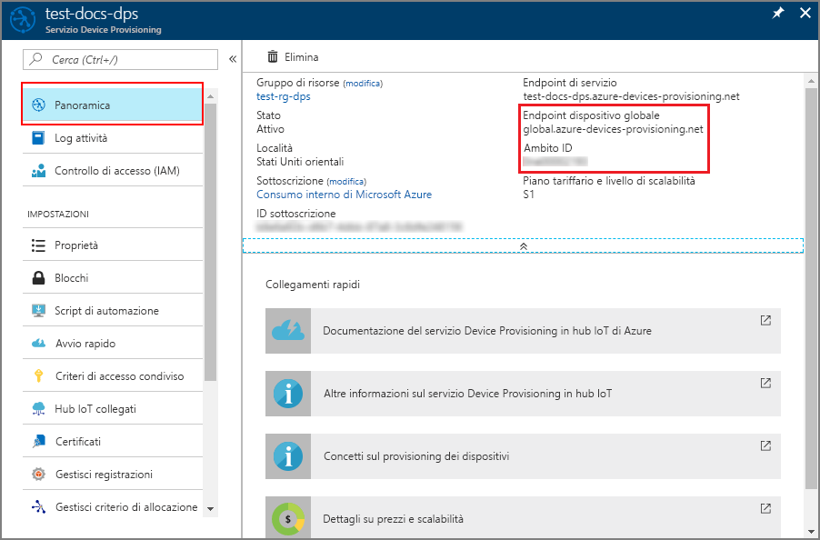
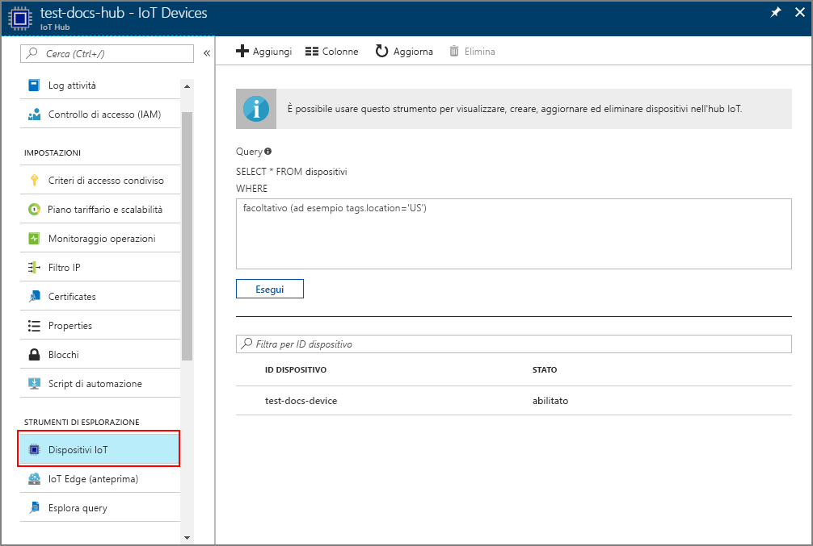

# <a name="create-and-provision-an-x509-simulated-device-using-nodejs-device-sdk-for-iot-hub-device-provisioning-service"></a>Creare ed effettuare il provisioning di un dispositivo simulato X.509 usando l'SDK per dispositivi Node.js per il servizio Device Provisioning in hub IoT
[!INCLUDE [iot-dps-selector-quick-create-simulated-device-x509](../../includes/iot-dps-selector-quick-create-simulated-device-x509.md)]

Il servizio Device Provisioning in hub IoT è un servizio helper per l'hub IoT che consente il provisioning completamente automatico dei dispositivi nell'hub IoT. Con il servizio Device Provisioning è possibile effettuare il provisioning di milioni di dispositivi in modo sicuro e scalabile.

Il provisioning dei dispositivi è costituito da due passaggi. Il primo consiste nella creazione della voce di registrazione appropriata nel servizio Device Provisioning in base ai requisiti specifici della soluzione.  Il secondo prevede la creazione di una connessione tra il dispositivo e il servizio Device Provisioning e la registrazione del dispositivo con l'hub IoT. Una volta completati entrambi questi passaggi, il provisioning del dispositivo può considerarsi completato. Il servizio Device Provisioning consente di automatizzare entrambi i passaggi per semplificare l'esperienza di provisioning dei dispositivi. Per altre informazioni, vedere [Concetti relativi al servizio Device Provisioning in hub IoT](https://docs.microsoft.com/en-us/azure/iot-dps/concepts-service).

Questi passaggi illustrano come creare una voce di registrazione nel servizio Device Provisioning, simulare un dispositivo X.509 nel computer di sviluppo, connettere il dispositivo simulato al servizio Device Provisioning e registrare il dispositivo nell'hub IoT usando [Azure IoT Hub Node.js Device SDK](https://github.com/Azure/azure-iot-sdk-node).


## <a name="prepare-the-environment"></a>Preparare l'ambiente 

1. Completare la procedura descritta in [Configurare il servizio Device Provisioning in hub IoT con il portale di Azure](./quick-setup-auto-provision.md) prima di continuare.

1. Verificare che [Node.js v4.0 o versione successiva](https://nodejs.org) sia installato nel computer.

1. Verificare che [Git](https://git-scm.com/download/) sia installato nel computer e venga aggiunto alle variabili di ambiente accessibili alla finestra di comando. 

1. Verificare che [OpenSSL](https://www.openssl.org/) sia installato nel computer e venga aggiunto alle variabili di ambiente accessibili alla finestra di comando. Questa raccolta può essere compilata e installata dall'origine o scaricata e installata da [terze parti](https://wiki.openssl.org/index.php/Binaries) come [questa](https://sourceforge.net/projects/openssl/). 

    > [!NOTE]
    > Se sono già stati creati i certificati X.509 _radice_, _intermedio_ e/o _foglia_, è possibile ignorare questo passaggio e tutti i passaggi successivi relativi alla generazione di certificati.
    >


## <a name="create-an-enrollment-entry"></a>Creare una voce di registrazione

Una registrazione è un record di dispositivi o gruppi di dispositivi che possono a un certo punto eseguire la registrazione nel servizio Device Provisioning. Il record di registrazione contiene le informazioni sul dispositivo o sul gruppo di dispositivi, tra cui i dettagli del certificato X.509 e altre informazioni di registrazione. Il servizio Device Provisioning supporta due tipi di registrazione, ovvero la _registrazione singola_ e il _gruppo di registrazione_. Per altre informazioni, vedere i [concetti relativi alla registrazione](https://docs.microsoft.com/en-us/azure/iot-dps/concepts-service#enrollment).

Se si creano i propri certificati X.509 di test, vedere [Concetti relativi alla sicurezza](https://docs.microsoft.com/en-us/azure/iot-dps/concepts-security#x509-certificates) per informazioni sui certificati necessari per la soluzione e [Tools for the Azure IoT Device Provisioning Device SDK for Node.js](https://github.com/azure/azure-iot-sdk-node/tree/master/provisioning/tools) (Strumenti per Azure IoT Device Provisioning Device SDK per Node.js) per i dettagli dell'implementazione.

1. Aprire un prompt dei comandi. Clonare il repository di GitHub per gli esempi di codice:
    
    ```cmd/sh
    git clone https://github.com/Azure/azure-iot-sdk-node.git --recursive
    ```

1. Passare allo script di generazione del certificato e compilare il progetto. 

    ```cmd/sh
    cd azure-iot-sdk-node/provisioning/tools
    npm install
    ```

1. Creare le informazioni di registrazione in uno dei modi seguenti, a seconda della configurazione:

    - **Registrazione singola**:

        1. Creare il certificato _foglia_ eseguendo lo script con il proprio _certificate-name_. Si noti che il nome comune del certificato foglia diventa l'[ID registrazione](https://docs.microsoft.com/en-us/azure/iot-dps/concepts-device#registration-id), quindi usare solo caratteri alfanumerici minuscoli e trattini.

        ```cmd/sh
        node create_test_cert.js device {certificate-name}
        ```
         
        1. Nel portale di **Azure** aprire il pannello di riepilogo del **servizio Device Provisioning**. Selezionare **Gestisci registrazioni**, quindi la scheda **Registrazioni singole** e fare clic sul pulsante **Aggiungi** nella parte superiore. 

        1. In **Add enrollment list entry** (Aggiungi voce elenco di registrazione) immettere le informazioni seguenti:
            - Selezionare **X.509** come *meccanismo* di attestazione dell'identità.
            - In *File di certificato con estensione pem o cer* selezionare il file di certificato **_{certificate-name}\_cert.pem_** creato nei passaggi precedenti con il widget *Esplora file*.
            - Facoltativamente, è possibile specificare le informazioni seguenti:
                - Selezionare un hub IoT collegato al servizio di provisioning.
                - Immettere un ID dispositivo univoco. Assicurarsi di non usare dati sensibili quando si assegna un nome al dispositivo. 
                - Aggiornare lo **stato iniziale del dispositivo gemello** con la configurazione iniziale desiderata per il dispositivo.
            - Al termine, fare clic sul pulsante **Save** (Salva). 

          

    Al termine della registrazione, il dispositivo X.509 verrà visualizzato come **{certificatename}** nella colonna *ID registrazione* della scheda *Registrazioni singole*. Prendere nota del valore per usarlo in seguito.

    - **Gruppi di registrazioni**: 

        1. Creare il certificato _radice_ eseguendo lo script con il proprio _root-name_.

        ```cmd/sh
        node create_test_cert.js root {root-name}
        ```

        1. Nel portale di **Azure** aprire il pannello di riepilogo del **servizio Device Provisioning**. Selezionare **Certificati** e fare clic sul pulsante **Aggiungi** nella parte superiore.

        1. In **Aggiungi certificato** immettere le informazioni seguenti:
            - Immettere un nome certificato univoco.
            - Selezionare il file **_{root-name}\_cert.pem_** creato in precedenza.
            - Al termine, fare clic sul pulsante **Save** (Salva).

        

        1. Selezionare il certificato appena creato:
            - Fare clic su **Genera codice di verifica**. Copiare il codice generato.
            - Creare il certificato di _verifica_. Immettere il _codice di verifica_ o fare clic con il pulsante destro del mouse nella finestra dello script Node in esecuzione per incollarlo con il comando seguente:

                ```cmd/sh
                node create_test_cert.js verification {rootname_cert} {verification code}
                ```

            - In *File di certificato di verifica con estensione pem o cer* selezionare il file di certificato **_verification_cert.pem_** creato nei passaggi precedenti con il widget *Esplora file*. Fare clic su **Verifica**.

            

        1. Selezionare **Gestisci registrazioni**. Selezionare **Gruppi di registrazioni** e fare clic sul pulsante **Aggiungi** nella parte superiore.
            - Immettere un nome gruppo univoco.
            - Selezionare il nome di certificato univoco creato in precedenza
            - Facoltativamente, è possibile specificare le informazioni seguenti:
                - Selezionare un hub IoT collegato al servizio di provisioning.
                - Aggiornare lo **stato iniziale del dispositivo gemello** con la configurazione iniziale desiderata per il dispositivo.

        

        Al termine della registrazione, il gruppo di dispositivi X.509 viene visualizzato nella colonna *Nome gruppo* della scheda *Gruppi di registrazioni*. Prendere nota del valore per usarlo in seguito.

        1. Creare il certificato _foglia_ eseguendo lo script con il proprio _certificate-name_ seguito dal _root-name_ usato in precedenza. Il nome comune del certificato foglia diventa l'[ID registrazione](https://docs.microsoft.com/en-us/azure/iot-dps/concepts-device#registration-id), quindi usare solo caratteri alfanumerici minuscoli e trattini.

            ```cmd/sh
            node create_test_cert.js device {certificate-name} {root-name}
            ```

        > [!NOTE]
        > È anche possibile creare certificati _intermedi_ usando `node create_test_cert.js intermediate {certificate-name} {parent-name}`. Assicurarsi di creare il certificato _foglia_ come ultimo passaggio usando l'ultimo certificato _intermedio_ come radice/padre. Per altre informazioni, vedere [Controllo dell'accesso dei dispositivi](https://docs.microsoft.com/en-us/azure/iot-dps/concepts-security#controlling-device-access-to-the-provisioning-service-with-x509-certificates).
        >


## <a name="simulate-the-device"></a>Simulare il dispositivo

[Azure IoT Hub Node.js Device SDK](https://github.com/Azure/azure-iot-sdk-node) offre un modo semplice per simulare un dispositivo. Per altre informazioni, vedere [Concetti relativi ai dispositivi](https://docs.microsoft.com/en-us/azure/iot-dps/concepts-device).

1. Nel portale di Azure selezionare il pannello **Panoramica** per il servizio Device Provisioning e prendere nota dei valori **_Endpoint dispositivo globale_** e **_Ambito ID_**.

     

1. Copiare il _certificato_ e la _chiave_ nella cartella di esempio.

    ```cmd/sh
    copy .\{certificate-name}_cert.pem ..\device\samples\{certificate-name}_cert.pem
    copy .\{certificate-name}_key.pem ..\device\samples\{certificate-name}_key.pem
    ```

1. Passare allo script di test del dispositivo e compilare il progetto. 

    ```cmd/sh
    cd ..\device\samples
    npm install
    ```

1. Modificare il file **register\_x509.js**. Salvare il file dopo aver apportato le modifiche seguenti.
    - Sostituire `provisioning host` con l'**_endpoint dispositivo globale_** annotato nel **passaggio 1** precedente.
    - Sostituire `id scope` con l'**_ID ambito_** annotato nel **passaggio 1** precedente. 
    - Sostituire `reigstration id` con l'**_ID registrazione_** o il **_nome gruppo_** annotato nella sezione precedente.
    - Sostituire `cert filename` e `key filename` con i file copiati nel **passaggio 2** precedente. 

1. Eseguire lo script e verificare che il provisioning del dispositivo sia stato eseguito correttamente.

    ```cmd/sh
    node register_x509.js
    ```   

1. Nel portale passare all'hub IoT collegato al servizio di provisioning e aprire il pannello **Dispositivi IoT**. Al termine del provisioning del dispositivo X.509 simulato nell'hub, il relativo ID dispositivo verrà visualizzato nel pannello **Dispositivi IoT** con *STATO* **abilitato**. Potrebbe essere necessario fare clic sul pulsante **Aggiorna** nella parte superiore se il pannello è stato aperto prima dell'esecuzione dell'applicazione del dispositivo di esempio. 

     

    Se si è modificato lo *stato iniziale del dispositivo gemello* rispetto al valore predefinito della voce di registrazione del dispositivo, è possibile eseguire il pull dello stato del dispositivo desiderato dall'hub e agire di conseguenza. Per altre informazioni, vedere [Comprendere e usare dispositivi gemelli nell'hub IoT](../iot-hub/iot-hub-devguide-device-twins.md).


## <a name="clean-up-resources"></a>Pulire le risorse

Se si prevede di continuare a usare ed esplorare l'esempio di client del dispositivo, non pulire le risorse create in questa guida introduttiva. Se non si prevede di continuare, usare i passaggi seguenti per eliminare tutte le risorse create da questa guida introduttiva.

1. Chiudere la finestra di output di esempio di client del dispositivo sul computer.
1. Nel portale di Azure fare clic su **Tutte le risorse** nel menu a sinistra e quindi selezionare il servizio Device Provisioning. Aprire il pannello **Gestisci registrazioni** per il servizio, quindi fare clic sulla scheda **Registrazioni singole** o **Gruppi di registrazioni**. Selezionare l'*ID REGISTRAZIONE* o il *NOME GRUPPO* del dispositivo registrato in questa guida introduttiva e fare clic sul pulsante **Elimina** nella parte superiore. 
1. Nel portale di Azure fare clic su **Tutte le risorse** nel menu a sinistra e quindi selezionare l'hub IoT. Aprire il pannello **Dispositivi IoT** per l'hub, selezionare l'*ID* del dispositivo registrato in questa guida introduttiva e quindi fare clic su **Elimina** nella parte superiore.


## <a name="next-steps"></a>Passaggi successivi

In questa guida introduttiva è stato creato un dispositivo X.509 simulato e ne è stato effettuato il provisioning nell'hub IoT usando il servizio Device Provisioning in hub IoT di Azure nel portale. Per informazioni su come registrare il dispositivo X.509 a livello di codice, passare alla guida introduttiva per la registrazione a livello di codice dei dispositivi X.509. 

> [!div class="nextstepaction"]
> [Guida introduttiva di Azure - Registrare dispositivi X.509 nel servizio Device Provisioning in hub IoT di Azure](quick-enroll-device-x509-node.md)
