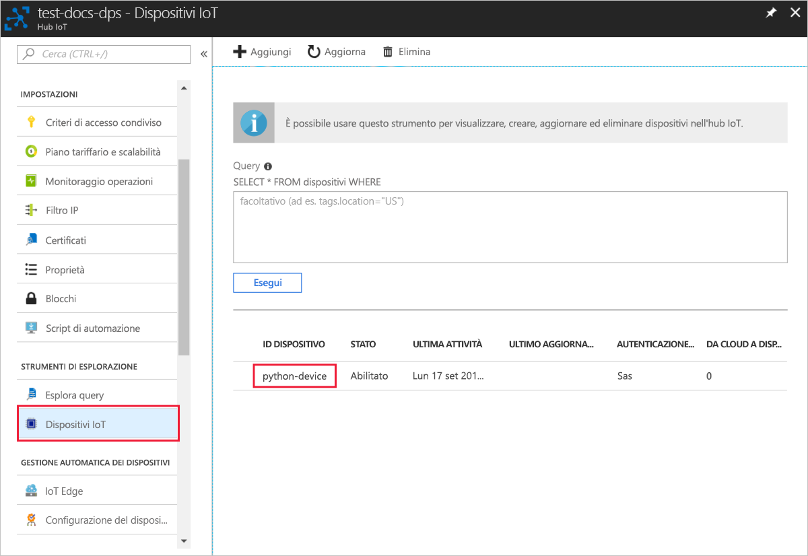

# <a name="quickstart-create-and-provision-a-simulated-x509-device-using-python-device-sdk-for-iot-hub-device-provisioning-service"></a>Guida introduttiva: Creare ed effettuare il provisioning di un dispositivo simulato X.509 usando l'SDK per dispositivi Python per il servizio Device Provisioning in hub IoT

[!INCLUDE [iot-dps-selector-quick-create-simulated-device-x509](../../includes/iot-dps-selector-quick-create-simulated-device-x509.md)]

Questi passaggi illustrano come simulare un dispositivo X.509 in un computer di sviluppo con sistema operativo Windows e usare un esempio di codice Python per connettere il dispositivo simulato con il servizio Device Provisioning e l'hub IoT. 

> [!IMPORTANT]
> Questo articolo si applica solo alla versione 1 dell'SDK per Python, ora deprecata. I client dispositivo e servizio per il servizio Device Provisioning in hub IoT non sono ancora disponibili nella versione 2. Il team si sta attualmente impegnando per offrire la parità delle funzionalità nella versione 2.

Se non si ha familiarità con il processo di provisioning automatico, è necessario vedere [Concetti relativi al provisioning automatico](concepts-auto-provisioning.md). È anche necessario aver completato la procedura descritta in [Configurare il servizio Device Provisioning in hub IoT con il portale di Azure](./quick-setup-auto-provision.md) prima di continuare. 

Il servizio Device Provisioning in Azure IoT supporta due tipi di registrazione:
- [Gruppi di registrazioni](concepts-service.md#enrollment-group): Usato per registrare più dispositivi correlati.
- [Registrazioni singole](concepts-service.md#individual-enrollment): Usato per registrare un singolo dispositivo.

Questo articolo descrive le registrazioni singole.

[!INCLUDE [IoT Device Provisioning Service basic](../../includes/iot-dps-basic.md)]

## <a name="prepare-the-environment"></a>Preparare l'ambiente 

1. Assicurarsi di aver installato [Visual Studio](https://visualstudio.microsoft.com/vs/) 2015 o versione successiva, con il carico di lavoro Sviluppo di applicazioni desktop con C++ abilitato per l'installazione di Visual Studio.

2. Scaricare e installare il [sistema di compilazione CMake](https://cmake.org/download/).

3. Verificare che `git` sia installato nel computer e venga aggiunto alle variabili di ambiente accessibili alla finestra di comando. Vedere gli [strumenti client Git di Software Freedom Conservancy](https://git-scm.com/download/) per la versione più recente degli strumenti `git` da installare, tra cui **Git Bash**, l'app da riga di comando che è possibile usare per interagire con il repository Git locale. 

4. Aprire un prompt dei comandi o Git Bash. Clonare il repository GitHub per l'esempio di codice di simulazione del dispositivo.
    
    ```cmd/sh
    git clone https://github.com/Azure/azure-iot-sdk-python.git --recursive
    ```

5. Creare una cartella nella copia locale di questo repository GitHub per il processo di compilazione CMake. 

    ```cmd/sh
    cd azure-iot-sdk-python/c
    mkdir cmake
    cd cmake
    ```

6. Eseguire questo comando per creare la soluzione di Visual Studio per il client di provisioning.

    ```cmd/sh
    cmake -Duse_prov_client:BOOL=ON ..
    ```


## <a name="create-a-self-signed-x509-device-certificate-and-individual-enrollment-entry"></a>Creare un certificato dispositivo X.509 autofirmato e la voce di registrazione singola

In questa sezione si userà un certificato X.509 autofirmato. Tenere presente questi punti importanti:

* I certificati autofirmati sono destinati solo alle operazioni di testing e non dovrebbero essere usati nell'ambiente di produzione.
* La data di scadenza predefinita per un certificato autofirmato è un anno.

Si userà il codice di esempio da Azure IoT C SDK per creare il certificato da usare con la voce di registrazione singola per il dispositivo simulato.

1. Aprire la soluzione generata nella cartella *cmake* denominata `azure_iot_sdks.sln` e compilarla in Visual Studio.

2. Fare clic con il pulsante destro del mouse sul progetto **dice\_device\_enrollment** nella cartella **Provision\_Tools** e scegliere **Imposta come progetto di avvio**. Eseguire la soluzione. 

3. Nella finestra di output immettere `i` per la registrazione singola quando richiesto. Nella finestra di output viene visualizzato un certificato X.509 generato in locale per il dispositivo simulato. 
    
    Copiare il primo certificato negli Appunti. Iniziare con la prima occorrenza di:
    
        -----BEGIN CERTIFICATE----- 
        
    Terminare la copia in corso dopo la prima occorrenza di:
    
        -----END CERTIFICATE-----
        
    Assicurarsi di includere anche queste due righe. 

    
 
4. Creare un file denominato **_X509testcertificate.pem_** nel computer Windows, aprirlo in un editor di propria scelta e copiare il contenuto degli Appunti in questo file. Salvare il file. 

5. Accedere al portale di Azure, selezionare il pulsante **Tutte le risorse** nel menu a sinistra e aprire il servizio di provisioning.

6. Nel menu del servizio Device Provisioning selezionare **Gestisci registrazioni**. Selezionare la scheda **Registrazioni singole** e quindi il pulsante **Aggiungi registrazione singola** in alto. 

7. Nel pannello **Aggiungi registrazione** immettere le informazioni seguenti:
   - Selezionare **X.509** come *meccanismo* di attestazione dell'identità.
   - In *Primary certificate .pem or .cer file* (File di certificato primario con estensione pem o cer) scegliere *Selezionare un file* per selezionare il file di certificato **X509testcertificate.pem** creato nei passaggi precedenti.
   - Facoltativamente, è possibile specificare le informazioni seguenti:
     - Selezionare un hub IoT collegato al servizio di provisioning.
     - Immettere un ID dispositivo univoco. Assicurarsi di non usare dati sensibili quando si assegna un nome al dispositivo. 
     - Aggiornare lo **stato iniziale del dispositivo gemello** con la configurazione iniziale desiderata per il dispositivo.
   - Al termine, fare clic sul pulsante **Salva**. 

     [](./media/python-quick-create-simulated-device-x509/device-enrollment.png#lightbox)

   Al termine della registrazione, il dispositivo X.509 verrà visualizzato come **riot-device-cert** nella colonna *ID registrazione* della scheda *Registrazioni singole*. 

## <a name="simulate-the-device"></a>Simulare il dispositivo

1. Nel menu del servizio Device Provisioning selezionare **Panoramica**. Prendere nota dell'_ambito ID_ e dell'_endpoint globale del servizio_.

    

2. Scaricare e installare [Python 2.x o 3.x](https://www.python.org/downloads/). Assicurarsi di usare le installazioni a 32 bit o 64 bit, come richiesto dalla configurazione. Quando richiesto durante l'installazione, assicurarsi di aggiungere Python alle variabili di ambiente specifiche per la piattaforma. Se si usa Python 2.x, potrebbe essere necessario [installare o aggiornare *pip*, il sistema di gestione pacchetti Python](https://pip.pypa.io/en/stable/installing/).
    
    > [!NOTE] 
    > Se si usa Windows, installare anche [Visual C++ Redistributable per Visual Studio 2015](https://support.microsoft.com/help/2977003/the-latest-supported-visual-c-downloads). I pacchetti pip richiedono il componente ridistribuibile per caricare/eseguire le DLL di C.

3. Seguire [queste istruzioni](https://github.com/Azure/azure-iot-sdk-python/blob/v1-deprecated/doc/python-devbox-setup.md) per compilare i pacchetti Python.

   > [!NOTE]
   > Se si usa `pip`, assicurarsi di installare anche il pacchetto `azure-iot-provisioning-device-client`.

4. Passare alla cartella degli esempi.

    ```cmd/sh
    cd azure-iot-sdk-python/provisioning_device_client/samples
    ```

5. Usando l'IDE Python, modificare lo script Python denominato **provisioning\_device\_client\_sample.py**. Modificare le variabili _GLOBAL\_PROV\_URI_ e _ID\_SCOPE_ con i valori annotati in precedenza.

    ```python
    GLOBAL_PROV_URI = "{globalServiceEndpoint}"
    ID_SCOPE = "{idScope}"
    SECURITY_DEVICE_TYPE = ProvisioningSecurityDeviceType.X509
    PROTOCOL = ProvisioningTransportProvider.HTTP
    ```

6. Eseguire l'esempio. 

    ```cmd/sh
    python provisioning_device_client_sample.py
    ```

7. L'applicazione si connetterà, registrerà il dispositivo e visualizzerà un messaggio di registrazione completata.

    

8. Nel portale passare all'hub IoT collegato al servizio di provisioning e aprire il pannello **Esplora dispositivi**. Al termine del provisioning del dispositivo X.509 simulato nell'hub, il relativo ID dispositivo verrà visualizzato nel pannello **Esplora dispositivi** con *STATO* **abilitato**. Potrebbe essere necessario premere il pulsante **Aggiorna** nella parte superiore se il pannello è stato aperto prima dell'esecuzione dell'applicazione del dispositivo di esempio. 

     

> [!NOTE]
> Se si è modificato lo *stato iniziale del dispositivo gemello* rispetto al valore predefinito della voce di registrazione del dispositivo, è possibile eseguire il pull dello stato del dispositivo desiderato dall'hub e agire di conseguenza. Per altre informazioni, vedere [Comprendere e usare dispositivi gemelli nell'hub IoT](../iot-hub/iot-hub-devguide-device-twins.md).
>

## <a name="clean-up-resources"></a>Pulire le risorse

Se si prevede di continuare a usare ed esplorare l'esempio di client dispositivo, non eseguire la pulizia delle risorse create in questa guida di avvio rapido. Se non si intende continuare, seguire questa procedura per eliminare tutte le risorse create in questa guida.

1. Chiudere la finestra di output di esempio di client del dispositivo sul computer.
2. Nel portale di Azure selezionare **Tutte le risorse** nel menu a sinistra e quindi il servizio Device Provisioning. Aprire il pannello **Gestisci registrazioni** per il servizio e quindi selezionare la scheda **Registrazioni singole**. Selezionare la casella di controllo accanto all'*ID registrazione* del dispositivo registrato in questa guida di avvio rapido e fare clic sul pulsante **Elimina** nella parte superiore del riquadro. 
3. Nel portale di Azure selezionare **Tutte le risorse** nel menu a sinistra e quindi l'hub IoT. Aprire il pannello **Dispositivi IoT** per l'hub, selezionare la casella di controllo accanto all'*ID dispositivo* del dispositivo registrato in questa guida di avvio rapido e quindi fare clic sul pulsante **Elimina** nella parte superiore del riquadro.

## <a name="next-steps"></a>Passaggi successivi

In questa guida di avvio rapido è stato creato un dispositivo X.509 simulato nel computer Windows e ne è stato effettuato il provisioning nell'hub IoT usando il servizio Device Provisioning in hub IoT di Azure nel portale. Per informazioni su come registrare il dispositivo X.509 a livello di codice, passare alla guida di avvio rapido per la registrazione a livello di codice dei dispositivi X.509. 

> [!div class="nextstepaction"]
> [Avvio rapido di Azure: Registrare dispositivi X.509 nel servizio Device Provisioning in hub IoT di Azure](quick-enroll-device-x509-python.md)
