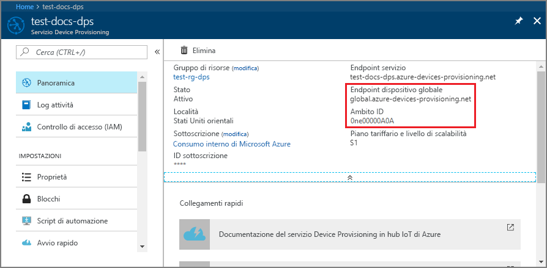
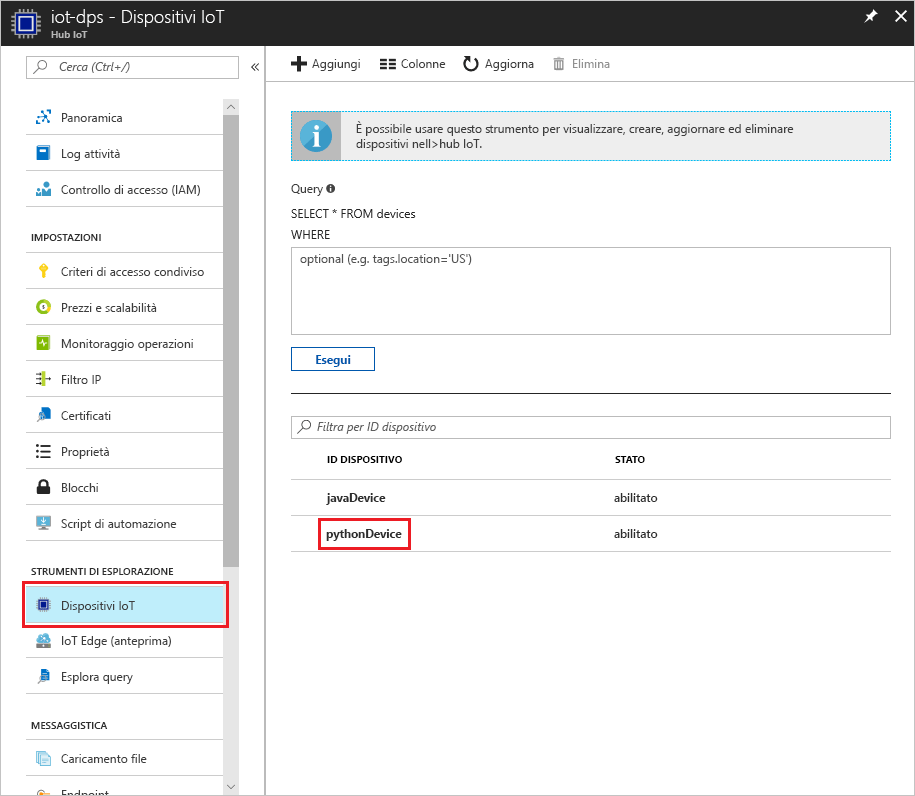

# <a name="create-and-provision-a-simulated-x509-device-using-python-device-sdk-for-iot-hub-device-provisioning-service"></a>Creare ed effettuare il provisioning di un dispositivo simulato X.509 usando l'SDK per dispositivi Python per il servizio Device Provisioning in hub IoT
> [!div class="op_single_selector"]
> * [C](quick-create-simulated-device-x509.md)
> * [Java](quick-create-simulated-device-x509-java.md)
> * [C#](quick-create-simulated-device-x509-csharp.md)
> * [Python](quick-create-simulated-device-x509-python.md)

Questi passaggi illustrano come simulare un dispositivo X.509 in un computer di sviluppo con sistema operativo Windows e usare un esempio di codice Python per connettere il dispositivo simulato con il servizio Device Provisioning e l'hub IoT. 

Assicurarsi di completare la procedura descritta in [Set up IoT Hub Device Provisioning Service with the Azure portal](./quick-setup-auto-provision.md) (Configurare il servizio Device Provisioning in hub IoT con il portale di Azure) prima di continuare.


## <a name="prepare-the-environment"></a>Preparare l'ambiente 

1. Verificare che nel computer sia installato [Visual Studio 2015](https://www.visualstudio.com/vs/older-downloads/) o [Visual Studio 2017](https://www.visualstudio.com/vs/). È necessario che il carico di lavoro 'Sviluppo di applicazioni desktop con C++' sia abilitato per l'installazione di Visual Studio.

1. Scaricare e installare il [sistema di compilazione CMake](https://cmake.org/download/).

1. Verificare che `git` sia installato nel computer e venga aggiunto alle variabili di ambiente accessibili alla finestra di comando. Vedere gli [strumenti client Git di Software Freedom Conservancy](https://git-scm.com/download/) per la versione più recente degli strumenti `git` da installare, tra cui **Git Bash**, l'app da riga di comando che è possibile usare per interagire con il repository Git locale. 

1. Aprire un prompt dei comandi o Git Bash. Clonare il repository GitHub per l'esempio di codice di simulazione del dispositivo.
    
    ```cmd/sh
    git clone https://github.com/Azure/azure-iot-sdk-python.git --recursive
    ```

1. Creare una cartella nella copia locale di questo repository GitHub per il processo di compilazione CMake. 

    ```cmd/sh
    cd azure-iot-sdk-python/c
    mkdir cmake
    cd cmake
    ```

1. Eseguire questo comando per creare la soluzione di Visual Studio per il client di provisioning.

    ```cmd/sh
    cmake -Duse_prov_client:BOOL=ON ..
    ```


## <a name="create-a-device-enrollment-entry"></a>Creare una voce per la registrazione dei dispositivi

1. Aprire la soluzione generata nella cartella *cmake* denominata `azure_iot_sdks.sln` e compilarla in Visual Studio.

1. Fare clic con il pulsante destro del mouse sul progetto **dice\_device\_enrollment** nella cartella **Provision\_Tools** e scegliere **Imposta come progetto di avvio**. Eseguire la soluzione. Nella finestra di output immettere `i` per la registrazione singola quando richiesto. Nella finestra di output viene visualizzato un certificato X.509 generato in locale per il dispositivo simulato. Copiare l'output da *-----BEGIN CERTIFICATE-----* a *-----END CERTIFICATE-----*, assicurandosi di includere anche queste due righe. 

    
 
1. Creare un file denominato **_X509testcertificate.pem_** nel computer Windows, aprirlo in un editor di propria scelta e copiare il contenuto degli Appunti in questo file. Salvare il file. 

1. Accedere al portale di Azure, fare clic sul pulsante **Tutte le risorse** nel menu a sinistra e aprire il servizio di provisioning.

1. Nel pannello di riepilogo del servizio Device Provisioning selezionare **Manage enrollments** (Gestisci registrazioni). Selezionare la scheda **Individual Enrollments** (Registrazioni singole) e fare clic sul pulsante **Aggiungi** in alto. 

1. In **Add enrollment list entry** (Aggiungi voce elenco di registrazione) immettere le informazioni seguenti:
    - Selezionare **X.509** come *meccanismo* di attestazione dell'identità.
    - In *File di certificato con estensione pem o cer* selezionare il file di certificato **_X509testcertificate.pem_** creato nei passaggi precedenti con il widget *Esplora file*.
    - Facoltativamente, è possibile specificare le informazioni seguenti:
        - Selezionare un hub IoT collegato al servizio di provisioning.
        - Immettere un ID dispositivo univoco. Assicurarsi di non usare dati sensibili quando si assegna un nome al dispositivo. 
        - Aggiornare lo **stato iniziale del dispositivo gemello** con la configurazione iniziale desiderata per il dispositivo.
    - Al termine, fare clic sul pulsante **Save** (Salva). 

      

   Al termine della registrazione, il dispositivo X.509 verrà visualizzato come **riot-device-cert** nella colonna *ID registrazione* della scheda *Registrazioni singole*. 


## <a name="simulate-the-device"></a>Simulare il dispositivo

1. Nel pannello di riepilogo del servizio Device Provisioning selezionare **Panoramica**. Prendere nota dell'_ambito ID_ e dell'_endpoint globale del servizio_.

    

1. Scaricare e installare [Python 2.x o 3.x](https://www.python.org/downloads/). Assicurarsi di usare le installazioni a 32 bit o 64 bit, come richiesto dalla configurazione. Quando richiesto durante l'installazione, assicurarsi di aggiungere Python alle variabili di ambiente specifiche per la piattaforma. Se si usa Python 2.x, potrebbe essere necessario [installare o aggiornare *pip*, il sistema di gestione pacchetti Python](https://pip.pypa.io/en/stable/installing/).
    - Se si usa il sistema operativo Windows, usare il [pacchetto ridistribuibile di Visual C++](http://www.microsoft.com/download/confirmation.aspx?id=48145) per consentire l'uso di DLL native da Python.

1. Seguire [queste istruzioni](https://github.com/Azure/azure-iot-sdk-python/blob/master/doc/python-devbox-setup.md) per compilare i pacchetti Python.

    > [!NOTE]
        > Se si usa `pip`, assicurarsi di installare anche il pacchetto `azure-iot-provisioning-device-client`.

1. Passare alla cartella degli esempi.

    ```cmd/sh
    cd azure-iot-sdk-python/provisioning_device_client/samples
    ```

1. Usando l'IDE Python, modificare lo script Python denominato **provisioning\_device\_client\_sample.py**. Modificare le variabili _GLOBAL\_PROV\_URI_ e _ID\_SCOPE_ con i valori annotati in precedenza.

    ```python
    GLOBAL_PROV_URI = "{globalServiceEndpoint}"
    ID_SCOPE = "{idScope}"
    SECURITY_DEVICE_TYPE = ProvisioningSecurityDeviceType.X509
    PROTOCOL = ProvisioningTransportProvider.HTTP
    ```

1. Eseguire l'esempio. 

    ```cmd/sh
    python provisioning_device_client_sample.py
    ```

1. L'applicazione si connetterà, registrerà il dispositivo e visualizzerà un messaggio di registrazione completata.

    

1. Nel portale passare all'hub IoT collegato al servizio di provisioning e aprire il pannello **Esplora dispositivi**. Al termine del provisioning del dispositivo X.509 simulato nell'hub, il relativo ID dispositivo verrà visualizzato nel pannello **Esplora dispositivi** con *STATO* **abilitato**. Potrebbe essere necessario fare clic sul pulsante **Aggiorna** nella parte superiore se il pannello è stato aperto prima dell'esecuzione dell'applicazione del dispositivo di esempio. 

     

> [!NOTE]
> Se si è modificato lo *stato iniziale del dispositivo gemello* rispetto al valore predefinito della voce di registrazione del dispositivo, è possibile eseguire il pull dello stato del dispositivo desiderato dall'hub e agire di conseguenza. Per altre informazioni, vedere [Comprendere e usare dispositivi gemelli nell'hub IoT](../iot-hub/iot-hub-devguide-device-twins.md).
>


## <a name="clean-up-resources"></a>Pulire le risorse

Se si prevede di continuare a usare ed esplorare l'esempio di client del dispositivo, non pulire le risorse create in questa guida introduttiva. Se non si prevede di continuare, usare i passaggi seguenti per eliminare tutte le risorse create da questa guida introduttiva.

1. Chiudere la finestra di output di esempio di client del dispositivo sul computer.
1. Nel portale di Azure fare clic su **Tutte le risorse** nel menu a sinistra e quindi selezionare il servizio Device Provisioning. Aprire il pannello **Gestisci registrazioni** per il servizio, quindi fare clic sulla scheda **Registrazioni singole**. Selezionare l'*ID registrazione* del dispositivo registrato in questa guida introduttiva e fare clic sul pulsante **Elimina** nella parte superiore. 
1. Nel portale di Azure fare clic su **Tutte le risorse** nel menu a sinistra e quindi selezionare l'hub IoT. Aprire il pannello **Dispositivi IoT** per l'hub, selezionare l'*ID* del dispositivo registrato in questa guida introduttiva e quindi fare clic su **Elimina** nella parte superiore.

## <a name="next-steps"></a>Passaggi successivi

In questa guida introduttiva è stato creato un dispositivo X.509 simulato nel computer Windows e ne è stato effettuato il provisioning nell'hub IoT usando il servizio Device Provisioning in hub IoT di Azure nel portale. Per informazioni su come registrare il dispositivo X.509 a livello di codice, passare alla guida introduttiva per la registrazione a livello di codice dei dispositivi X.509. 

> [!div class="nextstepaction"]
> [Guida introduttiva di Azure - Registrare dispositivi X.509 nel servizio Device Provisioning in hub IoT di Azure](quick-enroll-device-x509-java.md)
