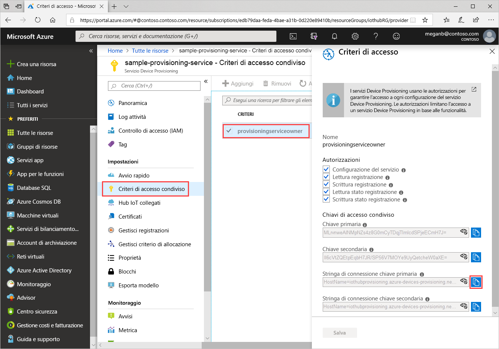
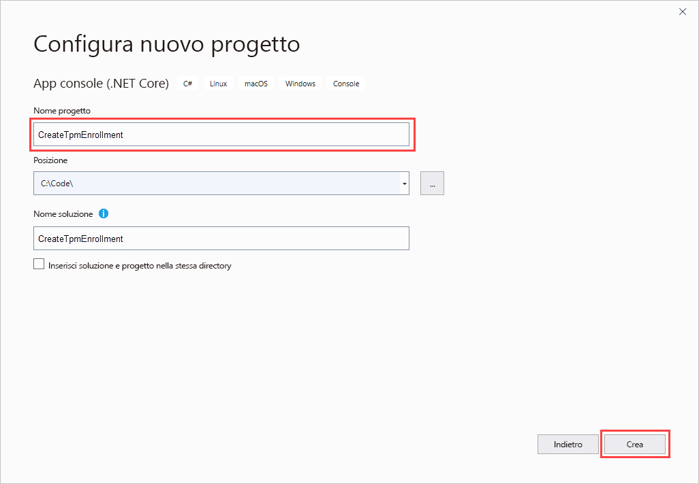
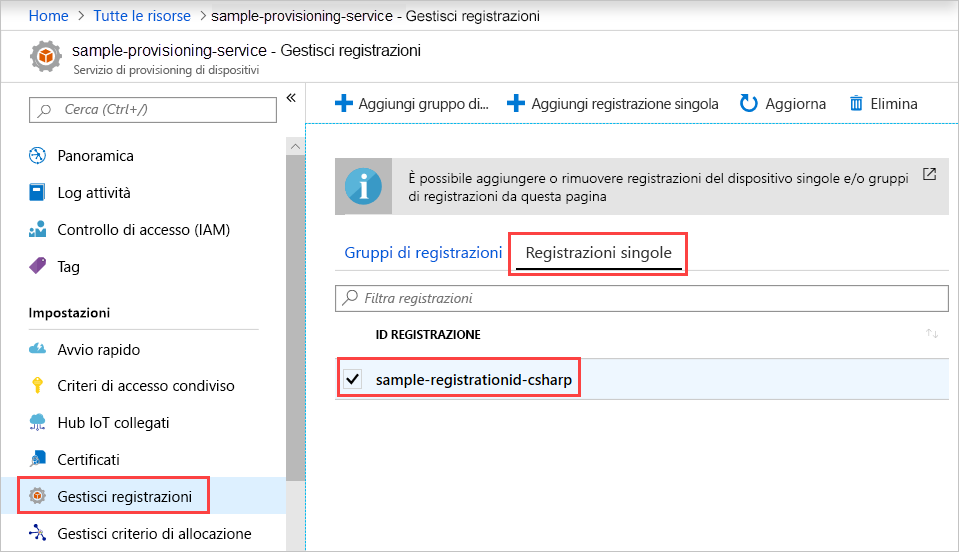

# <a name="quickstart-enroll-tpm-device-to-iot-hub-device-provisioning-service-using-c-service-sdk"></a>Guida introduttiva: Registrare un dispositivo TPM nel servizio Device Provisioning in hub IoT con C# Service SDK

[!INCLUDE [iot-dps-selector-quick-enroll-device-tpm](../../includes/iot-dps-selector-quick-enroll-device-tpm.md)]

Questo articolo illustra come creare a livello di codice una registrazione singola per un dispositivo TPM nel servizio Device Provisioning in hub IoT di Azure usando l'[SDK per servizi C#](https://github.com/Azure/azure-iot-sdk-csharp) e un'applicazione C# .NET Core di esempio. Facoltativamente, è possibile registrare un dispositivo TPM simulato nel servizio di provisioning usando questa voce di registrazione singola. Questi passaggi funzionano su computer sia Windows che Linux, ma questo articolo usa un computer di sviluppo Windows.

## <a name="prepare-the-development-environment"></a>Preparare l'ambiente di sviluppo

1. Verificare che [Visual Studio 2019](https://www.visualstudio.com/vs/) sia installato nel computer.

1. Verificare che [.NET Core SDK](https://www.microsoft.com/net/download/windows) sia installato nel computer.

1. Prima di continuare, completare la procedura descritta in [Configurare il servizio Device Provisioning in hub IoT con il portale di Azure](./quick-setup-auto-provision.md).

1. (Facoltativo) Se al termine di questa guida di avvio rapido si vuole registrare un dispositivo simulato, seguire la procedura descritta in [Creare ed effettuare il provisioning di un dispositivo simulato TPM usando l'SDK per dispositivi C#](quick-create-simulated-device-tpm-csharp.md) fino al passaggio in cui si ottiene una chiave di verifica dell'autenticità per il dispositivo. Salvare la chiave di verifica dell'autenticità, l'ID registrazione e, facoltativamente, l'ID dispositivo, perché si dovranno usare più avanti in questa guida di avvio rapido.

   > [!NOTE]
   > Non seguire la procedura per creare una registrazione singola con il portale di Azure.

## <a name="get-the-connection-string-for-your-provisioning-service"></a>Ottenere la stringa di connessione del servizio di provisioning

Per l'esempio in questa guida introduttiva è necessaria la stringa di connessione del servizio di provisioning.

1. Accedere al portale di Azure, selezionare **Tutte le risorse** e quindi il servizio Device Provisioning.

1. Scegliere **Criteri di accesso condiviso** e quindi selezionare i criteri di accesso da usare per aprirne le proprietà. In **Criteri di accesso** copiare e salvare la stringa di connessione della chiave primaria.

    

## <a name="create-the-individual-enrollment-sample"></a>Creare l'esempio di registrazione singola

Questa sezione illustra come creare un'app console .NET Core che aggiunge una registrazione singola per un dispositivo TPM al servizio di provisioning. Con alcune modifiche, è anche possibile seguire questa procedura per creare un'app console di [Windows IoT Core](https://developer.microsoft.com/en-us/windows/iot) per aggiungere la singola registrazione. Per altre informazioni sullo sviluppo con IoT Core, vedere la [documentazione di Windows IoT Core per sviluppatori](https://docs.microsoft.com/windows/iot-core/).

1. Aprire Visual Studio e selezionare **Crea un nuovo progetto**. In **Crea un nuovo progetto** scegliere il modello di progetto **App console (.NET Core)** per C# e selezionare **Avanti**.

1. Assegnare il nome *CreateTpmEnrollment* al progetto e fare clic su **Crea**.

    

1. All'apertura della soluzione in Visual Studio, nel riquadro **Esplora soluzioni** fare clic con il pulsante destro del mouse sul progetto **CreateTpmEnrollment**. Scegliere **Gestisci pacchetti NuGet**.

1. In **Gestione pacchetti NuGet** selezionare **Sfoglia**, cercare e scegliere **Microsoft.Azure.Devices.Provisioning.Service** e quindi fare clic su **Installa**.

   

   Con questo passaggio vengono eseguiti il download e l'installazione e viene aggiunto un riferimento al pacchetto NuGet dell'[SDK client del servizio di provisioning di Azure IoT](https://www.nuget.org/packages/Microsoft.Azure.Devices.Provisioning.Service/) e alle relative dipendenze.

1. Aggiungere le istruzioni `using` seguenti dopo le altre istruzioni `using` all'inizio di `Program.cs`:
  
   ```csharp
   using System.Threading.Tasks;
   using Microsoft.Azure.Devices.Provisioning.Service;
   ```

1. Aggiungere i campi seguenti alla classe `Program`, apportando le modifiche elencate di seguito.

   ```csharp
   private static string ProvisioningConnectionString = "{ProvisioningServiceConnectionString}";
   private const string RegistrationId = "sample-registrationid-csharp";
   private const string TpmEndorsementKey =
       "AToAAQALAAMAsgAgg3GXZ0SEs/gakMyNRqXXJP1S124GUgtk8qHaGzMUaaoABgCAAEMAEAgAAAAAAAEAxsj2gUS" +
       "cTk1UjuioeTlfGYZrrimExB+bScH75adUMRIi2UOMxG1kw4y+9RW/IVoMl4e620VxZad0ARX2gUqVjYO7KPVt3d" +
       "yKhZS3dkcvfBisBhP1XH9B33VqHG9SHnbnQXdBUaCgKAfxome8UmBKfe+naTsE5fkvjb/do3/dD6l4sGBwFCnKR" +
       "dln4XpM03zLpoHFao8zOwt8l/uP3qUIxmCYv9A7m69Ms+5/pCkTu/rK4mRDsfhZ0QLfbzVI6zQFOKF/rwsfBtFe" +
       "WlWtcuJMKlXdD8TXWElTzgh7JS4qhFzreL0c1mI0GCj+Aws0usZh7dLIVPnlgZcBhgy1SSDQMQ==";
       
   // Optional parameters
   private const string OptionalDeviceId = "myCSharpDevice";
   private const ProvisioningStatus OptionalProvisioningStatus = ProvisioningStatus.Enabled;
   ```

   * Sostituire il valore segnaposto di `ProvisioningServiceConnectionString` con la stringa di connessione del servizio di provisioning per cui si vuole creare la registrazione.

   * È facoltativamente possibile cambiare l'ID di registrazione, la chiave di verifica dell'autenticità, l'ID dispositivo e lo stato del provisioning.

   * Se si usa questa guida di avvio rapido insieme alla guida di avvio rapido [Creare ed effettuare il provisioning di un dispositivo simulato TPM usando l'SDK per dispositivi C#](quick-create-simulated-device-tpm-csharp.md) per effettuare il provisioning di un dispositivo simulato, sostituire la chiave di verifica dell'autenticità e l'ID registrazione con i valori di cui si è preso nota in tale guida. È possibile sostituire l'ID dispositivo con il valore suggerito in tale guida di avvio rapido, usare un valore personalizzato oppure usare il valore predefinito di questo esempio.

1. Aggiungere il metodo seguente alla classe `Program`.  Questo codice crea una voce di registrazione singola e quindi chiama il metodo `CreateOrUpdateIndividualEnrollmentAsync` in `ProvisioningServiceClient` per aggiungere la registrazione singola al servizio di provisioning.

   ```csharp
   public static async Task RunSample()
   {
       Console.WriteLine("Starting sample...");

       using (ProvisioningServiceClient provisioningServiceClient =
               ProvisioningServiceClient.CreateFromConnectionString(ProvisioningConnectionString))
       {
           #region Create a new individualEnrollment config
           Console.WriteLine("\nCreating a new individualEnrollment...");
           Attestation attestation = new TpmAttestation(TpmEndorsementKey);
           IndividualEnrollment individualEnrollment =
                   new IndividualEnrollment(
                           RegistrationId,
                           attestation);

           // The following parameters are optional. Remove them if you don't need them.
           individualEnrollment.DeviceId = OptionalDeviceId;
           individualEnrollment.ProvisioningStatus = OptionalProvisioningStatus;
           #endregion

           #region Create the individualEnrollment
           Console.WriteLine("\nAdding new individualEnrollment...");
           IndividualEnrollment individualEnrollmentResult =
               await provisioningServiceClient.CreateOrUpdateIndividualEnrollmentAsync(individualEnrollment).ConfigureAwait(false);
           Console.WriteLine("\nIndividualEnrollment created with success.");
           Console.WriteLine(individualEnrollmentResult);
           #endregion
        
       }
   }
   ```

1. Sostituire infine il corpo del metodo `Main` con le righe seguenti:

   ```csharp
   RunSample().GetAwaiter().GetResult();
   Console.WriteLine("\nHit <Enter> to exit ...");
   Console.ReadLine();
   ```

1. Compilare la soluzione.

## <a name="run-the-individual-enrollment-sample"></a>Eseguire l'esempio di registrazione singola
  
Eseguire l'esempio in Visual Studio per creare la registrazione singola per il dispositivo TPM.

Verrà visualizzata una finestra del prompt dei comandi in cui inizieranno a essere visualizzati i messaggi di conferma. Al termine della creazione, nella finestra del prompt dei comandi verranno visualizzate le proprietà della nuova registrazione singola.

È possibile verificare che la registrazione singola sia stata creata. Passare al riepilogo del servizio Device Provisioning e selezionare **Gestisci registrazioni** e quindi **Registrazioni singole**. Dovrebbe essere visualizzata una nuova voce di registrazione che corrisponde all'ID di registrazione usato nell'esempio.



Selezionare la voce per verificare la chiave di verifica dell'autenticità e le altre proprietà della voce.

Se si è seguita la procedura della guida di avvio rapido [Creare ed effettuare il provisioning di un dispositivo simulato TPM usando l'SDK per dispositivi C#](quick-create-simulated-device-tpm-csharp.md), si può proseguire con i passaggi rimanenti di tale guida per registrare il dispositivo simulato. Assicurarsi di ignorare i passaggi per la creazione di una registrazione singola nel portale di Azure.

## <a name="clean-up-resources"></a>Pulire le risorse

Se si intende esplorare l'esempio di servizio C#, non eseguire la pulizia delle risorse create in questa guida di avvio rapido. In caso contrario, usare i passaggi seguenti per eliminare tutte le risorse qui create.

1. Chiudere la finestra di output dell'esempio C# sul computer.

1. Passare al servizio Device Provisioning nel portale di Azure e selezionare **Gestisci registrazioni** e quindi la scheda **Registrazioni singole**. Selezionare la casella di controllo accanto all'*ID registrazione* della voce di registrazione creata con questa guida di avvio rapido e fare clic sul pulsante **Elimina** nella parte superiore del riquadro.

1. Se si è completata la procedura illustrata in [Creare ed effettuare il provisioning di un dispositivo simulato TPM usando l'SDK per dispositivi C#](quick-create-simulated-device-tpm-csharp.md) per creare un dispositivo TPM simulato, seguire questa procedura:

    1. Chiudere la finestra del simulatore TPM e la finestra dell'output dell'esempio per il dispositivo simulato.

    1. Nel portale di Azure passare all'hub IoT in cui è stato effettuato il provisioning del dispositivo. Nel menu in **Strumenti di esplorazione** selezionare **Dispositivi IoT** e quindi la casella di controllo accanto all'*ID dispositivo* del dispositivo registrato in questa guida di avvio rapido e infine fare clic sul pulsante **Elimina** nella parte superiore del riquadro.

## <a name="next-steps"></a>Passaggi successivi

In questa guida di avvio rapido si è creata a livello di codice una voce di registrazione singola per un dispositivo TPM. Facoltativamente, è stato creato un dispositivo simulato TPM nel computer e ne è stato effettuato il provisioning nell'hub IoT usando il servizio Device Provisioning in hub IoT di Azure. Per informazioni approfondite sul provisioning del dispositivo, passare all'esercitazione sulla configurazione del servizio Device Provisioning nel portale di Azure.

> [!div class="nextstepaction"]
> [Azure IoT Hub Device Provisioning Service tutorials (Esercitazioni sul servizio Device Provisioning in hub IoT di Azure)](./tutorial-set-up-cloud.md)
