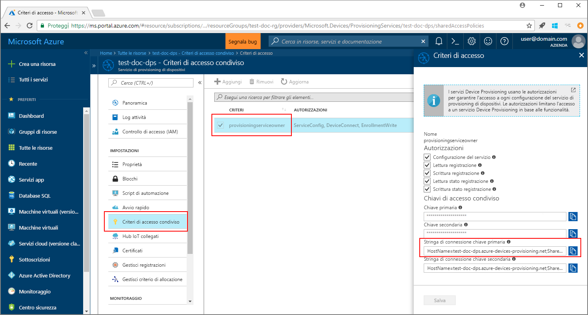
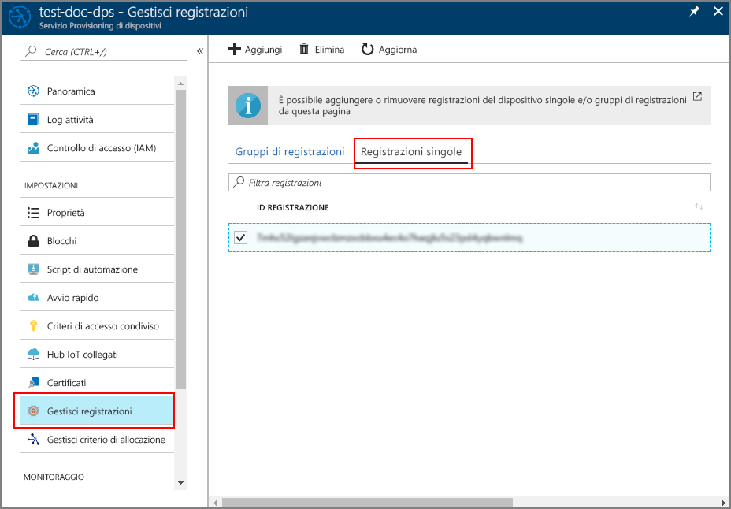

# <a name="enroll-tpm-device-to-iot-hub-device-provisioning-service-using-java-service-sdk"></a>Registrare un dispositivo TPM nel servizio Device Provisioning in hub IoT con Java Service SDK

[!INCLUDE [iot-dps-selector-quick-enroll-device-tpm](../../includes/iot-dps-selector-quick-enroll-device-tpm.md)]


Questi passaggi illustrano come registrare a livello di codice un dispositivo TPM simulato nei servizi Device Provisioning in hub IoT di Azure, usando [Java Service SDK](https://azure.github.io/azure-iot-sdk-java/service/) con l'aiuto di un'applicazione Java di esempio. Anche se Java Service SDK funziona su computer sia Windows che Linux, questo articolo usa un computer di sviluppo Windows per illustrare il processo di registrazione.

Assicurarsi di [configurare il servizio Device Provisioning in hub IoT con il portale di Azure](./quick-setup-auto-provision.md) e di [simulare un dispositivo TPM](quick-create-simulated-device.md#simulatetpm) prima di continuare.

<a id="setupdevbox"></a>

## <a name="prepare-the-development-environment"></a>Preparare l'ambiente di sviluppo 

1. Verificare che [Java SE Development Kit 8](http://www.oracle.com/technetwork/java/javase/downloads/jdk8-downloads-2133151.html) sia installato nel computer. 

2. Configurare le variabili di ambiente per l'installazione Java. La variabile `PATH` deve includere il percorso completo della directory *jdk1.8.x\bin*. Se si tratta della prima installazione Java del computer, creare una nuova variabile di ambiente denominata `JAVA_HOME` e fare in modo che punti al percorso completo della directory *jdk1.8.x*. Nel computer Windows questa directory si trova in genere nella cartella *C:\\Programmi\\Java\\* ed è possibile creare o modificare le variabili di ambiente cercando **Modifica le variabili di ambiente relative al sistema** nel **Pannello di controllo** del computer Windows. 

  Per controllare se Java è installato correttamente nel computer, eseguire il comando seguente nella finestra di comando:

    ```cmd\sh
    java -version
    ```

3. Scaricare ed estrarre [Maven 3](https://maven.apache.org/download.cgi) nel computer. 

4. Modificare la variabile di ambiente `PATH` in modo che punti alla cartella *apache-maven-3.x.x\\bin* nella cartella in cui viene estratto Maven. Per verificare che Maven sia installato correttamente, eseguire questo comando nella finestra di comando:

    ```cmd\sh
    mvn --version
    ```

5. Verificare che [git](https://git-scm.com/download/) sia installato nel computer e venga aggiunto alla variabile di ambiente `PATH`. 


<a id="javasample"></a>

## <a name="download-and-modify-the-java-sample-code"></a>Scaricare e modificare il codice di esempio Java

Questa sezione illustra come aggiungere i dettagli del provisioning del dispositivo TPM al codice di esempio. 

1. Aprire un prompt dei comandi. Clonare il repository GitHub per l'esempio di codice di registrazione del dispositivo usando Java Service SDK:
    
    ```cmd\sh
    git clone https://github.com/Azure/azure-iot-sdk-java.git --recursive
    ```

2. Nel codice sorgente scaricato passare alla cartella dell'esempio **_azure-iot-sdk-java/provisioning/provisioning-samples/service-enrollment-sample_**. Aprire il file **_/src/main/java/samples/com/microsoft/azure/sdk/iot/ServiceEnrollmentSample.java_** nell'editor preferito e aggiungere i dettagli seguenti:

    1. Aggiungere `[Provisioning Connection String]` per il servizio di provisioning dal portale, come indicato di seguito:
        1. Passare al servizio di provisioning nel [portale di Azure](https://portal.azure.com). 
        2. Aprire **Criteri di accesso condivisi** e selezionare un criterio con l'autorizzazione *EnrollmentWrite*.
        3. Copiare la **stringa di connessione chiave primaria**. 

              

        4. Nel file del codice di esempio **_ServiceEnrollmentSample.java_** sostituire `[Provisioning Connection String]` con la **stringa di connessione chiave primaria**.
    
            ```Java
            private static final String PROVISIONING_CONNECTION_STRING = "[Provisioning Connection String]";
            ```

    2. Aggiungere i dettagli del dispositivo TPM:
        1. Ottenere l'*ID registrazione* e la *chiave di verifica dell'autenticità del TPM* per una simulazione del dispositivo TPM, seguendo i passaggi della sezione [Simulare il dispositivo TPM](quick-create-simulated-device.md#simulatetpm).
        2. Usare l'**_ID registrazione_** e la **_chiave di verifica dell'autenticità_** dell'output del passaggio precedente per sostituire `[RegistrationId]` e `[TPM Endorsement Key]` nel file del codice di esempio **_ServiceEnrollmentSample.java_**:
        
            ```Java
            private static final String REGISTRATION_ID = "[RegistrationId]";
            private static final String TPM_ENDORSEMENT_KEY = "[TPM Endorsement Key]";
            ```

    3. È facoltativamente possibile configurare il servizio di provisioning tramite il codice di esempio:
        - Per aggiungere questa configurazione all'esempio, seguire questa procedura:
            1. Passare all'hub IoT collegato al servizio di provisioning nel [portale di Azure](https://portal.azure.com). Aprire la scheda **Panoramica** dell'hub e copiare il **nome host**. Assegnare questo **nome host** al parametro *IOTHUB_HOST_NAME*.
                ```Java
                private static final String IOTHUB_HOST_NAME = "[Host name].azure-devices.net";
                ```
            2. Assegnare un nome descrittivo al parametro *DEVICE_ID* e mantenere per *PROVISIONING_STATUS* il valore predefinito *ENABLED*. 
    
        - OPPURE, se si sceglie di non configurare il servizio di provisioning, assicurarsi di impostare come commento o eliminare le istruzioni seguenti nel file _ServiceEnrollmentSample.java_:
            ```Java
            // The following parameters are optional. Remove it if you don't need.
            individualEnrollment.setDeviceId(DEVICE_ID);
            individualEnrollment.setIotHubHostName(IOTHUB_HOST_NAME);
            individualEnrollment.setProvisioningStatus(PROVISIONING_STATUS);
            ```

    4. Esaminare il codice di esempio, che crea, aggiorna, esegue query ed elimina la registrazione per un singolo dispositivo TPM. Per verificare che la registrazione sia stata eseguita correttamente nel portale, impostare temporaneamente come commento le righe di codice seguenti alla fine del file _ServiceEnrollmentSample.java_:
    
        ```Java
        // *********************************** Delete info of individualEnrollment ************************************
        System.out.println("\nDelete the individualEnrollment...");
        provisioningServiceClient.deleteIndividualEnrollment(REGISTRATION_ID);
        ```

    5. Salvare il file _ServiceEnrollmentSample.java_.

<a id="runjavasample"></a>

## <a name="build-and-run-the-java-sample-code"></a>Compilare ed eseguire il codice di esempio Java

1. Aprire una finestra di comando e passare alla cartella **_azure-iot-sdk-java/provisioning/provisioning-samples/service-enrollment-sample_**.

2. Compilare il codice di esempio usando questo comando:

    ```cmd\sh
    mvn install -DskipTests
    ```

   Questo comando scarica il pacchetto Maven [`com.microsoft.azure.sdk.iot.provisioning.service`](https://www.mvnrepository.com/artifact/com.microsoft.azure.sdk.iot.provisioning/provisioning-service-client) nel computer. Questo pacchetto include i file binari per Java Service SDK, necessari al codice di esempio per la compilazione. 

3. Eseguire l'esempio usando questi comandi nella finestra di comando:

    ```cmd\sh
    cd target
    java -jar ./service-enrollment-sample-{version}-with-deps.jar
    ```

4. Verificare nella finestra di output che la registrazione sia stata eseguita correttamente. 

5. Passare al servizio di provisioning nel portale di Azure. Fare clic su **Gestisci registrazioni** e selezionare la scheda **Registrazioni singole**. Si noti che ora è elencato l'*ID registrazione* del dispositivo TPM simulato. 

      

## <a name="clean-up-resources"></a>Pulire le risorse
Se si prevede di esplorare l'esempio di servizio Java, non eliminare le risorse create in questa guida introduttiva. Se non si prevede di continuare, usare i passaggi seguenti per eliminare tutte le risorse create da questa guida introduttiva.

1. Chiudere la finestra di output di esempio di Java sul computer.
1. Chiudere la finestra del simulatore TPM che potrebbe essere stata creata per simulare il dispositivo TPM.
1. Passare al servizio Device Provisioning nel portale di Azure, fare clic su **Gestisci registrazioni** e quindi selezionare la scheda **Registrazioni singole**. Selezionare l'*ID registrazione* del dispositivo registrato usando questa guida introduttiva e fare clic sul pulsante **Elimina** nella parte superiore del pannello. 

## <a name="next-steps"></a>Passaggi successivi
In questa introduttiva si è registrato un dispositivo TPM simulato nel servizio Device Provisioning. Per informazioni approfondite sul provisioning del dispositivo, passare all'esercitazione sulla configurazione del servizio Device Provisioning nel portale di Azure. 

> [!div class="nextstepaction"]
> [Azure IoT Hub Device Provisioning Service tutorials (Esercitazioni sul servizio Device Provisioning in hub IoT di Azure)](./tutorial-set-up-cloud.md)
