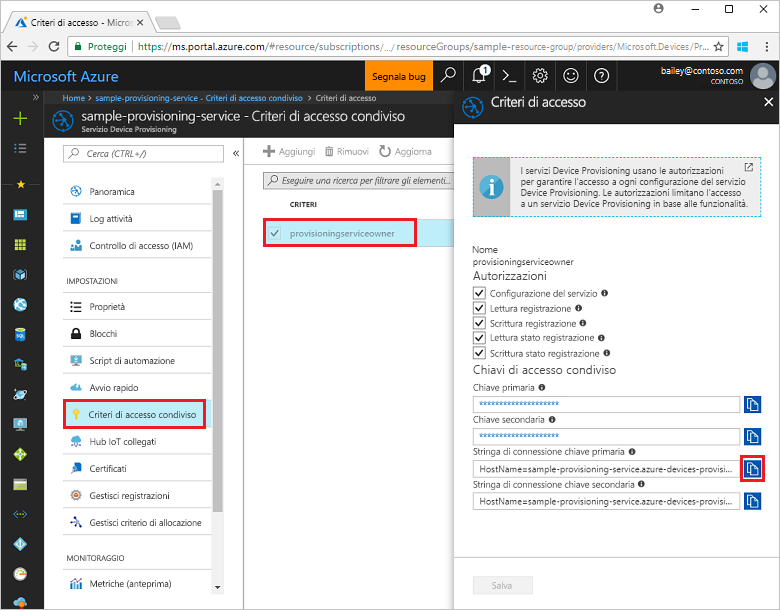
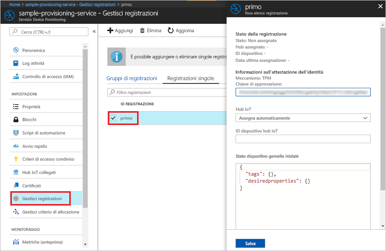

# <a name="quickstart-enroll-tpm-device-to-iot-hub-device-provisioning-service-using-nodejs-service-sdk"></a>Guida introduttiva: Registrare un dispositivo TPM nel servizio Device Provisioning in hub IoT con Node.js Service SDK

[!INCLUDE [iot-dps-selector-quick-enroll-device-tpm](../../includes/iot-dps-selector-quick-enroll-device-tpm.md)]

Questa guida di avvio rapido descrive come creare una registrazione singola a livello di codice per un dispositivo TPM nel servizio Device Provisioning in hub IoT di Azure usando Node.js Service SDK e un'applicazione Node.js di esempio. È anche possibile registrare un dispositivo TPM simulato nel servizio di provisioning usando questa voce di registrazione singola.

## <a name="prerequisites"></a>Prerequisiti

- Completamento dell'esercitazione [Configurare il servizio Device Provisioning in hub IoT con il portale di Azure](./quick-setup-auto-provision.md).
- Un account Azure con una sottoscrizione attiva. [È possibile crearne uno gratuitamente](https://azure.microsoft.com/free/?ref=microsoft.com&utm_source=microsoft.com&utm_medium=docs&utm_campaign=visualstudio).
- [Node.js v4.0 o versioni successive](https://nodejs.org). Questa guida di avvio rapido installa [Node.js Service SDK](https://github.com/Azure/azure-iot-sdk-node).
- Chiave di verifica dell'autenticità (facoltativa). Seguire la procedura descritta in [Creare ed effettuare il provisioning di un dispositivo simulato](quick-create-simulated-device.md) fino a quando non si ottiene la chiave. Non creare una registrazione singola usando il portale di Azure.

## <a name="create-the-individual-enrollment-sample"></a>Creare l'esempio di registrazione singola 

 
1. In una finestra di comando della cartella di lavoro eseguire:
  
    ```cmd\sh
    npm install azure-iot-provisioning-service
    ```  

2. Con un editor di testo creare un file **create_individual_enrollment.js** nella cartella di lavoro. Aggiungere il codice seguente al file e salvare:

    ```
    'use strict';

    var provisioningServiceClient = require('azure-iot-provisioning-service').ProvisioningServiceClient;

    var serviceClient = provisioningServiceClient.fromConnectionString(process.argv[2]);
    var endorsementKey = process.argv[3];

    var enrollment = {
      registrationId: 'first',
      attestation: {
        type: 'tpm',
        tpm: {
          endorsementKey: endorsementKey
        }
      }
    };

    serviceClient.createOrUpdateIndividualEnrollment(enrollment, function(err, enrollmentResponse) {
      if (err) {
        console.log('error creating the individual enrollment: ' + err);
      } else {
        console.log("enrollment record returned: " + JSON.stringify(enrollmentResponse, null, 2));
      }
    });
    ```

## <a name="run-the-individual-enrollment-sample"></a>Eseguire l'esempio di registrazione singola
  
1. Per eseguire l'esempio è necessaria la stringa di connessione del servizio di provisioning. 
    1. Accedere al portale di Azure, selezionare il pulsante **Tutte le risorse** nel menu a sinistra e aprire il servizio Device Provisioning. 
    2. Selezionare **Criteri di accesso condiviso** e quindi selezionare i criteri di accesso da usare per aprirne le proprietà. Nella finestra **Criteri di accesso** copiare e annotare la stringa di connessione della chiave primaria. 

        


2. È anche necessaria la chiave di verifica dell'autenticità per il dispositivo. Se è stata seguita la procedura descritta nella guida introduttiva [Creare ed effettuare il provisioning di un dispositivo simulato](quick-create-simulated-device.md) per creare un dispositivo TPM simulato, usare la chiave creata per il dispositivo. In caso contrario, per creare una registrazione singola di esempio è possibile usare la chiave di verifica dell'autenticità seguente fornita con [Node.js Service SDK](https://github.com/Azure/azure-iot-sdk-node):

    ```
    AToAAQALAAMAsgAgg3GXZ0SEs/gakMyNRqXXJP1S124GUgtk8qHaGzMUaaoABgCAAEMAEAgAAAAAAAEAxsj2gUScTk1UjuioeTlfGYZrrimExB+bScH75adUMRIi2UOMxG1kw4y+9RW/IVoMl4e620VxZad0ARX2gUqVjYO7KPVt3dyKhZS3dkcvfBisBhP1XH9B33VqHG9SHnbnQXdBUaCgKAfxome8UmBKfe+naTsE5fkvjb/do3/dD6l4sGBwFCnKRdln4XpM03zLpoHFao8zOwt8l/uP3qUIxmCYv9A7m69Ms+5/pCkTu/rK4mRDsfhZ0QLfbzVI6zQFOKF/rwsfBtFeWlWtcuJMKlXdD8TXWElTzgh7JS4qhFzreL0c1mI0GCj+Aws0usZh7dLIVPnlgZcBhgy1SSDQMQ==
    ```

3. Per creare un gruppo di registrazioni per il dispositivo TPM eseguire questo comando, includendo le virgolette che racchiudono gli argomenti:
 
     ```cmd\sh
     node create_individual_enrollment.js "<the connection string for your provisioning service>" "<endorsement key>"
     ```
 
3. Al termine della creazione, la finestra di comando visualizza le proprietà della nuova registrazione singola.

     

4. Verificare che la registrazione singola sia stata creata. Nel portale di Azure, nel pannello di riepilogo del servizio Device Provisioning selezionare **Gestisci registrazioni**. Selezionare la scheda **Registrazioni singole** e selezionare la nuova voce di registrazione (la *prima*) per esaminare la chiave di verifica dell'autenticità e altre proprietà della voce.

     
 
Ora che è stata creata una registrazione singola per un dispositivo TPM, è possibile proseguire con i passaggi rimanenti di [Creare ed effettuare il provisioning di un dispositivo simulato](quick-create-simulated-device.md) se si vuole registrare un dispositivo simulato. Omettere i passaggi per la creazione di una registrazione singola nel portale di Azure descritti in tale argomento di avvio rapido.

## <a name="clean-up-resources"></a>Pulire le risorse
Se si prevede di esplorare gli esempi di servizio Node.js, non eseguire la pulizia delle risorse create in questa guida di avvio rapido. Se non si intende continuare, seguire questa procedura per eliminare tutte le risorse create in questa guida.

1. Chiudere la finestra di output di esempio di Node.js nel computer.
1. Se è stato creato un dispositivo TPM simulato, chiudere la finestra del simulatore TPM.
2. Passare al servizio Device Provisioning nel portale di Azure e selezionare **Gestisci registrazioni** e quindi la scheda **Registrazioni singole**. Selezionare la casella di controllo accanto all'*ID registrazione* della voce di registrazione creata con questa guida di avvio rapido e fare clic sul pulsante **Elimina** nella parte superiore del riquadro. 
 
## <a name="next-steps"></a>Passaggi successivi
In questa guida di avvio rapido si è creata a livello di codice una voce di registrazione singola per un dispositivo TPM e, facoltativamente, è stato creato un dispositivo simulato TPM nel computer e ne è stato effettuato il provisioning nell'hub IoT usando il servizio Device Provisioning in hub IoT di Azure. Per informazioni approfondite sul provisioning del dispositivo, passare all'esercitazione sulla configurazione del servizio Device Provisioning nel portale di Azure. 
 
> [!div class="nextstepaction"]
> [Azure IoT Hub Device Provisioning Service tutorials (Esercitazioni sul servizio Device Provisioning in hub IoT di Azure)](./tutorial-set-up-cloud.md)