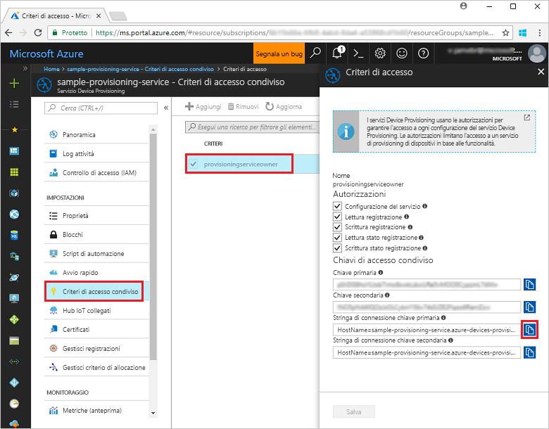
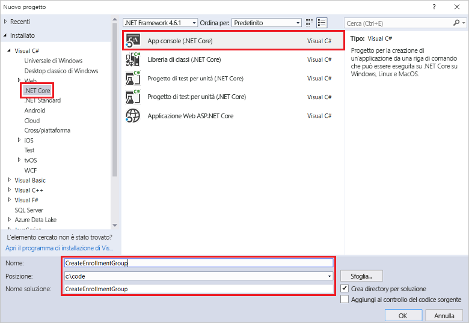
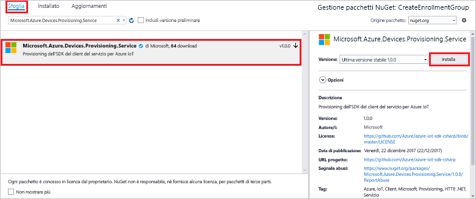
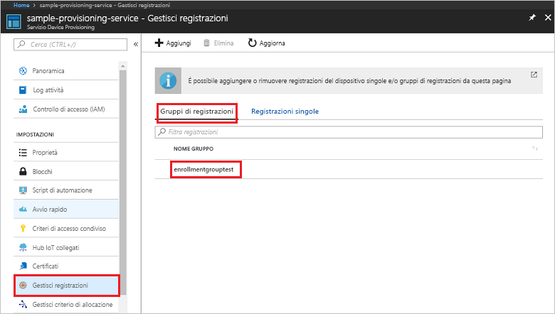

# <a name="enroll-x509-devices-to-iot-hub-device-provisioning-service-using-c-service-sdk"></a>Registrare dispositivi X.509 nel servizio Device Provisioning in hub IoT con C# Service SDK
> [!div class="op_single_selector"]
> * [Java](quick-enroll-device-x509-java.md)
> * [C#](quick-enroll-device-x509-csharp.md)
> * [Node.js](quick-enroll-device-x509-node.md)

Questi passaggi illustrano come creare un gruppo di registrazioni a livello di codice per un certificato X.509 intermedio o CA radice usando [C# Service SDK](https://github.com/Azure/azure-iot-sdk-csharp) e un'applicazione C# .NET Core di esempio. Un gruppo di registrazione controlla l'accesso al servizio di provisioning per i dispositivi che condividono un certificato di firma comune nella rispettiva catena di certificati. Per altre informazioni, vedere [Controllo dell'accesso dei dispositivi al servizio di provisioning con certificati X.509](./concepts-security.md#controlling-device-access-to-the-provisioning-service-with-x509-certificates). Per altre informazioni sull'uso di un'infrastruttura a chiave pubblica (PKI, Public Key Infrastructure) basata su certificati X.509 con l'hub IoT di Azure e il servizio Device Provisioning, vedere [Panoramica della sicurezza dei certificati della CA X.509](https://docs.microsoft.com/en-us/azure/iot-hub/iot-hub-x509ca-overview). Anche se i passaggi illustrati in questo articolo funzionano su computer sia Windows che Linux, l'articolo usa un computer di sviluppo Windows.

## <a name="prepare-the-development-environment"></a>Preparare l'ambiente di sviluppo

1. Assicurarsi che [Visual Studio 2017](https://www.visualstudio.com/vs/) sia installato nel computer. 
2. Verificare che [.NET Core SDK](https://www.microsoft.com/net/download/windows) sia installato nel computer. 
3. Assicurarsi di completare la procedura descritta in [Configurare il servizio Device Provisioning in hub IoT con il portale di Azure](./quick-setup-auto-provision.md) prima di continuare.
4. È necessario un file PEM o CER contenente la parte pubblica di un certificato X.509 intermedio o CA radice caricato e verificato con il servizio di provisioning. [Azure IoT C SDK](https://github.com/Azure/azure-iot-sdk-c) contiene strumenti che consentono di creare una catena di certificati X.509, caricare un certificato intermedio o radice dalla catena ed eseguire la proof-of-possession con il servizio per verificare il certificato. Per usare questi strumenti, scaricare i contenuti della cartella [azure-iot-sdk-c/tools/CACertificates](https://github.com/Azure/azure-iot-sdk-c/tree/master/tools/CACertificates) in una cartella di lavoro nel computer e seguire la procedura illustrata in [azure-iot-sdk-c\tools\CACertificates\CACertificateOverview.md](https://github.com/Azure/azure-iot-sdk-c/blob/master/tools/CACertificates/CACertificateOverview.md). Oltre agli strumenti disponibili in C SDK, l'[esempio di verifica dei certificati dei gruppi](https://github.com/Azure/azure-iot-sdk-csharp/tree/master/provisioning/service/samples/GroupCertificateVerificationSample) in **C# Service SDK** mostra come eseguire la proof-of-possession con un certificato X.509 intermedio o CA radice. 

  > [!IMPORTANT]
  > I certificati creati con gli strumenti dell'SDK sono progettati per l'uso per il solo sviluppo. Per informazioni su come ottenere certificati idonei al codice di produzione, vedere [Come ottenere un certificato della CA X.509](https://docs.microsoft.com/en-us/azure/iot-hub/iot-hub-x509ca-overview#how-to-get-an-x509-ca-certificate) nella documentazione dell'hub IoT di Azure.

## <a name="get-the-connection-string-for-your-provisioning-service"></a>Ottenere la stringa di connessione del servizio di provisioning

Per l'esempio in questa guida introduttiva è necessaria la stringa di connessione del servizio di provisioning.
1. Accedere al portale di Azure, fare clic sul pulsante **Tutte le risorse** nel menu a sinistra e aprire il servizio Device Provisioning. 
2. Fare clic su **Criteri di accesso condivisi** e quindi sui criteri di accesso da usare per aprirne le proprietà. Nella finestra **Criteri di accesso** copiare e annotare la stringa di connessione della chiave primaria. 

    

## <a name="create-the-enrollment-group-sample"></a>Creare l'esempio di gruppo di registrazioni 

La procedura disponibile in questa sezione mostra come creare un'app console di .NET Core che aggiunge un gruppo di registrazione al servizio di provisioning. Con alcune modifiche, è anche possibile seguire questa procedura per creare un'app console di [Windows IoT Core](https://developer.microsoft.com/en-us/windows/iot) per aggiungere il gruppo di registrazione. Per altre informazioni sullo sviluppo con IoT Core, vedere la [documentazione di Windows IoT Core per sviluppatori](https://docs.microsoft.com/en-us/windows/iot-core/).
1. In Visual Studio aggiungere un progetto di app console di Visual C# .NET Core a una nuova soluzione usando il modello di progetto **Console App (.NET Core)** (App console - .NET Core). Verificare che la versione di .NET Framework sia 4.5.1 o successiva. Assegnare al progetto il nome **CreateEnrollmentGroup**.

    

2. In Esplora soluzioni fare clic con il pulsante destro del mouse sul progetto **CreateEnrollmentGroup**, quindi scegliere **Gestisci pacchetti NuGet**.
3. Nella finestra **Gestione pacchetti NuGet** selezionare **Esplora**, cercare **Microsoft.Azure.Devices.Provisioning.Service**, selezionare **Installa** per installare il pacchetto **Microsoft.Azure.Devices.Provisioning.Service** e accettare le condizioni per l'utilizzo. Questa procedura scarica, installa e aggiunge un riferimento al pacchetto NuGet [Azure IoT Provisioning Service Client SDK](https://www.nuget.org/packages/Microsoft.Azure.Devices.Provisioning.Service/) e alle relative dipendenze.

    

4. Aggiungere le istruzioni `using` seguenti dopo le altre istruzioni `using` nella parte superiore del file **Program.cs**:
   
   ```csharp
   using System.Security.Cryptography.X509Certificates;
   using System.Threading.Tasks;
   using Microsoft.Azure.Devices.Provisioning.Service;
   ```
    
5. Aggiungere i campi seguenti alla classe **Program** .  
   - Sostituire il valore del segnaposto **ProvisioningConnectionString** con la stringa di connessione del servizio di provisioning per cui si vuole creare la registrazione.
   - Sostituire il valore del segnaposto **X509RootCertPath** con il percorso di un file PEM o CER che rappresenta la parte pubblica di un certificato X.509 intermedio o CA radice caricato e verificato in precedenza con il servizio di provisioning.
   - È facoltativamente possibile modificare il valore di **EnrollmentGroupId**. La stringa può contenere solo caratteri minuscoli e trattini. 

   > [!IMPORTANT]
   > Nel codice di produzione occorre tenere presenti le considerazioni seguenti sulla sicurezza:
   >
   > - L'impostazione della stringa di connessione come hardcoded per l'amministratore del servizio di provisioning non è conforme alle procedure consigliate per la sicurezza. La stringa di connessione deve essere tuttavia conservata in modo sicuro, ad esempio in un file di configurazione sicuro o nel Registro di sistema.
   > - Assicurarsi di caricare solo la parte pubblica del certificato di firma. Non caricare mai nel servizio di provisioning i file PFX (PKCS12) o PEM contenenti le chiavi private.
        
   ```csharp
   private static string ProvisioningConnectionString = "{Your provisioning service connection string}";
   private static string EnrollmentGroupId = "enrollmentgrouptest";
   private static string X509RootCertPath = @"{Path to a .cer or .pem file for a verified root CA or intermediate CA X.509 certificate}";
   ```
    
6. Aggiungere il metodo seguente alla classe **Program**. Questo codice crea una voce del gruppo di registrazione e quindi chiama il metodo **CreateOrUpdateEnrollmentGroupAsync** in **ProvisioningServiceClient** per aggiungere il gruppo di registrazione al servizio di provisioning.
   
   ```csharp
   public static async Task RunSample()
   {
       Console.WriteLine("Starting sample...");
 
       using (ProvisioningServiceClient provisioningServiceClient =
               ProvisioningServiceClient.CreateFromConnectionString(ProvisioningConnectionString))
       {
           #region Create a new enrollmentGroup config
           Console.WriteLine("\nCreating a new enrollmentGroup...");
           var certificate = new X509Certificate2(X509RootCertPath);
           Attestation attestation = X509Attestation.CreateFromRootCertificates(certificate);
           EnrollmentGroup enrollmentGroup =
                   new EnrollmentGroup(
                           EnrollmentGroupId,
                           attestation)
                   {
                       ProvisioningStatus = ProvisioningStatus.Enabled
                   };
           Console.WriteLine(enrollmentGroup);
           #endregion
 
           #region Create the enrollmentGroup
           Console.WriteLine("\nAdding new enrollmentGroup...");
           EnrollmentGroup enrollmentGroupResult =
               await provisioningServiceClient.CreateOrUpdateEnrollmentGroupAsync(enrollmentGroup).ConfigureAwait(false);
           Console.WriteLine("\nEnrollmentGroup created with success.");
           Console.WriteLine(enrollmentGroupResult);
           #endregion
 
       }
   }
   ```

7. Sostituire infine il corpo del metodo **Main** con le righe seguenti:
   
   ```csharp
   RunSample().GetAwaiter().GetResult();
   Console.WriteLine("\nHit <Enter> to exit ...");
   Console.ReadLine();
   ```
        
8. Compilare la soluzione.

## <a name="run-the-enrollment-group-sample"></a>Eseguire l'esempio di gruppo di registrazioni
  
1. Eseguire l'esempio in Visual Studio per creare il gruppo di registrazione.
 
2. Al termine della creazione, la finestra di comando visualizza le proprietà del nuovo gruppo di registrazioni.

    

3. Per assicurarsi che il gruppo di registrazione sia stato creato, nel pannello di riepilogo del servizio Device Provisioning nel portale di Azure selezionare **Gestisci registrazioni**, quindi selezionare la scheda **Gruppi di registrazioni**. Dovrebbe essere visualizzata una nuova voce di registrazione che corrisponde all'ID di registrazione usato nell'esempio. Fare clic sulla voce per verificare l'identificazione personale del certificato e altre proprietà per la voce.

    
 
## <a name="clean-up-resources"></a>Pulire le risorse
Se si prevede di esplorare l'esempio di servizio C#, non eliminare le risorse create in questa guida introduttiva. Se non si prevede di continuare, usare i passaggi seguenti per eliminare tutte le risorse create da questa guida introduttiva.

1. Chiudere la finestra di output di esempio di C# sul computer.
2. Passare al servizio Device Provisioning nel portale di Azure, fare clic su **Gestisci registrazioni** e quindi selezionare la scheda **Gruppi di registrazioni**. Selezionare l'*ID registrazione* della voce di registrazione creata usando questa guida introduttiva e fare clic sul pulsante **Elimina** nella parte superiore del pannello.  
3. Dal servizio Device Provisioning nel portale di Azure, fare clic su **Certificati**, selezionare il certificato caricato per questa guida introduttiva e quindi fare clic sul pulsante **Elimina** nella parte superiore della finestra **Dettagli certificato**.  
 
## <a name="next-steps"></a>Passaggi successivi
In questa guida introduttiva è stato creato un gruppo di registrazione per un certificato X.509 intermedio o CA radice usando il servizio Device Provisioning in hub IoT di Azure. Per informazioni approfondite sul provisioning del dispositivo, passare all'esercitazione sulla configurazione del servizio Device Provisioning nel portale di Azure. 
 
> [!div class="nextstepaction"]
> [Azure IoT Hub Device Provisioning Service tutorials (Esercitazioni sul servizio Device Provisioning in hub IoT di Azure)](./tutorial-set-up-cloud.md)
