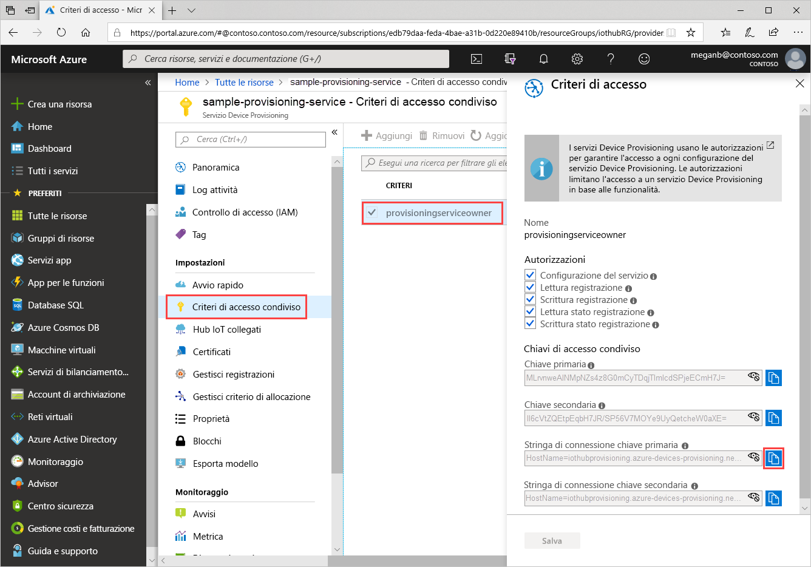
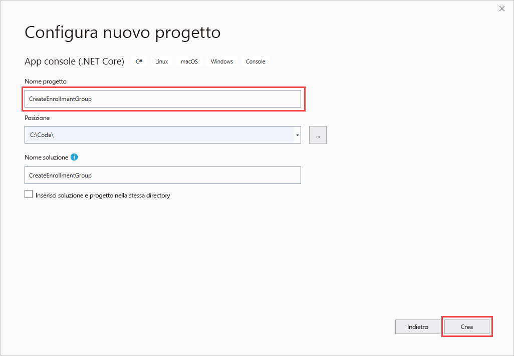
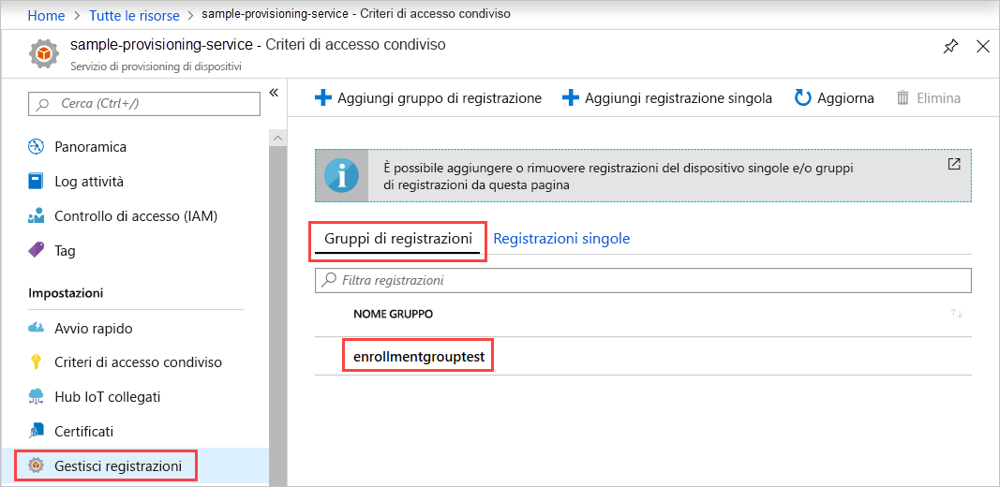

# <a name="quickstart-enroll-x509-devices-to-the-device-provisioning-service-using-c"></a>Guida introduttiva: Registrare i dispositivi X.509 nel servizio di provisioning di dispositivi con C#

[!INCLUDE [iot-dps-selector-quick-enroll-device-x509](../../includes/iot-dps-selector-quick-enroll-device-x509.md)]

Questa guida introduttiva illustra come usare C# per creare un [gruppo di registrazione](concepts-service.md#enrollment-group) a livello di codice che usi un certificato X.509 intermedio o CA radice. Il gruppo di registrazione viene creato usando [Microsoft Azure IoT SDK per .NET](https://github.com/Azure/azure-iot-sdk-csharp) e un'applicazione C# .NET Core di esempio. Un gruppo di registrazione controlla l'accesso al servizio di provisioning per i dispositivi che condividono un certificato di firma comune nella rispettiva catena di certificati. Per altre informazioni, vedere [Controllo dell'accesso dei dispositivi al servizio di provisioning con certificati X.509](./concepts-security.md#controlling-device-access-to-the-provisioning-service-with-x509-certificates). Per altre informazioni sull'uso di un'infrastruttura a chiave pubblica (PKI, Public Key Infrastructure) basata su certificati X.509 con l'hub IoT di Azure e il servizio Device Provisioning, vedere [Panoramica della sicurezza dei certificati della CA X.509](https://docs.microsoft.com/azure/iot-hub/iot-hub-x509ca-overview). 

Questa guida di avvio rapido prevede che siano già stati creati un hub IoT e un'istanza del servizio Device Provisioning. Se queste risorse non sono ancora state create, prima di continuare con questo articolo completare la guida di avvio rapido [Configurare il servizio Device Provisioning in hub IoT con il portale di Azure](./quick-setup-auto-provision.md).

I passaggi qui illustrati funzionano su computer sia Windows che Linux, ma questo articolo usa un computer di sviluppo Windows.

[!INCLUDE [quickstarts-free-trial-note](../../includes/quickstarts-free-trial-note.md)]

## <a name="prerequisites"></a>Prerequisiti

* Installare [Visual Studio 2019](https://www.visualstudio.com/vs/).
* Installare [.NET Core SDK](https://www.microsoft.com/net/download/windows).
* Installare [Git](https://git-scm.com/download/).

## <a name="prepare-test-certificates"></a>Preparare i certificati di test

Per questa guida introduttiva è necessario un file PEM o CER contenente la parte pubblica di un certificato X.509 intermedio o CA radice. Questo certificato deve essere caricato nel servizio di provisioning e verificato dal servizio.

[Azure IoT SDK per C](https://github.com/Azure/azure-iot-sdk-c) contiene strumenti di test che consentono di creare una catena di certificati X.509, caricare un certificato intermedio o radice da tale catena e verificare il certificato eseguendo la verifica del possesso con il servizio.

> [!CAUTION]
> Usare i certificati creati con gli strumenti dell'SDK solo per test di sviluppo.
> Non usare questi certificati nell'ambiente di produzione.
> Contengono password hardcoded, come *1234*, che scadono dopo 30 giorni.
> Per informazioni su come ottenere certificati idonei all'uso nell'ambiente di produzione, vedere [Come ottenere un certificato della CA X.509](https://docs.microsoft.com/azure/iot-hub/iot-hub-x509ca-overview#how-to-get-an-x509-ca-certificate) nella documentazione dell'hub IoT di Azure.
>

Per usare gli strumenti di test per generare certificati, seguire questa procedura:

1. Aprire una finestra del prompt dei comandi o la shell Git Bash e passare a una cartella di lavoro nel computer in uso. Eseguire il comando seguente per clonare il repository GitHub [Azure IoT C SDK](https://github.com/Azure/azure-iot-sdk-c):

   ```cmd/sh
   git clone https://github.com/Azure/azure-iot-sdk-c.git --recursive
   ```

   Il completamento di questa operazione richiederà alcuni minuti.

   Gli strumenti di test si trovano nel percorso *azure-iot-sdk-c/tools/CACertificates* del repository clonato.

1. Seguire la procedura in [Gestione dei certificati CA di prova per esempi e certificazioni](https://github.com/Azure/azure-iot-sdk-c/blob/master/tools/CACertificates/CACertificateOverview.md).

In aggiunta agli strumenti disponibili nell'SDK per C, l'[esempio di verifica del certificato di gruppo](https://github.com/Azure-Samples/azure-iot-samples-csharp/tree/master/provisioning/Samples/service/GroupCertificateVerificationSample) in *Microsoft Azure IoT SDK per .NET* mostra come eseguire la verifica di possesso in C# con un certificato CA radice o intermedio X.509.

## <a name="get-the-connection-string-for-your-provisioning-service"></a>Ottenere la stringa di connessione del servizio di provisioning

Per l'esempio in questa guida introduttiva è necessaria la stringa di connessione del servizio di provisioning.

1. Accedere al portale di Azure, selezionare **Tutte le risorse** e quindi il servizio Device Provisioning.

1. Selezionare **Criteri di accesso condiviso** e quindi scegliere i criteri di accesso da usare per aprirne le proprietà. In **Criteri di accesso** copiare e salvare la stringa di connessione della chiave primaria.

    

## <a name="create-the-enrollment-group-sample"></a>Creare l'esempio di gruppo di registrazioni 

Questa sezione illustra come creare un'app console .NET Core che aggiunge un gruppo di registrazione al servizio di provisioning. Con alcune modifiche, è anche possibile seguire questa procedura per creare un'app console di [Windows IoT Core](https://developer.microsoft.com/en-us/windows/iot) per aggiungere il gruppo di registrazione. Per altre informazioni sullo sviluppo con IoT Core, vedere la [documentazione di Windows IoT Core per sviluppatori](https://docs.microsoft.com/windows/iot-core/).

1. Aprire Visual Studio e selezionare **Crea un nuovo progetto**. In **Crea un nuovo progetto** scegliere il modello di progetto **App console (.NET Core)** per il modello di progetto C# e selezionare **Avanti**.

1. Assegnare il nome *CreateEnrollmentGroup* al progetto e quindi fare clic su **Crea**.

    

1. All'apertura della soluzione in Visual Studio, nel riquadro **Esplora soluzioni** fare clic con il pulsante destro del mouse sul progetto **CreateEnrollmentGroup** e quindi scegliere **Gestisci pacchetti NuGet**.

1. In **Gestione pacchetti NuGet** selezionare **Sfoglia**, cercare e scegliere **Microsoft.Azure.Devices.Provisioning.Service** e quindi fare clic su **Installa**.

    

   Con questo passaggio vengono eseguiti il download e l'installazione e viene aggiunto un riferimento al pacchetto NuGet dell'[SDK client del servizio di provisioning di Azure IoT](https://www.nuget.org/packages/Microsoft.Azure.Devices.Provisioning.Service/) e alle relative dipendenze.

1. Aggiungere le istruzioni `using` seguenti dopo le altre istruzioni `using` all'inizio di `Program.cs`:

   ```csharp
   using System.Security.Cryptography.X509Certificates;
   using System.Threading.Tasks;
   using Microsoft.Azure.Devices.Provisioning.Service;
   ```

1. Aggiungere i campi seguenti alla classe `Program` e apportare le modifiche indicate.  

   ```csharp
   private static string ProvisioningConnectionString = "{ProvisioningServiceConnectionString}";
   private static string EnrollmentGroupId = "enrollmentgrouptest";
   private static string X509RootCertPath = @"{Path to a .cer or .pem file for a verified root CA or intermediate CA X.509 certificate}";
   ```

   * Sostituire il valore segnaposto di `ProvisioningServiceConnectionString` con la stringa di connessione del servizio di provisioning per cui si vuole creare la registrazione.

   * Sostituire il valore segnaposto di `X509RootCertPath` con il percorso di un file con estensione pem o cer. Questo file rappresenta la parte pubblica di un certificato X.509 CA radice o intermedio precedentemente caricato e verificato con il servizio di provisioning.

   * Facoltativamente, è possibile modificare il valore di `EnrollmentGroupId`. La stringa può contenere solo caratteri minuscoli e trattini.

   > [!IMPORTANT]
   > Nel codice di produzione occorre tenere presenti le considerazioni seguenti sulla sicurezza:
   >
   > * L'impostazione della stringa di connessione come hardcoded per l'amministratore del servizio di provisioning non è conforme alle procedure consigliate per la sicurezza. La stringa di connessione deve essere tuttavia conservata in modo sicuro, ad esempio in un file di configurazione sicuro o nel Registro di sistema.
   > * Assicurarsi di caricare solo la parte pubblica del certificato di firma. Non caricare mai nel servizio di provisioning i file PFX (PKCS12) o PEM contenenti le chiavi private.

1. Aggiungere il metodo seguente alla classe `Program`. Questo codice crea una voce del gruppo di registrazione e quindi chiama il metodo `CreateOrUpdateEnrollmentGroupAsync` in `ProvisioningServiceClient` per aggiungere il gruppo di registrazione al servizio di provisioning.

   ```csharp
   public static async Task RunSample()
   {
       Console.WriteLine("Starting sample...");
 
       using (ProvisioningServiceClient provisioningServiceClient =
               ProvisioningServiceClient.CreateFromConnectionString(ProvisioningConnectionString))
       {
           #region Create a new enrollmentGroup config
           Console.WriteLine("\nCreating a new enrollmentGroup...");
           var certificate = new X509Certificate2(X509RootCertPath);
           Attestation attestation = X509Attestation.CreateFromRootCertificates(certificate);
           EnrollmentGroup enrollmentGroup =
                   new EnrollmentGroup(
                           EnrollmentGroupId,
                           attestation)
                   {
                       ProvisioningStatus = ProvisioningStatus.Enabled
                   };
           Console.WriteLine(enrollmentGroup);
           #endregion
 
           #region Create the enrollmentGroup
           Console.WriteLine("\nAdding new enrollmentGroup...");
           EnrollmentGroup enrollmentGroupResult =
               await provisioningServiceClient.CreateOrUpdateEnrollmentGroupAsync(enrollmentGroup).ConfigureAwait(false);
           Console.WriteLine("\nEnrollmentGroup created with success.");
           Console.WriteLine(enrollmentGroupResult);
           #endregion
 
       }
   }
   ```

1. Sostituire infine il corpo del metodo `Main` con le righe seguenti:

   ```csharp
   RunSample().GetAwaiter().GetResult();
   Console.WriteLine("\nHit <Enter> to exit ...");
   Console.ReadLine();
   ```

1. Compilare la soluzione.

## <a name="run-the-enrollment-group-sample"></a>Eseguire l'esempio di gruppo di registrazioni
  
Eseguire l'esempio in Visual Studio per creare il gruppo di registrazione. Verrà visualizzata una finestra del prompt dei comandi in cui inizieranno a essere visualizzati i messaggi di conferma. Al termine della creazione, nella finestra del prompt dei comandi verranno visualizzate le proprietà del nuovo gruppo di registrazione.

È possibile verificare che il gruppo di registrazione sia stato creato. Passare al riepilogo del servizio Device Provisioning e selezionare **Gestisci registrazioni** e quindi **Gruppi di registrazioni**. Dovrebbe essere visualizzata una nuova voce di registrazione che corrisponde all'ID di registrazione usato nell'esempio.



Selezionare la voce per verificare l'identificazione personale del certificato e le altre proprietà della voce.

## <a name="clean-up-resources"></a>Pulire le risorse

Se si intende esplorare l'esempio di servizio C#, non eseguire la pulizia delle risorse create in questa guida di avvio rapido. In caso contrario, usare i passaggi seguenti per eliminare tutte le risorse qui create.

1. Chiudere la finestra di output dell'esempio C# sul computer.

1. Passare al servizio Device Provisioning nel portale di Azure e selezionare **Gestisci registrazioni** e quindi **Gruppi di registrazioni**. Selezionare l'*ID registrazione* della voce di registrazione creata con questa guida di avvio rapido e fare clic su **Elimina**.

1. Nel servizio Device Provisioning nel portale di Azure selezionare **Certificati**, scegliere il certificato caricato per questa guida di avvio rapido e fare clic su **Elimina** nella parte superiore di **Dettagli certificato**.  

## <a name="next-steps"></a>Passaggi successivi

In questa guida di avvio rapido è stato creato un gruppo di registrazione per un certificato X.509 CA radice o intermedio usando il servizio Device Provisioning in hub IoT di Azure. Per informazioni approfondite sul provisioning del dispositivo, passare all'esercitazione sulla configurazione del servizio Device Provisioning nel portale di Azure.

> [!div class="nextstepaction"]
> [Azure IoT Hub Device Provisioning Service tutorials (Esercitazioni sul servizio Device Provisioning in hub IoT di Azure)](./tutorial-set-up-cloud.md)
