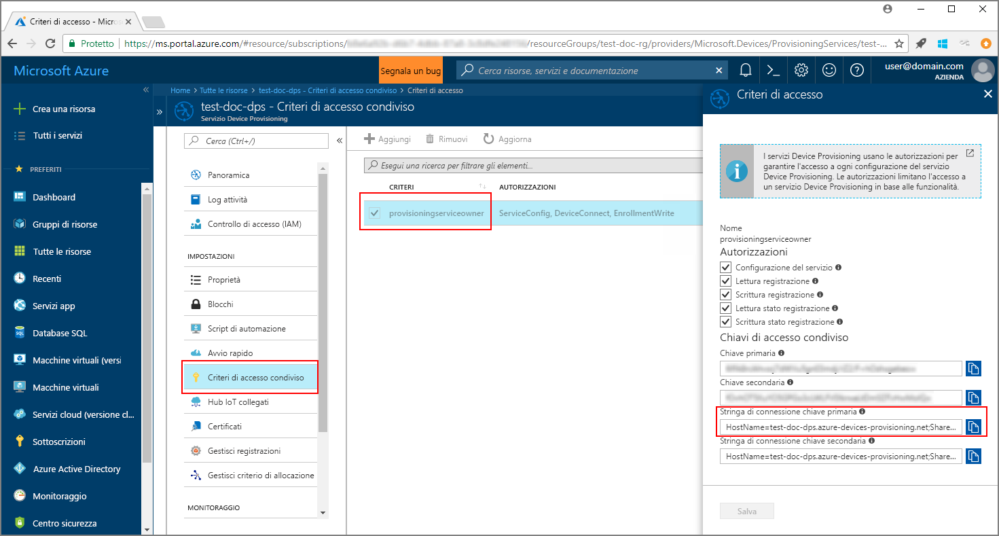
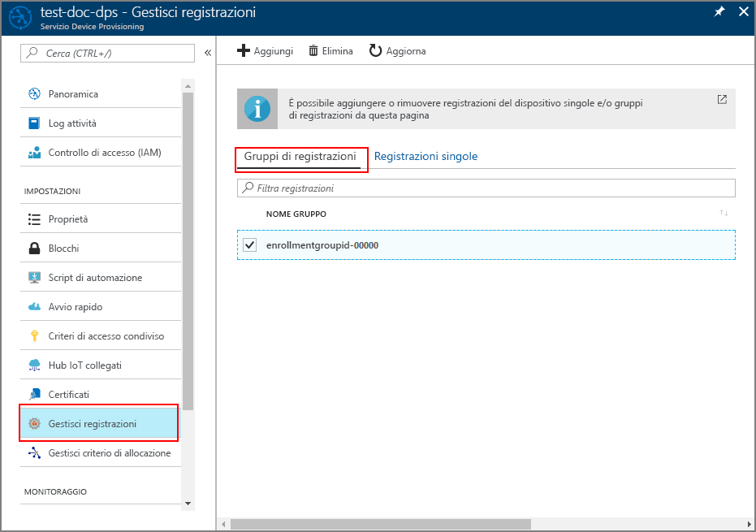

# <a name="enroll-x509-devices-to-iot-hub-device-provisioning-service-using-java-service-sdk"></a>Registrare dispositivi X.509 nel servizio Device Provisioning in hub IoT con Java Service SDK
> [!div class="op_single_selector"]
> * [Java](quick-enroll-device-x509-java.md)
> * [Node.JS](quick-enroll-device-x509-node.md)

Questi passaggi illustrano come registrare a livello di codice un gruppo di dispositivi simulati X.509 nel servizio Device Provisioning in hub IoT di Azure, usando [Java Service SDK](https://azure.github.io/azure-iot-sdk-java/service/) con l'aiuto di un'applicazione Java di esempio. Anche se Java Service SDK funziona su computer sia Windows che Linux, questo articolo usa un computer di sviluppo Windows per illustrare il processo di registrazione.

Assicurarsi di [configurare il servizio Device Provisioning in hub IoT con il portale di Azure](./quick-setup-auto-provision.md) prima di continuare.

<a id="setupdevbox"></a>

## <a name="prepare-the-development-environment"></a>Preparare l'ambiente di sviluppo 

1. Verificare che [Java SE Development Kit 8](http://www.oracle.com/technetwork/java/javase/downloads/jdk8-downloads-2133151.html) sia installato nel computer. 

2. Configurare le variabili di ambiente per l'installazione Java. La variabile `PATH` deve includere il percorso completo della directory *jdk1.8.x\bin*. Se si tratta della prima installazione Java del computer, creare una nuova variabile di ambiente denominata `JAVA_HOME` e fare in modo che punti al percorso completo della directory *jdk1.8.x*. Nel computer Windows questa directory si trova in genere nella cartella *C:\\Programmi\\Java\\* ed è possibile creare o modificare le variabili di ambiente cercando **Modifica le variabili di ambiente relative al sistema** nel **Pannello di controllo** del computer Windows. 

  Per controllare se Java è installato correttamente nel computer, eseguire il comando seguente nella finestra di comando:

    ```cmd\sh
    java -version
    ```

3. Scaricare ed estrarre [Maven 3](https://maven.apache.org/download.cgi) nel computer. 

4. Modificare la variabile di ambiente `PATH` in modo che punti alla cartella *apache-maven-3.x.x\\bin* nella cartella in cui viene estratto Maven. Per verificare che Maven sia installato correttamente, eseguire questo comando nella finestra di comando:

    ```cmd\sh
    mvn --version
    ```

5. Verificare che [git](https://git-scm.com/download/) sia installato nel computer e venga aggiunto alla variabile di ambiente `PATH`. 


<a id="javasample"></a>

## <a name="download-and-modify-the-java-sample-code"></a>Scaricare e modificare il codice di esempio Java

Questa sezione illustra come aggiungere i dettagli del provisioning del dispositivo X.509 al codice di esempio. 

1. Aprire un prompt dei comandi. Clonare il repository GitHub per l'esempio di codice di registrazione del dispositivo usando Java Service SDK:
    
    ```cmd\sh
    git clone https://github.com/Azure/azure-iot-sdk-java.git --recursive
    ```

2. Nel codice sorgente scaricato passare alla cartella dell'esempio **_azure-iot-sdk-java/provisioning/provisioning-samples/service-enrollment-group-sample_**. Aprire il file **_/src/main/java/samples/com/microsoft/azure/sdk/iot/ServiceEnrollmentGroupSample.java_** nell'editor preferito e aggiungere i dettagli seguenti:

    1. Aggiungere `[Provisioning Connection String]` per il servizio di provisioning dal portale, come indicato di seguito:
        1. Passare al servizio di provisioning nel [portale di Azure](https://portal.azure.com). 
        2. Aprire **Criteri di accesso condivisi** e selezionare un criterio con l'autorizzazione *EnrollmentWrite*.
        3. Copiare la **stringa di connessione chiave primaria**. 

              

        4. Nel file del codice di esempio **_ServiceEnrollmentGroupSample.java_** sostituire `[Provisioning Connection String]` con la **stringa di connessione chiave primaria**.

            ```Java
            private static final String PROVISIONING_CONNECTION_STRING = "[Provisioning Connection String]";
            ```

    2. Aggiungere il certificato radice per il gruppo di dispositivi. Se è necessario un certificato radice di esempio, usare lo strumento _generatore di certificati X.509_ come segue:
        1. In una finestra di comando passare alla cartella **_azure-iot-sdk-java/provisioning/provisioning-tools/provisioning-x509-cert-generator_**.
        2. Compilare lo strumento con questo comando:

                ```cmd\sh
                mvn clean install
                ```

        4. Eseguire lo strumento con questi comandi:

                ```cmd\sh
                cd target
                java -jar ./provisioning-x509-cert-generator-{version}-with-deps.jar
                ```

        5. Quando richiesto, è facoltativamente possibile immettere un _nome comune_ per i certificati.
        6. Lo strumento genera in locale un **certificato client**, la **chiave privata del certificato client** e il **certificato radice**.
        7. Copiare il **certificato radice**, incluse le righe **_-----BEGIN CERTIFICATE-----_** ed **_-----END CERTIFICATE-----_**. 
        8. Assegnare il valore del **certificato radice** al parametro **PUBLIC_KEY_CERTIFICATE_STRING**, come illustrato sotto:

                ```Java
                private static final String PUBLIC_KEY_CERTIFICATE_STRING =
                        "-----BEGIN CERTIFICATE-----\n" +
                        "XXXXXXXXXXXXXXXXXXXXXXXXXXXXXXXXXXXXXXXXXXXXXXXXXXXXXXXXXXXXXXXX\n" +
                        "XXXXXXXXXXXXXXXXXXXXXXXXXXXXXXXXXXXXXXXXXXXXXXXXXXXXXXXXXXXXXXXX\n" +
                        "XXXXXXXXXXXXXXXXXXXXXXXXXXXXXXXXXXXXXXXXXXXXXXXXXXXXXXXXXXXXXXXX\n" +
                        "XXXXXXXXXXXXXXXXXXXXXXXXXXXXXXXXXXXXXXXXXXXXXXXXXXXXXXXXXXXXXXXX\n" +
                        "XXXXXXXXXXXXXXXXXXXXXXXXXXXXXXXXXXXXXXXXXXXXXXXXXXXXXXXXXXXXXXXX\n" +
                        "XXXXXXXXXXXXXXXXXXXXXXXXXXXXXXXXXXXXXXXXXXXXXXXXXXXXXXXXXXXXXXXX\n" +
                        "XXXXXXXXXXXXXXXXXXXXXXXXXXXXXXXXXXXXXXXXXXXXXXXXXXXXXXXXXXXXXXXX\n" +
                        "XXXXXXXXXXXXXXXXXXXXXXXXXXXXXXXXXXXXXXXXXXXXXXXXXXXXXXXXXXXXXXXX\n" +
                        "XXXXXXXXXXXXXXXXXXXXXXXXXXXXXXXXXXXXXXXXXXXXXXXXXXXXXXXXXXXXXXXX\n" +
                        "XXXXXXXXXXXXXXXXXXXXXXXXXXXXXXXXXXXXXXXXXXXXXXXXXXXXXXXXXXXXXXXX\n" +
                        "-----END CERTIFICATE-----\n";
                ```

        9. Chiudere la finestra di comando o immettere **n** quando richiesto per *Codice di verifica*. 
 
    3. È facoltativamente possibile configurare il servizio di provisioning tramite il codice di esempio:
        - Per aggiungere questa configurazione all'esempio, seguire questa procedura:
            1. Passare all'hub IoT collegato al servizio di provisioning nel [portale di Azure](https://portal.azure.com). Aprire la scheda **Panoramica** dell'hub e copiare il **nome host**. Assegnare questo **nome host** al parametro *IOTHUB_HOST_NAME*.

                ```Java
                private static final String IOTHUB_HOST_NAME = "[Host name].azure-devices.net";
                ```
            2. Assegnare un nome descrittivo al parametro *DEVICE_ID* e mantenere per *PROVISIONING_STATUS* il valore predefinito *ENABLED*. 

        - OPPURE, se si sceglie di non configurare il servizio di provisioning, assicurarsi di impostare come commento o eliminare le istruzioni seguenti nel file _ServiceEnrollmentGroupSample.java_:

            ```Java
            enrollmentGroup.setIotHubHostName(IOTHUB_HOST_NAME);                // Optional parameter.
            enrollmentGroup.setProvisioningStatus(ProvisioningStatus.ENABLED);  // Optional parameter.
            ```

    4. Esaminare il codice di esempio, che crea, aggiorna, esegue query ed elimina la registrazione di un gruppo per i dispositivi X.509. Per verificare che la registrazione sia stata eseguita correttamente nel portale, impostare temporaneamente come commento le righe di codice seguenti alla fine del file _ServiceEnrollmentGroupSample.java_:

        ```Java
        // ************************************** Delete info of enrollmentGroup ***************************************
        System.out.println("\nDelete the enrollmentGroup...");
        provisioningServiceClient.deleteEnrollmentGroup(enrollmentGroupId);
        ```

    5. Salvare il file _ServiceEnrollmentGroupSample.java_. 
 

<a id="runjavasample"></a>

## <a name="build-and-run-sample-group-enrollment"></a>Compilare ed eseguire la registrazione del gruppo di esempio

1. Aprire una finestra di comando e passare alla cartella **_azure-iot-sdk-java/provisioning/provisioning-samples/service-enrollment-group-sample_**.

2. Compilare il codice di esempio usando questo comando:

    ```cmd\sh
    mvn install -DskipTests
    ```

   Questo comando scarica il pacchetto Maven [`com.microsoft.azure.sdk.iot.provisioning.service`](https://www.mvnrepository.com/artifact/com.microsoft.azure.sdk.iot.provisioning/provisioning-service-client) nel computer. Questo pacchetto include i file binari per Java Service SDK, necessari al codice di esempio per la compilazione. Se si è eseguito lo strumento _generatore di certificati X.509_ nella sezione precedente, questo pacchetto sarà già scaricato nel computer. 

3. Eseguire l'esempio usando questi comandi nella finestra di comando:

    ```cmd\sh
    cd target
    java -jar ./service-enrollment-group-sample-{version}-with-deps.jar
    ```

4. Verificare nella finestra di output che la registrazione sia stata eseguita correttamente.

5. Passare al servizio di provisioning nel portale di Azure. Fare clic su **Gestisci registrazioni**. Si noti che il gruppo di dispositivi X.509 viene visualizzato nella scheda **Gruppi di registrazioni** con un *NOME GRUPPO* generato automaticamente. 

      

## <a name="modifications-to-enroll-a-single-x509-device"></a>Modifiche per registrare un singolo dispositivo X.509

Per registrare un solo dispositivo X.509, modificare il codice di esempio della *registrazione singola* usato in [Enroll TPM device to IoT Hub Device Provisioning Service using Java service SDK](quick-enroll-device-tpm-java.md#javasample) (Registrare un dispositivo TPM nel servizio Device Provisioning in hub IoT usando Java Service SDK), come segue:

1. Copiare il *nome comune* del certificato client X.509 negli Appunti. Per usare lo strumento _generatore di certificati X.509_, come illustrato nella [sezione del codice di esempio precedente](#javasample), immettere un _nome comune_ per il certificato o usare quello predefinito **microsoftriotcore**. Usare questo **nome comune** come valore per la variabile *REGISTRATION_ID*. 

    ```Java
    // Use common name of your X.509 client certificate
    private static final String REGISTRATION_ID = "[RegistrationId]";
    ```

2. Rinominare la variabile *TPM_ENDORSEMENT_KEY* come *PUBLIC_KEY_CERTIFICATE_STRING*. Copiare il proprio certificato client o il **certificato client** dell'output dello strumento _generatore di certificati X.509_ come valore per la variabile *PUBLIC_KEY_CERTIFICATE_STRING*. 

    ```Java
    // Rename the variable *TPM_ENDORSEMENT_KEY* as *PUBLIC_KEY_CERTIFICATE_STRING*
    private static final String PUBLIC_KEY_CERTIFICATE_STRING =
            "-----BEGIN CERTIFICATE-----\n" +
            "XXXXXXXXXXXXXXXXXXXXXXXXXXXXXXXXXXXXXXXXXXXXXXXXXXXXXXXXXXXXXXXX\n" +
            "XXXXXXXXXXXXXXXXXXXXXXXXXXXXXXXXXXXXXXXXXXXXXXXXXXXXXXXXXXXXXXXX\n" +
            "XXXXXXXXXXXXXXXXXXXXXXXXXXXXXXXXXXXXXXXXXXXXXXXXXXXXXXXXXXXXXXXX\n" +
            "XXXXXXXXXXXXXXXXXXXXXXXXXXXXXXXXXXXXXXXXXXXXXXXXXXXXXXXXXXXXXXXX\n" +
            "XXXXXXXXXXXXXXXXXXXXXXXXXXXXXXXXXXXXXXXXXXXXXXXXXXXXXXXXXXXXXXXX\n" +
            "XXXXXXXXXXXXXXXXXXXXXXXXXXXXXXXXXXXXXXXXXXXXXXXXXXXXXXXXXXXXXXXX\n" +
            "XXXXXXXXXXXXXXXXXXXXXXXXXXXXXXXXXXXXXXXXXXXXXXXXXXXXXXXXXXXXXXXX\n" +
            "XXXXXXXXXXXXXXXXXXXXXXXXXXXXXXXXXXXXXXXXXXXXXXXXXXXXXXXXXXXXXXXX\n" +
            "XXXXXXXXXXXXXXXXXXXXXXXXXXXXXXXXXXXXXXXXXXXXXXXXXXXXXXXXXXXXXXXX\n" +
            "XXXXXXXXXXXXXXXXXXXXXXXXXXXXXXXXXXXXXXXXXXXXXXXXXXXXXXXXXXXXXXXX\n" +
            "-----END CERTIFICATE-----\n";
    ```
3. Nella funzione **main** sostituire la riga `Attestation attestation = new TpmAttestation(TPM_ENDORSEMENT_KEY);` con il codice seguente per usare il certificato client X.509:
    ```Java
    Attestation attestation = X509Attestation.createFromClientCertificates(PUBLIC_KEY_CERTIFICATE_STRING);
    ```

4. Salvare, compilare ed eseguire il file di esempio della *registrazione singola*, seguendo i passaggi illustrati nella sezione [Build and run the sample code for individual enrollment](quick-enroll-device-tpm-java.md#runjavasample) (Compilare ed eseguire il codice di esempio per la registrazione singola).


## <a name="clean-up-resources"></a>Pulire le risorse
Se si prevede di esplorare l'esempio di servizio Java, non eliminare le risorse create in questa guida introduttiva. Se non si prevede di continuare, usare i passaggi seguenti per eliminare tutte le risorse create da questa guida introduttiva.

1. Chiudere la finestra di output di esempio di Java sul computer.
1. Chiudere la finestra del _generatore di certificati X509_  sul computer.
1. Passare al servizio Device Provisioning nel portale di Azure, fare clic su **Gestisci registrazioni** e quindi selezionare la scheda **Gruppi di registrazioni**. Selezionare il *NOME GRUPPO* dei dispositivi X.509 registrati usando questa guida introduttiva e fare clic sul pulsante **Elimina** nella parte superiore del pannello.  

## <a name="next-steps"></a>Passaggi successivi
In questa introduttiva si è registrato un gruppo simulato di dispositivi X.509 nel servizio Device Provisioning. Per informazioni approfondite sul provisioning del dispositivo, passare all'esercitazione sulla configurazione del servizio Device Provisioning nel portale di Azure. 

> [!div class="nextstepaction"]
> [Azure IoT Hub Device Provisioning Service tutorials (Esercitazioni sul servizio Device Provisioning in hub IoT di Azure)](./tutorial-set-up-cloud.md)
