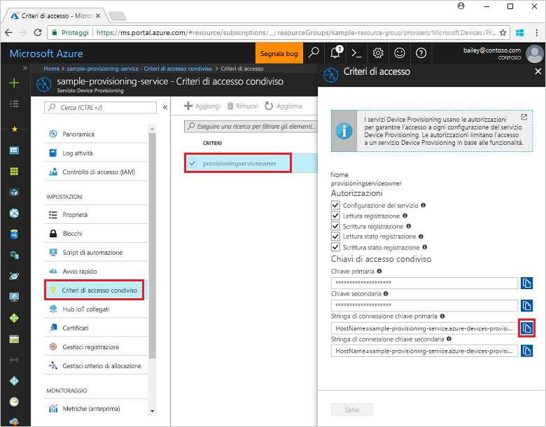
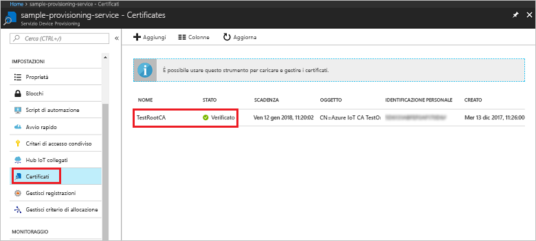
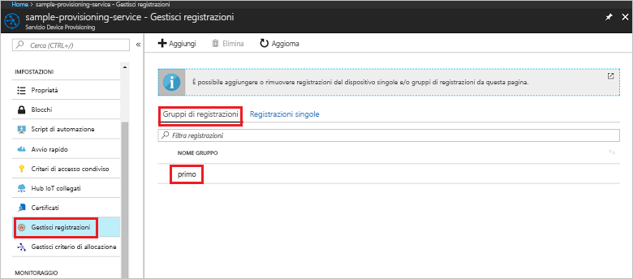

# <a name="enroll-x509-devices-to-iot-hub-device-provisioning-service-using-nodejs-service-sdk"></a>Registrare dispositivi X.509 nel servizio Device Provisioning in hub IoT con Node.js Service SDK
> [!div class="op_single_selector"]
> * [Java](quick-enroll-device-x509-java.md)
> * [Node.js](quick-enroll-device-x509-node.md)

Questi passaggi illustrano come creare un gruppo di registrazioni a livello di codice per un certificato X.509 intermedio o CA radice usando [Node.js Service SDK](https://github.com/Azure/azure-iot-sdk-node) e un'applicazione Node.js di esempio. Anche se questi passaggi funzionano su computer sia Windows che Linux, questo articolo usa un computer di sviluppo Windows.
 

## <a name="prerequisites"></a>prerequisiti

- Completare la procedura descritta in [Configurare il servizio Device Provisioning in hub IoT con il portale di Azure](./quick-setup-auto-provision.md). 

 
- Verificare che [Node.js v4.0 o versione successiva](https://nodejs.org) sia installato nel computer.


- È necessario un file PEM contenente un certificato X.509 intermedio o CA radice caricato e verificato con il servizio di provisioning. **Azure IoT c SDK** contiene strumenti che consentono di creare una catena di certificati X.509, caricare un certificato intermedio o radice dalla catena ed eseguire la proof-of-possession con il servizio per verificare il certificato. Per usare questi strumenti, clonare [Azure IoT c SDK](https://github.com/Azure/azure-iot-sdk-c) e seguire i passaggi descritti in [azure-iot-sdk-c\tools\CACertificates\CACertificateOverview.md](https://github.com/Azure/azure-iot-sdk-c/blob/master/tools/CACertificates/CACertificateOverview.md) nel computer.

## <a name="create-the-enrollment-group-sample"></a>Creare l'esempio di gruppo di registrazioni 

 
1. In una finestra di comando della cartella di lavoro eseguire:
  
     ```cmd\sh
     npm install azure-iot-provisioning-service
     ```  

2. Con un editor di testo creare un file **create_enrollment_group.js** nella cartella di lavoro. Aggiungere il codice seguente al file e salvare:

    ```
    'use strict';
    var fs = require('fs');

    var provisioningServiceClient = require('azure-iot-provisioning-service').ProvisioningServiceClient;

    var serviceClient = provisioningServiceClient.fromConnectionString(process.argv[2]);

    var enrollment = {
      enrollmentGroupId: 'first',
      attestation: {
        type: 'x509',
        x509: {
          signingCertificates: {
            primary: {
              certificate: fs.readFileSync(process.argv[3], 'utf-8').toString()
            }
          }
        }
      },
      provisioningStatus: 'disabled'
    };

    serviceClient.createOrUpdateEnrollmentGroup(enrollment, function(err, enrollmentResponse) {
      if (err) {
        console.log('error creating the group enrollment: ' + err);
      } else {
        console.log("enrollment record returned: " + JSON.stringify(enrollmentResponse, null, 2));
        enrollmentResponse.provisioningStatus = 'enabled';
        serviceClient.createOrUpdateEnrollmentGroup(enrollmentResponse, function(err, enrollmentResponse) {
          if (err) {
            console.log('error updating the group enrollment: ' + err);
          } else {
            console.log("updated enrollment record returned: " + JSON.stringify(enrollmentResponse, null, 2));
          }
        });
      }
    });
    ````

## <a name="run-the-enrollment-group-sample"></a>Eseguire l'esempio di gruppo di registrazioni
 
1. Per eseguire l'esempio è necessaria la stringa di connessione del servizio di provisioning. 
    1. Accedere al portale di Azure, fare clic sul pulsante **Tutte le risorse** nel menu a sinistra e aprire il servizio Device Provisioning. 
    2. Fare clic su **Criteri di accesso condivisi** e quindi sui criteri di accesso da usare per aprirne le proprietà. Nella finestra **Criteri di accesso** copiare e annotare la stringa di connessione della chiave primaria. 

     


3. Come indicato in [Prerequisiti](#prerequisites), è anche necessario un file PEM contenente un certificato X.509 intermedio o CA radice caricato e verificato in precedenza con il servizio di provisioning. Per verificare che il certificato sia stato caricato e verificato, nella pagina di riepilogo del servizio Device Provisioning del portale di Azure fare clic su **Certificati**. Trovare il certificato che si vuole usare per la registrazione del gruppo e verificare che il valore di stato sia *verificato*.

     

1. Per creare un gruppo di registrazioni per il certificato eseguire questo comando, includendo le virgolette che racchiudono gli argomenti:
 
     ```cmd\sh
     node create_enrollment_group.js "<the connection string for your provisioning service>" "<your certificate's .pem file>"
     ```
 
3. Al termine della creazione, la finestra di comando visualizza le proprietà del nuovo gruppo di registrazioni.

     

4. Verificare che il gruppo di registrazioni sia stato creato. Nel portale di Azure, nel pannello di riepilogo del servizio Device Provisioning selezionare **Gestisci registrazioni**. Selezionare la scheda **Gruppi di registrazioni** e verificare che la nuova voce di registrazione (la *prima*) sia presente.

     
 
## <a name="clean-up-resources"></a>Pulire le risorse
Se si prevede di esplorare gli esempi di servizio Node.js, non eliminare le risorse create in questa guida introduttiva. Se non si prevede di continuare, usare i passaggi seguenti per eliminare tutte le risorse di Azure create con questa guida introduttiva.
 
1. Chiudere la finestra di output di esempio di Node.js nel computer.
2. Passare al servizio Device Provisioning nel portale di Azure, fare clic su **Gestisci registrazioni** e quindi selezionare la scheda **Gruppi di registrazioni**. Selezionare l'*ID registrazione* della voce di registrazione creata usando questa guida introduttiva e fare clic sul pulsante **Elimina** nella parte superiore del pannello.  
3. Dal servizio Device Provisioning nel portale di Azure, fare clic su **Certificati**, selezionare il certificato caricato per questa guida introduttiva e quindi fare clic sul pulsante **Elimina** nella parte superiore della finestra **Dettagli certificato**.  
 
## <a name="next-steps"></a>Passaggi successivi
In questa guida introduttiva è stata creata una registrazione di gruppo per un certificato X.509 intermedio o CA radice usando il servizio Device Provisioning in hub IoT di Azure. Per informazioni approfondite sul provisioning del dispositivo, passare all'esercitazione sulla configurazione del servizio Device Provisioning nel portale di Azure. 
 
> [!div class="nextstepaction"]
> [Azure IoT Hub Device Provisioning Service tutorials (Esercitazioni sul servizio Device Provisioning in hub IoT di Azure)](./tutorial-set-up-cloud.md)