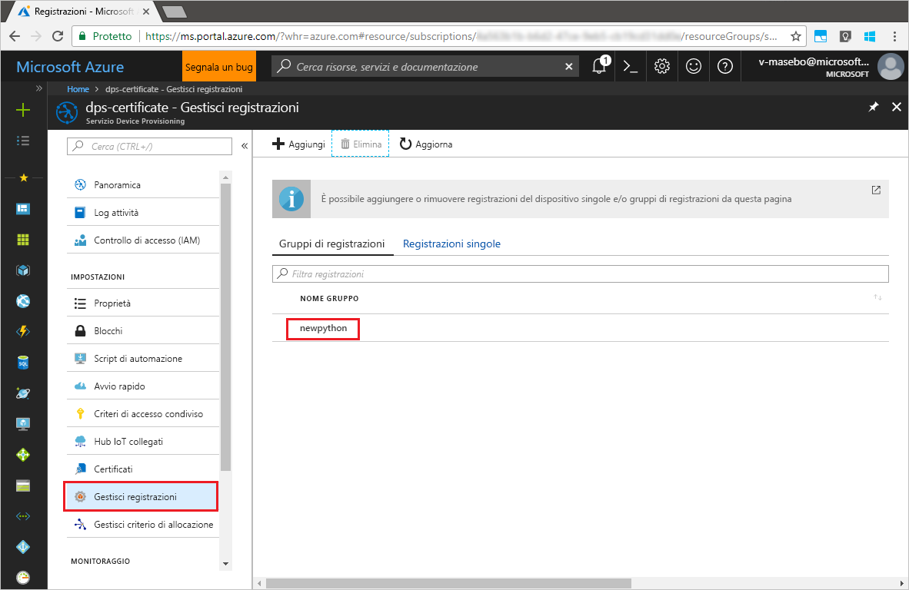

# <a name="enroll-x509-devices-to-iot-hub-device-provisioning-service-using-python-provisioning-service-sdk"></a>Registrare dispositivi X.509 nel servizio Device Provisioning in hub IoT con Python Provisioning Service SDK
[!INCLUDE [iot-dps-selector-quick-enroll-device-x509](../../includes/iot-dps-selector-quick-enroll-device-x509.md)]

Questi passaggi illustrano come registrare a livello di codice un gruppo di dispositivi simulati X.509 nel servizio Device Provisioning in hub IoT di Azure, usando [Python Provisioning Service SDK](https://github.com/Azure/azure-iot-sdk-python/tree/master/provisioning_service_client) con l'aiuto di un'applicazione Python di esempio. Anche se Java Service SDK funziona su computer sia Windows che Linux, questo articolo usa un computer di sviluppo Windows per illustrare il processo di registrazione.

Assicurarsi di [configurare il servizio Device Provisioning in hub IoT con il portale di Azure](./quick-setup-auto-provision.md) prima di continuare.

> [!NOTE]
> Questa guida introduttiva supporta solo il **gruppo di registrazioni**. La **registrazione singola** tramite _Python Provisioning Service SDK_ sarà disponibile in futuro.
> 

<a id="prepareenvironment"></a>

## <a name="prepare-the-environment"></a>Preparare l'ambiente 

1. Scaricare e installare [Python 2.x o 3.x](https://www.python.org/downloads/). Assicurarsi di usare le installazioni a 32 bit o 64 bit, come richiesto dalla configurazione. Quando richiesto durante l'installazione, assicurarsi di aggiungere Python alle variabili di ambiente specifiche per la piattaforma. 

1. Scegliere una delle opzioni seguenti:

    - Creare e compilare **Azure IoT Python SDK**. Seguire [queste istruzioni](https://github.com/Azure/azure-iot-sdk-python/blob/master/doc/python-devbox-setup.md) per compilare i pacchetti Python. Se si usa il sistema operativo Windows, installare anche [Visual C++ Redistributable Package](http://www.microsoft.com/download/confirmation.aspx?id=48145) per consentire l'uso di DLL native di Python.

    - [Installare o aggiornare *pip*, il sistema di gestione pacchetti Python](https://pip.pypa.io/en/stable/installing/). Installare il pacchetto con il comando seguente:

        ```cmd/sh
        pip install azure-iothub-provisioningserviceclient
        ```

1. È necessario un file PEM contenente un certificato X.509 intermedio o CA radice caricato e verificato con il servizio di provisioning. **Azure IoT C SDK** contiene strumenti che consentono di creare una catena di certificati X.509, caricare un certificato intermedio o radice dalla catena ed eseguire la proof-of-possession con il servizio per verificare il certificato. Per usare questi strumenti, clonare [Azure IoT C SDK](https://github.com/Azure/azure-iot-sdk-c) e seguire i passaggi descritti in [azure-iot-sdk-c\tools\CACertificates\CACertificateOverview.md](https://github.com/Azure/azure-iot-sdk-c/blob/master/tools/CACertificates/CACertificateOverview.md) nel computer.


## <a name="modify-the-python-sample-code"></a>Modificare il codice Python di esempio

Questa sezione illustra come aggiungere i dettagli del provisioning del dispositivo X.509 al codice di esempio. 

1. Usando un editor di testo, creare un nuovo file **EnrollmentGroup.py**.

1. Aggiungere le variabili e le istruzioni `import` seguenti all'inizio del file **EnrollmentGroup.py**. Sostituire quindi `dpsConnectionString` con la stringa di connessione trovata in **Criteri di accesso condivisi** di **Servizio Device Provisioning** nel **portale di Azure**. Sostituire il segnaposto del certificato con il certificato creato in precedenza in [Preparare l'ambiente](quick-enroll-device-x509-python.md#prepareenvironment). Creare infine un `registrationid` univoco e assicurarsi che sia costituito solo da caratteri alfanumerici minuscoli e trattini.  
   
    ```python
    from provisioningserviceclient import ProvisioningServiceClient
    from provisioningserviceclient.models import EnrollmentGroup, AttestationMechanism

    CONNECTION_STRING = "{dpsConnectionString}"

    SIGNING_CERT = """-----BEGIN CERTIFICATE-----
    XXXXXXXXXXXXXXXXXXXXXXXXXXXXXXXXXXXXXXXXXXXXXXXXXXXXXXXXXXXXXXXX
    XXXXXXXXXXXXXXXXXXXXXXXXXXXXXXXXXXXXXXXXXXXXXXXXXXXXXXXXXXXXXXXX
    XXXXXXXXXXXXXXXXXXXXXXXXXXXXXXXXXXXXXXXXXXXXXXXXXXXXXXXXXXXXXXXX
    XXXXXXXXXXXXXXXXXXXXXXXXXXXXXXXXXXXXXXXXXXXXXXXXXXXXXXXXXXXXXXXX
    XXXXXXXXXXXXXXXXXXXXXXXXXXXXXXXXXXXXXXXXXXXXXXXXXXXXXXXXXXXXXXXX
    XXXXXXXXXXXXXXXXXXXXXXXXXXXXXXXXXXXXXXXXXXXXXXXXXXXXXXXXXXXXXXXX
    XXXXXXXXXXXXXXXXXXXXXXXXXXXXXXXXXXXXXXXXXXXXXXXXXXXXXXXXXXXXXXXX
    XXXXXXXXXXXXXXXXXXXXXXXXXXXXXXXXXXXXXXXXXXXXXXXXXXXXXXXXXXXXXXXX
    XXXXXXXXXXXXXXXXXXXXXXXXXXXXXXXXXXXXXXXXXXXXXXXXXXXXXXXXXXXXXXXX
    XXXXXXXXXXXXXXXXXXXXXXXXXXXXXXXXXXXXXXXXXXXXXXXXXXXXXXXXXXXXXXXX
    XXXXXXXXXXXXXXXXXXXXXXXXXXXXXXXXXXXXXXXXXXXXXXXXXXXXXXXXXXXXXXXX
    XXXXXXXXXXXXXXXXXXXXXXXXXXXXXXXXXXXXXXXXXXXXXXXXXXXXXXXXXXXXXXXX
    XXXXXXXXXXXXXXXXXXXXXXXXXXXXXXXXXXXXXXXXXXXXXXXXXXXXXXXXXXXXXXXX
    XXXXXXXXXXXXXXXXXXXXXXXXXXXXXXXXXXXXXXXXXXXXXXXXXXXXXXXXXXXXXXXX
    XXXXXXXXXXXXXXXXXXXXXXXXXXXXXXXXXXXXXXXXXXXXXXXXXXXXXXXX
    -----END CERTIFICATE-----"""

    GROUP_ID = "{registrationid}"
    ```

1. Aggiungere la funzione e la chiamata di funzione seguenti per implementare la creazione della registrazione di gruppo:
   
    ```python
    def main():
        print ( "Initiating enrollment group creation..." )

        psc = ProvisioningServiceClient.create_from_connection_string(CONNECTION_STRING)
        att = AttestationMechanism.create_with_x509_signing_certs(SIGNING_CERT)
        eg = EnrollmentGroup.create(GROUP_ID, att)

        eg = psc.create_or_update(eg)
    
        print ( "Enrollment group created." )

    if __name__ == '__main__':
        main()
    ```

1. Salvare e chiudere il file **EnrollmentGroup.py**.
 

## <a name="run-the-sample-group-enrollment"></a>Eseguire la registrazione del gruppo di esempio

1. Aprire un prompt dei comandi ed eseguire lo script.

    ```cmd/sh
    python EnrollmentGroup.py
    ```

1. Verificare nell'output che la registrazione sia stata eseguita correttamente.

1. Passare al servizio di provisioning nel portale di Azure. Fare clic su **Gestisci registrazioni**. Si noti che il gruppo di dispositivi X.509 viene visualizzato nella scheda **Gruppi di registrazioni** con il nome `registrationid` assegnato in precedenza. 

      


## <a name="clean-up-resources"></a>Pulire le risorse
Se si prevede di esplorare l'esempio di servizio Java, non eliminare le risorse create in questa guida introduttiva. Se non si prevede di continuare, usare i passaggi seguenti per eliminare tutte le risorse create da questa guida introduttiva.

1. Chiudere la finestra di output di esempio di Java sul computer.
1. Chiudere la finestra del _generatore di certificati X509_  sul computer.
1. Passare al servizio Device Provisioning nel portale di Azure, fare clic su **Gestisci registrazioni** e quindi selezionare la scheda **Gruppi di registrazioni**. Selezionare il *NOME GRUPPO* dei dispositivi X.509 registrati usando questa guida introduttiva e fare clic sul pulsante **Elimina** nella parte superiore del pannello.  


## <a name="next-steps"></a>Passaggi successivi
In questa introduttiva si è registrato un gruppo simulato di dispositivi X.509 nel servizio Device Provisioning. Per informazioni approfondite sul provisioning del dispositivo, passare all'esercitazione sulla configurazione del servizio Device Provisioning nel portale di Azure. 

> [!div class="nextstepaction"]
> [Azure IoT Hub Device Provisioning Service tutorials (Esercitazioni sul servizio Device Provisioning in hub IoT di Azure)](./tutorial-set-up-cloud.md)
