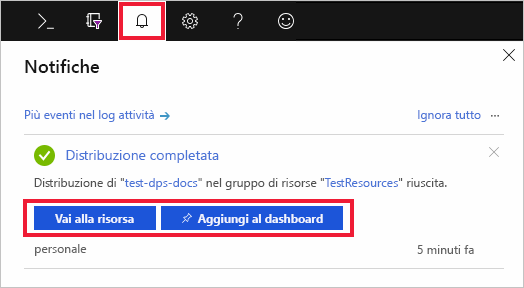

# Guida introduttiva: Configurare il servizio Device Provisioning in hub IoT con il portale di Azure

Questa procedura illustra come configurare le risorse cloud di Azure nel portale per il provisioning dei dispositivi. Questo articolo include i passaggi per la creazione dell'hub IoT e di una nuova istanza del servizio Device Provisioning in hub IoT, oltre al collegamento dei due servizi. 

Se non si ha una sottoscrizione di Azure, creare un [account gratuito](https://azure.microsoft.com/free/?WT.mc_id=A261C142F) prima di iniziare.

## Creare un hub IoT

[!INCLUDE [iot-hub-include-create-hub](../../includes/iot-hub-include-create-hub.md)]

## Creare una nuova istanza del servizio Device Provisioning in hub IoT

1. Selezionare di nuovo il pulsante **+ Crea una risorsa**.

2. *Cercare nel Marketplace* il **servizio Device Provisioning**. Selezionare **Servizio Device Provisioning in hub IoT** e fare clic sul pulsante **Crea**. 

3. Fornire le informazioni seguenti per la nuova istanza del servizio Device provisioning e fare clic su **Crea**.

    * **Nome:** specificare un nome univoco per la nuova istanza del servizio Device Provisioning. Se il nome immesso è disponibile, viene visualizzato un segno di spunta verde.
    * **Sottoscrizione:** scegliere la sottoscrizione da usare per creare l'istanza del servizio Device Provisioning.
    * **Gruppo di risorse:** questo campo consente di creare un nuovo gruppo di risorse o sceglierne uno esistente per contenere la nuova istanza. Scegliere lo stesso gruppo di risorse che contiene l'hub Iot creato in precedenza, ad esempio, **TestResources**. Inserendo tutte le risorse correlate in un gruppo è possibile gestirle insieme. Ad esempio, con l'eliminazione del gruppo di risorse vengono eliminate tutte le risorse contenute in quel gruppo. Per altre informazioni, vedere [Manage Azure Resource Manager resource groups](../azure-resource-manager/manage-resource-groups-portal.md) (Gestire gruppi di risorse di Azure Resource Manager).
    * **Località:** selezionare la località più vicina ai dispositivi.

        

4. Fare clic sul pulsante di notifica per monitorare la creazione dell'istanza della risorsa. Dopo la distribuzione del servizio, selezionare **Aggiungi al dashboard** e quindi **Vai alla risorsa**.

    

## Collegare l'hub IoT e il servizio Device Provisioning

In questa sezione verrà aggiunta una configurazione all'istanza del servizio Device Provisioning. Questa configurazione imposta l'hub IoT per i dispositivi che verranno sottoposti a provisioning.

1. Fare clic sul pulsante **Tutte le risorse** nel menu a sinistra del portale di Azure. Selezionare l'istanza del servizio Device Provisioning creata nella sezione precedente.  

2. Nel menu del servizio Device Provisioning selezionare **Linked IoT hubs** (Hub IoT collegati). Fare clic sul pulsante **+ Aggiungi** in alto. 

3. Nella pagina **Aggiungi collegamento all'hub IoT** fornire le informazioni seguenti per collegare la nuova istanza del servizio Device Provisioning a un hub IoT. Fare clic su **Salva**. 

    * **Sottoscrizione:** selezionare la sottoscrizione contenente l'hub IoT che si vuole collegare alla nuova istanza del servizio Device Provisioning.
    * **Hub IoT:** selezionare l'hub IoT da collegare alla nuova istanza del servizio Device Provisioning.
    * **Criteri di accesso:** selezionare **iothubowner** come credenziali per stabilire il collegamento con l'hub IoT.  

        

3. L'hub selezionato verrà ora visualizzato nel pannello **Linked IoT hubs** (Hub IoT collegati). Potrebbe essere necessario fare clic su **Aggiorna** perché venga visualizzato.

## Pulire le risorse

Altre guide di avvio rapido di questa raccolta si basano sulla presente guida di avvio rapido. Se si prevede di continuare a usare le guide di avvio rapido successive o le esercitazioni, non pulire le risorse create in questa guida di avvio rapido. Se non si prevede di continuare, seguire questa procedura per eliminare tutte le risorse create da questa guida di avvio rapido nel portale di Azure.

1. Nel portale di Azure selezionare **Tutte le risorse** nel menu a sinistra e quindi selezionare il servizio Device Provisioning. Nella parte superiore del riquadro dei dettagli del dispositivo selezionare **Elimina**.  
2. Nel portale di Azure selezionare **Tutte le risorse** nel menu a sinistra e quindi l'hub IoT. Nella parte superiore del riquadro dei dettagli dell'hub selezionare **Elimina**.  

## Passaggi successivi

In questo argomento di avvio rapido sono stati distribuiti un hub IoT e un'istanza del servizio Device Provisioning e le due risorse sono state collegate. Per informazioni su come usare questa configurazione per eseguire il provisioning di un dispositivo simulato, proseguire con l'argomento di avvio rapido per la creazione di un dispositivo simulato.

> [!div class="nextstepaction"]
> [Avvio rapido per la creazione di un dispositivo simulato](./quick-create-simulated-device.md)
