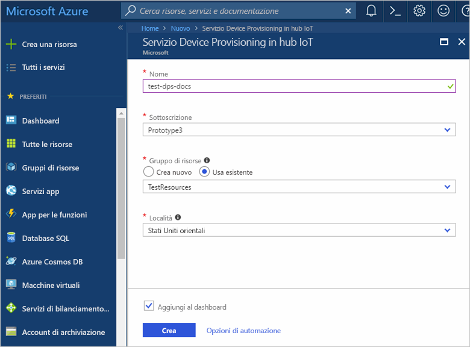
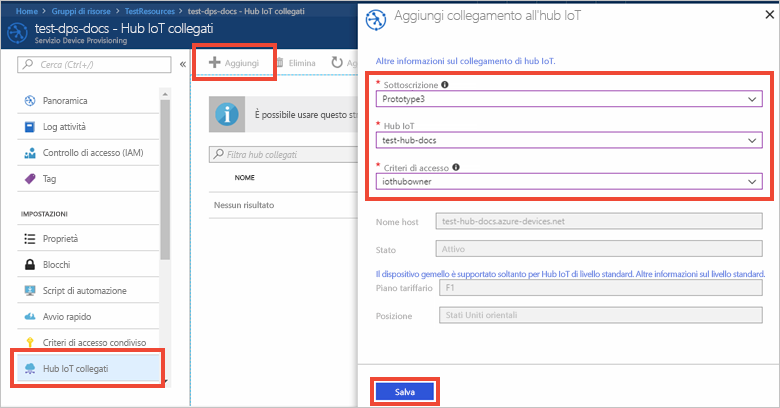

# Configurare il servizio Device Provisioning in hub IoT di Azure (anteprima) con il portale di Azure

Questa procedura illustra come configurare le risorse cloud di Azure nel portale per il provisioning dei dispositivi. Comprende la creazione dell'hub IoT e di una nuova istanza del servizio Device Provisioning in hub IoT, oltre al collegamento dei due servizi. 

Se non si ha una sottoscrizione di Azure, creare un [account gratuito](https://azure.microsoft.com/free/?WT.mc_id=A261C142F) prima di iniziare.

## Accedere al Portale di Azure.

Accedere al [Portale di Azure](https://portal.azure.com/).

## Creare un hub IoT

1. Fare clic sul pulsante **Nuovo** nell'angolo superiore sinistro del portale di Azure.

2. Selezionare **Internet delle cose**, **Hub IoT** e quindi fare clic sul pulsante **Crea**. 

3. Assegnare un **nome** all'hub IoT. Selezionare una delle opzioni disponibili per i prezzi, immettere le [unità di hub IoT](https://azure.microsoft.com/pricing/details/iot-hub/), selezionare il numero di partizioni per i messaggi da dispositivo a cloud e la sottoscrizione usata per questa risorsa. Immettere il nome di un gruppo di risorse nuovo o esistente e selezionare la posizione. Al termine, fare clic su **Crea**.

      

4. Dopo aver distribuito l'hub IoT, si aprirà automaticamente il pannello riepilogativo dell'hub.

## Creare una nuova istanza del servizio Device Provisioning in hub IoT

1. Fare clic sul pulsante **Nuovo** nell'angolo superiore sinistro del portale di Azure.

2. *Nel Marketplace* cercare il **servizio Device Provisioning**. Selezionare **IoT Hub Device Provisioning Service (preview)** e fare clic sul pulsante **Crea**. 

3. **Assegnare un nome** all'istanza del servizio Device Provisioning. Selezionare la sottoscrizione che verrà usata per questa istanza e immettere il nome di un gruppo di risorse nuovo o esistente. Selezionare la posizione. Al termine, fare clic su **Crea**.

      

4. Dopo aver distribuito il servizio, si aprirà automaticamente il pannello riepilogativo.

## Collegare l'hub IoT e il servizio Device Provisioning

1. Fare clic sul pulsante **Tutte le risorse** nel menu a sinistra del portale di Azure. Selezionare l'istanza del servizio Device Provisioning creata nella sezione precedente.  

2. Nel pannello di riepilogo del servizio Device Provisioning selezionare **Linked IoT hubs** (Hub IoT collegati). Fare clic sul pulsante **+ Aggiungi** in alto. 

3. Nel pannello **Add link to IoT hub** (Aggiungi collegamento a hub IoT) del portale selezionare la sottoscrizione corrente oppure immettere il nome e la stringa di connessione di un'altra sottoscrizione. Selezionare il nome dell'hub dall'elenco a discesa. Al termine, fare clic su **Salva**. 

      

3. L'hub selezionato verrà ora visualizzato nel pannello **Linked IoT hubs** (Hub IoT collegati). 

## Pulire le risorse

Altre guide introduttive della raccolta si basano su questa. Se si prevede di continuare a usare le guide introduttive o le esercitazioni successive, non eliminare le risorse create in questa guida introduttiva. Se non si prevede di continuare, seguire questa procedura per eliminare tutte le risorse create da questa guida introduttiva nel portale di Azure.

1. Nel portale di Azure fare clic su **Tutte le risorse** nel menu a sinistra e quindi selezionare il servizio Device Provisioning. Nella parte superiore del pannello **Tutte le risorse** fare clic su **Elimina**.  
2. Nel portale di Azure fare clic su **Tutte le risorse** nel menu a sinistra e quindi selezionare l'hub IoT. Nella parte superiore del pannello **Tutte le risorse** fare clic su **Elimina**.  

## Passaggi successivi

In questa guida introduttiva sono stati distribuiti un hub IoT e un'istanza del servizio Device Provisioning e le due risorse sono state collegate. Per informazioni su come usare questa configurazione per eseguire il provisioning di un dispositivo simulato, proseguire con la guida introduttiva per la creazione di un dispositivo simulato.

> [!div class="nextstepaction"]
> [Guida introduttiva per la creazione di un dispositivo simulato](./quick-create-simulated-device.md)

