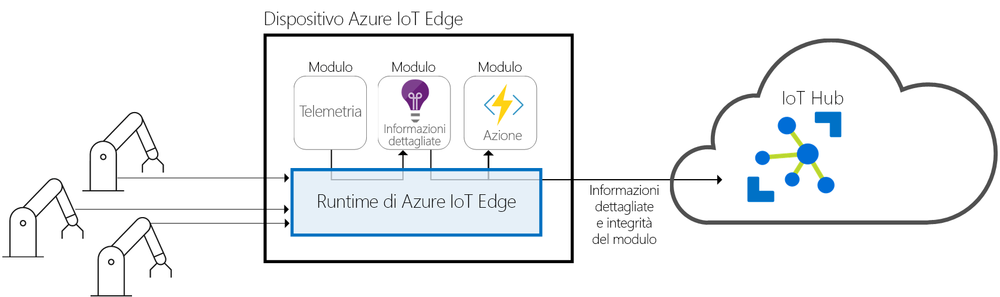
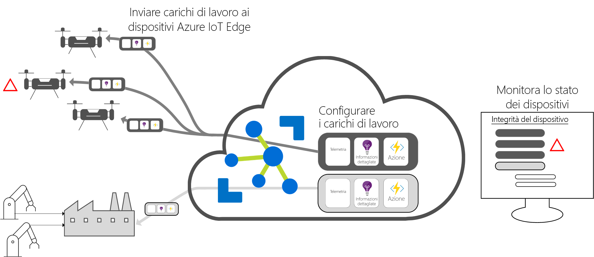

# Che cos'è Azure IoT Edge

Azure IoT Edge sposta nei dispositivi l'analisi cloud e la logica di business personalizzata consentendo all'organizzazione di concentrarsi sulle analisi approfondite di livello aziendale invece che sulla gestione dati. È possibile ampliare la soluzione IoT assemblando la logica di business in contenitori standard, distribuire questi contenitori in qualsiasi dispositivo e monitorare tutto dal cloud.

L'analisi incrementa il valore aggiunto nelle soluzioni IoT, ma non tutte le operazioni di analisi devono essere eseguite nel cloud. Per rispondere alle emergenze il più rapidamente possibile, è possibile eseguire il rilevamento anomalie nella rete perimetrale. Se si desidera ridurre i costi della larghezza di banda ed evitare il trasferimento di terabyte di dati non elaborati, è possibile pulire e aggregare i dati in locale, quindi inviare nel cloud solo le informazioni dettagliate per l'analisi.

Azure IoT Edge è costituito da tra componenti:

* I **moduli di IoT Edge** sono contenitori che eseguono servizi di Azure, servizi di terze parti o il codice dell'utente. Vengono distribuiti nei dispositivi IoT Edge ed eseguiti in locale su tali dispositivi.
* Il **runtime di IoT Edge** viene eseguito su ogni dispositivo IoT Edge e gestisce i moduli distribuiti in ogni dispositivo. 
* Un'**interfaccia basata sul cloud** consente di monitorare e gestire in remoto i dispositivi IoT Edge.

>[!NOTE]
>Azure IoT Edge è disponibile nei livelli Gratuito e Standard dell'hub IoT. Il livello Gratuito può essere usato solo a scopo di test e valutazione. Per altre informazioni sui livelli Basic e Standard, vedere [come scegliere il livello corretto dell'hub IoT](../iot-hub/iot-hub-scaling.md).

## Moduli di IoT Edge

I moduli di IoT Edge sono unità di esecuzione, implementati come contenitori compatibili con Docker, che eseguono la logica di business nella rete perimetrale. Si possono configurare più moduli in modo che comunichino tra di essi, creando una pipeline di elaborazione dati. È possibile sviluppare moduli personalizzati o inserire determinati servizi di Azure nei moduli che contengono informazioni offline e nella rete perimetrale.

### Intelligenza artificiale nella rete perimetrale

Azure IoT Edge consente di distribuire funzionalità di intelligenza artificiale di valore elevato, come elaborazione di eventi complessi, apprendimento automatico, riconoscimento delle immagini e altre, senza scriverle internamente. Tutti i servizi di Azure, ad esempio Funzioni di Azure, Analisi di flusso di Azure e Azure Machine Learning, possono essere eseguiti in locale tramite Azure IoT Edge. Questa possibilità non è tuttavia limitata ai servizi di Azure. Chiunque può creare moduli di intelligenza artificiale e renderli disponibili alla community tramite Azure Marketplace.

### Usare un codice personalizzato

Azure IoT Edge consente anche di distribuire il proprio codice nei dispositivi. Azure IoT Edge segue lo stesso modello di programmazione degli altri servizi di Azure IoT. È possibile eseguire stesso codice in un dispositivo o nel cloud. Poiché Azure IoT Edge supporta sia Linux che Windows, è possibile scrivere codice per la piattaforma preferita. Supporta Java, .NET Core 2.0, Node.js, C e Python, quindi gli sviluppatori possono scrivere codice in un linguaggio già conosciuto e usare la logica di business esistente.

## Runtime di IoT Edge

Il runtime di Azure IoT Edge consente la logica personalizzata e cloud sui dispositivi IoT Edge. Il runtime risiede nel dispositivo IoT Edge ed esegue operazioni di gestione e di comunicazione. Il runtime esegue diverse funzioni:

* Installa e aggiorna i carichi di lavoro nel dispositivo.
* Mantiene gli standard di sicurezza di Azure IoT Edge sul dispositivo.
* Assicura che i moduli di IoT Edge siano sempre in esecuzione.
* Segnala l'integrità dei moduli al cloud per il monitoraggio remoto.
* Gestisce la comunicazione tra i dispositivi foglia downstream e un dispositivo IoT Edge, tra i moduli in un dispositivo IoT Edge e tra un dispositivo IoT Edge e il cloud.

È possibile usare un dispositivo Azure IoT Edge nel modo preferito. Il runtime viene spesso usato per distribuire l'intelligenza artificiale nei dispositivi gateway che aggregano ed elaborano dati provenienti da altri dispositivi locali, ma questo modello di distribuzione è solo un'opzione.

Il runtime Azure IoT Edge viene eseguito in un ampio set di dispositivi IoT per consentirne l'uso in numerosi modi. Supporta sistemi operativi sia Linux che Windows ed estrae i dettagli sull'hardware. Usare un dispositivo inferiore a Raspberry Pi 3 se non si elaborano molti dati o usare un server industriale per eseguire carichi di lavoro con un utilizzo intensivo delle risorse.

## Interfaccia cloud di IoT Edge

È difficile gestire il ciclo di vita del software per milioni di dispositivi IoT di modelli e marche diversi o distribuiti a livello geografico. I carichi di lavoro sono creati e configurati per un particolare tipo di dispositivo, distribuiti a tutti i dispositivi e monitorati per individuare eventuali dispositivi non correttamente funzionanti. Queste attività non possono essere eseguite per ogni singolo dispositivo, ma devono essere eseguite su vasta scala.

Azure IoT Edge si integra facilmente con gli acceleratori di soluzioni di Azure IoT offrendo un piano di controllo per le esigenze della soluzione. I servizi cloud consentono di:

* Creare e configurare un carico di lavoro da eseguire in un tipo specifico di dispositivo.
* Inviare un carico di lavoro a un set di dispositivi.
* Monitorare sul campo i carichi di lavoro in esecuzione sui dispositivi.

## Passaggi successivi

Provare ad applicare questi concetti [distribuendo IoT Edge in un dispositivo simulato](quickstart.md).
