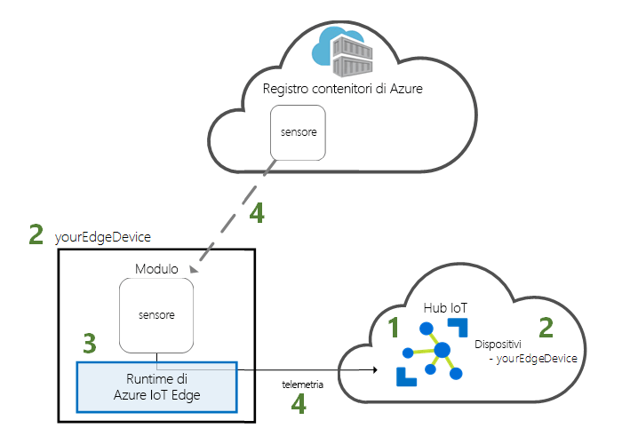
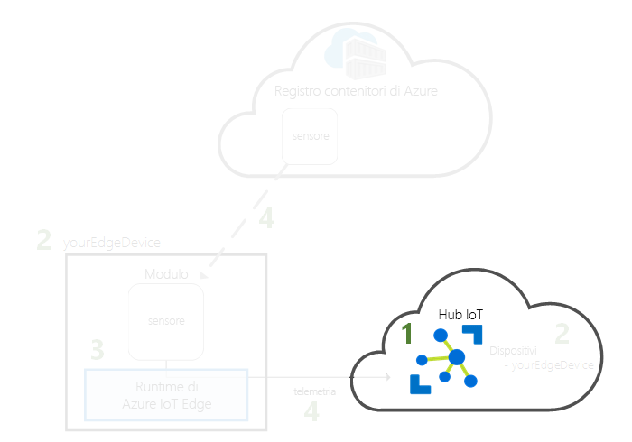
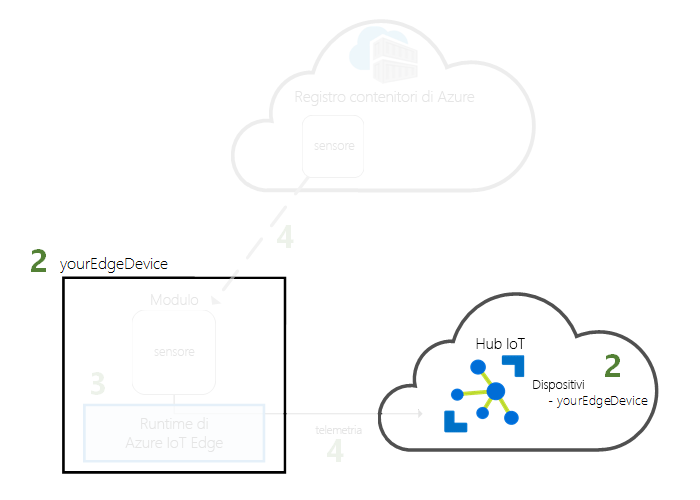
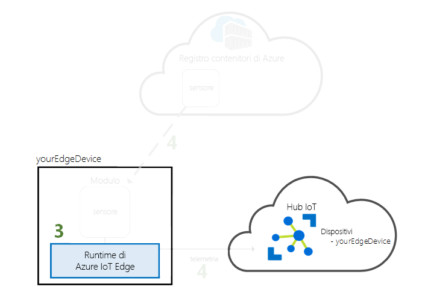

# <a name="quickstart-deploy-your-first-iot-edge-module-to-a-linux-device"></a>Guida introduttiva: Distribuire il primo modulo IoT Edge in un dispositivo Linux

Azure IoT Edge sposta la potenza del cloud sui dispositivi di Internet delle cose. In questa guida introduttiva si apprende come usare l'interfaccia cloud per distribuire in modalità remota codice predefinito in un dispositivo IoT Edge.

In questa guida introduttiva si apprende come:

1. Creare un hub IoT.
2. Registrare un dispositivo IoT Edge nell'hub IoT.
3. Installare e avviare il runtime IoT Edge nel dispositivo.
4. Distribuire in remoto un modulo in un dispositivo IoT Edge.



Questa Guida introduttiva illustra la creazione di una macchina virtuale di Azure configurata per essere usata come dispositivo IoT Edge. È quindi possibile distribuire un modulo dal portale di Azure nel dispositivo. Il modulo distribuito in questa guida introduttiva è un sensore simulato che genera dati di temperatura, umidità e pressione. Le altre esercitazioni su Azure IoT Edge si basano sulle operazioni eseguite qui tramite la distribuzione di moduli che analizzano dati simulati per ottenere informazioni aziendali accurate.

Se non si ha una sottoscrizione di Azure attiva, creare un [account gratuito](https://azure.microsoft.com/free) prima di iniziare.

[!INCLUDE [cloud-shell-try-it.md](../../includes/cloud-shell-try-it.md)]

Usare l'interfaccia della riga di comando di Azure per completare molti dei passaggi di questa guida introduttiva. Azure IoT include un'estensione per abilitare funzionalità aggiuntive.

Aggiungere l'estensione Azure IoT all'istanza di Cloud Shell.

   ```azurecli-interactive
   az extension add --name azure-cli-iot-ext
   ```

## <a name="prerequisites"></a>Prerequisiti

Risorse cloud:

* Un gruppo di risorse per la gestione di tutte le risorse usate in questa guida introduttiva.

   ```azurecli-interactive
   az group create --name IoTEdgeResources --location westus2
   ```

Dispositivo IoT Edge:

* Un dispositivo o macchina virtuale Linux da usare come dispositivo IoT Edge. È opportuno usare la macchina virtuale [Azure IoT Edge on Ubuntu](https://azuremarketplace.microsoft.com/marketplace/apps/microsoft_iot_edge.iot_edge_vm_ubuntu) fornita da Microsoft, che preinstalla tutti gli elementi necessari per eseguire IoT Edge in un dispositivo. Creare la macchina virtuale usando i comandi seguenti:

   ```azurecli-interactive
   az vm image accept-terms --urn microsoft_iot_edge:iot_edge_vm_ubuntu:ubuntu_1604_edgeruntimeonly:latest
   az vm create --resource-group IoTEdgeResources --name EdgeVM --image microsoft_iot_edge:iot_edge_vm_ubuntu:ubuntu_1604_edgeruntimeonly:latest --admin-username azureuser --generate-ssh-keys --size Standard_DS1_v2
   ```

   La creazione e l'avvio della nuova macchina virtuale potrebbero richiedere alcuni minuti.

   Quando si crea una nuova macchina virtuale, prendere nota del valore di **publicIpAddress**, che viene fornito come parte dell'output del comando di creazione. Questo indirizzo IP pubblico verrà usato per connettersi alla macchina virtuale più avanti in questa guida introduttiva.

* Se si preferisce eseguire il runtime Azure IoT Edge nel proprio dispositivo, seguire le istruzioni illustrate in [Installare il runtime di Azure IoT Edge in Linux (x64)](how-to-install-iot-edge-linux.md) o [Installare il runtime di Azure IoT Edge in Linux (ARM32v7/armhf)](how-to-install-iot-edge-linux-arm.md).

## <a name="create-an-iot-hub"></a>Creare un hub IoT

Per iniziare, creare un hub IoT con l'interfaccia della riga di comando di Azure.



Per questa guida introduttiva è possibile usare il livello gratuito dell'hub IoT. Se l'hub IoT è già stato usato in passato ed già stato creato un hub gratuito, è possibile usarlo qui. Ogni sottoscrizione può avere un solo hub IoT gratuito.

Il codice seguente crea un hub **F1** gratuito nel gruppo di risorse **IoTEdgeResources**. Sostituire *{hub_name}* con un nome univoco per l'hub IoT.

   ```azurecli-interactive
   az iot hub create --resource-group IoTEdgeResources --name {hub_name} --sku F1
   ```

   Se si verifica un errore perché è già presente un hub gratuito nella sottoscrizione, modificare lo SKU in **S1**. Se si verifica un errore che indica che il nome dell'hub IoT non è disponibile, significa che qualcuno ha già un hub con lo stesso nome. Provare con un nuovo nome.

## <a name="register-an-iot-edge-device"></a>Registrare un dispositivo IoT Edge

Registrare un dispositivo IoT Edge con l'hub IoT appena creato.



Creare un'identità del dispositivo IoT Edge affinché il dispositivo possa comunicare con l'hub IoT. L'identità del dispositivo si trova nel cloud e si usa una stringa di connessione del dispositivo univoca per associare un dispositivo fisico a un'identità del dispositivo.

Poiché i dispositivi IoT Edge si comportano e possono essere gestiti in modo diverso rispetto ai dispositivi IoT tipici, indicare con un flag `--edge-enabled` che l'identità si riferisce a un dispositivo IoT Edge.

1. In Azure Cloud Shell immettere il comando seguente per creare un dispositivo denominato **myEdgeDevice** nell'hub.

   ```azurecli-interactive
   az iot hub device-identity create --hub-name {hub_name} --device-id myEdgeDevice --edge-enabled
   ```

   Se viene visualizzato un errore relativo alle chiavi dei criteri iothubowner, assicurarsi che Cloud Shell esegua la versione più recente dell'estensione azure-cli-iot-ext.

2. Recuperare la stringa di connessione per il dispositivo, che collega il dispositivo fisico alla sua identità nell'hub IoT.

   ```azurecli-interactive
   az iot hub device-identity show-connection-string --device-id myEdgeDevice --hub-name {hub_name}
   ```

3. Copiare il valore della chiave `connectionString` dall'output JSON e salvarlo. Questo valore corrisponde alla stringa di connessione che verrà usata per configurare il runtime IoT Edge nella sezione successiva.

   

## <a name="configure-your-iot-edge-device"></a>Configurare il dispositivo IoT Edge

Avviare il runtime Azure IoT Edge nel dispositivo IoT Edge.



Il runtime di IoT Edge viene distribuito in tutti i dispositivi IoT Edge. È costituito da tre componenti. Il **daemon di sicurezza IoT Edge** si avvia a ogni avvio di un dispositivo IoT Edge ed esegue il bootstrap del dispositivo avviando l'agente IoT Edge. L'**agente IoT Edge** semplifica la distribuzione e il monitoraggio di moduli nel dispositivo IoT Edge, tra cui l'hub di IoT Edge. L'**hub IoT Edge** gestisce le comunicazioni tra moduli nel dispositivo IoT Edge e tra il dispositivo e l'hub IoT.

Durante la configurazione del runtime, si immette una stringa di connessione del dispositivo. Usare la stringa recuperata tramite l'interfaccia della riga di comando di Azure. La stringa associa il dispositivo fisico all'identità del dispositivo IoT Edge in Azure.

### <a name="set-the-connection-string-on-the-iot-edge-device"></a>Impostare la stringa di connessione sul dispositivo IoT Edge

Se si usa la macchina virtuale Azure IoT Edge on Ubuntu come descritto nei prerequisiti, nel dispositivo è già installato il runtime IoT Edge. È sufficiente configurare il dispositivo con la relativa stringa di connessione recuperata nella sezione precedente. È possibile eseguire questa operazione in remoto senza connettersi alla macchina virtuale. Eseguire questo comando sostituendo **{device_connection_string}** con la propria stringa.

   ```azurecli-interactive
   az vm run-command invoke -g IoTEdgeResources -n EdgeVM --command-id RunShellScript --script "/etc/iotedge/configedge.sh '{device_connection_string}'"
   ```

Se si esegue IoT Edge nel computer locale o in un dispositivo ARM32, è necessario installare il runtime IoT Edge e i relativi prerequisiti nel dispositivo. Seguire le istruzioni riportate in [Installare il runtime di Azure IoT Edge in Linux (x64)](how-to-install-iot-edge-linux.md) o [Installare il runtime di Azure IoT Edge in Linux (ARM32v7/armhf)](how-to-install-iot-edge-linux-arm.md) e quindi tornare a questa guida introduttiva.

### <a name="view-the-iot-edge-runtime-status"></a>Visualizzare lo stato del runtime IoT Edge

I restanti comandi di questa guida introduttiva vengono eseguiti nel dispositivo IoT Edge stesso ed è pertanto possibile verificare le operazioni effettuate nel dispositivo. Se si usa una macchina virtuale, connettersi a tale macchina usando l'indirizzo IP pubblico incluso nell'output del comando di creazione. È anche possibile trovare l'indirizzo IP pubblico nella pagina di panoramica della macchina virtuale nel portale di Azure. Usare il comando seguente per connettersi alla macchina virtuale. Se è stato usato un nome utente diverso da quello suggerito nei prerequisiti, sostituire **{azureuser}** . Sostituire **{publicIpAddress}** con l'indirizzo del computer.

   ```azurecli-interactive
   ssh azureuser@{publicIpAddress}
   ```

Verificare che il runtime sia stato installato e configurato correttamente nel dispositivo IoT Edge.

>[!TIP]
>Per eseguire comandi `iotedge` sono necessari privilegi elevati. Quando ci si disconnette dal computer e si accede di nuovo per la prima volta dopo l'installazione del runtime IoT Edge, le autorizzazioni vengono aggiornate automaticamente. Fino ad allora, usare **sudo** davanti ai comandi.

1. Verificare che il daemon di sicurezza IoT Edge sia in esecuzione come servizio di sistema.

   ```bash
   sudo systemctl status iotedge
   ```

   

2. Se è necessario risolvere problemi del servizio, recuperare i log di servizio.

   ```bash
   journalctl -u iotedge
   ```

3. Visualizzare i moduli in esecuzione nel dispositivo.

   ```bash
   sudo iotedge list
   ```

   

Il dispositivo IoT Edge è ora configurato. È pronto per eseguire i moduli distribuiti nel cloud.

## <a name="deploy-a-module"></a>Distribuire un modulo

Gestire il dispositivo Azure IoT Edge dal cloud per distribuire un modulo che invierà dati di telemetria all'hub IoT.


[!INCLUDE [iot-edge-deploy-module](../../includes/iot-edge-deploy-module.md)]

## <a name="view-generated-data"></a>Visualizzare i dati generati

In questa guida introduttiva è stato creato un nuovo dispositivo IoT Edge, nel quale è stato installato il runtime di IoT Edge. È stato quindi usato il portale di Azure per distribuire un modulo di IoT Edge da eseguire nel dispositivo senza dovere apportare modifiche al dispositivo stesso.

In questo caso il modulo di cui è stato eseguito il push crea dati di esempio che possono essere usati per i test. Il modulo relativo al sensore di temperatura simulato genera dati dell'ambiente che possono essere usati successivamente per i test. Il sensore simulato monitora un macchinario e l'ambiente intorno al macchinario. Questo sensore può trovarsi ad esempio in una stanza di server, in un ambiente di produzione o in una turbina eolica. Il messaggio include la temperatura e l'umidità dell'ambiente, la temperatura e la pressione dell'apparecchiatura e un timestamp. Le esercitazioni di IoT Edge usano i dati creati da questo modulo come dati di test per le analisi.

Aprire di nuovo il prompt dei comandi nel dispositivo IoT Edge o usare la connessione SSH dall'interfaccia della riga di comando di Azure. Verificare che il modulo distribuito dal cloud sia in esecuzione nel dispositivo IoT Edge:

   ```bash
   sudo iotedge list
   ```

   

Visualizzare i messaggi inviati dal modulo del sensore temperatura:

   ```bash
   sudo iotedge logs SimulatedTemperatureSensor -f
   ```

   >[!TIP]
   >Quando viene fatto riferimento a nomi di moduli, i comandi di IoT Edge fanno distinzione tra maiuscole e minuscole.

   

È anche possibile visualizzare i messaggi ricevuti dall'hub IoT usando l'[estensione Azure IoT Hub Toolkit per Visual Studio Code](https://marketplace.visualstudio.com/items?itemName=vsciot-vscode.azure-iot-toolkit).(precedentemente Azure IoT Toolkit).

## <a name="clean-up-resources"></a>Pulire le risorse

Se si vuole continuare con le esercitazioni su IoT Edge, è possibile usare il dispositivo registrato e configurato in questa guida introduttiva. In caso contrario, è possibile eliminare le risorse di Azure create per evitare addebiti.

Se la macchina virtuale e l'hub IoT sono stati creati in un nuovo gruppo di risorse, è possibile eliminare il gruppo e tutte le risorse associate. Verificare il contenuto del gruppo di risorse per assicurarsi che non vi siano dati da conservare. Se non si vuole eliminare l'intero gruppo, è possibile eliminare le singole risorse.

Rimuovere il gruppo **IoTEdgeResources**.

```azurecli-interactive
az group delete --name IoTEdgeResources
```

## <a name="next-steps"></a>Passaggi successivi


In questa guida introduttiva è stato creato un dispositivo IoT Edge ed è stata usata l'interfaccia cloud di Azure IoT Edge per distribuire il codice nel dispositivo. A questo punto, è disponibile un dispositivo di test che genera dati non elaborati relativi al proprio ambiente.

Il passaggio successivo consiste nell'impostare l'ambiente di sviluppo locale in modo che sia possibile avviare la creazione di moduli IoT Edge che eseguano la propria logica di business. 

> [!div class="nextstepaction"]
> [Sviluppare moduli IoT Edge per i dispositivi Linux](tutorial-develop-for-linux.md)
