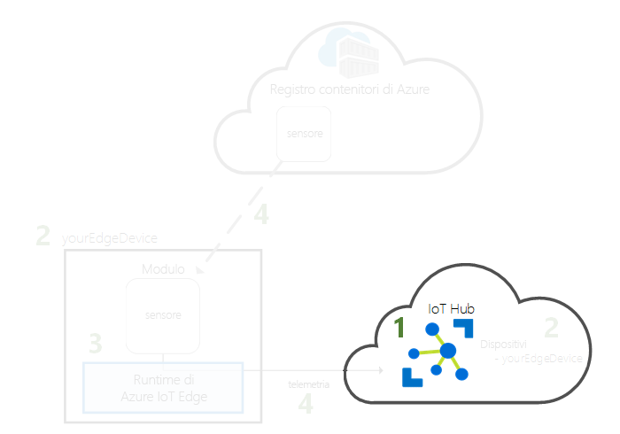
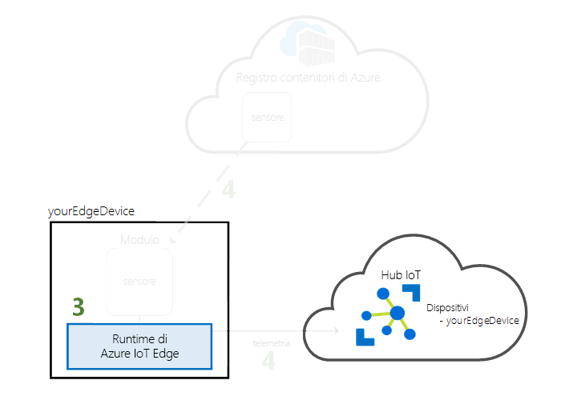
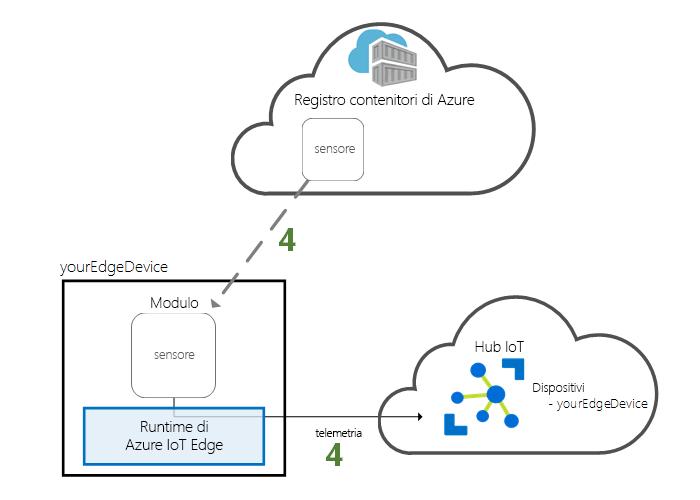

# <a name="quickstart-deploy-your-first-iot-edge-module-from-the-azure-portal-to-a-windows-device---preview"></a>Guida introduttiva: Distribuire il primo modulo di IoT Edge dal portale di Azure in un dispositivo Windows - Anteprima

In questa guida introduttiva viene usata l'interfaccia cloud di Azure IoT Edge per distribuire in modalità remota codice predefinito in un dispositivo IoT Edge. Per completare questa attività, usare prima di tutto il dispositivo Windows per simulare un dispositivo IoT Edge, quindi distribuire un modulo in tale dispositivo.

In questa guida introduttiva si apprende come:

1. Creare un hub IoT.
2. Registrare un dispositivo IoT Edge nell'hub IoT.
3. Installare e avviare il runtime IoT Edge nel dispositivo.
4. Distribuire in remoto un modulo in un dispositivo IoT Edge e inviare dati di telemetria all'hub IoT.


Il modulo distribuito in questa guida introduttiva è un sensore simulato che genera dati di temperatura, umidità e pressione. Le altre esercitazioni su Azure IoT Edge si basano sulle operazioni eseguite qui tramite la distribuzione di moduli che analizzano dati simulati per ottenere informazioni aziendali accurate.

>[!NOTE]
>Il runtime IoT Edge in Windows è disponibile in [anteprima pubblica](https://azure.microsoft.com/support/legal/preview-supplemental-terms/).

Se non si ha una sottoscrizione di Azure attiva, creare un [account gratuito](https://azure.microsoft.com/free) prima di iniziare.

[!INCLUDE [cloud-shell-try-it.md](../../includes/cloud-shell-try-it.md)]

Usare l'interfaccia della riga di comando di Azure per completare molti dei passaggi di questa guida introduttiva. Azure IoT include un'estensione per abilitare funzionalità aggiuntive.

Aggiungere l'estensione Azure IoT all'istanza di Cloud Shell.

   ```azurecli-interactive
   az extension add --name azure-cli-iot-ext
   ```

## <a name="prerequisites"></a>Prerequisiti

Risorse cloud:

* Un gruppo di risorse per la gestione di tutte le risorse usate in questa guida introduttiva.

   ```azurecli-interactive
   az group create --name IoTEdgeResources --location westus
   ```

Dispositivo IoT Edge:

* Un computer Windows o una macchina virtuale da usare come dispositivo IoT Edge. Usare una versione di Windows supportata:
  * Windows 10 o versioni successive
  * Windows Server 2016 o versioni successive
* Se si tratta di un computer Windows, assicurarsi che soddisfi i [requisiti di sistema](https://docs.microsoft.com/virtualization/hyper-v-on-windows/reference/hyper-v-requirements) per Hyper-V.
* Se si tratta di una macchina virtuale, abilitare la [virtualizzazione annidata](https://docs.microsoft.com/virtualization/hyper-v-on-windows/user-guide/nested-virtualization) e allocare almeno 2 GB di memoria.
* Installare [Docker per Windows](https://docs.docker.com/docker-for-windows/install/) e assicurarsi che sia in esecuzione.

> [!TIP]
> Durante l'installazione di Docker è possibile scegliere se usare contenitori Windows o Linux. Questa guida introduttiva illustra come configurare il runtime IoT Edge per l'uso con contenitori Linux.

## <a name="create-an-iot-hub"></a>Creare un hub IoT

Iniziare la guida introduttiva creando l'hub IoT con l'interfaccia della riga di comando di Azure.



Per questa guida introduttiva è possibile usare il livello gratuito dell'hub IoT. Se l'hub IoT è già stato usato in passato ed già stato creato un hub gratuito, è possibile usarlo qui. Ogni sottoscrizione può avere un solo hub IoT gratuito.

Il codice seguente crea un hub **F1** gratuito nel gruppo di risorse **IoTEdgeResources**. Sostituire *{hub_name}* con un nome univoco per l'hub IoT.

   ```azurecli-interactive
   az iot hub create --resource-group IoTEdgeResources --name {hub_name} --sku F1
   ```

   Se si verifica un errore perché è già presente un hub gratuito nella sottoscrizione, modificare lo SKU in **S1**.

## <a name="register-an-iot-edge-device"></a>Registrare un dispositivo IoT Edge

Registrare un dispositivo IoT Edge con l'hub IoT appena creato.


Creare un'identità del dispositivo per il dispositivo simulato in modo che possa comunicare con l'hub IoT. L'identità del dispositivo si trova nel cloud e si usa una stringa di connessione del dispositivo univoca per associare un dispositivo fisico a un'identità del dispositivo.

Poiché i dispositivi IoT Edge si comportano e possono essere gestiti in modo diverso dai dispositivi IoT tipici, dichiarare fin dall'inizio che si tratta di un dispositivo IoT Edge.

1. In Azure Cloud Shell immettere il comando seguente per creare un dispositivo denominato **myEdgeDevice** nell'hub.

   ```azurecli-interactive
   az iot hub device-identity create --device-id myEdgeDevice --hub-name {hub_name} --edge-enabled
   ```

1. Recuperare la stringa di connessione per il dispositivo, che collega il dispositivo fisico alla sua identità nell'hub IoT.

   ```azurecli-interactive
   az iot hub device-identity show-connection-string --device-id myEdgeDevice --hub-name {hub_name}
   ```

1. Copiare la stringa di connessione e salvarla. Usare questo valore per configurare il runtime IoT Edge nella sezione successiva.

## <a name="install-and-start-the-iot-edge-runtime"></a>Installare e avviare il runtime di IoT Edge

Installare il runtime Azure IoT Edge nel dispositivo IoT Edge e configurarlo con una stringa di connessione del dispositivo.


Il runtime di IoT Edge viene distribuito in tutti i dispositivi IoT Edge. È costituito da tre componenti. Il **daemon di sicurezza IoT Edge** si avvia a ogni avvio di un dispositivo Edge ed esegue l' avvio del dispositivo avviando l'agente IoT Edge. L'**agente IoT Edge** semplifica la distribuzione e il monitoraggio di moduli nel dispositivo IoT Edge, tra cui l'hub di IoT Edge. L'**hub IoT Edge** gestisce le comunicazioni tra moduli nel dispositivo IoT Edge e tra il dispositivo e l'hub IoT.

Durante l'installazione del runtime, viene chiesto di immettere una stringa di connessione del dispositivo. Usare la stringa recuperata tramite l'interfaccia della riga di comando di Azure. La stringa associa il dispositivo fisico all'identità del dispositivo IoT Edge in Azure.

Le istruzioni in questa sezione permettono di configurare il runtime IoT Edge con contenitori Linux. Per usare i contenitori Windows, vedere [Install Azure IoT Edge runtime on Windows to use with Windows containers](how-to-install-iot-edge-windows-with-windows.md) (Installare il runtime Azure IoT Edge in Windows per usarlo con contenitori Windows).

Completare i passaggi seguenti nel computer Windows o nella macchina virtuale preparata per essere usata come dispositivo IoT Edge.

### <a name="download-and-install-the-iot-edge-service"></a>Scaricare e installare il servizio IoT Edge

Usare PowerShell per scaricare e installare il runtime IoT Edge. Usare la stringa di connessione del dispositivo recuperata dall'hub IoT per configurare il dispositivo.

1. Nel dispositivo IoT Edge eseguire PowerShell come amministratore.

2. Scaricare e installare il servizio IoT Edge nel dispositivo.

   ```powershell
   . {Invoke-WebRequest -useb aka.ms/iotedge-win} | Invoke-Expression; `
   Install-SecurityDaemon -Manual -ContainerOs Linux
   ```

3. Quando viene chiesto un elemento **DeviceConnectionString**, fornire la stringa copiata nella sezione precedente. Non racchiudere tra virgolette la stringa di connessione.

### <a name="view-the-iot-edge-runtime-status"></a>Visualizzare lo stato del runtime IoT Edge

Verificare che il runtime sia stato installato e configurato correttamente.

1. Verificare lo stato del servizio IoT Edge.

   ```powershell
   Get-Service iotedge
   ```

2. Se è necessario risolvere problemi del servizio, recuperare i log di servizio.

   ```powershell
   # Displays logs from today, newest at the bottom.

   Get-WinEvent -ea SilentlyContinue `
    -FilterHashtable @{ProviderName= "iotedged";
      LogName = "application"; StartTime = [datetime]::Today} |
    select TimeCreated, Message |
    sort-object @{Expression="TimeCreated";Descending=$false} |
    format-table -autosize -wrap
   ```

3. Visualizzare tutti i moduli in esecuzione nel dispositivo IoT Edge. Poiché il servizio è stato avviato per la prima volta, verrà visualizzato solo il modulo **edgeAgent** in esecuzione. Il modulo edgeAgent viene eseguito per impostazione predefinita e permette di installare e avviare tutti i moduli aggiuntivi distribuiti nel dispositivo.

   ```powershell
   iotedge list
   ```

   

Il dispositivo IoT Edge è ora configurato. È pronto per eseguire i moduli distribuiti nel cloud.

## <a name="deploy-a-module"></a>Distribuire un modulo

Gestire il dispositivo Azure IoT Edge dal cloud per distribuire un modulo che invierà dati di telemetria all'hub IoT.


[!INCLUDE [iot-edge-deploy-module](../../includes/iot-edge-deploy-module.md)]

## <a name="view-generated-data"></a>Visualizzare i dati generati

In questa guida introduttiva è stato creato un nuovo dispositivo IoT Edge, nel quale è stato installato il runtime di IoT Edge. È stato quindi usato il portale di Azure per eseguire il push di un modulo di IoT Edge da eseguire nel dispositivo senza dovere apportare modifiche al dispositivo stesso. In questo caso il modulo di cui è stato eseguito il push crea dati ambientali che è possibile usare per le esercitazioni.

Verificare che il modulo distribuito dal cloud sia in esecuzione nel dispositivo IoT Edge.

```powershell
iotedge list
```

   

Visualizzare i messaggi inviati dal modulo tempSensor al cloud.

```powershell
iotedge logs tempSensor -f
```

  

È anche possibile visualizzare i messaggi ricevuti dall'hub IoT usando l'[estensione Azure IoT Toolkit per Visual Studio Code](https://marketplace.visualstudio.com/items?itemName=vsciot-vscode.azure-iot-toolkit).

## <a name="clean-up-resources"></a>Pulire le risorse

Se si vuole continuare con le esercitazioni su IoT Edge, è possibile usare il dispositivo registrato e configurato in questa guida introduttiva. In caso contrario, è possibile eliminare le risorse di Azure create e rimuovere il runtime IoT Edge dal dispositivo.

### <a name="delete-azure-resources"></a>Eliminare le risorse di Azure

Se la macchina virtuale e l'hub IoT sono stati creati in un nuovo gruppo di risorse, è possibile eliminare il gruppo e tutte le risorse associate. Se nel gruppo sono presenti risorse che si vuole conservare, eliminare solo le singole risorse che si vuole pulire.

Rimuovere il gruppo **IoTEdgeResources**.

   ```azurecli-interactive
   az group delete --name IoTEdgeResources
   ```

### <a name="remove-the-iot-edge-runtime"></a>Rimuovere il runtime IoT Edge

Se si prevede di usare il dispositivo IoT Edge per test futuri, ma si vuole interrompere l'invio di dati da parte del modulo tempSensor all'hub IoT quando non è in uso, usare il comando seguente per arrestare il servizio IoT Edge.

   ```powershell
   Stop-Service iotedge -NoWait
   ```

È possibile riavviare il servizio quando si è pronti per riavviare i test

   ```powershell
   Start-Service iotedge
   ```

Se si vuole rimuovere le installazioni dal dispositivo, usare i comandi seguenti.  

Rimuovere il runtime IoT Edge.

   ```powershell
   . {Invoke-WebRequest -useb aka.ms/iotedge-win} | Invoke-Expression; `
   Uninstall-SecurityDaemon
   ```

Quando il runtime IoT Edge viene rimosso, i contenitori creati vengono arrestati, ma rimangono sul dispositivo. Visualizzare tutti i contenitori.

   ```powershell
   docker ps -a
   ```

Eliminare i contenitori creati nel dispositivo dal runtime IoT Edge. Modificare il nome del contenitore tempSensor se gli è stato assegnato un nome diverso.

   ```powershell
   docker rm -f tempSensor
   docker rm -f edgeHub
   docker rm -f edgeAgent
   ```
   
## <a name="next-steps"></a>Passaggi successivi

In questa guida introduttiva è stato creato un nuovo dispositivo IoT Edge ed è stata usata l'interfaccia cloud di Azure IoT Edge per distribuire il codice nel dispositivo. A questo punto, è disponibile un dispositivo di test che genera dati non elaborati relativi al proprio ambiente.

È ora possibile continuare con una delle altre esercitazioni per scoprire in che modo trasformare questi dati in informazioni aziendali accurate tramite Azure IoT Edge.

> [!div class="nextstepaction"]
> [Filtrare dati dei sensori tramite una funzione di Azure](tutorial-deploy-function.md)
