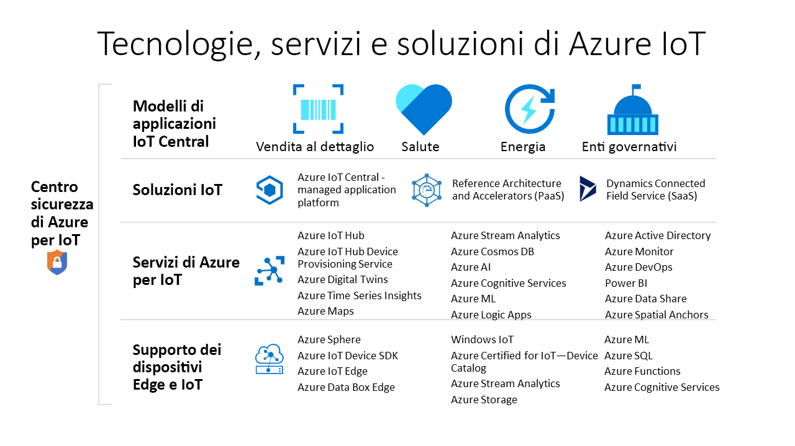

# Quali tecnologie di Azure è possibile usare per creare soluzioni IoT?

Le tecnologie e i servizi di Azure IoT offrono opzioni per la creazione di una vasta gamma di soluzioni IoT che consentono la trasformazione digitale dell'organizzazione. Ad esempio, è possibile:

- Usare [Azure IoT Central](https://apps.azureiotcentral.com), una piattaforma applicativa IoT gestita, per creare e distribuire una soluzione IoT di livello aziendale sicura. IoT Central include una raccolta di modelli di applicazione specifici del settore, ad esempio per la vendita al dettaglio e la sanità, per accelerare il processo di sviluppo della soluzione.
- Estendere la codebase open source per un [acceleratore di soluzioni](https://www.azureiotsolutions.com) di Azure IoT per implementare uno scenario IoT comune come il monitoraggio remoto o la manutenzione predittiva.
- Usare i servizi della piattaforma Azure IoT, come [hub IoT di Azure](../iot-hub/about-iot-hub.md) e [Azure IoT SDK per dispositivi](../iot-hub/iot-hub-devguide-sdks.md), per la creazione di una soluzione IoT personalizzata da zero.

## Azure IoT Central

La [piattaforma applicativa IoT Central](https://apps.azureiotcentral.com) riduce il carico di attività e i costi di sviluppo, gestione e manutenzione di soluzioni IoT di livello aziendale. L'interfaccia utente Web personalizzabile di IoT Central consente di monitorare le condizioni dei dispositivi, di creare regole e di gestire milioni di dispositivi e i relativi dati durante il ciclo di vita. La superficie dell'API all'interno di IoT Central consente l'accesso a livello di codice per configurare e interagire con la soluzione IoT.

Azure IoT Central è una piattaforma applicativa completamente gestita che è possibile usare per creare soluzioni IoT personalizzate. IoT Central usa i modelli di applicazione per creare soluzioni. Sono disponibili modelli per soluzioni generiche e per settori specifici, ad esempio fonti energetiche, sanità, pubblica amministrazione e vendita al dettaglio. I modelli di applicazione di IoT Central consentono di distribuire un'applicazione di IoT Central in pochi minuti, che è quindi possibile personalizzare con temi, dashboard e visualizzazioni.

Scegliere i dispositivi dal [catalogo dei dispositivi Azure Certified per IoT](https://catalog.azureiotsolutions.com) per connettersi rapidamente alla soluzione. Usare l'interfaccia utente Web di IoT Central per monitorare e gestire i dispositivi in modo da mantenerli integri e connessi. Usare i connettori e le API per integrare l'applicazione di IoT Central con altre applicazioni aziendali.

Come piattaforma applicativa completamente gestita, IoT Central dispone di un modello tariffario semplice e prevedibile.

## Solution Accelerator di Azure IoT

Gli [acceleratori di soluzioni di Azure IoT](https://www.azureiotsolutions.com) sono una raccolta di soluzioni personalizzabili di livello aziendale. È possibile distribuire queste soluzioni così come sono o sviluppare una soluzione IoT personalizzata usando il codice sorgente Java o .NET open source.

Gli acceleratori di soluzioni di Azure IoT offrono un elevato livello di controllo sulla soluzione IoT. Gli acceleratori di soluzioni includono soluzioni predefinite per scenari IoT comuni che è possibile distribuire nella sottoscrizione di Azure in pochi minuti. Tali scenari includono:

  - Monitoraggio remoto
  - Connected factory
  - Manutenzione predittiva
  - Simulazione dei dispositivi

La codebase open source per tutti gli acceleratori di soluzioni è disponibile in GitHub. Scaricare il codice per personalizzare un acceleratore di soluzioni per soddisfare requisiti IoT specifici.

Gli acceleratori di soluzioni usano i servizi di Azure, ad esempio l'hub IoT di Azure e Archiviazione di Azure, che è necessario gestire nella sottoscrizione di Azure.

## Soluzioni personalizzate

Per creare una soluzione IoT da zero o per estendere una soluzione creata usando IoT Central o un acceleratore di soluzioni, usare uno o più dei servizi e delle tecnologie di Azure IoT seguenti:

### Dispositivi

Sviluppare i dispositivi IoT usando uno degli [starter Kit di Azure IoT](https://catalog.azureiotsolutions.com/kits) o scegliere un dispositivo da usare dal [catalogo dei dispositivi Azure Certified per IoT](https://catalog.azureiotsolutions.com). Implementare il codice incorporato usando gli [SDK per dispositivi](../iot-hub/iot-hub-devguide-sdks.md) open source. Gli SDK per dispositivi supportano più sistemi operativi, ad esempio Linux, Windows e sistemi operativi in tempo reale. Sono disponibili SDK per più linguaggi di programmazione, ad esempio [C](https://github.com/Azure/azure-iot-sdk-c), [Node.js](https://github.com/Azure/azure-iot-sdk-node), [Java](https://github.com/Azure/azure-iot-sdk-java), [.NET](https://github.com/Azure/azure-iot-sdk-csharp) e [Python](https://github.com/Azure/azure-iot-sdk-python).

È possibile semplificare ulteriormente il modo in cui si crea il codice incorporato per i dispositivi usando il servizio [Plug and Play IoT](../iot-pnp/overview-iot-plug-and-play.md). Plug and Play IoT consente agli sviluppatori di soluzioni di integrare nei dispositivi le proprie soluzioni senza scrivere codice incorporato. La parte centrale di Plug and Play IoT è costituita da uno schema del _modello di funzionalità di dispositivo_ che descrive le funzionalità dei dispositivi. Usare il modello di funzionalità del dispositivo per generare il codice del dispositivo incorporato e configurare una soluzione basata sul cloud, ad esempio un'applicazione di IoT Central.

[Azure IoT Edge](../iot-edge/about-iot-edge.md) consente di scaricare parti del carico di lavoro IoT dai servizi cloud di Azure sui dispositivi. IoT Edge può ridurre la latenza nella soluzione, ridurre la quantità di dati che i dispositivi scambiano con il cloud e consentire scenari offline. È possibile gestire i dispositivi IoT Edge da IoT Central e da alcuni acceleratori di soluzioni.

[Azure Sphere](https://docs.microsoft.com/azure-sphere/product-overview/what-is-azure-sphere) è una piattaforma applicativa protetta e di alto livello con funzionalità di comunicazione e di protezione integrate per i dispositivi connessi a Internet. Include un'unità microcontroller protetta, un sistema operativo personalizzato basato su Linux e un servizio di sicurezza basato sul cloud che garantisce una sicurezza continua e rinnovabile.

### Connettività cloud

Il servizio [hub IoT di Azure](../iot-hub/about-iot-hub.md) consente comunicazioni bidirezionali affidabili e sicure tra milioni di dispositivi IoT e una soluzione basata sul cloud. Il [servizio Device Provisioning in hub IoT di Azure](../iot-dps/about-iot-dps.md) è un servizio di supporto per l'hub IoT. Il servizio fornisce il provisioning JIT automatizzato di dispositivi nell'hub IoT corretto senza alcun intervento dell'utente. Queste funzionalità consentono ai clienti di effettuare il provisioning di milioni di dispositivi in modo sicuro e scalabile.

L'hub IoT è un componente fondamentale degli acceleratori di soluzioni ed è possibile usarlo per risolvere problematiche associate all'implementazione IoT come le seguenti:

* Connettività e gestione di volumi elevati di dispositivi.
* Inserimento di volumi elevati di dati di telemetria.
* Comando e controllo dei dispositivi.
* Applicazione della sicurezza dei dispositivi.

### Colmare il divario tra il mondo fisico e quello digitale

[Gemelli digitali di Azure](../digital-twins/about-digital-twins.md) è un servizio IoT che consente di modellare un ambiente fisico usando un grafico di intelligenza spaziale con cui modellare le relazioni tra persone, spazi e dispositivi. Tramite la correlazione dei dati attraverso il mondo digitale e fisico, è possibile creare soluzioni dotate di funzioni di riconoscimento del contesto.

IoT Central usa i gemelli digitali per sincronizzare i dispositivi e i dati nel mondo reale con i modelli digitali che consentono agli utenti di monitorare e gestire i dispositivi connessi.

### Dati e analisi

I dispositivi IoT in genere generano grandi quantità di dati di serie temporali come ad esempio le letture delle temperature dai sensori. [Azure Time Series Insights](../time-series-insights/time-series-insights-overview.md) può connettersi a un hub IoT, leggere il flusso di dati di telemetria dai dispositivi, archiviare i dati e consentire di eseguire query e visualizzarle.

[Mappe di Azure](/azure/azure-maps) è una raccolta di servizi geospaziali che usano dati di mappa aggiornati per fornire un contesto geografico preciso alle applicazioni Web e per dispositivi mobili. Per creare le applicazioni, è possibile usare un'API REST, un controllo JavaScript basato sul Web o un Android SDK.

## Passaggi successivi

Per un'esperienza pratica, provare a eseguire una delle guide di avvio rapido:

- [Creare un'applicazione di Azure IoT Central](../iot-central/core/quick-deploy-iot-central.md)
- [Send telemetry from a device to an IoT hub](../iot-hub/quickstart-send-telemetry-cli.md) (Inviare dati di telemetria da un dispositivo a un hub IoT)
- [Provare una soluzione di monitoraggio remoto basata sul cloud](../iot-accelerators/quickstart-remote-monitoring-deploy.md)
