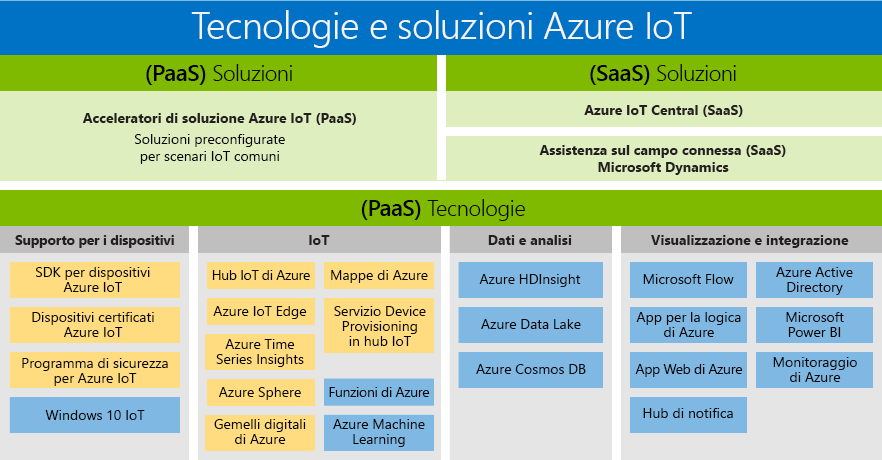

# Tecnologie e soluzioni per Internet delle cose (IoT) PaaS e SaaS

Microsoft ha creato un portfolio che supporta le esigenze di tutti i clienti, consentendo a tutti gli utenti di accedere ai vantaggi della trasformazione digitale. Il portfolio di prodotti di Azure IoT offre una panoramica delle tecnologie e delle soluzioni PaaS/SaaS disponibili. Presenta i due percorsi disponibili per la creazione di una soluzione personalizzata:

- PaaS (Platform as a Service, piattaforma distribuita come servizio): consente di compilare l'applicazione usando uno qualsiasi dei servizi seguenti.
    - [Acceleratori di soluzioni di Azure IoT](https://www.azureiotsolutions.com/), una raccolta di soluzioni preconfigurate di livello aziendale che consentono di accelerare lo sviluppo di soluzioni IoT personalizzate. 
    - Servizio [Gemelli digitali di Azure](https://azure.microsoft.com/services/digital-twins/), che consente di modellare l'ambiente fisico per creare soluzioni IoT dotate di funzioni di riconoscimento del contesto tramite un grafico di intelligenza spaziale e modelli a oggetti specifici di dominio.

- Software come un servizio, ovvero SaaS: è una guida introduttiva rapida ad [Azure IoT Central](https://azure.microsoft.com/services/iot-central/), la nuova soluzione SaaS per sviluppare applicazioni IoT senza dover affrontare la complessità delle soluzioni IoT. Se l'organizzazione non dispone di risorse per creare la propria soluzione IoT, Azure IoT Central è una soluzione IoT senza codice che consente di creare modelli di dispositivo, dashboard e regole in pochi minuti.

## Soluzioni

Velocizzare l'implementazione con acceleratori delle soluzioni e offerte SaaS. È possibile scegliere tra soluzioni preconfigurate che consentono di esplorare scenari IoT comuni, come il monitoraggio remoto, la manutenzione predittiva e la factory connessa, per creare un soluzione completamente personalizzabile. È anche possibile usare Azure IoT Central, una soluzione end-to-end completamente gestita che permette di ottenere scenari IoT avanzati senza che siano necessarie competenze specifiche per le soluzioni cloud.

### Acceleratori di soluzioni di Azure IoT (PaaS)

Gli acceleratori di soluzioni di Azure IoT Suite sono soluzioni PaaS personalizzabili che offrono un elevato livello di controllo sulla soluzione IoT. Se l'azienda sta implementando IoT per le operazioni connesse o ha requisiti di personalizzazione specifici per i prodotti connessi, gli acceleratori di soluzioni di Azure IoT offrono il controllo necessario. 

Le organizzazioni con un numero elevato di dispositivi o di modelli di dispositivo e i produttori in cerca di soluzioni factory connesse, sono esempi di società che possono trarre vantaggio dagli acceleratori di soluzioni di Azure IoT. Creando soluzioni altamente personalizzabili, fatte su misura per esigenze complesse, gli acceleratori di soluzioni di IoT offrono: 

- Soluzioni predefinite
    - Monitoraggio remoto
    - Connected factory
    - Manutenzione predittiva
    - Simulazione dei dispositivi
- Capacità di distribuzione in pochi minuti
- Time-to-value velocizzato
- Soluzioni che offrono massimo controllo 
 
### Azure IoT Central (SaaS)

Azure IoT Central è una soluzione SaaS completamente gestita che consente di iniziare rapidamente un'esperienza IoT minima. Se l'azienda richiede velocità più che personalizzazione, i modelli SaaS potrebbero essere la soluzione perfetta per le esigenze di implementazione IoT. 

Le organizzazioni con un numero inferiore di modelli di dispositivi, scenari più prevedibili e capacità IoT/informatiche limitate possono ora godere dei vantaggi di IoT tramite un approccio SaaS. Le aziende che prima non avevano tempo, denaro e competenze per sviluppare i prodotti connessi, possono ora iniziare a farlo rapidamente con Azure IoT Central. Microsoft è leader nel campo della creazione di soluzioni SaaS avanzate che soddisfano i requisiti di implementazione IoT comuni. 

- SaaS IoT completamente gestito
- Nessuna competenza di sviluppo di soluzioni cloud necessaria
- Configurabile in base alle esigenze
- Ideale per soddisfare le esigenze IoT

### Confrontare gli acceleratori di soluzioni Azure IoT e Azure IoT Central

Per implementare una tipica [architettura della soluzione IoT](/azure/iot-fundamentals/iot-introduction), Azure IoT offre diverse opzioni, [acceleratori di soluzioni di Azure IoT](/azure/iot-suite) e [Azure IoT Central](https://www.microsoft.com/internet-of-things/iot-central-saas-solutions), ognuna adeguata ai diversi requisiti dei clienti.

[Hub IoT di Azure](https://azure.microsoft.com/services/iot-hub/) è la piattaforma PaaS principale di Azure usata sia da Azure IoT Central che dagli acceleratori di soluzioni Azure IoT. L'hub IoT supporta comunicazioni bidirezionali affidabili e sicure tra milioni di dispositivi IoT e una soluzione cloud. L'hub IoT consente di risolvere problematiche associate all'implementazione IoT come le seguenti:

* Connettività e gestione di volumi elevati di dispositivi.
* Inserimento di volumi elevati di dati di telemetria.
* Comando e controllo dei dispositivi.
* Applicazione della sicurezza dei dispositivi.

La scelta del prodotto Azure IoT è una parte essenziale della pianificazione della soluzione IoT. L'hub IoT è un singolo servizio di Azure che non offre, da solo, una soluzione IoT end-to-end, ma può essere usato come punto di partenza per qualsiasi soluzione IoT. Non è necessario usare gli acceleratori di soluzioni Azure IoT o Azure IoT Central per usare l'hub IoT. Sia gli acceleratori di soluzioni Azure IoT che Azure IoT Central usano l'hub IoT insieme ad altri servizi di Azure. La tabella seguente offre un riepilogo delle differenze principali tra gli acceleratori di soluzioni Azure IoT e Azure IoT Central per consentire la scelta dell'opzione corretta per i propri requisiti:

|                        | Solution Accelerator di Azure IoT | Azure IoT Central |
| ---------------------- | --------- | ----------- |
| Utilizzo primario | Velocizzare lo sviluppo di una soluzione IoT personalizzata che necessita della massima flessibilità. | Accelerare il time-to-market per soluzioni IoT semplici che non richiedono una personalizzazione approfondita dei servizi. |
| Accesso ai servizi PaaS sottostanti          | L'utente ha accesso ai servizi di Azure sottostanti per gestirli o, se necessario, sostituirli. | SaaS. Soluzione completamente gestita. I servizi sottostanti non sono esposti. |
| Flessibilità            | Elevata. Il codice per i microservizi è open source e può essere modificato come si preferisce. È anche possibile personalizzare l'infrastruttura di distribuzione.| Media. È possibile usare l'esperienza utente basata su browser predefinita per personalizzare il modello di soluzione e aspetti dell'interfaccia utente. L'infrastruttura non è personalizzabile perché i diversi componenti non sono esposti.|
| Livello di competenze                 | Medio-alto. Sono necessarie competenze in Java o .NET per personalizzare il back-end della soluzione e competenze in JavaScript per personalizzare la visualizzazione. | Bassa. Sono necessarie competenze di modellazione per personalizzare la soluzione. Non sono richieste competenze nella creazione di codice. |
| Esperienza iniziale | Gli acceleratori di soluzioni implementano scenari IoT comuni, distribuibili in pochi minuti. | I modelli di applicazione e i modelli di dispositivo forniscono modelli predefiniti distribuibili in pochi minuti. |
| Prezzi                | È possibile ottimizzare i servizi per controllare i costi. | Struttura di prezzi semplice e prevedibile. |

La scelta del prodotto da usare per creare la propria soluzione IoT è determinata in definitiva da:

* Requisiti aziendali.
* Tipo di soluzione che si vuole creare.
* Set di competenze dell'organizzazione per la creazione e la gestione della soluzione a lungo termine.

## Tecnologie (PaaS)

Con il portfolio IoT di servizi per la piattaforma più completo, le tecnologie della piattaforma distribuita come servizio, ovvero PaaS, che comprendono la piattaforma di Azure consentono di creare, personalizzare e controllare facilmente tutti gli aspetti della soluzione IoT. Stabilire comunicazioni bidirezionali con miliardi di dispositivi IoT e gestire i dispositivi IoT su larga scala. Quindi integrare i dati del dispositivo IoT con altri servizi della piattaforma, ad esempio Azure Cosmos DB e Azure Time Series Insights, per migliorare le informazioni dettagliate nella soluzione. 

### Supporto dei dispositivi

Avviare il proprio progetto IoT in tutta tranquillità, sfruttando gli [starter kit di Azure IoT](https://catalog.azureiotsuite.com/kits) o scegliendo tra centinaia di dispositivi Certified per IoT disponibili nel nostro [catalogo di dispositivi](http://catalog.azureiotsuite.com/). Tutti i dispositivi sono indipendenti dalla piattaforma e testati per garantire una facile connessione all'hub IoT.
Connettere tutti i dispositivi ad Azure IoT usando gli [SDK per dispositivi](/azure/iot-hub/iot-hub-devguide-sdks) open source. Gli SDK supportano diversi sistemi operativi, come Linux, Windows e i sistemi operativi in tempo reale, oltre che diversi linguaggi di programmazione, come [C](https://github.com/Azure/azure-iot-sdk-c), [Node.js](https://github.com/Azure/azure-iot-sdk-node), [Java](https://github.com/Azure/azure-iot-sdk-java), [.NET](https://github.com/Azure/azure-iot-sdk-csharp) e [Python](https://github.com/Azure/azure-iot-sdk-python).

### IoT 
L'[hub IoT](https://azure.microsoft.com/services/iot-hub/) di Azure è un servizio completamente gestito che consente comunicazioni bidirezionali affidabili e sicure tra milioni di dispositivi IoT e un backend della soluzione. Device Provisioning in hub IoT di Azure è un servizio di assistenza per l'hub IoT che consente il provisioning JIT automatico nell'hub IoT corretto senza richiedere l'intervento umano, permettendo ai clienti di effettuare il provisioning di milioni di dispositivi in modo sicuro e scalabile.

### Microsoft Edge
[Azure IoT Edge](https://azure.microsoft.com/services/iot-edge/) è un servizio IoT. Il servizio è destinato a clienti che vogliono analizzare i dati nei dispositivi, ovvero "nella rete perimetrale". Spostando le parti del carico di lavoro nella rete perimetrale, si riscontrerà una riduzione della latenza e si avrà la possibilità di scegliere gli scenari non in linea.

### Intelligenza spaziale
[Gemelli digitali di Azure](https://azure.microsoft.com/services/digital-twins/) è un servizio IoT che consente di creare il modello di un ambiente fisico e offre un grafico di intelligenza spaziale con cui modellare le relazioni tra persone, spazi e dispositivi. Tramite la correlazione dei dati attraverso il mondo digitale e fisico, è possibile creare soluzioni dotate di funzioni di riconoscimento del contesto.  

### Dati e analisi
Sfruttare i vantaggi di una matrice di dati di Azure e le offerte PaaS di analisi nella soluzione IoT, come portare l'intelligence del cloud nella rete perimetrale con Azure Machine Learning, archiviare i dati del dispositivo IoT in modo conveniente con Azure Data Lake, visualizzare una grande quantità di dati dai dispositivi IoT con [Azure Time Series Insights](https://azure.microsoft.com/services/time-series-insights/).

### Visualizzazione e interazione
Microsoft Azure offre una soluzione cloud completa che combina una raccolta in continua crescita di servizi cloud integrati con l'impegno, leader nel settore, verso la protezione e la privacy dei dati. Altre informazioni su [Microsoft Azure](https://azure.microsoft.com/).

## Passaggi successivi

Consultare la [sezione introduttiva della documentazione dell'hub IoT](/azure/iot-hub/iot-hub-get-started) per usare le funzionalità IoT in modo semplice e rapido. Oppure, per un'esperienza pratica più approfondita, provare a seguire una delle [esercitazioni di IoT Edge](/azure/iot-edge/tutorial-simulate-device-windows).
