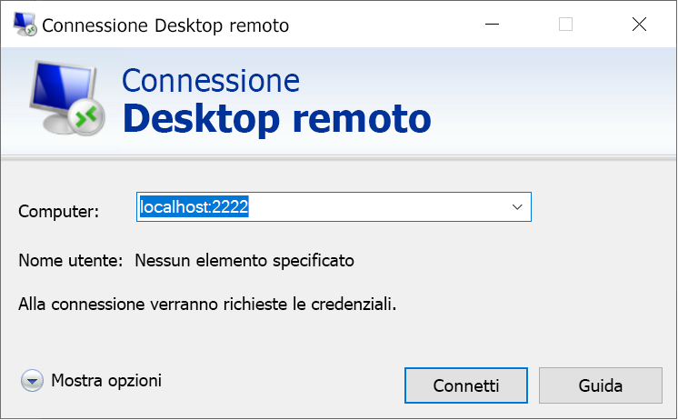

# <a name="quickstart-enable-ssh-and-rdp-over-an-iot-hub-device-stream-by-using-a-c-proxy-application-preview"></a>Guida introduttiva: Abilitare SSH e RDP su un flusso del dispositivo dell'hub IoT con un'applicazione proxy C# (anteprima)

[!INCLUDE [iot-hub-quickstarts-4-selector](../../includes/iot-hub-quickstarts-4-selector.md)]

L'hub IoT di Microsoft Azure supporta attualmente i flussi dispositivo come [funzionalità in anteprima](https://azure.microsoft.com/support/legal/preview-supplemental-terms/).

I [flussi dispositivo dell'hub IoT](iot-hub-device-streams-overview.md) consentono alle applicazioni del servizio e del dispositivo di comunicare in modo sicuro e di facile integrazione con i firewall. Questo argomento di avvio rapido prevede due applicazioni C# che consentono di inviare il traffico delle applicazioni client/server, come SSH (Secure Shell) e RDP (Remote Desktop Protocol), tramite un flusso del dispositivo stabilito mediante l'hub IoT. Per una panoramica della configurazione, vedere l'[esempio di applicazione proxy locale per SSH o RDP](iot-hub-device-streams-overview.md#local-proxy-sample-for-ssh-or-rdp).

Questo articolo descrive prima la configurazione per SSH (tramite la porta 22) e quindi illustra come modificare la porta per RDP. Poiché i flussi del dispositivo sono indipendenti da applicazioni e protocolli, lo stesso esempio può essere modificato e quindi adattato ad altri tipi di traffico delle applicazioni. A questo scopo è in genere necessario solo cambiare la porta di comunicazione impostandola su quella usata dall'applicazione prevista.

## <a name="how-it-works"></a>Funzionamento

La figura seguente illustra il modo in cui le applicazioni proxy locali del dispositivo e del servizio consentono la connettività end-to-end tra i processi del client SSH e del daemon SSH. In questo caso, si presuppone che il daemon sia in esecuzione nello stesso dispositivo dell'applicazione proxy locale del dispositivo.


1. L'applicazione proxy locale del servizio si connette all'hub IoT e avvia un flusso del dispositivo nel dispositivo di destinazione.

1. L'applicazione proxy locale del dispositivo completa l'handshake di avvio del flusso e stabilisce un tunnel di streaming end-to-end tramite l'endpoint di streaming dell'hub IoT sul lato servizio.

1. L'applicazione proxy locale del dispositivo si connette al daemon SSH in ascolto sulla porta 22 del dispositivo. Questa impostazione è configurabile, come descritto nella sezione "Eseguire l'applicazione proxy locale del dispositivo".

1. L'applicazione proxy locale del servizio attende nuove connessioni SSH da parte dell'utente restando in ascolto su una porta designata, che in questo caso è la porta 2222. Questa impostazione è configurabile, come descritto nella sezione "Eseguire l'applicazione proxy locale del servizio". Quando l'utente si connette tramite il client SSH, il tunnel consente di trasferire il traffico dell'applicazione SSH tra le applicazioni client e server SSH.

> [!NOTE]
> Il traffico SSH che viene inviato tramite un flusso del dispositivo sarà sottoposto a tunneling attraverso l'endpoint di streaming dell'hub IoT invece di essere inviato direttamente tra il servizio e il dispositivo. Per altre informazioni, vedere la sezione sui [vantaggi dell'uso di flussi del dispositivo dell'hub IoT](iot-hub-device-streams-overview.md#benefits).

[!INCLUDE [cloud-shell-try-it.md](../../includes/cloud-shell-try-it.md)]

Se non si ha una sottoscrizione di Azure, creare un [account gratuito](https://azure.microsoft.com/free/?WT.mc_id=A261C142F) prima di iniziare.

## <a name="prerequisites"></a>Prerequisiti

* L'anteprima dei flussi del dispositivo è attualmente supportata solo per gli hub IoT creati nelle aree seguenti:

  * Stati Uniti centrali
  * Stati Uniti centrali EUAP

* Le due applicazioni di esempio eseguite in questo argomento sono scritte in C#. È necessario .NET Core SDK 2.1.0 o versione successiva nel computer di sviluppo.

  È possibile scaricare [.NET Core SDK per più piattaforme da .NET](https://www.microsoft.com/net/download/all).

* Verificare la versione corrente di C# installata nel computer di sviluppo tramite il comando seguente:

    ```
    dotnet --version
    ```

* Eseguire questo comando per aggiungere l'estensione Azure IoT per l'interfaccia della riga di comando di Azure all'istanza di Cloud Shell. L'estensione IoT aggiunge i comandi specifici di hub IoT, IoT Edge e servizio Device Provisioning in hub IoT all'interfaccia della riga di comando di Azure.

   ```azurecli-interactive
   az extension add --name azure-cli-iot-ext
   ```

* [Scaricare il progetto C# di esempio](https://github.com/Azure-Samples/azure-iot-samples-csharp/archive/master.zip) ed estrarre l'archivio ZIP.

## <a name="create-an-iot-hub"></a>Creare un hub IoT

[!INCLUDE [iot-hub-include-create-hub-device-streams](../../includes/iot-hub-include-create-hub-device-streams.md)]

## <a name="register-a-device"></a>Registrare un dispositivo

È necessario registrare un dispositivo con l'hub IoT perché questo possa connettersi. In questo argomento di avvio rapido si usa Azure Cloud Shell per registrare un dispositivo simulato.

1. Per creare l'identità del dispositivo, eseguire il comando seguente in Cloud Shell:

   > [!NOTE]
   > * Sostituire il segnaposto *YourIoTHubName* con il nome scelto per l'hub IoT.
   > * Usare *MyDevice* come illustrato. Si tratta del nome specificato per il dispositivo registrato. Se si sceglie un altro nome per il dispositivo, sarà necessario usarlo nell'intero articolo e aggiornarlo nelle applicazioni di esempio prima di eseguirle.

    ```azurecli-interactive
    az iot hub device-identity create --hub-name YourIoTHubName --device-id MyDevice
    ```

1. Eseguire i comandi seguenti in Cloud Shell per ottenere la *stringa di connessione* per il dispositivo appena registrato:

   > [!NOTE]
   > Sostituire il segnaposto *YourIoTHubName* con il nome scelto per l'hub IoT.

    ```azurecli-interactive
    az iot hub device-identity show-connection-string --hub-name YourIoTHubName --device-id MyDevice --output table
    ```

    Prendere nota della stringa di connessione del dispositivo per usarla in seguito nella guida. Sarà simile a quanto indicato nell'esempio seguente:

   `HostName={YourIoTHubName}.azure-devices.net;DeviceId=MyDevice;SharedAccessKey={YourSharedAccessKey}`

1. Per connettersi all'hub IoT e stabilire un flusso del dispositivo, è anche necessario avere la *stringa di connessione del servizio* dell'hub IoT per consentire all'applicazione sul lato servizio. Il comando seguente recupera questo valore per l'hub IoT:

   > [!NOTE]
   > Sostituire il segnaposto *YourIoTHubName* con il nome scelto per l'hub IoT.

    ```azurecli-interactive
    az iot hub show-connection-string --policy-name service --name YourIoTHubName
    ```

    Prendere nota del valore restituirlo per usarlo in seguito nella guida. Sarà simile a quanto indicato nell'esempio seguente:

   `"HostName={YourIoTHubName}.azure-devices.net;SharedAccessKeyName=service;SharedAccessKey={YourSharedAccessKey}"`

## <a name="ssh-to-a-device-via-device-streams"></a>Connessione SSH a un dispositivo tramite i flussi dispositivo

In questa sezione si stabilisce un flusso end-to-end per il tunneling del traffico SSH.

### <a name="run-the-device-local-proxy-application"></a>Eseguire l'applicazione proxy locale del dispositivo

Passare alla directory *device-streams-proxy/device* nella cartella del progetto decompresso. Tenere a portata di mano le informazioni seguenti:

| Nome dell'argomento | Valore dell'argomento |
|----------------|-----------------|
| `deviceConnectionString` | La stringa di connessione del dispositivo creato in precedenza. |
| `targetServiceHostName` | L'indirizzo IP in cui è in ascolto il server SSH. L'indirizzo sarebbe `localhost` se fosse lo stesso IP in cui è in esecuzione l'applicazione proxy locale del dispositivo. |
| `targetServicePort` | La porta usata dal protocollo dell'applicazione (per SSH, per impostazione predefinita viene usata la porta 22).  |

Compilare ed eseguire il codice come segue:

```
cd ./iot-hub/Quickstarts/device-streams-proxy/device/

# Build the application
dotnet build

# Run the application
# In Linux or macOS
dotnet run $deviceConnectionString localhost 22

# In Windows
dotnet run %deviceConnectionString% localhost 22
```

### <a name="run-the-service-local-proxy-application"></a>Eseguire l'applicazione proxy locale del servizio

Passare a `device-streams-proxy/service` nella cartella del progetto decompressa. Sarà necessario specificare le informazioni seguenti:

| Nome parametro | Valore del parametro |
|----------------|-----------------|
| `iotHubConnectionString` | Stringa di connessione del servizio dell'hub IoT. |
| `deviceId` | Identificatore del dispositivo creato in precedenza. |
| `localPortNumber` | Una porta locale a cui si connetterà il client SSH. In questo esempio viene usata la porta 2222, ma è possibile usare altri numeri arbitrari. |

Compilare ed eseguire il codice come segue:

```
cd ./iot-hub/Quickstarts/device-streams-proxy/service/

# Build the application
dotnet build

# Run the application
# In Linux or macOS
dotnet run $serviceConnectionString MyDevice 2222

# In Windows
dotnet run %serviceConnectionString% MyDevice 2222
```

### <a name="run-the-ssh-client"></a>Eseguire il client SSH

Usare ora l'applicazione client SSH e connettersi all'applicazione proxy locale del servizio sulla porta 2222 invece di usare direttamente il daemon SSH.

```
ssh <username>@localhost -p 2222
```

A questo punto, la finestra di accesso SSH richiede di immettere le credenziali.

Output della console sul lato servizio (l'applicazione il proxy locale del servizio è in ascolto sulla porta 2222):


Output della console nell'applicazione proxy locale del dispositivo, che si connette al daemon SSH all'indirizzo *IP_address:22*:


Output della console dell'applicazione client SSH. Il client SSH comunica con il daemon SSH tramite connessione alla porta 22, su cui è in ascolto l'applicazione proxy locale del servizio:


## <a name="rdp-to-a-device-via-device-streams"></a>Connessione RDP a un dispositivo tramite i flussi dispositivo

La configurazione per RDP è molto simile a quella per SSH (descritta in precedenza). È necessario usare l'indirizzo IP di destinazione di RDP e la porta 3389 e usare il client RDP (anziché il client SSH).

### <a name="run-the-device-local-proxy-application-rdp"></a>Eseguire l'applicazione proxy locale del dispositivo (RDP)

Passare alla directory *device-streams-proxy/device* nella cartella del progetto decompresso. Tenere a portata di mano le informazioni seguenti:

| Nome dell'argomento | Valore dell'argomento |
|----------------|-----------------|
| `DeviceConnectionString` | La stringa di connessione del dispositivo creato in precedenza. |
| `targetServiceHostName` | Il nome host o l'indirizzo IP in cui viene eseguito il server RDP. L'indirizzo sarebbe `localhost` se fosse lo stesso IP in cui è in esecuzione l'applicazione proxy locale del dispositivo. |
| `targetServicePort` | La porta usata dal protocollo dell'applicazione (per RDP, per impostazione predefinita viene usata la porta 3389).  |

Compilare ed eseguire il codice come segue:

```
cd ./iot-hub/Quickstarts/device-streams-proxy/device

# Run the application
# In Linux or macOS
dotnet run $DeviceConnectionString localhost 3389

# In Windows
dotnet run %DeviceConnectionString% localhost 3389
```

### <a name="run-the-service-local-proxy-application-rdp"></a>Eseguire l'applicazione proxy locale del servizio (RDP)

Passare a `device-streams-proxy/service` nella cartella del progetto decompressa. Sarà necessario specificare le informazioni seguenti:

| Nome parametro | Valore del parametro |
|----------------|-----------------|
| `iotHubConnectionString` | Stringa di connessione del servizio dell'hub IoT. |
| `deviceId` | Identificatore del dispositivo creato in precedenza. |
| `localPortNumber` | Una porta locale a cui si connetterà il client SSH. In questo esempio viene usata la porta 2222, ma è possibile modificarla usando altri numeri di porta. |

Compilare ed eseguire il codice come segue:

```
cd ./iot-hub/Quickstarts/device-streams-proxy/service/

# Build the application
dotnet build

# Run the application
# In Linux or macOS
dotnet run $serviceConnectionString MyDevice 2222

# In Windows
dotnet run %serviceConnectionString% MyDevice 2222
```

### <a name="run-rdp-client"></a>Eseguire il client RDP

Usare ora l'applicazione client RDP e connettersi all'applicazione proxy locale del servizio sulla porta 2222 (una porta arbitraria disponibile scelta in precedenza).



## <a name="clean-up-resources"></a>Pulire le risorse

[!INCLUDE [iot-hub-quickstarts-clean-up-resources](../../includes/iot-hub-quickstarts-clean-up-resources-device-streams.md)]

## <a name="next-steps"></a>Passaggi successivi

In questo argomento di avvio rapido è stato configurato un hub IoT, è stato registrato un dispositivo, sono state distribuite le applicazioni proxy locali del dispositivo e del servizio per stabilire un flusso del dispositivo tramite l'hub IoT, quindi tali applicazioni sono state usate per effettuare il tunneling del traffico SSH o RDP. Lo stesso paradigma può essere usato per altri protocolli client/server (in cui il server viene eseguito nel dispositivo, ad esempio nel daemon SSH).

Per altre informazioni sui flussi del dispositivo, vedere:

> [!div class="nextstepaction"]
> [Panoramica dei flussi dispositivo](./iot-hub-device-streams-overview.md)
