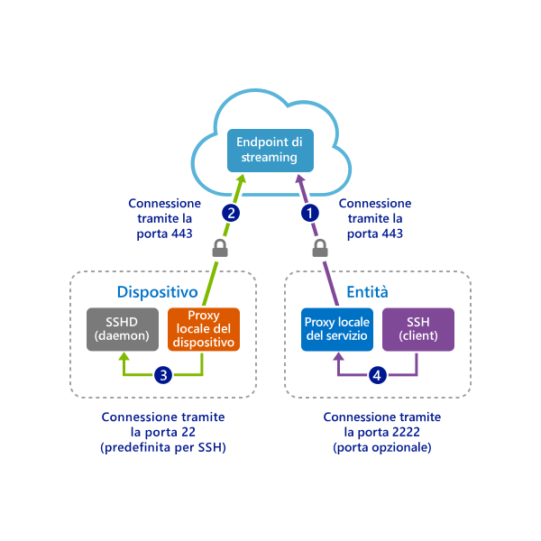
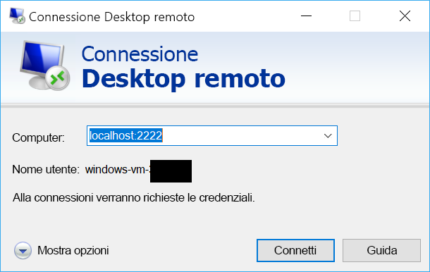

# <a name="quickstart-sshrdp-over-iot-hub-device-streams-using-c-proxy-applications-preview"></a>Avvio rapido: SSH/RDP su flussi dispositivo dell'hub IoT con applicazioni proxy C# (anteprima)

[!INCLUDE [iot-hub-quickstarts-4-selector](../../includes/iot-hub-quickstarts-4-selector.md)]

L'hub IoT di Microsoft Azure attualmente supporta i flussi dispositivo come [funzionalità di anteprima](https://azure.microsoft.com/support/legal/preview-supplemental-terms/).

I [flussi dispositivo dell'hub IoT](./iot-hub-device-streams-overview.md) consentono alle applicazioni del servizio e del dispositivo di comunicare in modo sicuro e di facile integrazione con i firewall. Questa guida introduttiva prevede due programmi C# che consentono di inviare il traffico delle applicazioni client/server (come SSH e RDP) tramite un flusso dispositivo stabilito mediante l'hub IoT. Per una panoramica della configurazione, vedere [qui](./iot-hub-device-streams-overview.md#local-proxy-sample-for-ssh-or-rdp).

Per prima cosa viene descritta la configurazione per SSH (con la porta 22). Verrà quindi illustrato come modificare la porta della configurazione per RDP. Poiché i flussi dispositivo sono indipendenti dalle applicazioni e dai protocolli, lo stesso esempio può essere modificato e quindi adattato ad altri tipi di traffico delle applicazioni. A questo scopo è in genere necessario solo modificare la porta di comunicazione indicando quella usata dall'applicazione desiderata.


## <a name="how-it-works"></a>Funzionamento

La figura seguente illustra la configurazione del modo in cui in questo esempio i programmi proxy locali del dispositivo e del servizio consentiranno la connettività end-to-end tra il client SSH e il daemon SSH. In questo caso, si presuppone che il daemon sia in esecuzione nello stesso dispositivo del proxy locale del dispositivo.



1. Il proxy locale del servizio si connette all'hub IoT e avvia un flusso dispositivo nel dispositivo di destinazione usando il relativo ID dispositivo.

2. Il proxy locale del dispositivo completa l'handshake di avvio del flusso e stabilisce un tunnel di streaming end-to-end tramite l'endpoint di streaming dell'hub IoT sul lato servizio.

3. Il proxy locale del dispositivo si connette al daemon SSH (SSHD) in ascolto sulla porta 22 del dispositivo. La porta è configurabile come descritto [di seguito](#run-the-device-local-proxy).

4. Il proxy locale del servizio resta in attesa delle nuove connessioni SSH da parte dell'utente in ascolto su una porta designata che in questo caso è la porta 2222 (anche questa configurabile come descritto di [seguito](#run-the-service-local-proxy)). Quando l'utente si connette tramite il client SSH, il tunnel consente di scambiare il traffico dell'applicazione tra i programmi client e server SSH.

> [!NOTE]
> Il traffico SSH che viene inviato tramite il flusso sarà forzato mediante il tunnel attraverso l'endpoint di streaming dell'hub IoT anziché essere inviato direttamente tra il servizio e il dispositivo, ottenendo in tal modo [questi vantaggi](./iot-hub-device-streams-overview.md#benefits).

[!INCLUDE [cloud-shell-try-it.md](../../includes/cloud-shell-try-it.md)]

Se non si ha una sottoscrizione di Azure, creare un [account gratuito](https://azure.microsoft.com/free/?WT.mc_id=A261C142F) prima di iniziare.

## <a name="prerequisites"></a>Prerequisiti

L'anteprima dei flussi dispositivo attualmente è supportata solo per gli hub IoT creati nelle aree seguenti:

  - **Stati Uniti centrali**
  - **Stati Uniti centrali EUAP**

Le due applicazioni di esempio eseguite in questa guida introduttiva sono scritte in C#. È necessario .NET Core SDK 2.1.0 o versione successiva nel computer di sviluppo.

È possibile scaricare .NET Core SDK per più piattaforme da [.NET](https://www.microsoft.com/net/download/all).

È possibile verificare la versione corrente di C# installata nel computer di sviluppo tramite il comando seguente:

```
dotnet --version
```

Scaricare il progetto C# di esempio da https://github.com/Azure-Samples/azure-iot-samples-csharp/archive/master.zip ed estrarre l'archivio ZIP.


## <a name="create-an-iot-hub"></a>Creare un hub IoT

[!INCLUDE [iot-hub-include-create-hub](../../includes/iot-hub-include-create-hub-device-streams.md)]

## <a name="register-a-device"></a>Registrare un dispositivo

È necessario registrare un dispositivo con l'hub IoT perché questo possa connettersi. In questa guida introduttiva si usa Azure Cloud Shell per registrare un dispositivo simulato.

1. Eseguire i comandi seguenti in Azure Cloud Shell per aggiungere l'estensione dell'interfaccia della riga di comando dell'hub IoT e per creare l'identità del dispositivo. 

   **YourIoTHubName**: sostituire il segnaposto in basso con il nome scelto per l'hub IoT.

   **MyDevice**: nome specificato per il dispositivo registrato. Usare MyDevice come illustrato. Se si sceglie un altro nome per il dispositivo, sarà necessario usare tale nome nell'ambito di questo articolo e aggiornare il nome del dispositivo nelle applicazioni di esempio prima di eseguirle.

    ```azurecli-interactive
    az extension add --name azure-cli-iot-ext
    az iot hub device-identity create --hub-name YourIoTHubName --device-id MyDevice
    ```

2. Eseguire il comando seguente in Azure Cloud Shell per ottenere la _stringa di connessione del dispositivo_ per il dispositivo appena registrato.

   **YourIoTHubName**: sostituire il segnaposto in basso con il nome scelto per l'hub IoT.

    ```azurecli-interactive
    az iot hub device-identity show-connection-string --hub-name YourIoTHubName --device-id MyDevice --output table
    ```

    Annotare la stringa di connessione del dispositivo che sarà simile a quella dell'esempio seguente:

   `HostName={YourIoTHubName}.azure-devices.net;DeviceId=MyDevice;SharedAccessKey={YourSharedAccessKey}`

    Il valore verrà usato più avanti in questa guida introduttiva.

3. È necessario anche la _stringa di connessione del servizio_ dell'hub IoT per consentire all'applicazione sul lato servizio di connettersi all'hub IoT e stabilire un flusso dispositivo. Il comando seguente recupera questo valore per l'hub IoT:

   **YourIoTHubName**: sostituire il segnaposto in basso con il nome scelto per l'hub IoT.

    ```azurecli-interactive
    az iot hub show-connection-string --policy-name service --name YourIoTHubName
    ```

    Prendere nota del valore restituito che sarà simile a quello seguente:

   `"HostName={YourIoTHubName}.azure-devices.net;SharedAccessKeyName=service;SharedAccessKey={YourSharedAccessKey}"`
    

## <a name="ssh-to-a-device-via-device-streams"></a>Connessione SSH a un dispositivo tramite i flussi dispositivo

### <a name="run-the-device-local-proxy"></a>Eseguire il proxy locale del dispositivo

Passare a `device-streams-proxy/device` nella cartella del progetto decompressa. Sarà necessario specificare le informazioni seguenti:

| Nome dell'argomento | Valore dell'argomento |
|----------------|-----------------|
| `deviceConnectionString` | Stringa di connessione del dispositivo creato in precedenza. |
| `targetServiceHostName` | Indirizzo IP su cui il server SSH resta in ascolto (ovvero `localhost` se viene usato lo stesso indirizzo IP in cui è in esecuzione il proxy locale del dispositivo). |
| `targetServicePort` | Porta usata dal protocollo dell'applicazione (per impostazione predefinita viene usata la porta 22 per SSH).  |

Compilare ed eseguire il codice come segue:

```
cd ./iot-hub/Quickstarts/device-streams-proxy/device/

# Build the application
dotnet build

# Run the application
# In Linux/MacOS
dotnet run $deviceConnectionString localhost 22

# In Windows
dotnet run %deviceConnectionString% localhost 22
```

### <a name="run-the-service-local-proxy"></a>Eseguire il proxy locale del servizio

Passare a `device-streams-proxy/service` nella cartella del progetto decompressa. Sarà necessario specificare le informazioni seguenti:

| Nome parametro | Valore del parametro |
|----------------|-----------------|
| `iotHubConnectionString` | Stringa di connessione del servizio dell'hub IoT. |
| `deviceId` | Identificatore del dispositivo creato in precedenza. |
| `localPortNumber` | Porta locale a cui si connetterà il client SSH. In questo esempio viene usata la porta 2222, ma è possibile modificarla usando altri numeri di porta. |

Compilare ed eseguire il codice come segue:

```
cd ./iot-hub/Quickstarts/device-streams-proxy/service/

# Build the application
dotnet build

# Run the application
# In Linux/MacOS
dotnet run $serviceConnectionString MyDevice 2222

# In Windows
dotnet run %serviceConnectionString% MyDevice 2222
```

### <a name="run-ssh-client"></a>Eseguire il client SSH

Usare ora il programma client SSH e connettersi al proxy locale del servizio sulla porta 2222 invece di usare direttamente il daemon SSH. 

```
ssh <username>@localhost -p 2222
```

A questo punto, verrà visualizzato il prompt di accesso SSH per immettere le credenziali.

Output della console sul lato servizio (il proxy locale del servizio è in ascolto sulla porta 2222):


Output della console nel proxy locale del dispositivo che si connette al daemon SSH con `IP_address:22`:

]Testo alternativo(./media/quickstart-device-streams-proxy-csharp/device-console-output.png "")Output del proxy locale del dispositivo")

Output della console del programma client SSH (il client SSH comunica con il daemon SSH tramite la connessione alla porta 22 dove è in ascolto il proxy locale del servizio):


## <a name="rdp-to-a-device-via-device-streams"></a>Connessione RDP a un dispositivo tramite i flussi dispositivo

La configurazione per RDP è molto simile a quella per SSH (descritta in precedenza). È necessario usare in pratica l'indirizzo IP di destinazione di RDP e la porta 3389 e usare il client RDP (anziché il client SSH).

### <a name="run-the-device-local-proxy-rdp"></a>Eseguire il proxy locale del dispositivo (RDP)

Passare a `device-streams-proxy/device` nella cartella del progetto decompressa. Sarà necessario specificare le informazioni seguenti:

| Nome dell'argomento | Valore dell'argomento |
|----------------|-----------------|
| `DeviceConnectionString` | Stringa di connessione del dispositivo creato in precedenza. |
| `targetServiceHostName` | Nome host o indirizzo IP in cui viene eseguito il server RDP (ovvero `localhost` se viene usato lo stesso indirizzo IP in cui è in esecuzione il proxy locale del dispositivo). |
| `targetServicePort` | Porta usata dal protocollo dell'applicazione (per impostazione predefinita viene usata la porta 3389 per RDP).  |

Compilare ed eseguire il codice come segue:

```
cd ./iot-hub/Quickstarts/device-streams-proxy/device

# Run the application
# In Linux/MacOS
dotnet run $DeviceConnectionString localhost 3389

# In Windows
dotnet run %DeviceConnectionString% localhost 3389
```

### <a name="run-the-service-local-proxy-rdp"></a>Eseguire il proxy locale del dispositivo (RDP)

Passare a `device-streams-proxy/service` nella cartella del progetto decompressa. Sarà necessario specificare le informazioni seguenti:

| Nome parametro | Valore del parametro |
|----------------|-----------------|
| `iotHubConnectionString` | Stringa di connessione del servizio dell'hub IoT. |
| `deviceId` | Identificatore del dispositivo creato in precedenza. |
| `localPortNumber` | Porta locale a cui si connetterà il client SSH. In questo esempio viene usata la porta 2222, ma è possibile modificarla usando altri numeri di porta. |

Compilare ed eseguire il codice come segue:

```
cd ./iot-hub/Quickstarts/device-streams-proxy/service/

# Build the application
dotnet build

# Run the application
# In Linux/MacOS
dotnet run $serviceConnectionString MyDevice 2222

# In Windows
dotnet run %serviceConnectionString% MyDevice 2222
```

### <a name="run-rdp-client"></a>Eseguire il client RDP

Usare ora il programma client RDP e connettersi al proxy locale del servizio sulla porta 2222 (una porta arbitraria disponibile scelta in precedenza).



## <a name="clean-up-resources"></a>Pulire le risorse

[!INCLUDE [iot-hub-quickstarts-clean-up-resources](../../includes/iot-hub-quickstarts-clean-up-resources-device-streams.md)]

## <a name="next-steps"></a>Passaggi successivi

In questa guida introduttiva è stato configurato un hub IoT, è stato registrato un dispositivo, è stato distribuito un programma proxy locale del dispositivo e del servizio per stabilire un flusso dispositivo tramite l'hub IoT e sono stati usati i proxy per effettuare il tunneling del traffico SSH o RDP. Lo stesso paradigma può essere usato per altri protocolli client/server (in cui il server viene eseguito nel dispositivo, ad esempio, nel daemon SSH).

Consultare i collegamenti seguenti per altre informazioni sui flussi dispositivo:

> [!div class="nextstepaction"]
> [Panoramica dei flussi dispositivo](./iot-hub-device-streams-overview.md)
