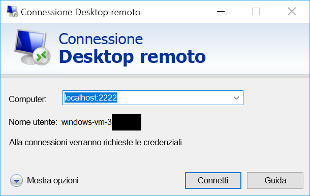

# <a name="quickstart-sshrdp-over-iot-hub-device-streams-using-nodejs-proxy-application-preview"></a>Guida introduttiva: SSH/RDP su flussi dispositivo dell'hub IoT con un'applicazione proxy Node.js (anteprima)

[!INCLUDE [iot-hub-quickstarts-4-selector](../../includes/iot-hub-quickstarts-4-selector.md)]

L'hub IoT di Microsoft Azure supporta attualmente i flussi dispositivo come [funzionalità di anteprima](https://azure.microsoft.com/support/legal/preview-supplemental-terms/).

I [flussi dispositivo dell'hub IoT](./iot-hub-device-streams-overview.md) consentono alle applicazioni del servizio e del dispositivo di comunicare in modo sicuro e di facile integrazione con i firewall. Questa guida introduttiva descrive l'esecuzione di un'applicazione proxy Node.js in esecuzione sul lato servizio per consentire l'invio del traffico RDP e SSH al dispositivo tramite un flusso dispositivo. Per una panoramica della configurazione, vedere [qui](./iot-hub-device-streams-overview.md#local-proxy-sample-for-ssh-or-rdp). Durante l'anteprima pubblica, l'SDK Node.js supporta solo i flussi dispositivo sul lato servizio. Di conseguenza, questa guida introduttiva illustra solo le istruzioni per eseguire il proxy locale del servizio. È consigliabile eseguire un proxy locale del dispositivo associato disponibile nella [guida introduttiva per C](./quickstart-device-streams-proxy-c.md) o nella [guida introduttiva per C#](./quickstart-device-streams-proxy-csharp.md).

Per prima cosa viene descritta la configurazione per SSH (con la porta 22). Verrà quindi illustrato come modificare la configurazione per RDP (che usa la porta 3389). Poiché i flussi dispositivo sono indipendenti dalle applicazioni e dai protocolli, lo stesso esempio può essere modificato e adattato ad altri tipi di traffico delle applicazioni, modificando in genere la porta di comunicazione.

[!INCLUDE [cloud-shell-try-it.md](../../includes/cloud-shell-try-it.md)]

Se non si ha una sottoscrizione di Azure, creare un [account gratuito](https://azure.microsoft.com/free/?WT.mc_id=A261C142F) prima di iniziare.

## <a name="prerequisites"></a>Prerequisiti

L'anteprima dei flussi dispositivo è attualmente supportata solo per gli hub IoT creati nelle aree seguenti:

  - **Stati Uniti centrali**
  - **Stati Uniti centrali EUAP**

Per eseguire l'applicazione locale del servizio in questa guida introduttiva, è necessario Node.js versione 4.x.x o versione successiva nel computer di sviluppo.

È possibile scaricare Node.js per più piattaforme da [nodejs.org](https://nodejs.org).

È possibile verificare la versione corrente di Node.js installata nel computer di sviluppo tramite il comando seguente:

```
node --version
```

Eseguire il comando seguente per aggiungere l'estensione Microsoft Azure IoT per l'interfaccia della riga di comando di Azure all'istanza di Cloud Shell. L'estensione IoT aggiunge i comandi specifici di hub IoT, IoT Edge e servizio Device Provisioning in hub IoT all'interfaccia della riga di comando di Azure.

```azurecli-interactive
az extension add --name azure-cli-iot-ext
```

Se non è già stato fatto, scaricare il progetto Node.js di esempio da https://github.com/Azure-Samples/azure-iot-samples-node/archive/streams-preview.zip ed estrarre l'archivio ZIP.

## <a name="create-an-iot-hub"></a>Creare un hub IoT

Se è stata completata la precedente [Guida introduttiva: Inviare dati di telemetria da un dispositivo a un hub IoT](quickstart-send-telemetry-node.md), è possibile ignorare questo passaggio.

[!INCLUDE [iot-hub-include-create-hub](../../includes/iot-hub-include-create-hub-device-streams.md)]

## <a name="register-a-device"></a>Registrare un dispositivo

Se è stata completata la precedente [Guida introduttiva: Inviare dati di telemetria da un dispositivo a un hub IoT](quickstart-send-telemetry-node.md), è possibile ignorare questo passaggio.

È necessario registrare un dispositivo con l'hub IoT perché questo possa connettersi. In questa guida introduttiva si usa Azure Cloud Shell per registrare un dispositivo simulato.

1. Eseguire il comando seguente in Azure Cloud Shell per creare l'identità del dispositivo.

   **YourIoTHubName**: sostituire il segnaposto in basso con il nome scelto per l'hub IoT.

   **MyDevice**: nome specificato per il dispositivo registrato. Usare MyDevice come illustrato. Se si sceglie un altro nome per il dispositivo, sarà necessario usare tale nome nell'ambito di questo articolo e aggiornare il nome del dispositivo nelle applicazioni di esempio prima di eseguirle.

    ```azurecli-interactive
    az iot hub device-identity create --hub-name YourIoTHubName --device-id MyDevice
    ```

2. È necessaria anche una _stringa di connessione del servizio_ per consentire all'applicazione back-end di connettersi all'hub IoT dell'utente e recuperare i messaggi. Il comando seguente recupera la stringa di connessione del servizio per l'hub IoT:

    **YourIoTHubName**: sostituire il segnaposto in basso con il nome scelto per l'hub IoT.

    ```azurecli-interactive
    az iot hub show-connection-string --policy-name service --name YourIoTHubName
    ```

    Prendere nota del valore restituito che sarà simile a quello seguente:

   `"HostName={YourIoTHubName}.azure-devices.net;SharedAccessKeyName=service;SharedAccessKey={YourSharedAccessKey}"`

## <a name="ssh-to-a-device-via-device-streams"></a>Connessione SSH a un dispositivo tramite i flussi dispositivo

### <a name="run-the-device-local-proxy"></a>Eseguire il proxy locale del dispositivo

Come indicato in precedenza, l'SDK Node.js dell'hub IoT supporta solo i flussi dispositivo sul lato servizio. Per l'applicazione locale del dispositivo usare i programmi proxy del dispositivo associati disponibili nella [guida introduttiva per C](./quickstart-device-streams-proxy-c.md) o nella [guida introduttiva per C#](./quickstart-device-streams-proxy-csharp.md). Prima di procedere al passaggio successivo verificare che il proxy locale del dispositivo sia in esecuzione.

### <a name="run-the-service-local-proxy"></a>Eseguire il proxy locale del servizio

Supponendo che il [proxy locale del dispositivo](#run-the-device-local-proxy) sia in esecuzione, attenersi alla procedura seguente per eseguire il proxy locale del servizio scritto in Node.js.

- Fornire le credenziali del servizio, l'ID dispositivo di destinazione in cui viene eseguito il daemon SSH e il numero di porta per il proxy in esecuzione nel dispositivo come variabili di ambiente.
  ```
  # In Linux
  export IOTHUB_CONNECTION_STRING="<provide_your_service_connection_string>"
  export STREAMING_TARGET_DEVICE="MyDevice"
  export PROXY_PORT=2222

  # In Windows
  SET IOTHUB_CONNECTION_STRING=<provide_your_service_connection_string>
  SET STREAMING_TARGET_DEVICE=MyDevice
  SET PROXY_PORT=2222
  ```
  Modificare i valori indicati in precedenza in modo che l'ID dispositivo corrisponda alla stringa di connessione.

- Passare a `Quickstarts/device-streams-service` nella cartella del progetto decompressa ed eseguire il proxy locale del servizio.
  ```
  cd azure-iot-samples-node-streams-preview/iot-hub/Quickstarts/device-streams-service

  # Install the preview service SDK, and other dependencies
  npm install azure-iothub@streams-preview
  npm install

  # Run the service-local proxy application
  node proxy.js
  ```

### <a name="ssh-to-your-device-via-device-streams"></a>Connessione SSH a un dispositivo tramite i flussi dispositivo

In Linux eseguire SSH usando `ssh $USER@localhost -p 2222` in un terminale. In Windows usare il client SSH preferito, ad esempio PuTTY.

Output della console sul proxy locale del servizio dopo aver stabilito una sessione SSH (il proxy locale del servizio è in ascolto sulla porta 2222): 

Output della console del programma client SSH (il client SSH comunica con il daemon SSH tramite la connessione alla porta 22 dove è in ascolto il proxy locale del servizio): 

### <a name="rdp-to-your-device-via-device-streams"></a>Connessione RDP a un dispositivo tramite i flussi dispositivo

Usare ora il programma client RDP e connettersi al proxy del servizio sulla porta 2222 (una porta arbitraria disponibile scelta in precedenza).

> [!NOTE]
> Assicurarsi che il proxy del dispositivo sia configurato correttamente per RDP e che sia configurato con la porta RDP 3389.



## <a name="clean-up-resources"></a>Pulire le risorse

[!INCLUDE [iot-hub-quickstarts-clean-up-resources](../../includes/iot-hub-quickstarts-clean-up-resources-device-streams.md)]

## <a name="next-steps"></a>Passaggi successivi

In questa guida introduttiva è stato configurato un hub IoT, è stato registrato un dispositivo ed è stato distribuito un programma proxy del servizio per abilitare RDP e SSH in un dispositivo IoT. Il traffico RDP e SSH viene forzato mediante il tunnel attraverso un flusso dispositivo tramite l'hub IoT. In questo modo si elimina la necessità della connettività diretta al dispositivo.

Consultare i collegamenti seguenti per altre informazioni sui flussi dispositivo:

> [!div class="nextstepaction"]
> [Panoramica dei flussi dispositivo](./iot-hub-device-streams-overview.md)
