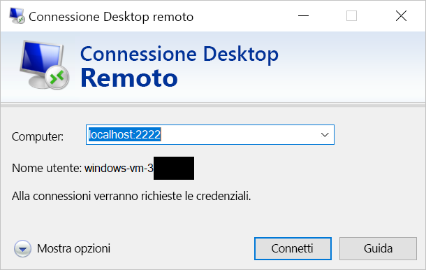

# <a name="quickstart-enable-ssh-and-rdp-over-an-iot-hub-device-stream-by-using-a-nodejs-proxy-application-preview"></a>Avvio rapido: Abilitare SSH e RDP su un flusso del dispositivo dell'hub IoT con un'applicazione proxy Node.js (anteprima)

[!INCLUDE [iot-hub-quickstarts-4-selector](../../includes/iot-hub-quickstarts-4-selector.md)]

L'hub IoT di Microsoft Azure supporta attualmente i flussi dispositivo come [funzionalità in anteprima](https://azure.microsoft.com/support/legal/preview-supplemental-terms/).

I [flussi dispositivo dell'hub IoT](./iot-hub-device-streams-overview.md) consentono alle applicazioni del servizio e del dispositivo di comunicare in modo sicuro e di facile integrazione con i firewall. 

Questo argomento di avvio rapido descrive l'esecuzione di un'applicazione proxy Node.js sul lato servizio per consentire l'invio del traffico SSH (Secure Shell) e RDP (Remote Desktop Protocol) al dispositivo tramite un flusso del dispositivo. Per una panoramica della configurazione, vedere l'[esempio di proxy locale](./iot-hub-device-streams-overview.md#local-proxy-sample-for-ssh-or-rdp). 

Durante l'anteprima pubblica, l'SDK Node.js supporta solo i flussi del dispositivo sul lato servizio. Di conseguenza, questo argomento di avvio rapido include le istruzioni per eseguire solo l'applicazione proxy locale del servizio. Per eseguire l'applicazione proxy locale del dispositivo, vedere:  

   * [Abilitare SSH e RDP su flussi del dispositivo dell'hub IoT con un'applicazione proxy C](./quickstart-device-streams-proxy-c.md)
   * [Abilitare SSH e RDP su flussi del dispositivo dell'hub IoT con un'applicazione proxy C#](./quickstart-device-streams-proxy-csharp.md)

Questo articolo descrive la configurazione per SSH (tramite la porta 22) e quindi illustra come modificarla per RDP (tramite la porta 3389). Poiché i flussi del dispositivo sono indipendenti da applicazioni e protocolli, lo stesso esempio può essere modificato e adattato ad altri tipi di traffico delle applicazioni client-server, in genere modificando la porta di comunicazione.

[!INCLUDE [cloud-shell-try-it.md](../../includes/cloud-shell-try-it.md)]

Se non si ha una sottoscrizione di Azure, creare un [account gratuito](https://azure.microsoft.com/free/?WT.mc_id=A261C142F) prima di iniziare.

## <a name="prerequisites"></a>Prerequisiti

* L'anteprima dei flussi del dispositivo è attualmente supportata solo per gli hub IoT creati nelle aree seguenti:

  * Stati Uniti centrali
  * Stati Uniti centrali EUAP

* Per eseguire l'applicazione locale del servizio in questo argomento di avvio rapido, è necessario avere Node.js v10.x.x o versione successiva nel computer di sviluppo.
  * Scaricare [Node.js](https://nodejs.org) per più piattaforme.
  * Verificare la versione corrente di Node.js installata nel computer di sviluppo tramite il comando seguente:

   ```
   node --version
   ```

* Aggiungere l'estensione Azure IoT per l'interfaccia della riga di comando di Azure all'istanza di Cloud Shell eseguendo il comando seguente. L'estensione IoT aggiunge i comandi specifici di hub IoT, IoT Edge e servizio Device Provisioning in hub IoT all'interfaccia della riga di comando di Azure.

    ```azurecli-interactive
    az extension add --name azure-cli-iot-ext
    ```

* Se non è già stato fatto, [scaricare il progetto Node.js di esempio](https://github.com/Azure-Samples/azure-iot-samples-node/archive/streams-preview.zip) ed estrarre l'archivio ZIP.

## <a name="create-an-iot-hub"></a>Creare un hub IoT

Se è stata completata la precedente [Guida introduttiva: Inviare dati di telemetria da un dispositivo a un hub IoT](quickstart-send-telemetry-node.md), è possibile ignorare questo passaggio.

[!INCLUDE [iot-hub-include-create-hub-device-streams](../../includes/iot-hub-include-create-hub-device-streams.md)]

## <a name="register-a-device"></a>Registrare un dispositivo

Se è stata completato l'argomento [Avvio rapido: Inviare dati di telemetria da un dispositivo a un hub IoT](quickstart-send-telemetry-node.md), è possibile ignorare questo passaggio.

È necessario registrare un dispositivo con l'hub IoT perché questo possa connettersi. In questa sezione si usa Azure Cloud Shell per registrare un dispositivo simulato.

1. Per creare l'identità del dispositivo, eseguire il comando seguente in Cloud Shell:

   > [!NOTE]
   > * Sostituire il segnaposto *YourIoTHubName* con il nome scelto per l'hub IoT.
   > * Usare *MyDevice* come illustrato. Si tratta del nome specificato per il dispositivo registrato. Se si sceglie un altro nome per il dispositivo, sarà necessario usarlo nell'intero articolo e aggiornarlo nelle applicazioni di esempio prima di eseguirle.

    ```azurecli-interactive
    az iot hub device-identity create --hub-name YourIoTHubName --device-id MyDevice
    ```

1. Per consentire all'applicazione back-end di connettersi all'hub IoT e recuperare i messaggi, è necessaria anche una *stringa di connessione del servizio*. Il comando seguente recupera la stringa per l'hub IoT:

   > [!NOTE]
   > Sostituire il segnaposto *YourIoTHubName* con il nome scelto per l'hub IoT.

    ```azurecli-interactive
    az iot hub show-connection-string --policy-name service --name YourIoTHubName
    ```

    Prendere nota del valore restituirlo per usarlo in seguito nella guida. Sarà simile a quanto indicato nell'esempio seguente:

   `"HostName={YourIoTHubName}.azure-devices.net;SharedAccessKeyName=service;SharedAccessKey={YourSharedAccessKey}"`

## <a name="ssh-to-a-device-via-device-streams"></a>Connessione SSH a un dispositivo tramite i flussi dispositivo

In questa sezione si stabilisce un flusso end-to-end per il tunneling del traffico SSH.

### <a name="run-the-device-local-proxy-application"></a>Eseguire l'applicazione proxy locale del dispositivo

Come indicato in precedenza, l'SDK Node.js dell'hub IoT supporta solo i flussi del dispositivo sul lato servizio. Per l'applicazione locale del dispositivo, usare un'applicazione proxy del dispositivo disponibile in uno degli argomenti di avvio rapido seguenti:

   * [Abilitare SSH e RDP su flussi del dispositivo dell'hub IoT con un'applicazione proxy C](./quickstart-device-streams-proxy-c.md)
   * [Abilitare SSH e RDP su flussi del dispositivo dell'hub IoT con un'applicazione proxy C#](./quickstart-device-streams-proxy-csharp.md) 

Prima di procedere con il passaggio successivo, assicurarsi che l'applicazione proxy locale del dispositivo sia in esecuzione.

### <a name="run-the-service-local-proxy-application"></a>Eseguire l'applicazione proxy locale del servizio

Con l'applicazione proxy locale del dispositivo in esecuzione, procedere come segue per eseguire l'applicazione proxy locale del servizio scritta in Node.js:

1. Per le variabili di ambiente, fornire le credenziali del servizio, l'ID del dispositivo di destinazione in cui viene eseguito il daemon SSH e il numero di porta per il proxy in esecuzione nel dispositivo.

   ```
   # In Linux
   export IOTHUB_CONNECTION_STRING="<provide_your_service_connection_string>"
   export STREAMING_TARGET_DEVICE="MyDevice"
   export PROXY_PORT=2222

   # In Windows
   SET IOTHUB_CONNECTION_STRING=<provide_your_service_connection_string>
   SET STREAMING_TARGET_DEVICE=MyDevice
   SET PROXY_PORT=2222
   ```

   Cambiare i valori indicati in precedenza in modo che l'ID dispositivo corrisponda alla stringa di connessione.

1. Passare alla directory *Quickstarts/device-streams-service* nella cartella del progetto non compresso ed eseguire l'applicazione proxy locale del servizio.

   ```
   cd azure-iot-samples-node-streams-preview/iot-hub/Quickstarts/device-streams-service

   # Install the preview service SDK, and other dependencies
   npm install azure-iothub@streams-preview
   npm install

   # Run the service-local proxy application
   node proxy.js
   ```

### <a name="ssh-to-your-device-via-device-streams"></a>Connessione SSH a un dispositivo tramite i flussi dispositivo

In Linux eseguire SSH usando `ssh $USER@localhost -p 2222` in un terminale. In Windows usare il client SSH preferito, ad esempio PuTTY.

Output della console nell'applicazione proxy locale del servizio dopo aver stabilito una sessione SSH (l'applicazione proxy locale del servizio è in ascolto sulla porta 2222):


Output della console dell'applicazione client SSH (il client SSH comunica con il daemon SSH tramite la connessione alla porta 22, su cui è in ascolto l'applicazione proxy locale del servizio):


### <a name="rdp-to-your-device-via-device-streams"></a>Connessione RDP a un dispositivo tramite i flussi dispositivo

Usare ora l'applicazione client RDP e connettersi al proxy del servizio sulla porta 2222 (una porta arbitraria scelta in precedenza).

> [!NOTE]
> Assicurarsi che il proxy del dispositivo sia configurato correttamente per RDP e che sia configurato con la porta RDP 3389.



## <a name="clean-up-resources"></a>Pulire le risorse

[!INCLUDE [iot-hub-quickstarts-clean-up-resources](../../includes/iot-hub-quickstarts-clean-up-resources-device-streams.md)]

## <a name="next-steps"></a>Passaggi successivi

In questo argomento di avvio rapido è stato configurato un hub IoT, è stato registrato un dispositivo ed è stata distribuita un'applicazione proxy del servizio per abilitare RDP e SSH in un dispositivo IoT. Il traffico RDP e SSH viene sottoposto a tunneling attraverso un flusso del dispositivo tramite l'hub IoT. In questo modo si elimina la necessità della connettività diretta al dispositivo.

Per altre informazioni sui flussi del dispositivo, vedere:

> [!div class="nextstepaction"]
> [Panoramica dei flussi dispositivo](./iot-hub-device-streams-overview.md)
