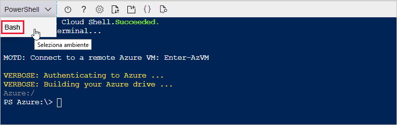
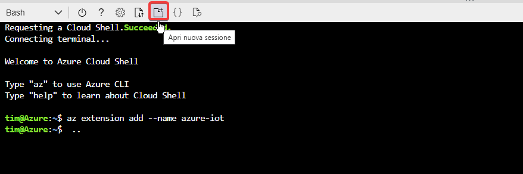
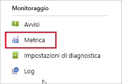
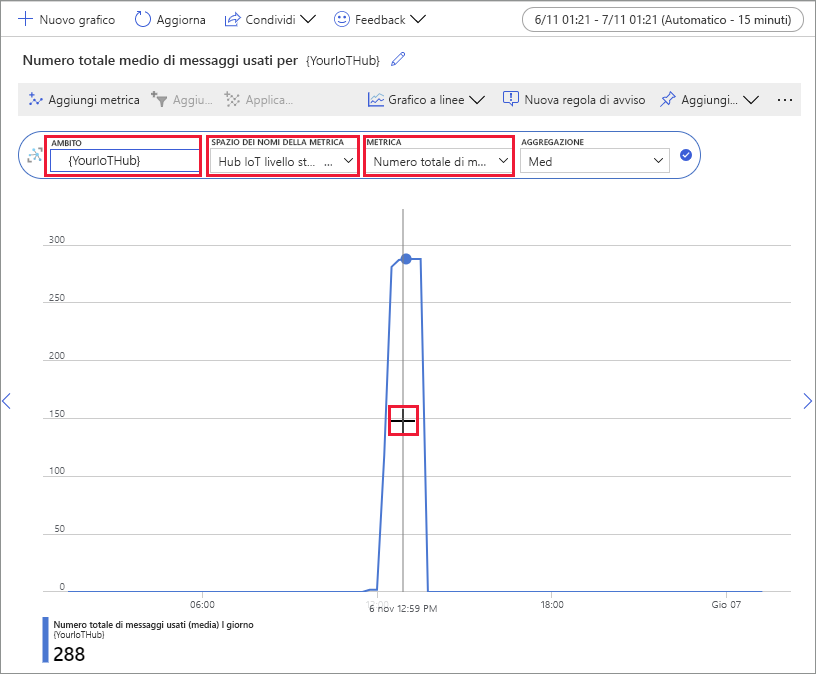

# <a name="quickstart-send-telemetry-from-a-device-to-an-iot-hub-and-monitor-it-with-the-azure-cli"></a>Guida introduttiva: Inviare dati di telemetria da un dispositivo a un hub IoT e monitorarli con l'interfaccia della riga di comando di Azure

[!INCLUDE [iot-hub-quickstarts-1-selector](../../includes/iot-hub-quickstarts-1-selector.md)]

L'hub IoT è un servizio di Azure che consente di acquisire volumi elevati di dati di telemetria dai dispositivi IoT nel cloud per l'archiviazione o l'elaborazione. In questa Guida introduttiva viene usata l'interfaccia della riga di comando di Azure per creare un hub e un dispositivo simulato, inviare i dati di telemetria del dispositivo all'hub e inviare un messaggio dal cloud al dispositivo. È anche possibile usare il portale di Azure per visualizzare le metriche del dispositivo. Si tratta di un flusso di lavoro di base per gli sviluppatori che usano l'interfaccia della riga di comando per interagire con un'applicazione hub IoT.

## <a name="prerequisites"></a>Prerequisiti
- Se non si dispone di sottoscrizione di Azure, [crearne una gratuitamente](https://azure.microsoft.com/free/?WT.mc_id=A261C142F) prima di iniziare.
- Interfaccia della riga di comando di Azure. È possibile eseguire tutti i comandi in questa Guida introduttiva in Azure Cloud Shell, una shell interattiva dell'interfaccia della riga di comando eseguita nel browser. Se si usa Cloud Shell, non è necessario installare alcun componente. Se si preferisce installare e usare l'interfaccia della riga di comando in locale, per questa Guida introduttiva è necessaria l'interfaccia della riga di comando di Azure versione 2.0.76 o successiva. Eseguire az --version per trovare la versione. Per installare o eseguire l'aggiornamento, vedere [Installare l'interfaccia della riga di comando di Azure]( /cli/azure/install-azure-cli).

## <a name="sign-in-to-the-azure-portal"></a>Accedere al portale di Azure
Accedere al portale di Azure all'indirizzo https://portal.azure.com.

Indipendentemente dal fatto che l'interfaccia della riga di comando venga eseguita localmente o in Cloud Shell, tenere aperto il portale nel browser  perché verrà usato in seguito.

## <a name="launch-the-cloud-shell"></a>Avviare Cloud Shell
In questa sezione viene avviata un'istanza di Azure Cloud Shell. Se si usa l'interfaccia della riga di comando in locale, passare alla sezione [Preparare due sessioni dell'interfaccia della riga di comando](#prepare-two-cli-sessions).

Per avviare Cloud Shell:
1. Selezionare il pulsante **Cloud Shell** nella barra dei menu in alto a destra nel portale di Azure. 

    

    > [!NOTE]
    > Se è la prima volta che si usa Cloud Shell, viene richiesto di creare una risorsa di archiviazione necessaria per usare Cloud Shell.  Selezionare una sottoscrizione per creare un account di archiviazione e una condivisione File di Microsoft Azure. 

1. Selezionare l'ambiente dell'interfaccia della riga di comando preferito nell'elenco a discesa **Seleziona ambiente**. In questa Guida introduttiva viene usato l'ambiente **Bash**. Tutti i comandi dell'interfaccia della riga di comando seguenti funzionano anche nell'ambiente PowerShell. 

    

## <a name="prepare-two-cli-sessions"></a>Preparare due sessioni dell'interfaccia della riga di comando
In questa sezione vengono preparate due sessioni dell'interfaccia della riga di comando di Azure. Se si usa Cloud Shell, le due sessioni vengono eseguite in schede separate del browser. Se si usa un client dell'interfaccia della riga di comando locale, vengono eseguite due istanze dell'interfaccia separate. La prima sessione viene usata come dispositivo simulato, mentre la seconda viene usata per il monitoraggio e l'invio di messaggi. Per eseguire un comando, selezionare **Copia** per copiare un blocco di codice in questa Guida introduttiva, incollarlo nella sessione della shell e quindi eseguirlo.

L'interfaccia della riga di comando di Azure richiede l'accesso all'account Azure. Tutte le comunicazioni tra la sessione della shell dell'interfaccia della riga di comando di Azure e l'hub IoT vengono autenticate e crittografate. Di conseguenza, in questa Guida introduttiva non è richiesta alcuna autenticazione aggiuntiva, ad esempio una stringa di connessione, da usare con un dispositivo reale.

1. Eseguire il comando [az extension add](https://docs.microsoft.com/cli/azure/extension?view=azure-cli-latest#az-extension-add) per aggiungere l'estensione Microsoft Azure IoT per l'interfaccia della riga di comando di Azure alla shell in uso. L'estensione IoT aggiunge i comandi specifici di hub IoT, IoT Edge e servizio Device Provisioning in hub IoT all'interfaccia della riga di comando di Azure.

   ```azurecli
   az extension add --name azure-cli-iot-ext
   ```
    Dopo aver installato l'estensione Azure IoT, non è necessario installarla nuovamente in alcuna sessione di Cloud Shell. 

1. Aprire una seconda sessione dell'interfaccia della riga di comando.  Se si usa Cloud Shell, selezionare **Apri nuova sessione**. Se si usa l'interfaccia della riga di comando in locale, aprire una seconda istanza. 

    

## <a name="create-an-iot-hub"></a>Creare un hub IoT
In questa sezione viene usata l'interfaccia della riga di comando di Azure per creare un gruppo di risorse e un hub IoT.  Un gruppo di risorse di Azure è un contenitore logico in cui le risorse di Azure vengono distribuite e gestite. Un hub IoT funge da hub centrale dei messaggi per la comunicazione bidirezionale tra l'applicazione IoT e i dispositivi. 

> [!TIP]
> Facoltativamente, è possibile creare un gruppo di risorse di Azure, un hub IoT e altre risorse usando il [portale di Azure](iot-hub-create-through-portal.md), [Visual Studio Code](iot-hub-create-use-iot-toolkit.md) o altri metodi programmatici.  

1. Eseguire il comando [az group create](https://docs.microsoft.com/cli/azure/group?view=azure-cli-latest#az-group-create) per creare un gruppo di risorse. Il comando seguente crea un gruppo denominato *MyResourceGroup* nella posizione *eastus*. 

    ```azurecli
    az group create --name MyResourceGroup --location eastus
    ```

1. Eseguire il comando [az iot hub create](https://docs.microsoft.com/cli/azure/iot/hub?view=azure-cli-latest#az-iot-hub-create) per creare un hub IoT. La creazione di un hub IoT potrebbe richiedere alcuni minuti. 

    *YourIotHubName*. Sostituire il segnaposto con il nome scelto per l'hub IoT. Un nome dell'hub IoT deve essere univoco a livello globale in Azure. Tale segnaposto viene usato nella parte restante di questa Guida introduttiva per rappresentare il nome dell'hub IoT.

    ```azurecli
    az iot hub create --resource-group MyResourceGroup --name {YourIoTHubName}
    ```

## <a name="create-and-monitor-a-device"></a>Creare e monitorare un dispositivo
In questa sezione viene creato un dispositivo simulato nella prima sessione dell'interfaccia della riga di comando. Il dispositivo simulato invia i dati di telemetria del dispositivo all'hub IoT. Nella seconda sessione dell'interfaccia della riga di comando vengono monitorati eventi e dati di telemetria e viene inviato un messaggio dal cloud al dispositivo simulato.

Per creare e avviare un dispositivo simulato:
1. Eseguire il comando [az iot hub device-identity create](https://docs.microsoft.com/cli/azure/ext/azure-cli-iot-ext/iot/hub/device-identity?view=azure-cli-latest#ext-azure-cli-iot-ext-az-iot-hub-device-identity-create) nella prima sessione dell'interfaccia della riga di comando. Verrà creata l'identità del dispositivo simulato. 

    *YourIotHubName*. Sostituire il segnaposto con il nome scelto per l'hub IoT. 

    *simDevice*. È possibile usare questo nome direttamente per il dispositivo simulato nella parte restante di questa Guida introduttiva. Facoltativamente, usare un nome diverso. 

    ```azurecli
    az iot hub device-identity create --device-id simDevice --hub-name {YourIoTHubName} 
    ```

1. Eseguire il comando [az iot device simulate](https://docs.microsoft.com/cli/azure/ext/azure-cli-iot-ext/iot/device?view=azure-cli-latest#ext-azure-cli-iot-ext-az-iot-device-simulate) nella prima sessione dell'interfaccia della riga di comando.  Verrà avviato il dispositivo simulato. Il dispositivo invia i dati di telemetria all'hub IoT e riceve i messaggi da quest'ultimo.  

    *YourIotHubName*. Sostituire il segnaposto con il nome scelto per l'hub IoT. 

    ```azurecli
    az iot device simulate -d simDevice -n {YourIoTHubName}
    ```

Per monitorare un dispositivo:
1. Nella seconda sessione dell'interfaccia della riga di comando eseguire il comando [az iot hub monitor-events](https://docs.microsoft.com/cli/azure/ext/azure-cli-iot-ext/iot/hub?view=azure-cli-latest#ext-azure-cli-iot-ext-az-iot-hub-monitor-events). Verrà avviato il monitoraggio del dispositivo simulato. L'output mostra i dati di telemetria che il dispositivo simulato invia all'hub IoT.

    *YourIotHubName*. Sostituire il segnaposto con il nome scelto per l'hub IoT. 

    ```azurecli
    az iot hub monitor-events --output table --hub-name {YourIoTHubName}
    ```

    

1. Dopo aver monitorato il dispositivo simulato nella seconda sessione dell'interfaccia della riga di comando, premere CTRL+C per interrompere il monitoraggio. 

## <a name="use-the-cli-to-send-a-message"></a>Usare l'interfaccia della riga di comando per inviare un messaggio
In questa sezione viene usata la seconda sessione dell'interfaccia della riga di comando per inviare un messaggio al dispositivo simulato.

1. Nella prima sessione dell'interfaccia della riga di comando verificare che il dispositivo simulato sia in esecuzione. Se il dispositivo è stato arrestato, eseguire questo comando seguente per avviarlo:

    *YourIotHubName*. Sostituire il segnaposto con il nome scelto per l'hub IoT. 

    ```azurecli
    az iot device simulate -d simDevice -n {YourIoTHubName}
    ```

1. Nella seconda sessione dell'interfaccia della riga di comando, eseguire il comando [az iot device c2d-message send](https://docs.microsoft.com/cli/azure/ext/azure-cli-iot-ext/iot/device/c2d-message?view=azure-cli-latest#ext-azure-cli-iot-ext-az-iot-device-c2d-message-send). Viene inviato un messaggio da cloud a dispositivo dall'hub IoT al dispositivo simulato. Il messaggio include una stringa e due coppie chiave-valore.  

    *YourIotHubName*. Sostituire il segnaposto con il nome scelto per l'hub IoT. 

    ```azurecli
    az iot device c2d-message send -d simDevice --data "Hello World" --props "key0=value0;key1=value1" -n {YourIoTHubName}
    ```
    Facoltativamente, è possibile inviare messaggi da cloud a dispositivo usando il portale di Azure. A tale scopo, passare alla pagina di panoramica per l'hub IoT, selezionare **Dispositivi IoT**, selezionare il dispositivo simulato e quindi **Messaggio per il dispositivo**. 

1. Nella prima sessione dell'interfaccia della riga di comando verificare che il dispositivo simulato abbia ricevuto il messaggio. 

    

1. Dopo aver visualizzato il messaggio, chiudere la seconda sessione dell'interfaccia della riga di comando. Mantenere aperta la prima sessione dell'interfaccia della riga di comando che verrà usata per pulire le risorse in un passaggio successivo.

## <a name="view-messaging-metrics-in-the-portal"></a>Visualizzare le metriche di messaggistica nel portale
Il portale di Azure consente di gestire tutti gli aspetti dell'hub IoT e dei dispositivi. In una tipica applicazione dell'hub IoT che inserisce i dati di telemetria dai dispositivi, potrebbe essere necessario monitorare i dispositivi o visualizzare le metriche sui dati di telemetria dei dispositivi stessi. 

Per visualizzare le metriche di messaggistica nel portale di Azure:
1. Nel menu di spostamento a sinistra nel portale selezionare **Tutte le risorse**. Vengono elencate tutte le risorse nella sottoscrizione, incluso l'hub IoT creato. 

1. Selezionare il collegamento nell'hub IoT creato. Nel portale viene visualizzata la pagina di panoramica relativa all'hub.

1. Selezionare **Metriche** nel riquadro sinistro dell'hub IoT. 

    

1. Immettere il nome dell'hub IoT in **Ambito**.

2. Selezionare *Iot Hub Standard Metrics* (Metriche standard hub IoT) in **Spazio dei nomi della metrica**.

3. Selezionare *Numero totale di messaggi usati* in **Metriche**. 

4. Posizionare il puntatore del mouse sull'area della sequenza temporale in cui il dispositivo ha inviato i messaggi. Il numero totale di messaggi in un momento specifico viene visualizzato nell'angolo inferiore sinistro della sequenza temporale.

    

5. Facoltativamente, usare l'elenco a discesa **Metriche** per visualizzare altre metriche sul dispositivo simulato, ad esempio i *recapiti di messaggi da cloud a dispositivo completati* o i *dispositivi totali (anteprima)* . 

## <a name="clean-up-resources"></a>Pulire le risorse
Se le risorse di Azure create in questa Guida introduttiva non sono più necessarie, è possibile usare l'interfaccia della riga di comando di Azure per eliminarle.

Se si continua con il prossimo articolo consigliato, è possibile conservare le risorse già create e usarle di nuovo. 

> [!IMPORTANT]
> L'eliminazione di un gruppo di risorse è irreversibile. Il gruppo di risorse e tutte le risorse in esso contenute vengono eliminati in modo permanente. Assicurarsi di non eliminare accidentalmente il gruppo di risorse sbagliato o le risorse errate. 

Per eliminare un gruppo di risorse per nome:
1. Eseguire il comando [az group delete](https://docs.microsoft.com/cli/azure/group?view=azure-cli-latest#az-group-delete). In questo modo vengono rimossi il gruppo di risorse, l'hub IoT e la registrazione del dispositivo creato.

    ```azurecli
    az group delete --name MyResourceGroup
    ```
1. Eseguire il comando [az group list](https://docs.microsoft.com/cli/azure/group?view=azure-cli-latest#az-group-list) per verificare che il gruppo di risorse sia stato eliminato.  

    ```azurecli
    az group list
    ```

## <a name="next-steps"></a>Passaggi successivi
In questa Guida introduttiva è stata usata l'interfaccia della riga di comando di Azure per creare un hub IoT, creare un dispositivo simulato, inviare e monitorare dati di telemetria, inviare un messaggio da cloud a dispositivo ed eliminare le risorse. È stato usato il portale di Azure per visualizzare le metriche di messaggistica sul dispositivo.

Per uno sviluppatore di dispositivi, il passaggio successivo suggerito consiste nel vedere la Guida introduttiva per i dati di telemetria che usa Azure IoT SDK per dispositivi per C. Facoltativamente, vedere uno degli articoli della Guida introduttiva ai dati di telemetria dell'hub IoT di Azure per la telemetria nel linguaggio preferito o nell'SDK.

> [!div class="nextstepaction"]
> [Guida introduttiva: Inviare dati di telemetria da un dispositivo a un hub IoT (C)](quickstart-send-telemetry-c.md)
