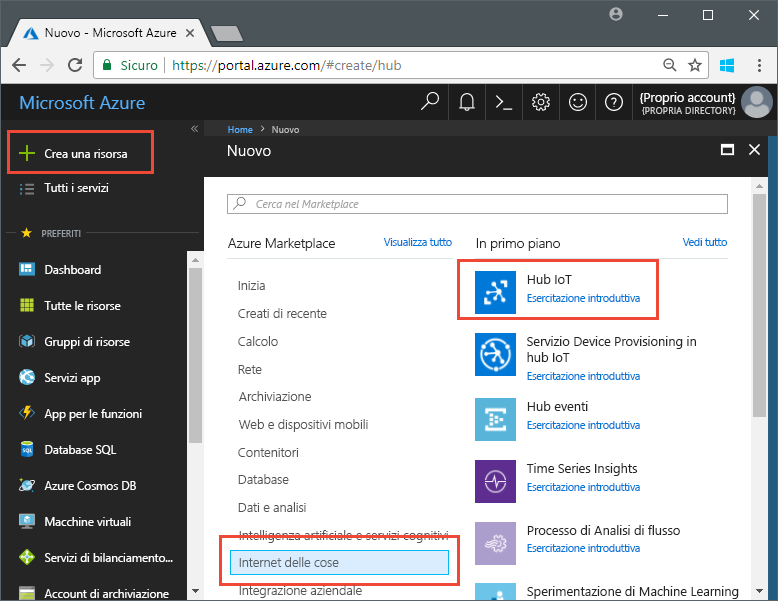
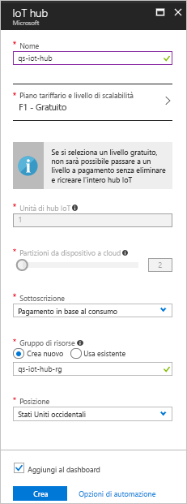
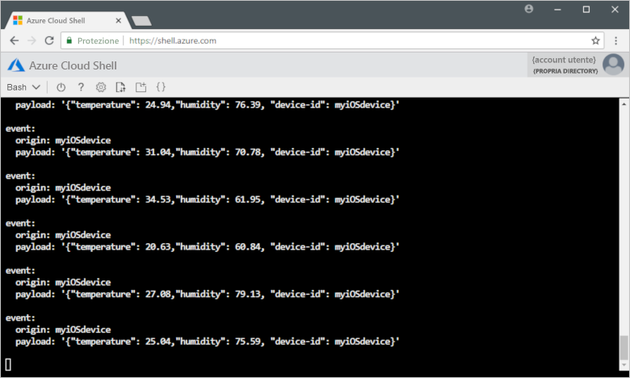

# <a name="send-telemetry-from-a-device-to-an-iot-hub-swift"></a>Inviare dati di telemetria da un dispositivo a un hub IoT (Swift)

L'hub IoT è un servizio di Azure che consente di acquisire volumi elevati di dati di telemetria dai dispositivi IoT nel cloud per l'archiviazione o l'elaborazione. In questo articolo si inviano dati di telemetria da un'applicazione di dispositivo simulato all'hub IoT. Sarà quindi possibile visualizzare i dati da un'applicazione back-end. 

In questo articolo si usa un'applicazione Swift già pronta per inviare i dati di telemetria e un'utilità da riga di comando per leggere i dati di telemetria dall'hub IoT. 

[!INCLUDE [cloud-shell-try-it.md](../../includes/cloud-shell-try-it.md)]

Se non si ha una sottoscrizione di Azure, creare un [account gratuito](https://azure.microsoft.com/free/?WT.mc_id=A261C142F) prima di iniziare.

## <a name="prerequisites"></a>prerequisiti

- L'esempio di codice scaricato da [esempi di Azure](https://github.com/Azure-Samples/azure-iot-samples-ios/archive/master.zip). 
- La versione più recente di [XCode](https://developer.apple.com/xcode/), che esegue la versione più recente di iOS SDK. Questa guida introduttiva è stata testata con XCode 9.3 e iOS 11.3.
- La versione più recente di [CocoaPods](https://guides.cocoapods.org/using/getting-started.html).
- L'utilità da riga di comando iothub-explorer, che legge i dati di telemetria dall'hub IoT. Per installarla, installare prima [Node.js](https://nodejs.org) versione 4.x.x o successiva e quindi eseguire il comando seguente: 

   ```sh
   sudo npm install -g iothub-explorer
   ```

## <a name="create-an-iot-hub"></a>Creare un hub IoT

Il primo passaggio consiste nell'usare il portale di Azure per creare un hub IoT nella propria sottoscrizione. L'hub IoT consente di acquisire volumi elevati di dati di telemetria nel cloud da molti dispositivi. L'hub abilita quindi la lettura ed elaborazione di tali dati da parte di uno o più servizi back-end in esecuzione nel cloud.

1. Accedere al [portale di Azure](http://portal.azure.com).

1. Selezionare **Crea una risorsa** > **Internet delle cose** > **Hub IoT**. 

   

1. Per creare l'hub IoT, usare i valori nella tabella seguente:

    | Impostazione | Valore |
    | ------- | ----- |
    | NOME | Un nome univoco per l'hub |
    | Piano tariffario e livello di scalabilità | F1 Gratuito |
    | Unità di hub IoT | 1 |
    | Partizioni da dispositivo a cloud | 2 partizioni |
    | Sottoscrizione | La sottoscrizione di Azure. |
    | Gruppo di risorse | Creare un nuovo gruppo di risorse e specificarne il nome. |
    | Località | La località più vicina. |
    | Aggiungi al dashboard | Sì |

1. Fare clic su **Crea**.  

   

1. Prendere nota dei nomi dell'hub IoT e del gruppo di risorse. Questi nomi verranno usati più avanti in questa guida introduttiva.

## <a name="register-a-device"></a>Registrare un dispositivo

È necessario registrare un dispositivo con l'hub IoT perché questo possa connettersi. In questa guida introduttiva si usa l'interfaccia della riga di comando di Azure per registrare un dispositivo simulato.

1. Aggiungere l'estensione della riga di comando dell'hub IoT CLI e creare l'identità del dispositivo. Sostituire `{YourIoTHubName}` con il nome dell'hub IoT:

   ```azurecli-interactive
   az extension add --name azure-cli-iot-ext
   az iot hub device-identity create --hub-name {YourIoTHubName} --device-id myiOSdevice
   ```

    Se si sceglie un nome diverso per il dispositivo, aggiornare il nome del dispositivo nelle applicazioni di esempio prima di eseguirlo.

1. Eseguire il comando seguente per ottenere la _stringa di connessione del dispositivo_ per il dispositivo appena registrato:

   ```azurecli-interactive
   az iot hub device-identity show-connection-string --hub-name {YourIoTHubName} --device-id myiOSdevice --output table
   ```

   Annotare la stringa di connessione del dispositivo, che avrà questo aspetto: `Hostname=...=`. Il valore verrà usato più avanti in questo articolo.

1. È inoltre necessaria una _stringa di connessione del servizio_ per consentire alle applicazioni back-end di connettersi all'hub IoT e recuperare i messaggi da dispositivo a cloud. Il comando seguente recupera la stringa di connessione del servizio per l'hub IoT:

   ```azurecli-interactive
   az iot hub show-connection-string --hub-name {YourIoTHubName} --output table
   ```

   Annotare la stringa di connessione del servizio, che avrà questo aspetto: `Hostname=...=`. Il valore verrà usato più avanti in questo articolo.

## <a name="send-simulated-telemetry"></a>Inviare dati di telemetria simulati

L'applicazione di esempio viene eseguita in un dispositivo iOS, che si connette a un endpoint specifico del dispositivo nell'hub IoT e invia dati di telemetria simulati di temperatura e umidità. 

### <a name="install-cocoapods"></a>Installare CocoaPods

CocoaPods gestisce le dipendenze per i progetti iOS che usano librerie di terze parti.

In una finestra del terminale passare alla cartella Azure-IoT-Samples-iOS scaricata nei prerequisiti. Passare quindi alla cartella del progetto di esempio:

```sh
cd quickstart/sample-device
```

Assicurarsi che XCode sia chiuso, quindi eseguire il comando seguente per installare i CocoaPods dichiarati nel file **podfile**:

```sh
pod install
```

Oltre a installare i pod necessari per il progetto, il comando di installazione crea anche un file di area di lavoro XCode già configurato per usare i pod per le dipendenze. 

### <a name="run-the-sample-application"></a>Eseguire l'applicazione di esempio 

1. Aprire l'area di lavoro di esempio in XCode.

   ```sh
   open "MQTT Client Sample.xcworkspace"
   ```

2. Espandere il progetto **MQTT Client Sample** e quindi espandere la cartella con lo stesso nome.  
3. Aprire **ViewController.swift** per la modifica in XCode. 
4. Cercare la variabile **connectionString** e aggiornarne il valore con la stringa di connessione del dispositivo annotata in precedenza.
5. Salvare le modifiche. 
6. Eseguire il progetto nell'emulatore di dispositivo con il pulsante **Compila ed esegui** o la combinazione di tasti **Comando + R**. 

   

7. Quando l'emulatore si apre, selezionare **Start** nell'app di esempio.

Nella schermata seguente sono mostrati alcuni esempi di output dei dati di telemetria simulati inviati dall'applicazione all'hub IoT:

   

## <a name="read-the-telemetry-from-your-hub"></a>Leggere i dati di telemetria dell'hub

L'app di esempio eseguita nell'emulatore XCode mostra i dati relativi ai messaggi inviati dal dispositivo. I dati possono inoltre essere visualizzati dall'hub IoT man mano che vengono ricevuti. L'utilità da riga di comando `iothub-explorer` si connette all'endpoint **Eventi** sul lato servizio dell'hub IoT. 

Aprire una nuova finestra del terminale. Eseguire il comando seguente, sostituendo {your hub service connection string} con la stringa di connessione del servizio recuperata all'inizio di questo articolo:

```sh
iothub-explorer monitor-events myiOSdevice --login "{your hub service connection string}"
```

La schermata seguente mostra il tipo di dati di telemetria visualizzati nella finestra del terminale:



Se si verifica un errore quando si esegue il comando iothub-explorer, accertarsi di usare la *stringa di connessione del servizio* per l'hub IoT e non la *stringa di connessione del dispositivo* per il dispositivo IoT. Entrambe le stringhe di connessione iniziano con **Hostname={iothubname}**, ma la stringa di connessione del servizio contiene la proprietà **SharedAccessKeyName**, mentre la stringa di connessione del dispositivo contiene **DeviceID**. 

## <a name="clean-up-resources"></a>Pulire le risorse

Se si prevede di continuare i test dell'hub IoT in altri articoli, lasciare il gruppo di risorse e l'hub IoT per l'uso successivo.

Se l'hub IoT non è più necessario, eliminarlo insieme al gruppo di risorse nel portale, selezionando il gruppo di risorse che contiene l'hub IoT e facendo clic su **Elimina**.

## <a name="next-steps"></a>Passaggi successivi

In questo articolo si è configurato un hub IoT e registrato un dispositivo, si sono inviati dati di telemetria simulati all'hub da un dispositivo iOS e si sono letti i dati di telemetria dall'hub. 

Per altre informazioni sull'uso di dispositivi iOS con l'hub IoT, vedere l'articolo sull'[invio di messaggi da cloud a dispositivo con iOS (Swift)](iot-hub-ios-swift-c2d.md).

<!-- Links -->
[lnk-process-d2c-tutorial]: iot-hub-csharp-csharp-process-d2c.md
[lnk-device-management]: iot-hub-node-node-device-management-get-started.md
[lnk-iot-edge]: ../iot-edge/tutorial-simulate-device-linux.md
[lnk-connect-device]: https://azure.microsoft.com/develop/iot/
