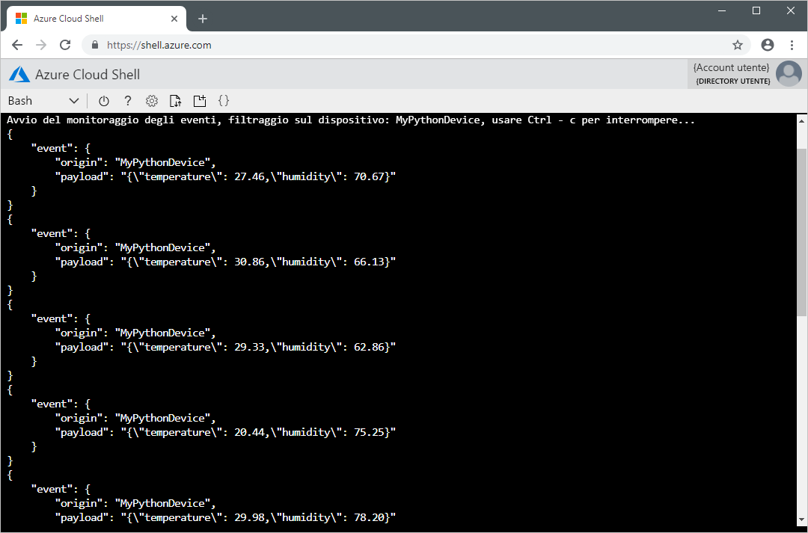

# <a name="quickstart-send-telemetry-from-a-device-to-an-iot-hub-and-read-it-with-a-back-end-application-python"></a>Guida introduttiva: Inviare dati di telemetria da un dispositivo a un hub IoT e leggere i dati con un'applicazione di back-end (Python)

[!INCLUDE [iot-hub-quickstarts-1-selector](../../includes/iot-hub-quickstarts-1-selector.md)]

L'hub IoT è un servizio di Azure che consente di acquisire volumi elevati di dati di telemetria dai dispositivi IoT nel cloud per l'archiviazione o l'elaborazione. In questa Guida rapida, si inviano dati di telemetria da un'applicazione del dispositivo simulato, tramite l'Hub IoT, a un'applicazione di back-end per l'elaborazione.

La guida introduttiva usa un'applicazione Python già pronta per inviare i dati di telemetria e un'utilità da riga di comando per leggere i dati di telemetria dall'hub. Prima di eseguire queste due applicazioni, creare un hub IoT e registrare un dispositivo con l'hub.

[!INCLUDE [cloud-shell-try-it.md](../../includes/cloud-shell-try-it.md)]

Se non si ha una sottoscrizione di Azure, creare un [account gratuito](https://azure.microsoft.com/free/?WT.mc_id=A261C142F) prima di iniziare.

## <a name="prerequisites"></a>Prerequisiti

L'applicazione di esempio eseguita in questa guida di avvio rapido è scritta in Python. Attualmente gli SDK di Microsoft Azure IoT per Python supportano solo versioni specifiche di Python per ogni piattaforma. Per altre informazioni, vedere il [file Leggimi di Python SDK](https://github.com/Azure/azure-iot-sdk-python#important-installation-notes---dealing-with-importerror-issues).

Questa guida di avvio rapido presuppone che si usi un computer di sviluppo Windows. Per i sistemi Windows è supportato solo [Python 3.6.x](https://www.python.org/downloads/release/python-368/). Il programma di installazione di Python scelto deve essere basato sull'architettura del sistema in uso. Se l'architettura della CPU di sistema è a 32 bit, scaricare il programma di installazione x86, mentre per l'architettura a 64 bit scaricare il programma di installazione x86-64. Assicurarsi inoltre che sia installato [Microsoft Visual C++ Redistributable per Visual Studio 2019](https://support.microsoft.com/en-us/help/2977003/the-latest-supported-visual-c-downloads) per l'architettura in uso (x86 o x64).

È possibile scaricare Python per altre piattaforme da [Python.org](https://www.python.org/downloads/).

È possibile verificare la versione corrente di Python installata nel computer di sviluppo tramite uno dei comandi seguenti:

```python
python --version
```

```python
python3 --version
```

Eseguire il comando seguente per aggiungere l'estensione Microsoft Azure IoT per l'interfaccia della riga di comando di Azure all'istanza di Cloud Shell. L'estensione IoT aggiunge i comandi specifici di hub IoT, IoT Edge e servizio Device Provisioning in hub IoT all'interfaccia della riga di comando di Azure.

```azurecli-interactive
az extension add --name azure-cli-iot-ext
```

Scaricare il progetto di esempio di Python da https://github.com/Azure-Samples/azure-iot-samples-python/archive/master.zip ed estrarre l'archivio ZIP.

## <a name="create-an-iot-hub"></a>Creare un hub IoT

[!INCLUDE [iot-hub-include-create-hub](../../includes/iot-hub-include-create-hub.md)]

## <a name="register-a-device"></a>Registrare un dispositivo

È necessario registrare un dispositivo con l'hub IoT perché questo possa connettersi. In questa guida introduttiva si usa Azure Cloud Shell per registrare un dispositivo simulato.

1. Eseguire il comando seguente in Azure Cloud Shell per creare l'identità del dispositivo.

    **YourIoTHubName**: sostituire il segnaposto in basso con il nome scelto per l'hub IoT.

    **MyPythonDevice**: nome specificato per il dispositivo registrato. Usare MyPythonDevice come illustrato. Se si sceglie un altro nome per il dispositivo, sarà necessario usare tale nome nell'ambito di questo articolo e aggiornare il nome del dispositivo nelle applicazioni di esempio prima di eseguirle.

    ```azurecli-interactive
    az iot hub device-identity create --hub-name YourIoTHubName --device-id MyPythonDevice
    ```

1. Eseguire i comandi seguenti in Azure Cloud Shell per ottenere la _stringa di connessione del dispositivo_ per il dispositivo registrato:

    **YourIoTHubName**: sostituire il segnaposto in basso con il nome scelto per l'hub IoT.

    ```azurecli-interactive
    az iot hub device-identity show-connection-string --hub-name YourIoTHubName --device-id MyPythonDevice --output table
    ```

    Annotare la stringa di connessione del dispositivo, che avrà questo aspetto:

   `HostName={YourIoTHubName}.azure-devices.net;DeviceId=MyNodeDevice;SharedAccessKey={YourSharedAccessKey}`

    Il valore verrà usato più avanti in questa guida introduttiva.

## <a name="send-simulated-telemetry"></a>Inviare dati di telemetria simulati

L'applicazione del dispositivo simulato si connette a un endpoint specifico del dispositivo nell'hub IoT e invia dati di telemetria simulati di temperatura e umidità.

1. In una finestra del terminale locale passare alla cartella radice del progetto Python di esempio. Passare quindi alla cartella **iot-hub\Quickstarts\simulated-device**.

1. Aprire il file **SimulatedDevice.py** in un editor di testo di propria scelta.

    Sostituire il valore della variabile `CONNECTION_STRING` con la stringa di connessione del dispositivo annotata in precedenza. Salvare quindi le modifiche nel file **SimulatedDevice.py**.

1. Nella finestra del terminale locale eseguire i comandi seguenti per installare le librerie necessarie per l'applicazione del dispositivo simulato:

    ```cmd/sh
    pip install azure-iothub-device-client
    ```

1. Nella finestra del terminale locale eseguire i comandi seguenti per eseguire l'applicazione del dispositivo simulato:

    ```cmd/sh
    python SimulatedDevice.py
    ```

    La schermata seguente mostra l'output mentre l'applicazione del dispositivo simulato invia i dati di telemetria all'hub IoT:

    

## <a name="read-the-telemetry-from-your-hub"></a>Leggere i dati di telemetria dell'hub

L'estensione dell'interfaccia della riga di comando dell'hub IoT può connettersi all'endpoint **Eventi** sul lato servizio dell'hub IoT. L'estensione riceve i messaggi da dispositivo a cloud inviati dal dispositivo simulato. In genere, un'applicazione di back-end di hub IoT viene eseguita nel cloud per ricevere ed elaborare i messaggi da dispositivo a cloud.

Eseguire i comandi seguenti in Azure Cloud Shell, sostituendo `YourIoTHubName` con il nome dell'hub IoT:

```azurecli-interactive
az iot hub monitor-events --hub-name YourIoTHubName --device-id MyPythonDevice 
```

Lo screenshot seguente mostra l'output mentre l'estensione riceve i dati di telemetria inviati dal dispositivo simulato all'hub:



## <a name="clean-up-resources"></a>Pulire le risorse

[!INCLUDE [iot-hub-quickstarts-clean-up-resources](../../includes/iot-hub-quickstarts-clean-up-resources.md)]

## <a name="next-steps"></a>Passaggi successivi

In questa Guida rapida, è stata configurata un hub IoT, è stato registrato un dispositivo, è stata inviata una telemetria simulata all'hub usando un'applicazione Python e sono stati letti i dati di telemetria dall'hub usando una semplice applicazione di back-end.

Per informazioni su come controllare il dispositivo simulato da un'applicazione back-end, continuare nella Guida introduttiva successiva.

> [!div class="nextstepaction"]
> [Guida introduttiva: controllare un dispositivo connesso a un hub IoT](quickstart-control-device-python.md)