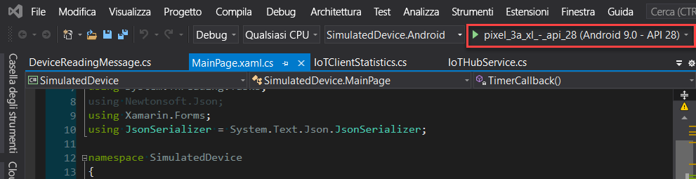
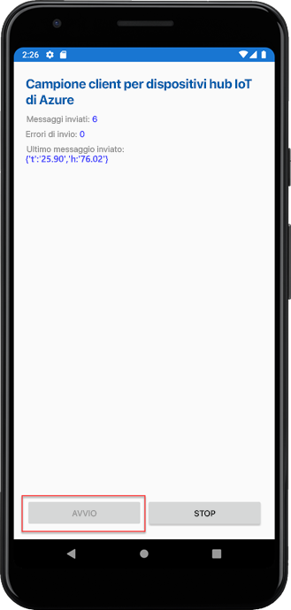

# <a name="quickstart-send-telemetry-from-a-device-to-an-iot-hub-xamarinforms"></a>Avvio rapido: Inviare dati di telemetria da un dispositivo a un hub IoT (Xamarin.Forms)

[!INCLUDE [iot-hub-quickstarts-1-selector](../../includes/iot-hub-quickstarts-1-selector.md)]

L'hub IoT è un servizio di Azure che consente di acquisire volumi elevati di dati di telemetria dai dispositivi IoT nel cloud per l'archiviazione o l'elaborazione. In questo articolo si inviano dati di telemetria da un'applicazione di dispositivo simulato all'hub IoT. Sarà quindi possibile visualizzare i dati da un'applicazione back-end.

In questo articolo si usa un'applicazione Xamarin.Forms già pronta per inviare i dati di telemetria e un'utilità dell'interfaccia della riga di comando per leggere i dati di telemetria dall'hub IoT.

[!INCLUDE [cloud-shell-try-it.md](../../includes/cloud-shell-try-it.md)]

Se non si ha una sottoscrizione di Azure, creare un [account gratuito](https://azure.microsoft.com/free/?WT.mc_id=A261C142F) prima di iniziare.


## <a name="prerequisites"></a>Prerequisiti

- L'esempio di codice scaricato da [esempi di Azure](https://github.com/Azure-Samples/azure-iot-samples-xamarin/archive/master.zip).

- La versione più recente di [Visual Studio 2019](https://visualstudio.microsoft.com/) o [Visual Studio per Mac](https://visualstudio.microsoft.com/) con gli strumenti di Xamarin.Forms installati. Questa guida di avvio rapido è stata testata con Visual Studio 16.6.0.

- Assicurarsi che la porta 8883 sia aperta nel firewall. L'esempio di dispositivo di questo argomento di avvio rapido usa il protocollo MQTT, che comunica tramite la porta 8883. Questa porta potrebbe essere bloccata in alcuni ambienti di rete aziendali e didattici. Per altre informazioni e soluzioni alternative per questo problema, vedere [Connettersi all'hub IoT (MQTT)](iot-hub-mqtt-support.md#connecting-to-iot-hub).

- Eseguire questo comando per aggiungere l'estensione Microsoft Azure IoT per l'interfaccia della riga di comando di Azure all'istanza di Cloud Shell. L'estensione IoT aggiunge i comandi specifici dell'hub IoT, di IoT Edge e del servizio Device Provisioning in hub IoT all'interfaccia della riga di comando di Azure.

   ```azurecli-interactive
   az extension add --name azure-iot
   ```

   [!INCLUDE [iot-hub-cli-version-info](../../includes/iot-hub-cli-version-info.md)]

## <a name="create-an-iot-hub"></a>Creare un hub IoT

[!INCLUDE [iot-hub-include-create-hub](../../includes/iot-hub-include-create-hub.md)]

## <a name="register-a-device"></a>Registrare un dispositivo

È necessario registrare un dispositivo con l'hub IoT perché questo possa connettersi. In questa guida introduttiva si usa Azure Cloud Shell per registrare un dispositivo simulato.

1. Eseguire questo comando in Azure Cloud Shell per creare l'identità del dispositivo.

   **YourIoTHubName**: sostituire il segnaposto in basso con il nome scelto per l'hub IoT.

   **myXamarinDevice**: nome del dispositivo da registrare. È consigliabile usare **myXamarinDevice**, come illustrato. Se si sceglie un altro nome per il dispositivo, sarà necessario usare tale nome anche nell'ambito di questo articolo e aggiornare il nome del dispositivo nelle applicazioni di esempio prima di eseguirle.

   ```azurecli-interactive
   az iot hub device-identity create --hub-name {YourIoTHubName} --device-id myXamarinDevice
   ```

1. Eseguire il comando seguente in Azure Cloud Shell per ottenere la _stringa di connessione del dispositivo_ per il dispositivo appena registrato:

   **YourIoTHubName**: sostituire il segnaposto in basso con il nome scelto per l'hub IoT.

   ```azurecli-interactive
   az iot hub device-identity show-connection-string --hub-name {YourIoTHubName} --device-id myXamarinDevice --output table
   ```

   Annotare la stringa di connessione del dispositivo, che avrà questo aspetto:

   `HostName={YourIoTHubName}.azure-devices.net;DeviceId=myXamarinDevice;SharedAccessKey={YourSharedAccessKey}`

    Il valore verrà usato più avanti in questa guida di avvio rapido.

## <a name="send-simulated-telemetry"></a>Inviare dati di telemetria simulati

L'applicazione di esempio viene eseguita in Windows, tramite un'app UWP, in un dispositivo iOS o un simulatore e in un dispositivo Android o un simulatore, che si connette a un endpoint specifico del dispositivo nell'hub IoT e invia dati di telemetria simulati di temperatura e umidità. 

1. Aprire l'area di lavoro di esempio in Visual Studio o Visual Studio per Mac.
2. Espandere il progetto **SimulatedDevice**.  
3. Aprire il file**IoTHubService.cs** per la modifica in Visual Studio. 
4. Cercare la variabile **_iotHubConnectionString** e aggiornarne il valore con la stringa di connessione del dispositivo annotata in precedenza.
5. Salvare le modifiche. 
6. Eseguire il progetto nell'emulatore di dispositivo o in un dispositivo reale con il pulsante **Compila ed esegui** o il tasto di scelta rapida **F5** in Windows o **Comando + R** in Mac. 

   

7. Quando l'emulatore si apre, selezionare **Start** nell'app di esempio.

Nella schermata seguente sono mostrati alcuni esempi di output dei dati di telemetria simulati inviati dall'applicazione all'hub IoT: 

## <a name="read-the-telemetry-from-your-hub"></a>Leggere i dati di telemetria dell'hub

L'app di esempio eseguita nell'emulatore XCode mostra i dati relativi ai messaggi inviati dal dispositivo. I dati possono inoltre essere visualizzati dall'hub IoT man mano che vengono ricevuti. L'estensione dell'interfaccia della riga di comando dell'hub IoT può connettersi all'endpoint **Eventi** sul lato servizio dell'hub IoT. L'estensione riceve i messaggi da dispositivo a cloud inviati dal dispositivo simulato. In genere, un'applicazione di back-end di hub IoT viene eseguita nel cloud per ricevere ed elaborare i messaggi da dispositivo a cloud.

Eseguire i comandi seguenti in Azure Cloud Shell, sostituendo `YourIoTHubName` con il nome dell'hub IoT:

```azurecli-interactive
az iot hub monitor-events --device-id myXamarinDevice --hub-name {YourIoTHubName}
```

Lo screenshot seguente mostra l'output mentre l'estensione riceve i dati di telemetria inviati dal dispositivo simulato all'hub:

La schermata seguente illustra il tipo di dati di telemetria visualizzati nella finestra del terminale locale: 

## <a name="clean-up-resources"></a>Pulire le risorse

[!INCLUDE [iot-hub-quickstarts-clean-up-resources](../../includes/iot-hub-quickstarts-clean-up-resources.md)]

## <a name="next-steps"></a>Passaggi successivi

In questa guida di avvio rapido è stato configurato un hub IoT, è stato registrato un dispositivo, sono stati inviati dati di telemetria simulati all'hub da un'applicazione Xamarin.Forms e i dati di telemetria sono stati letti dall'hub. 

Per informazioni su come controllare il dispositivo simulato da un'applicazione back-end, continuare nella Guida introduttiva successiva.

> [!div class="nextstepaction"]
> [Avvio rapido: controllare un dispositivo connesso a un hub IoT](quickstart-control-device-node.md)
