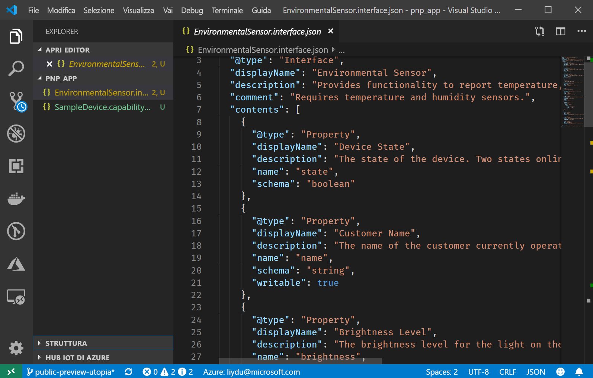

# <a name="quickstart-use-a-device-capability-model-to-create-an-iot-plug-and-play-preview-device-windows"></a>Guida introduttiva: Usare un modello funzionalità di dispositivo per creare un dispositivo di anteprima Plug and Play IoT (Windows)

Un _modello di funzionalità di dispositivo_ descrive le funzionalità di un dispositivo Plug and Play IoT. Un modello di funzionalità di dispositivo è spesso associato a uno SKU di prodotto. Le funzionalità definite nel modello di funzionalità di dispositivo sono organizzate in interfacce riutilizzabili. È possibile generare la bozza di codice del dispositivo da un modello di funzionalità di dispositivo. Questa guida di avvio rapido illustra come usare VS Code su Windows per creare un dispositivo Plug and Play IoT usando un modello di funzionalità di dispositivo.

## <a name="prerequisites"></a>Prerequisiti

Per completare questa guida di avvio rapido, è necessario installare il software seguente nel computer locale:

* [Visual Studio Build Tools](https://visualstudio.microsoft.com/thank-you-downloading-visual-studio/?sku=BuildTools&rel=16) con **Strumenti di compilazione C++** e carichi di lavoro del **componente Gestione pacchetti NuGet**. In alternativa, se si dispone già di [Visual Studio (Community, Professional o Enterprise)](https://visualstudio.microsoft.com/downloads/) 2019, 2017 o 2015 con gli stessi carichi di lavoro installati.
* [Git](https://git-scm.com/download/).
* [CMake](https://cmake.org/download/).
* [Visual Studio Code](https://code.visualstudio.com/).

### <a name="install-azure-iot-tools"></a>Installare Azure IoT Tools

Usare la procedura seguente per installare il pacchetto di estensione [Azure IoT Tools per VS Code](https://marketplace.visualstudio.com/items?itemName=vsciot-vscode.azure-iot-tools):

1. In VS Code selezionare **Estensioni**.
1. Cercare **Azure IoT Tools**.
1. Selezionare **Installa**.

### <a name="install-the-azure-iot-explorer"></a>Installare Azure IoT Explorer

Scaricare e installare la versione più recente di **Azure IoT Explorer** dalla pagina [repository](https://github.com/Azure/azure-iot-explorer/releases) dello strumento, selezionando il file con estensione MSI in "Assets" per l'aggiornamento più recente.

### <a name="get-the-connection-string-for-your-company-model-repository"></a>Ottenere la stringa di connessione per il repository dei modelli aziendali

La _stringa di connessione del repository dei modelli aziendali_ è disponibile nel [portale di Azure Certified per IoT](https://preview.catalog.azureiotsolutions.com) quando si accede con un account aziendale o dell'istituto di istruzione Microsoft o con l'ID partner Microsoft se disponibile. Dopo aver eseguito l'accesso selezionare **Company repository** (Repository aziendale) e quindi **Stringhe di connessione**.

[!INCLUDE [cloud-shell-try-it.md](../../includes/cloud-shell-try-it.md)]

## <a name="prepare-an-iot-hub"></a>Preparare un hub IoT

Per completare questa guida di avvio rapido, la sottoscrizione di Azure deve includere anche un hub IoT di Azure. Se non si ha una sottoscrizione di Azure, creare un [account gratuito](https://azure.microsoft.com/free/?WT.mc_id=A261C142F) prima di iniziare. Se non è disponibile alcun hub IoT, seguire [queste istruzioni per crearne uno](../iot-hub/iot-hub-create-using-cli.md).

> [!IMPORTANT]
> Durante la fase di anteprima pubblica, le funzionalità Plug and Play IoT sono disponibili solo negli hub IoT creati nelle aree **Stati Uniti centrali**, **Europa settentrionale** e **Giappone orientale**.

Eseguire questo comando per aggiungere l'estensione Microsoft Azure IoT per l'interfaccia della riga di comando di Azure all'istanza di Cloud Shell:

```azurecli-interactive
az extension add --name azure-cli-iot-ext
```

Eseguire il comando seguente per creare l'identità del dispositivo nell'hub IoT. Sostituire i segnaposto **YourIoTHubName** e **YourDevice** con i nomi effettivi.

```azurecli-interactive
az iot hub device-identity create --hub-name <YourIoTHubName> --device-id <YourDevice>
```

Eseguire il comando seguente per ottenere la _stringa di connessione del dispositivo_ per il dispositivo appena registrato:

```azurecli-interactive
az iot hub device-identity show-connection-string --hub-name <YourIoTHubName> --device-id <YourDevice> --output table
```

Eseguire il comando seguente per ottenere la _stringa di connessione dell'hub IoT_ per l'hub:

```azurecli-interactive
az iot hub show-connection-string --hub-name <YourIoTHubName> --output table
```

## <a name="prepare-the-development-environment"></a>Preparare l'ambiente di sviluppo

### <a name="get-azure-iot-device-sdk-for-c"></a>Ottenere Azure IoT SDK per dispositivi per C

In questa guida di avvio rapido verrà preparato un ambiente di sviluppo installando Azure IoT SDK per dispositivi per C tramite [Vcpkg](https://github.com/microsoft/vcpkg).

1. Aprire un prompt dei comandi. Eseguire questo comando per installare Vcpkg:

    ```cmd/sh
    git clone https://github.com/Microsoft/vcpkg.git
    cd vcpkg

    .\bootstrap-vcpkg.bat
    ```

    Quindi, per associare l'[integrazione](https://github.com/microsoft/vcpkg/blob/master/docs/users/integration.md) a livello di utente, eseguire questo comando (è richiesto l'amministratore al primo utilizzo):

    ```cmd/sh
    .\vcpkg.exe integrate install
    ```

1. Installare Azure IoT SDK per dispositivi per C Vcpkg:

    ```cmd/sh
    .\vcpkg.exe install azure-iot-sdk-c[public-preview,use_prov_client]
    ```

## <a name="author-your-model"></a>Creare il modello

In questa guida di avvio rapido si useranno un modello di funzionalità di dispositivo di esempio esistente e le interfacce associate.

1. Creare una directory `pnp_app` nell'unità locale. Questa cartella viene usata per i file del modello di dispositivo e lo stub del codice del dispositivo.

1. Scaricare il [modello di funzionalità di dispositivo e i file di interfaccia di esempio](https://github.com/Azure/IoTPlugandPlay/blob/master/samples/SampleDevice.capabilitymodel.json) e l'[interfaccia di esempio](https://github.com/Azure/IoTPlugandPlay/blob/master/samples/EnvironmentalSensor.interface.json) e salvare i file nella cartella `pnp_app`.

    > [!TIP]
    > Per scaricare un file da GitHub, passare al file, fare clic con il pulsante destro del mouse su **Raw** e quindi scegliere **Save link as** (Salva collegamento con nome).

1. Aprire la cartella `pnp_app` con VS Code. È possibile visualizzare i file con IntelliSense:

    

1. Nei file scaricati sostituire `<YOUR_COMPANY_NAME_HERE>` nei campi `@id` e `schema` con un valore univoco. Usare solo i caratteri a-z, A-Z, 0-9 e il carattere di sottolineatura. Per altre informazioni, vedere il [formato dell'identificatore gemello digitale](https://github.com/Azure/IoTPlugandPlay/tree/master/DTDL#digital-twin-identifier-format).

## <a name="generate-the-c-code-stub"></a>Generare lo stub del codice C

A questo punto, si dispone di un modello di funzionalità di dispositivo e delle interfacce associate ed è possibile generare il codice del dispositivo che implementa il modello. Per generare lo stub del codice C in VS Code:

1. Con la cartella `pnp_app` aperta in VS Code, usare **CTRL+MAIUSC+P** per aprire il riquadro comandi, immettere **Plug and Play IoT** e selezionare **Generate Device Code Stub** (Genera stub codice dispositivo).

    > [!NOTE]
    > La prima volta che si usa l'interfaccia della riga di comando CodeGen di Plug and Play IoT è necessario attendere alcuni secondi il completamento del download e dell'installazione automatica.

1. Scegliere il file **SampleDevice.capabilitymodel.json** da usare per generare lo stub del codice del dispositivo.

1. Immettere il nome di progetto **sample_device**. Si tratta del nome dell'applicazione del dispositivo.

1. Scegliere **ANSI C** come linguaggio.

1. Scegliere **Via IoT Hub device connection string** (Tramite stringa di connessione del dispositivo hub IoT) come metodo di connessione.

1. Scegliere **CMake Project on Windows** (Progetto CMake in Windows) come modello di progetto.

1. Scegliere la modalità **Via Vcpkg** (Tramite vcpkg) per includere l'SDK per dispositivi.

1. Nello stesso percorso del file DCM verrà creata una nuova cartella denominata **sample_device**, contenente i file stub del codice del dispositivo generati. VS Code apre una nuova finestra per visualizzarli.
    

## <a name="build-and-run-the-code"></a>Compilare ed eseguire il codice

Per compilare lo stub del codice del dispositivo generato, si usa il codice sorgente dell'SDK per dispositivi. L'applicazione compilata simula un dispositivo che si connette a un hub IoT. L'applicazione invia proprietà e dati di telemetria e riceve comandi.

1. Creare una sottodirectory `cmake` nella cartella `sample_device` e passare a tale cartella:

    ```cmd\sh
    mkdir cmake
    cd cmake
    ```

1. Eseguire questi comandi per compilare lo stub del codice generato (sostituendo il segnaposto con la directory del repository Vcpkg):

    ```cmd\sh
    cmake .. -G "Visual Studio 16 2019" -A Win32 -Duse_prov_client=ON -Dhsm_type_symm_key:BOOL=ON -DCMAKE_TOOLCHAIN_FILE="<directory of your Vcpkg repo>\scripts\buildsystems\vcpkg.cmake"

    cmake --build .
    ```
    
    > [!NOTE]
    > Se si usa Visual Studio 2017 o 2015, è necessario specificare il generatore CMake in base agli strumenti di compilazione usati:
    >```cmd\sh
    ># Either
    >cmake .. -G "Visual Studio 15 2017" -Duse_prov_client=ON -Dhsm_type_symm_key:BOOL=ON -DCMAKE_TOOLCHAIN_FILE="{directory of your Vcpkg repo}\scripts\buildsystems\vcpkg.cmake"
    ># or
    >cmake .. -G "Visual Studio 14 2015" -Duse_prov_client=ON -Dhsm_type_symm_key:BOOL=ON -DCMAKE_TOOLCHAIN_FILE="{directory of your Vcpkg repo}\scripts\buildsystems\vcpkg.cmake"
    >```

    > [!NOTE]
    > Se cmake non trova il compilatore C++, vengono visualizzati errori di compilazione durante l'esecuzione del comando precedente. In tal caso, provare a eseguire questo comando al [prompt dei comandi di Visual Studio](https://docs.microsoft.com/dotnet/framework/tools/developer-command-prompt-for-vs).

1. Al termine della compilazione, eseguire l'applicazione passando come parametro la stringa di connessione del dispositivo dell'hub IoT.

    ```cmd\sh
    .\Debug\sample_device.exe "<device connection string>"
    ```

1. L'applicazione del dispositivo inizia a inviare dati all'hub IoT.

    

## <a name="validate-the-code"></a>Convalidare il codice

### <a name="publish-device-model-files-to-model-repository"></a>Pubblicare i file del modello di dispositivo nel repository dei modelli

Per convalidare il codice del dispositivo con **Azure IoT Explorer**, è necessario pubblicare i file nel repository dei modelli.

1. Con la cartella `pnp_app` aperta in VS Code, usare **CTRL+MAIUSC+P** per aprire il riquadro comandi, digitare e selezionare **Plug and Play IoT: Submit files to Model Repository** (Plug & Play IoT: Invia file al repository dei modelli).

1. Selezionare i file `SampleDevice.capabilitymodel.json` e `EnvironmentalSensor.interface.json`.

1. Immettere la stringa di connessione del repository dei modelli aziendali.

    > [!NOTE]
    > La stringa di connessione è necessaria solo la prima volta che ci si connette al repository.

1. Nella notifica e nella finestra di output di VS Code è possibile verificare che i file siano stati pubblicati correttamente.

    > [!NOTE]
    > Se vengono visualizzati errori durante la pubblicazione dei file del modello di dispositivo, è possibile provare a usare il comando **IoT Plug and Play: Sign out Model Repository** (Plug & Play IoT: Disconnetti repository dei modelli) per disconnettersi e ripetere la procedura.

### <a name="use-the-azure-iot-explorer-to-validate-the-code"></a>Usare Azure IoT Explorer per convalidare il codice

1. Aprire Azure IoT Explorer. Viene visualizzata la pagina **App configurations** (Configurazioni app).

1. Immettere la _stringa di connessione dell'hub IoT_ e selezionare **Connect** (Connetti).

1. Dopo la connessione viene visualizzata la pagina della panoramica del dispositivo.

1. Per aggiungere il repository aziendale, selezionare **Impostazioni**, quindi **+ Add module definition source** (+ Aggiungi origine definizione modulo) e infine **Company repository** (Repository aziendale). Aggiungere la stringa di connessione del repository dei modelli aziendali e seleziona **Salva e connetti**.

1. Nella pagina della panoramica del dispositivo individuare l'identità del dispositivo creata in precedenza e selezionarla per visualizzare altri dettagli.

1. Espandere l'interfaccia con ID **urn:<YOUR_INTERFACE_NAME>:EnvironmentalSensor:1** per visualizzare le primitive Plug and Play IoT, ovvero le proprietà, i comandi e i dati di telemetria. Il nome dell'interfaccia che verrà visualizzato è il nome inserito quando si crea il modello.

1. Selezionare la pagina **Telemetria** e scegliere _Start_ per visualizzare i dati di telemetria inviati dal dispositivo.

1. Selezionare la pagina **Properties (non-writable)** (Proprietà - non scrivibili) per visualizzare le proprietà non scrivibili segnalate dal dispositivo.

1. Selezionare la pagina **Properties (writable)** (Proprietà - scrivibili) per visualizzare le proprietà scrivibili che è possibile aggiornare.

1. Espandere la proprietà **name**, aggiornarla con un nuovo nome e selezionare **Update writable property** (Aggiorna proprietà scrivibile).

1. Per visualizzare il nuovo nome nella colonna **Reported Property** (Proprietà segnalata), selezionare il pulsante **Refresh** (Aggiorna) nella parte superiore della pagina.

1. Selezionare la pagina **Commands** (Comandi) per visualizzare tutti i comandi supportati dal dispositivo.

1. Espandere il comando **blink** e impostare un nuovo intervallo di tempo per l'intermittenza. Selezionare **Invia comando** per chiamare il comando nel dispositivo.

1. Passare al prompt dei comandi del dispositivo simulato e leggere i messaggi di conferma visualizzati per verificare che i comandi siano stati eseguiti come previsto.

## <a name="next-steps"></a>Passaggi successivi

In questa guida di avvio rapido si è appreso come creare un dispositivo Plug and Play IoT usando un modello di funzionalità di dispositivo.

Per altre informazioni sui modelli di funzionalità di dispositivo e su come creare modelli personalizzati, continuare con l'esercitazione:

> [!div class="nextstepaction"]
> [Esercitazione: Creare e testare un modello di funzionalità di dispositivo con Visual Studio Code](tutorial-pnp-visual-studio-code.md)
