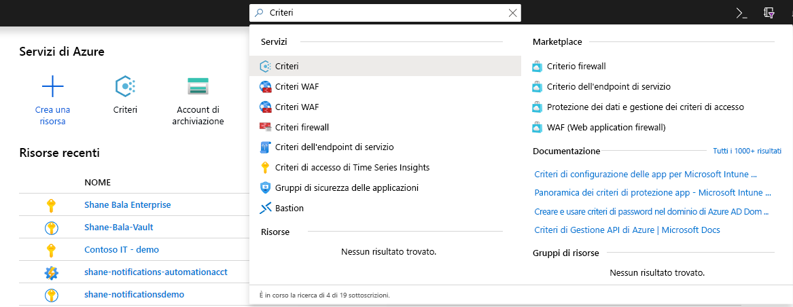
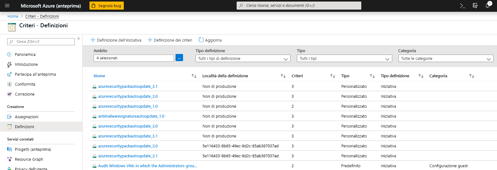
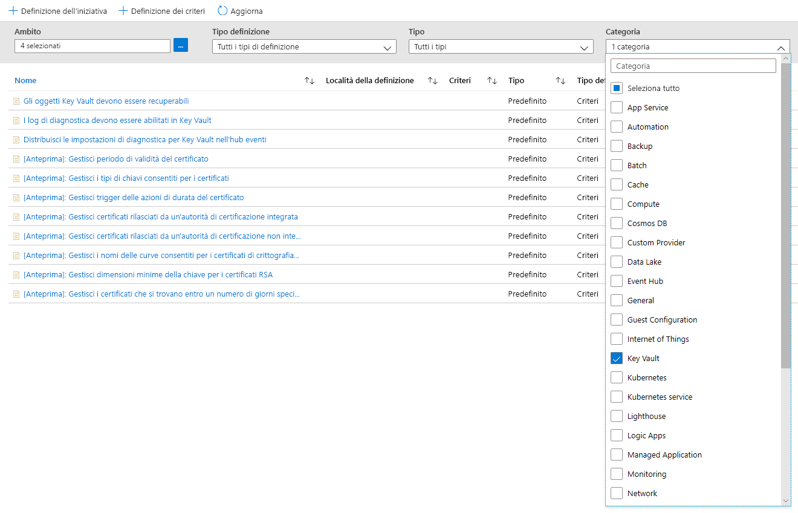
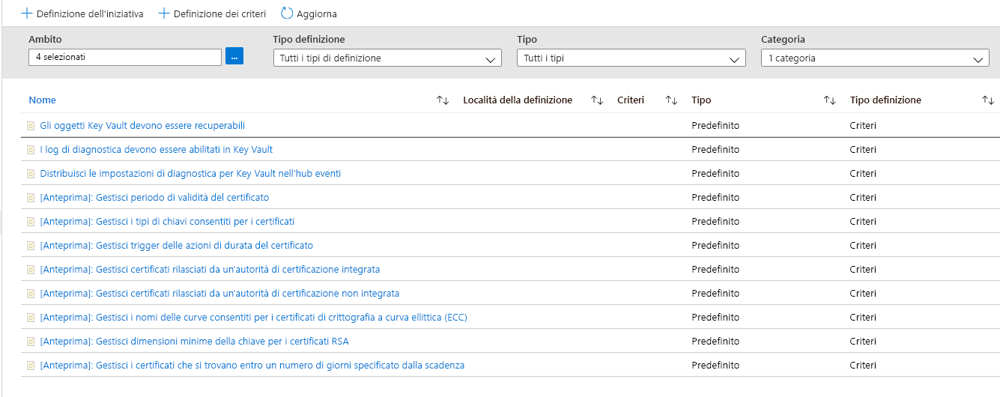
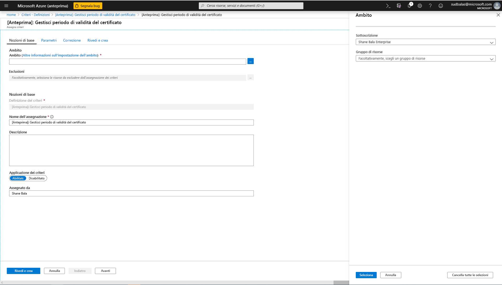
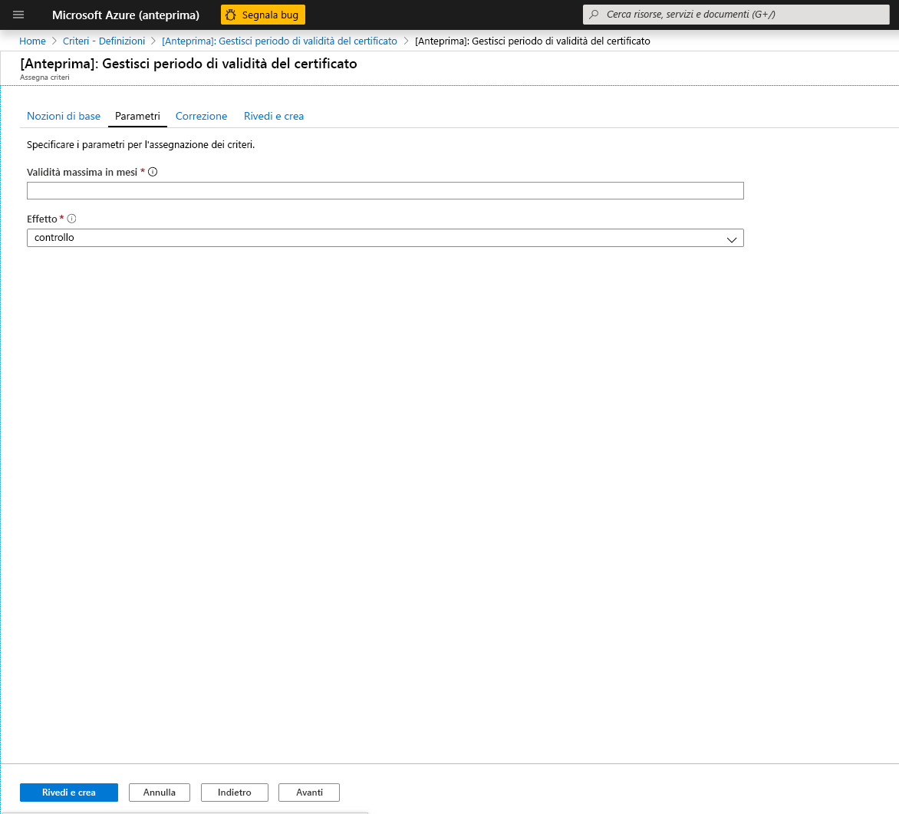
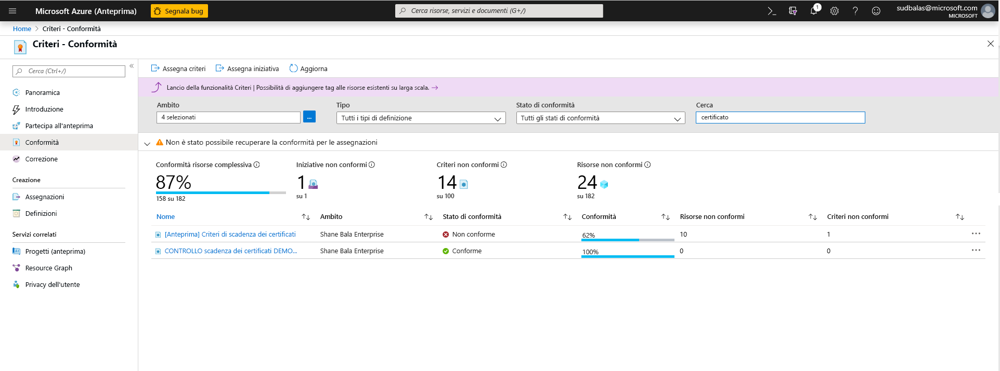
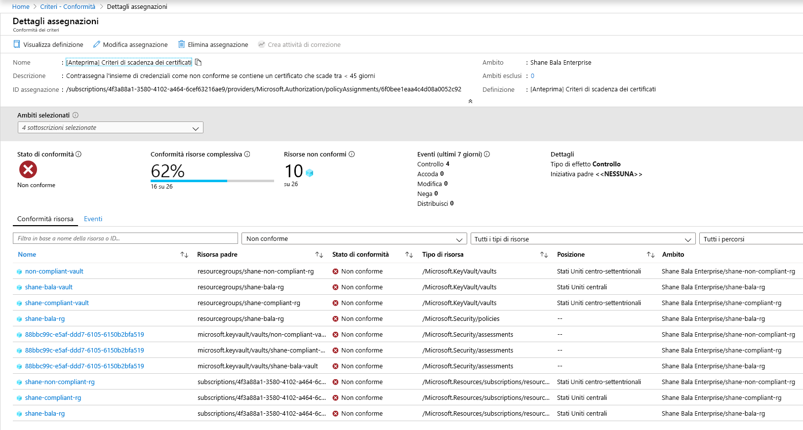
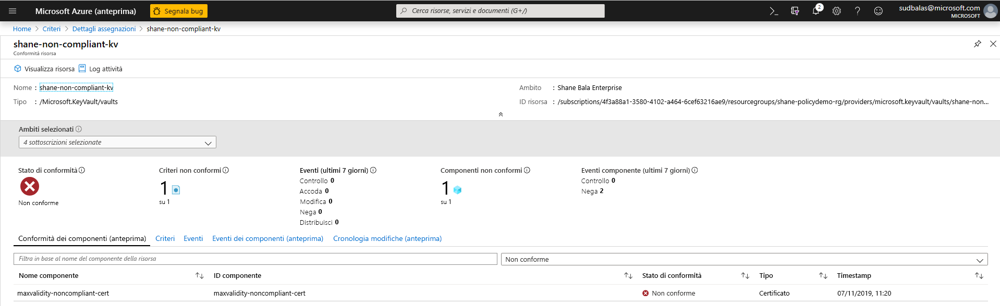
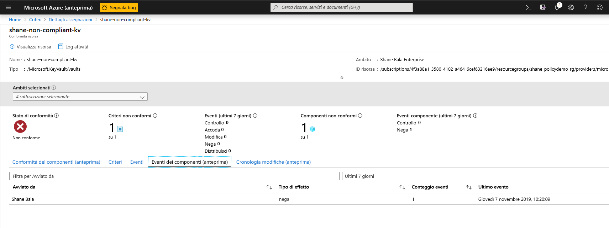

# Integrare Azure Key Vault con Criteri di Azure

[Criteri di Azure](../governance/policy/index.yml) è uno strumento di governance che consente agli utenti di controllare e gestire con scalabilità il proprio ambiente Azure. Criteri di Azure consente di inserire protezioni per le risorse di Azure per garantire che rispettino la conformità alle regole dei criteri assegnate. Consente anche agli utenti di eseguire il controllo, l'applicazione in tempo reale e la correzione dell'ambiente Azure. I risultati dei controlli eseguiti dai criteri saranno disponibili per gli utenti in un dashboard di conformità in cui è possibile visualizzare un elenco delle risorse e dei componenti conformi e non.  Per altre informazioni, vedere [Panoramica del servizio Criteri di Azure](../governance/policy/overview.md).

Esempi di scenari d'uso

- Si intende migliorare il comportamento in ambito di sicurezza della società implementando i requisiti relativi alle dimensioni minime delle chiavi e ai periodi di validità massimi dei certificati negli insiemi di credenziali delle chiavi dell'azienda, ma non si conoscono i team conformi e quelli che non lo sono. 
- Attualmente non si dispone di una soluzione per eseguire un controllo all'interno dell'organizzazione o si eseguono controlli manuali dell'ambiente chiedendo ai singoli team all'interno dell'organizzazione di segnalare la conformità. Si cerca un modo per automatizzare questa attività, nonché eseguire controlli in tempo reale e garantirne l'accuratezza.
- Si intende applicare i criteri di sicurezza aziendali e impedire a singoli utenti di creare certificati autofirmati, ma non si dispone di un modo automatico per bloccare la creazione. 
- Si intende soddisfare alcuni requisiti per i team di test, ma si desidera mantenere controlli rigidi sull'ambiente di produzione. È necessario separare l'applicazione delle risorse in modo semplice e automatico. 
- Si desidera garantire la possibilità di eseguire il rollback dell'applicazione di nuovi criteri in caso di problemi di un sito live. È necessaria una soluzione rapida per disattivare l'applicazione dei criteri. 
- Il controllo dell'ambiente viene seguito tramite una soluzione di terze parti e si intende usare un'offerta Microsoft interna. 

## Tipi di effetti dei criteri e indicazioni

**Controllo**. Quando l'effetto di un criterio è impostato su Controllo, il criterio non comporta alcuna modifica sostanziale dell'ambiente. Nel dashboard di conformità dei criteri vengono contrassegnati i componenti non conformi, ad esempio i certificati che non rispettano la conformità alle definizioni dei criteri in un ambito specificato. Il controllo è l'impostazione predefinita se non è selezionato alcun effetto dei criteri. 

**Nega**. Quando l'effetto di un criterio è impostato su Nega, il criterio blocca la creazione di nuovi componenti, ad esempio i certificati, nonché nuove versioni dei componenti esistenti non conformi alla definizione dei criteri. Le risorse non conformi esistenti in un insieme di credenziali delle chiavi non sono interessate. Le funzionalità di controllo continuano a essere attive.

## Definizioni dei criteri predefinite disponibili

In Key Vault è stato creato un set di criteri che è possibile assegnare agli scenari comuni di gestione dei certificati. Tali criteri sono predefiniti, ovvero non richiedono la scrittura di codice JSON personalizzato per essere abilitati e sono disponibili nel portale di Azure per l'assegnazione. È comunque possibile personalizzare determinati parametri in base alle esigenze dell'organizzazione. 

Gli otto criteri di anteprima sono i seguenti.

### Gestisci periodo di validità del certificato (anteprima)

Questo criterio consente di gestire il periodo di validità massimo dei certificati archiviati nell'insieme di credenziali delle chiavi. Per motivi di sicurezza, è consigliabile limitare il periodo di validità massimo dei certificati. Se una chiave privata del certificato fosse stata compromessa senza rilevamento, l'uso di certificati di breve durata riduce al minimo l'intervallo di tempo per i danni e riduce il valore del certificato per un utente malintenzionato. 

### Gestisci i tipi di chiave consentiti per i certificati (anteprima)
Questo criterio consente di limitare il tipo di certificati che possono essere presenti nell'insieme di credenziali delle chiavi. È possibile usare il criterio per verificare che le chiavi private del certificato siano RSA oppure ECC o che siano supportate da un modulo di protezione hardware. Nell'elenco seguente è possibile scegliere i tipi di certificato consentiti.
- RSA
- RSA - modulo di protezione hardware
- ECC 
- ECC - modulo di protezione hardware 

### Gestisci trigger delle azioni di durata del certificato (anteprima)

Questo criterio consente di gestire l'azione di durata specificata per i certificati che rientrano in un determinato numero di giorni dalla scadenza o che hanno raggiunto una certa percentuale di vita valida. 

### Gestisci certificati rilasciati da un'autorità di certificazione integrata (anteprima)

Se si usa un'autorità di certificazione integrata di Key Vault (Digicert o GlobalSign) e si vuole che gli utenti usino uno di questi provider o entrambi, è possibile usare questo criterio per controllare o applicare la selezione. Questo criterio può essere usato anche per controllare o negare la creazione di certificati autofirmati nell'insieme di credenziali delle chiavi. 

### Gestisci certificati rilasciati da un'autorità di certificazione integrata (anteprima)

Se si usa un'autorità di certificazione interna o un'autorità di certificazione non integrata con l'insieme di credenziali delle chiavi e si vuole che gli utenti usino un'autorità di certificazione da un elenco fornito, è possibile usare questo criterio per creare un elenco consentito di autorità di certificazione in base al nome dell'autorità emittente. Questo criterio può essere usato anche per controllare o negare la creazione di certificati autofirmati nell'insieme di credenziali delle chiavi. 

### Gestisci i nomi delle curve consentiti per i certificati di crittografia a curva ellittica (ECC) (anteprima)
Se si usano i certificati con crittografia a curva ellittica (ECC), è possibile personalizzare un elenco di nomi di curve consentiti. L'opzione predefinita consente di usare tutti i nomi di curva seguenti. 
- P-256
- P-256K
- P-384
- P-521

### Gestisci dimensioni minime della chiave per i certificati RSA (anteprima)
Se si usano i certificati RSA, è possibile scegliere una dimensione minima della chiave dei certificati stessi. È possibile selezionare un'opzione nell'elenco seguente. 
- 2048 bit
- 3072 bit
- 4096 bit

### Gestisci i certificati che si trovano entro un numero di giorni specificato dalla scadenza (anteprima)
Il servizio può riscontrare un'interruzione se un certificato non monitorato in modo adeguato non viene ruotato prima della scadenza. Questo criterio è essenziale per garantire che i certificati archiviati nell'insieme di credenziali delle chiavi siano monitorati. È consigliabile applicare questo criterio più volte con soglie di scadenza diverse, ad esempio 180, 90, 60 e 30 giorni. Il criterio può essere usato per monitorare e valutare la scadenza dei certificati nell'organizzazione. 

## Scenario di esempio

Si gestisce un insieme di credenziali delle chiavi usato da più team che contiene 100 certificati e si vuole verificare che nessun certificato nell'insieme di credenziali delle chiavi sia valido per più di due anni.

1. Si assegna il criterio [Gestisci periodo di validità del certificato](#manage-certificate-validity-period-preview), si specifica che il periodo di validità massimo di un certificato sia di 24 mesi e si imposta l'effetto del criterio su "controllo". 
1. Nel [report di conformità nel portale di Azure](#view-compliance-results) viene rilevato che 20 certificati non sono conformi e che sono validi per più di due anni e che i certificati rimanenti sono conformi. 
1. Si contattano i proprietari di questi certificati e si comunica il nuovo requisito di sicurezza, in base al quale i certificati non possono essere validi per più di due anni. Alcuni team rispondono e 15 certificati vengono rinnovati con un periodo di validità massimo di 2 anni o meno. Altri team non rispondono e nell'insieme di credenziali delle chiavi sono ancora presenti 5 certificati.
1. L'effetto dei criteri assegnati viene impostato su "nega". I 5 certificati non conformi non vengono revocati e continuano a funzionare. Tali certificati, tuttavia, non possono essere rinnovati con un periodo di validità maggiore di 2 anni. 

## Abilitazione e gestione di un criterio di Key Vault tramite il portale di Azure

### Selezionare una definizione di criteri

1. Accedere al portale di Azure. 
1. Cercare "Criteri" nella barra di ricerca e selezionare **Criteri**.

    

1. Nella finestra Criteri selezionare **Definizioni**.

    

1. Nel filtro Categoria deselezionare **Seleziona tutto** e quindi selezionare **Key Vault**. 

    

1. A questo punto dovrebbe essere possibile visualizzare tutti i criteri disponibili per l'anteprima pubblica, ad Azure Key Vault. Assicurarsi di aver letto e compreso la sezione delle linee guida precedente e selezionare i criteri da assegnare a un ambito.  

    

### Assegnare criteri a un ambito 

1. Selezionare i criteri da applicare. In questo esempio viene visualizzato il criterio **Gestisci periodo di validità del certificato**. Fare clic sul pulsante di assegnazione nell'angolo superiore sinistro.

    
  
1. Selezionare la sottoscrizione in cui si desidera applicare i criteri. È possibile scegliere di limitare l'ambito a un singolo gruppo di risorse in una sottoscrizione. Se si desidera applicare i criteri all'intera sottoscrizione ed escludere alcuni gruppi di risorse, è anche possibile configurare un elenco di esclusione. Impostare il selettore di imposizione dei criteri su **Abilitato** se si desidera che l'effetto del criterio (controllo o negazione) venga applicato o su **Disabilitato** per disattivarne l'applicazione. 

    

1. Fare clic sulla scheda dei parametri nella parte superiore della schermata per specificare il periodo di validità massimo desiderato (in mesi). Selezionare **Controllo** o **Nega** come effetto del criterio seguendo le indicazioni delle sezioni precedenti e quindi selezionare il pulsante Rivedi e crea. 

    

### Visualizzare i risultati di conformità

1. Tornare al pannello dei criteri e selezionare la scheda relativa alla conformità. Fare clic sull'assegnazione di criteri per cui visualizzare i risultati di conformità.

    

1. In questa pagina è possibile filtrare i risultati in base a insiemi di credenziali conformi o non conformi. È possibile visualizzare anche un elenco di insiemi di credenziali delle chiavi non conformi nell'ambito dell'assegnazione dei criteri. Un insieme di credenziali viene considerato non conforme se uno dei componenti (certificati) presenti nell'insieme non è conforme. È possibile selezionare un singolo insieme di credenziali per visualizzare i singoli componenti non conformi (certificati). 

    

1. Visualizzare il nome dei componenti in un insieme di credenziali non conformi

    

1. Se è necessario controllare se agli utenti viene negata la possibilità di creare risorse nell'insieme di credenziali delle chiavi, fare clic sulla scheda **Eventi dei componenti (anteprima)** per visualizzare un riepilogo delle operazioni di certificato negate con il richiedente e i timestamp delle richieste. 

    

## Limitazioni delle funzionalità

L'assegnazione di un criterio con un effetto "Nega" può richiedere fino a 30 minuti (caso medio) e 1 ora (caso peggiore) per iniziare a negare la creazione di risorse non conformi. La valutazione dei criteri dei componenti esistenti in un insieme di credenziali può richiedere fino a 1 ora (caso medio) e 2 ore (caso peggiore) prima che i risultati di conformità vengano visualizzabili nell'interfaccia utente del portale. Se i risultati di conformità vengono visualizzati come "non avviati", i motivi possono essere i seguenti:
- La valutazione dei criteri non è ancora stata completata. La latenza di valutazione iniziale può richiedere fino a 2 ore nello scenario peggiore. 
- Non sono presenti insiemi di credenziali delle chiavi nell'ambito dell'assegnazione dei criteri.
- Non sono presenti insiemi di credenziali delle chiavi con certificati nell'ambito dell'assegnazione di criteri. 

## Passaggi successivi

- Altre informazioni sul [Servizio Criteri di Azure](../governance/policy/overview.md)
- Vedere un esempio: [Insiemi di credenziali Key Vault senza endpoint di rete virtuale](../governance/policy/samples/keyvault-no-vnet-rules.md)

