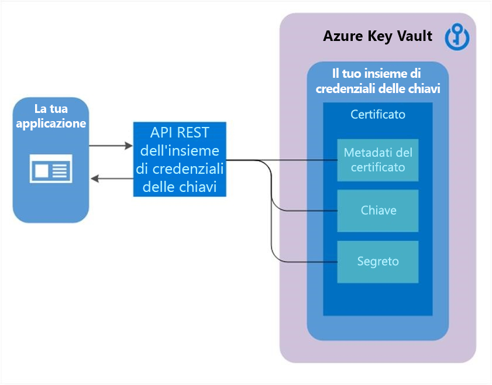

# Introduzione ai certificati di Key Vault
Gli scenari seguenti illustrano diversi utilizzi primari del servizio di gestione dei certificati di Key Vault, includendo i passaggi aggiuntivi necessari per creare il primo certificato in un insieme di credenziali delle chiavi.

Vengono illustrate le procedure seguenti:
- Creazione del primo certificato di Key Vault
- Creazione di un certificato con un'autorità di certificazione partner di Key Vault
- Creazione di un certificato con un'autorità di certificazione non partner di Key Vault
- Importazione di un certificato

## Certificati come oggetti complessi
I certificati sono costituiti da tre risorse correlate che collegate tra loro formano un certificato di Key Vault: i metadati del certificato, una chiave e un segreto.

## Creazione del primo certificato di Key Vault  
 Prima di poter creare un certificato in un'istanza di Key Vault, è necessario completare i passaggi preliminari 1 e 2 e deve essere presente un insieme di credenziali delle chiavi per l'utente/organizzazione.  

**Passaggio 1**. Provider autorità di certificazione (CA)  
-   L'onboarding come amministratore IT o PKI o altro utente responsabile della gestione degli account con le CA per una determinata azienda (ad esempio, Contoso) è un prerequisito per usare i certificati di Key Vault.  
    Le CA seguenti sono gli attuali provider partner di Key Vault.  
    -   DigiCert: Key Vault offre certificati SSL OV con DigiCert.  
    -   Globaltrust - Key Vault, sono disponibili per i certificati con Globaltrust OV SSL.  

**Passaggio 2**. Un amministratore account per un provider CA crea le credenziali che verranno usate da Key Vault per la registrazione, il rinnovo e l'uso di certificati SSL tramite Key Vault.

**Passaggio 3**. A seconda dell'autorità di certificazione, un amministratore di Contoso e un dipendente di Contoso (utente di Key Vault) proprietario di certificati possono ottenere un certificato dall'amministratore o direttamente dall'account con la CA.  

- Avviare un'operazione di aggiunta di credenziali in un insieme di credenziali delle chiavi [ impostando una risorsa autorità di certificazione](/rest/api/keyvault/setcertificateissuer/setcertificateissuer). Un'autorità di certificazione è un'entità rappresentata in Azure Key Vault come risorsa CertificateIssuer. Viene usata per rendere disponibili informazioni sull'origine di un certificato di un insieme di credenziali delle chiavi: nome dell'autorità di certificazione, provider, credenziali e altri dettagli amministrativi.
  - Esempio: MyDigiCertIssuer  
    -   Provider  
    -   Credenziali: credenziali dell'account CA. Ogni autorità di certificazione ha dati specifici.  

    Per altre informazioni sulla creazione di account con i provider CA, vedere il relativo post nel [blog su Key Vault](https://aka.ms/kvcertsblog).  

**Passaggio 3.1**. Configurare i [contatti relativi al certificato](/rest/api/keyvault/setcertificatecontacts/setcertificatecontacts) per le notifiche. Questi costituiscono il contatto per l'utente di Key Vault. Questo passaggio non viene applicato da Key Vault.  

Nota: questo processo, fino al passaggio 3.1, è un'operazione una tantum.  

## Creazione di un certificato con una CA partner di Key Vault

**Passaggio 4**. Le descrizioni seguenti corrispondono ai passaggi contrassegnati con un numero in verde nel diagramma precedente.  
  (1) Nel diagramma precedente, l'applicazione crea un certificato, operazione che internamente inizia con la creazione di una chiave nell'insieme di credenziali delle chiavi.  
  (2) Key Vault invia una richiesta di certificato SSL alla CA.  
  (3) L'applicazione esegue il polling di Key Vault, in un processo di ciclo e attesa, per il completamento del certificato. La creazione del certificato è completata quando Key Vault riceve la risposta della CA con il certificato x509.  
  (4) La CA risponde alla richiesta di certificato SSL di Key Vault con un certificato SSL X509.  
  (5) La creazione del nuovo certificato viene completata con l'unione del certificato X509 per la CA.  

  L'utente di Key Vault crea un certificato specificando i criteri.

  -   Ripetere in base alle esigenze.  
  -   Vincoli dei criteri  
      -   Proprietà X509  
      -   Proprietà della chiave  
      -   Informazioni di riferimento per il provider, ad esempio MyDigiCertIssure  
      -   Informazioni relative al rinnovo, ad esempio 90 giorni prima della scadenza  

  - Il processo di creazione di un certificato è in genere asincrono e prevede il polling dell'insieme di credenziali delle chiavi per lo stato dell'operazione di creazione del certificato.  
[Operazione di recupero del certificato](/rest/api/keyvault/getcertificateoperation/getcertificateoperation)  
      -   Stato: operazione completata, non riuscita con informazioni sull'errore o annullata  
      -   A causa del ritardo nella creazione può essere avviata un'operazione di annullamento. L'annullamento può essere applicato o meno.  

## Importazione di un certificato  
 In alternativa, è possibile importare un certificato, PFX o PEM, in Key Vault.  

 Per altre informazioni sul formato PEM, vedere la sezione relativa ai certificati in [Informazioni su chiavi, segreti e certificati](about-keys-secrets-and-certificates.md).  

 Per importare un certificato, è necessario un file PEM o PFX su disco con una chiave privata. 
-   È necessario specificare il nome dell'insieme di credenziali e il nome del certificato. I criteri sono facoltativi.

-   I file PEM/PFX contengono attributi che possono essere analizzati da Key Vault per popolare i criteri dei certificati. Se i criteri dei certificati sono già specificati, Key Vault proverà a trovare una corrispondenza con i dati del file PFX/PEM.  

-   Al termine dell'importazione, le operazioni successive useranno i nuovi criteri, ossia le nuove versioni.  

-   Se non vengono eseguite altre operazioni, Key Vault per prima cosa invierà un avviso di scadenza. 

-   L'utente, inoltre, può modificare i criteri, che sono funzionali al momento dell'importazione ma contengono impostazioni predefinite nel caso in cui non vengano specificate informazioni durante l'importazione, Esempio: se non sono presenti informazioni sull'autorità di certificazione.  

### Formati di importazione sono supportati
Sono supportati i seguenti tipi di importazione per il formato di file con estensione PEM. Un singolo certificato con codificata PEM insieme a un PKCS #8 codificato, chiave non crittografata che presenta le seguenti

---BEGIN CERTIFICATE------END CERTIFICATE--

---BEGIN PRIVATE KEY------END PRIVATE KEY--

Merge certificato Supportiamo formati con estensione PEM in base 2. È possibile unire in un singolo certificato con codificato PKCS #8 oppure P7B file con codifica base64. ---BEGIN CERTIFICATE------END CERTIFICATE--

Attualmente non supportiamo le chiavi CE nel formato PEM.

## Creazione di un certificato con una CA non partner di Key Vault  
 Questo metodo consente di usare CA diverse dai provider partner di Key Vault, in modo che l'organizzazione possa avvalersi di una CA di propria scelta.  

  

 Le descrizioni dei passaggi seguenti corrispondono ai passaggi contrassegnati con un numero in verde nel diagramma precedente.  

  (1) Nel diagramma precedente, l'applicazione crea un certificato, operazione che internamente inizia con la creazione di una chiave nell'insieme di credenziali delle chiavi.  

  (2) Key Vault restituisce all'applicazione una richiesta di firma del certificato.  

  (3) L'applicazione passa la richiesta di firma del certificato alla CA scelta.  

  (4) La CA scelta risponde con un certificato X509.  

  (5) L'applicazione completa la creazione del nuovo certificato con l'unione del certificato X509 proveniente dalla CA.

## Vedere anche

- [Informazioni su chiavi, segreti e certificati](about-keys-secrets-and-certificates.md)
