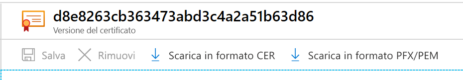

# <a name="export-certificates-from-azure-key-vault"></a>Esportare certificati da Azure Key Vault

Informazioni su come esportare i certificati da Azure Key Vault. Per esportare i certificati, è possibile usare l'interfaccia della riga di comando di Azure, Azure PowerShell o il portale di Azure. È possibile usare il portale di Azure anche per esportare i certificati di Servizio app di Azure.

## <a name="about-azure-key-vault-certificates"></a>Informazioni sui certificati di Azure Key Vault

Azure Key Vault consente di effettuare facilmente il provisioning, la gestione e la distribuzione di certificati digitali per la rete. Permette inoltre di offrire comunicazioni sicure per le applicazioni. Per altre informazioni, vedere [Certificati di Azure Key Vault](https://docs.microsoft.com/azure/key-vault/certificates/about-certificates).

### <a name="composition-of-a-certificate"></a>Componenti di un certificato

Quando viene creato un certificato Key Vault, vengono creati una *chiave* e un *segreto* indirizzabili con lo stesso nome. La chiave di Key Vault consente di eseguire operazioni relative alle chiavi. Il segreto di Key Vault consente invece di recuperare il valore del certificato come segreto. Un certificato Key Vault contiene inoltre metadati del certificato x509 pubblico. Per altre informazioni, vedere [Componenti di un certificato](https://docs.microsoft.com/azure/key-vault/certificates/about-certificates#composition-of-a-certificate).

### <a name="exportable-and-non-exportable-keys"></a>Chiavi esportabili e non esportabili

Un certificato di Key Vault creato può essere recuperato dal segreto indirizzabile con la chiave privata. Recuperare il certificato in formato PFX o PEM.

- **Esportabile** : i criteri usati per creare il certificato indicano che la chiave è esportabile.
- **Non esportabile** : i criteri usati per creare il certificato indicano che la chiave non è esportabile. In questo caso, la chiave privata non è inclusa nel valore quando viene recuperata come segreto.

Tipi di chiavi supportati: RSA, RSA-HSM, EC, EC-HSM, oct (elencati [qui](https://docs.microsoft.com/rest/api/keyvault/createcertificate/createcertificate#jsonwebkeytype)) L'esportabilità è consentita solo con RSA, EC. Le chiavi HSM non sono esportabili.

Per altre informazioni, vedere [Informazioni sui certificati di Azure Key Vault](https://docs.microsoft.com/azure/key-vault/certificates/about-certificates#exportable-or-non-exportable-key).

## <a name="export-stored-certificates"></a>Esportare i certificati archiviati

Per esportare i certificati archiviati in Azure Key Vault, è possibile usare l'interfaccia della riga di comando di Azure, Azure PowerShell o il portale di Azure.

> [!NOTE]
> Quando si importa il certificato nell'insieme di credenziali delle chiavi, è necessaria solo una password del certificato. Key Vault non salva la password associata. Quando si esporta il certificato, la password è vuota.

# <a name="azure-cli"></a>[Interfaccia della riga di comando di Azure](#tab/azure-cli)

Usare il comando seguente nell'interfaccia della riga di comando di Azure per scaricare la **parte pubblica** di un certificato di Key Vault.

```azurecli
az keyvault certificate download --file
                                 [--encoding {DER, PEM}]
                                 [--id]
                                 [--name]
                                 [--subscription]
                                 [--vault-name]
                                 [--version]
```

Per altre informazioni, vedere [gli esempi e le definizioni dei parametri](https://docs.microsoft.com/cli/azure/keyvault/certificate?view=azure-cli-latest#az-keyvault-certificate-download).

Il download come certificato comporta il recupero della parte pubblica. Per ottenere sia la chiave privata che i metadati pubblici, è possibile eseguire il download come segreto.

```azurecli
az keyvault secret download -–file {nameofcert.pfx}
                            [--encoding {ascii, base64, hex, utf-16be, utf-16le, utf-8}]
                            [--id]
                            [--name]
                            [--subscription]
                            [--vault-name]
                            [--version]
```

Per altre informazioni, vedere le [definizioni dei parametri](https://docs.microsoft.com/cli/azure/keyvault/secret?view=azure-cli-latest#az-keyvault-secret-download).

# <a name="powershell"></a>[PowerShell](#tab/azure-powershell)

Usare questo comando in Azure PowerShell per ottenere il certificato denominato **TestCert01** dall'insieme di credenziali delle chiavi denominato **ContosoKV01** . Per scaricare il certificato come file PFX, eseguire questo comando. Questi comandi accedono a **SecretId** e quindi salvano il contenuto come file PFX.

```azurepowershell
$cert = Get-AzKeyVaultCertificate -VaultName "ContosoKV01" -Name "TestCert01"
$secret = Get-AzKeyVaultSecret -VaultName $vaultName -Name $cert.Name
$secretValueText = '';
$ssPtr = [System.Runtime.InteropServices.Marshal]::SecureStringToBSTR($secret.SecretValue)
try {
    $secretValueText = [System.Runtime.InteropServices.Marshal]::PtrToStringBSTR($ssPtr)
} finally {
    [System.Runtime.InteropServices.Marshal]::ZeroFreeBSTR($ssPtr)
}
$secretByte = [Convert]::FromBase64String($secretValueText)
$x509Cert = new-object System.Security.Cryptography.X509Certificates.X509Certificate2
$x509Cert.Import($secretByte, "", "Exportable,PersistKeySet")
$type = [System.Security.Cryptography.X509Certificates.X509ContentType]::Pfx
$pfxFileByte = $x509Cert.Export($type, $password)

# Write to a file
[System.IO.File]::WriteAllBytes("KeyVault.pfx", $pfxFileByte)
```

Questo comando esporta l'intera catena di certificati con la chiave privata. Il certificato deve essere protetto da password.
Per altre informazioni sul comando e sui parametri di **Get-AzKeyVaultCertificate** , vedere [Get-AzKeyVaultCertificate - Esempio 2](https://docs.microsoft.com/powershell/module/az.keyvault/Get-AzKeyVaultCertificate?view=azps-4.4.0).

# <a name="portal"></a>[Portale](#tab/azure-portal)

Nel portale di Azure, dopo aver creato/importato un certificato nel pannello **Certificato** , si riceve una notifica della creazione del certificato. Selezionare il certificato e la versione corrente per visualizzare l'opzione per il download.

Per scaricare il certificato, selezionare **Scarica in formato CER** o **Scarica in formato PFX/PEM** .



**Esportare i certificati di Servizio app di Azure**

I certificati di Servizio app di Azure costituiscono una soluzione pratica per acquistare certificati SSL. È possibile assegnarli alle app Azure dall'interno del portale. È anche possibile esportare questi certificati dal portale come file PFX e usarli altrove. Dopo l'importazione, i certificati di Servizio app di Azure si trovano in **segreti** .

Per altre informazioni, vedere la procedura per [esportare i certificati di Servizio app di Azure](https://social.technet.microsoft.com/wiki/contents/articles/37431.exporting-azure-app-service-certificates.aspx).

---

## <a name="read-more"></a>Altre informazioni
* [Tipi di file e definizioni di diversi certificati](https://docs.microsoft.com/archive/blogs/kaushal/various-ssltls-certificate-file-typesextensions)
