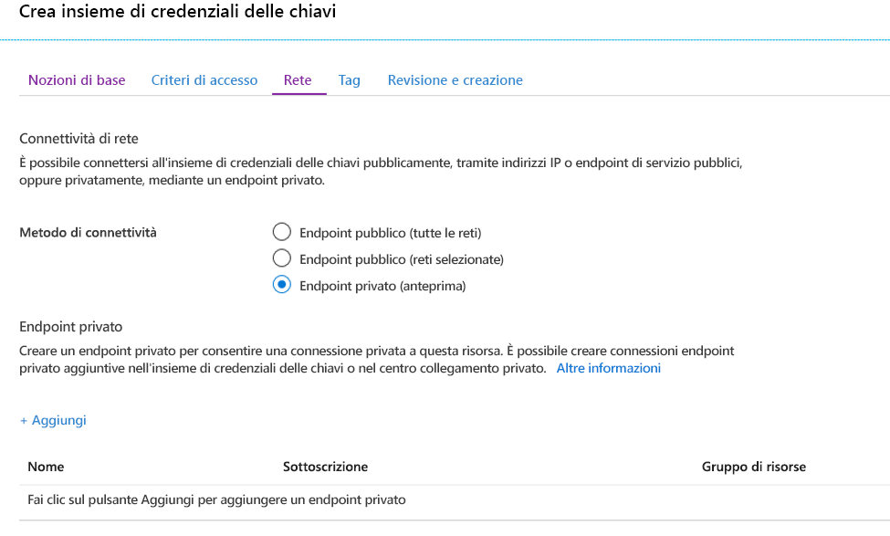
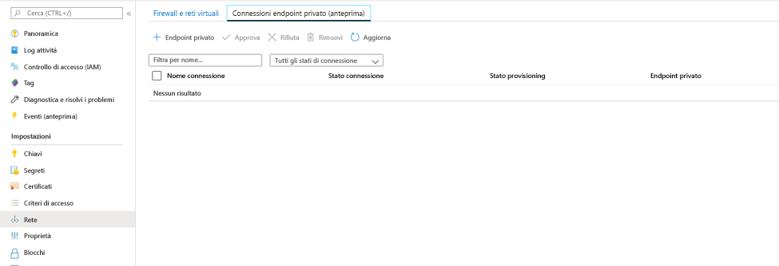
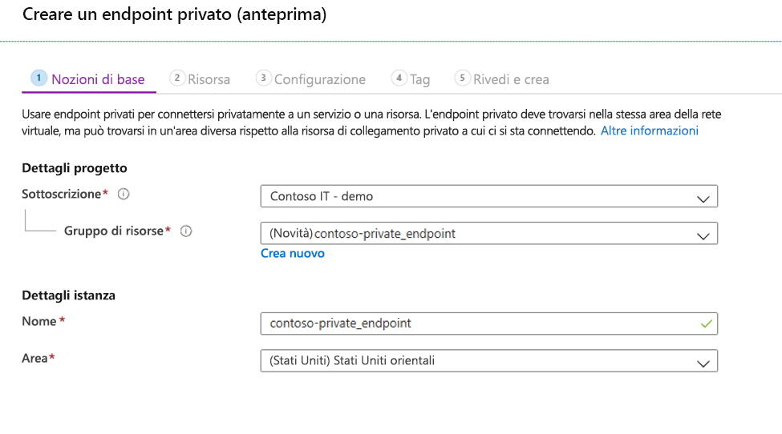
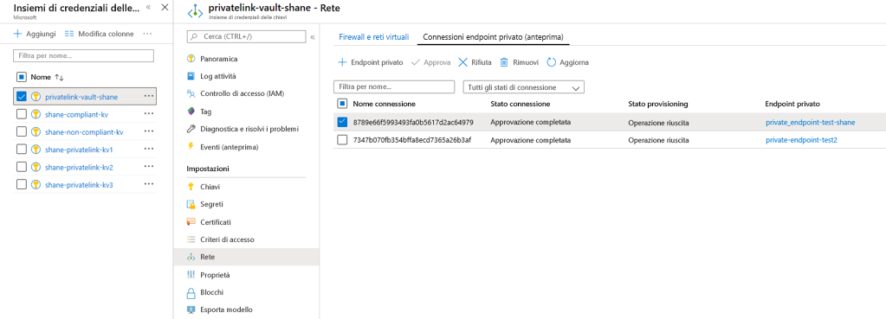

# <a name="integrate-key-vault-with-azure-private-link"></a>Integrare Key Vault con Collegamento privato di Azure

Il servizio Collegamento privato di Azure consente di accedere ai servizi di Azure, ad esempio Azure Key Vault, Archiviazione di Azure e Azure Cosmos DB, e ai servizi di clienti/partner ospitati in Azure tramite un endpoint privato nella rete virtuale.

Un endpoint privato di Azure è un'interfaccia di rete che connette privatamente e in modo sicuro a un servizio basato su Collegamento privato di Azure. L'endpoint privato usa un indirizzo IP privato della rete virtuale, introducendo efficacemente il servizio nella rete virtuale. Tutto il traffico verso il servizio può essere instradato tramite l'endpoint privato, quindi non sono necessari gateway, dispositivi NAT, ExpressRoute o connessioni VPN oppure indirizzi IP pubblici. Il traffico tra la rete virtuale e il servizio attraversa la rete backbone Microsoft, impedendone l'esposizione alla rete Internet pubblica. È possibile connettersi a un'istanza di una risorsa di Azure, garantendo il massimo livello di granularità nel controllo di accesso.

Per altre informazioni, vedere [Che cos'è Collegamento privato di Azure?](../../private-link/private-link-overview.md).

## <a name="prerequisites"></a>Prerequisiti

Per integrare un insieme di credenziali delle chiavi con Collegamento privato di Azure, è necessario quanto segue:

- Un insieme di credenziali delle chiavi.
- Una rete virtuale di Azure.
- Una subnet nella rete virtuale.
- Autorizzazioni di proprietario o collaboratore per l'insieme di credenziali delle chiavi e la rete virtuale.

L'endpoint privato e la rete virtuale devono trovarsi nella stessa area. Quando si seleziona un'area per l'endpoint privato tramite il portale, verranno automaticamente filtrate solo le reti virtuali presenti in tale area. L'insieme di credenziali delle chiavi può trovarsi in un'area diversa.

L'endpoint privato usa un indirizzo IP privato nella rete virtuale.

## <a name="establish-a-private-link-connection-to-key-vault-using-the-azure-portal"></a>Stabilire una connessione di collegamento privato a Key Vault con il portale di Azure 

Creare prima di tutto una rete virtuale seguendo la procedura descritta nell'articolo [Creare una rete virtuale usando il portale di Azure](../../virtual-network/quick-create-portal.md).

È quindi possibile creare un nuovo insieme di credenziali delle chiavi o stabilire una connessione di collegamento privato a un insieme di credenziali delle chiavi esistente.

### <a name="create-a-new-key-vault-and-establish-a-private-link-connection"></a>Creare un nuovo insieme di credenziali delle chiavi e stabilire una connessione di collegamento privato

È possibile creare un nuovo insieme di credenziali delle chiavi seguendo la procedura descritta nell'articolo [Impostare e recuperare un segreto da Azure Key Vault usando il portale di Azure](../secrets/quick-create-portal.md).

Dopo aver configurato le informazioni di base dell'insieme di credenziali delle chiavi, selezionare la scheda Rete e seguire questa procedura:

1. Selezionare il pulsante di opzione Endpoint privato nella scheda Rete.
1. Fare clic sul pulsante "+ Aggiungi" per aggiungere un endpoint privato.

    
 
1. Nel campo "Posizione" del pannello Crea endpoint privato selezionare l'area in cui si trova la rete virtuale. 
1. Nel campo "Nome" creare un nome descrittivo che consentirà di identificare questo endpoint privato. 
1. Selezionare la rete virtuale e la subnet in cui si vuole creare questo endpoint privato nel menu a discesa. 
1. Lasciare invariata l'opzione "Integra con la zona DNS privato".  
1. Selezionare "Ok".

    
 
Sarà ora possibile visualizzare l'endpoint privato configurato. È ora possibile eliminare e modificare questo endpoint privato. Selezionare il pulsante "Rivedi e crea" e creare l'insieme di credenziali delle chiavi. Il completamento della distribuzione richiederà 5-10 minuti. 

### <a name="establish-a-private-link-connection-to-an-existing-key-vault"></a>Stabilire una connessione di collegamento privato a un insieme di credenziali delle chiavi esistente

Se si dispone già di un insieme di credenziali delle chiavi, è possibile creare una connessione di collegamento privato attenendosi alla procedura seguente:

1. Accedere al portale di Azure. 
1. Nella barra di ricerca digitare "key vaults".
1. Selezionare nell'elenco l'insieme di credenziali delle chiavi in cui si vuole aggiungere un endpoint privato.
1. Selezionare la scheda "Rete" in Impostazioni.
1. Selezionare la scheda Connessioni endpoint privato nella parte superiore della pagina.
1. Selezionare il pulsante "+ Endpoint privato" nella parte superiore della pagina.

    
    

È possibile scegliere di creare un endpoint privato per qualsiasi risorsa di Azure usando questo pannello. È possibile usare i menu a discesa per selezionare un tipo di risorsa e selezionare una risorsa nella directory oppure è possibile connettersi a qualsiasi risorsa di Azure usando un ID risorsa. Lasciare invariata l'opzione "Integra con la zona DNS privato".  

## <a name="establish-a-private-link-connection-to-key-vault-using-cli"></a>Stabilire una connessione di collegamento privato a Key Vault con l'interfaccia della riga di comando

### <a name="login-to-azure-cli"></a>Accedere all'interfaccia della riga di comando di Azure
```console
az login 
```
### <a name="select-your-azure-subscription"></a>Selezionare la sottoscrizione di Azure 
```console
az account set --subscription {AZURE SUBSCRIPTION ID}
```
### <a name="create-a-new-resource-group"></a>Creare un nuovo gruppo di risorse 
```console
az group create -n {RG} -l {AZURE REGION}
```
### <a name="register-microsoftkeyvault-as-a-provider"></a>Registrare Microsoft.KeyVault come provider 
```console
az provider register -n Microsoft.KeyVault
```
### <a name="create-a-new-key-vault"></a>Creare una nuova istanza di Key Vault
```console
az keyvault create --name {KEY VAULT NAME} --resource-group {RG} --location {AZURE REGION}
```
### <a name="turn-on-key-vault-firewall"></a>Attivare il firewall di Key Vault
```console
az keyvault update --name {KEY VAULT NAME} --resource-group {RG} --default-action deny
```
### <a name="create-a-virtual-network"></a>Creare una rete virtuale
```console
az network vnet create --resource-group {RG} --name {vNet NAME} --location {AZURE REGION}
```
### <a name="add-a-subnet"></a>Aggiungere una subnet
```console
az network vnet subnet create --resource-group {RG} --vnet-name {vNet NAME} --name {subnet NAME} --address-prefixes {addressPrefix}
```
### <a name="disable-virtual-network-policies"></a>Disabilitare i criteri della rete virtuale 
```console
az network vnet subnet update --name {subnet NAME} --resource-group {RG} --vnet-name {vNet NAME} --disable-private-endpoint-network-policies true
```
### <a name="add-a-private-dns-zone"></a>Creare una zona DNS privato 
```console
az network private-dns zone create --resource-group {RG} --name privatelink.vaultcore.azure.net
```
### <a name="link-private-dns-zone-to-virtual-network"></a>Collegare la zona DNS privato alla rete virtuale 
```console
az network private-dns link vnet create --resource-group {RG} --virtual-network {vNet NAME} --zone-name privatelink.vaultcore.azure.net --name {dnsZoneLinkName} --registration-enabled true
```
### <a name="add-private-dns-records"></a>Aggiungere record DNS privato
```console
# https://docs.microsoft.com/en-us/azure/dns/private-dns-getstarted-cli#create-an-additional-dns-record
az network private-dns zone list -g $rg_name
az network private-dns record-set a add-record -g $rg_name -z "privatelink.vaultcore.azure.net" -n $vault_name -a $kv_network_interface_private_ip
az network private-dns record-set list -g $rg_name -z "privatelink.vaultcore.azure.net"

# From home/public network, you wil get a public IP. If inside a vnet with private zone, nslookup will resolve to the private ip.
nslookup $vault_name.vault.azure.net
nslookup $vault_name.privatelink.vaultcore.azure.net
```
### <a name="create-a-private-endpoint-automatically-approve"></a>Creare un endpoint privato (approvazione automatica) 
```console
az network private-endpoint create --resource-group {RG} --vnet-name {vNet NAME} --subnet {subnet NAME} --name {Private Endpoint Name}  --private-connection-resource-id "/subscriptions/{AZURE SUBSCRIPTION ID}/resourceGroups/{RG}/providers/Microsoft.KeyVault/vaults/ {KEY VAULT NAME}" --group-ids vault --connection-name {Private Link Connection Name} --location {AZURE REGION}
```
### <a name="create-a-private-endpoint-manually-request-approval"></a>Creare un endpoint privato (richiesta manuale di approvazione) 
```console
az network private-endpoint create --resource-group {RG} --vnet-name {vNet NAME} --subnet {subnet NAME} --name {Private Endpoint Name}  --private-connection-resource-id "/subscriptions/{AZURE SUBSCRIPTION ID}/resourceGroups/{RG}/providers/Microsoft.KeyVault/vaults/ {KEY VAULT NAME}" --group-ids vault --connection-name {Private Link Connection Name} --location {AZURE REGION} --manual-request
```
### <a name="show-connection-status"></a>Visualizzare lo stato di connessione 
```console
az network private-endpoint show --resource-group {RG} --name {Private Endpoint Name}
```
## <a name="manage-private-link-connection"></a>Gestire una connessione di collegamento privato

Quando si crea un endpoint privato, la connessione deve essere approvata. Se la risorsa per cui si sta creando un endpoint privato si trova nella directory, sarà possibile approvare la richiesta di connessione purché si disponga di autorizzazioni sufficienti. Se ci si connette a una risorsa di Azure in un'altra directory, è necessario attendere che il proprietario della risorsa approvi la richiesta di connessione.

Sono disponibili quattro stati di provisioning:

| Azione del provider del servizio | Stato dell'endpoint privato del consumer del servizio | Descrizione |
|--|--|--|
| nessuno | In sospeso | La connessione viene creata manualmente ed è in attesa di approvazione dal proprietario della risorsa di collegamento privato. |
| Approvazione | Approved | La connessione è stata approvata automaticamente o manualmente ed è pronta per essere usata. |
| Rifiuto | Rifiutato | La connessione è stata rifiutata dal proprietario della risorsa di collegamento privato. |
| Rimuovere | Disconnesso | La connessione è stata rimossa dal proprietario della risorsa di collegamento privato, l'endpoint privato diventa informativo e deve essere eliminato per la pulizia. |
 
###  <a name="how-to-manage-a-private-endpoint-connection-to-key-vault-using-the-azure-portal"></a>Come gestire una connessione di endpoint privato a Key Vault con il portale di Azure 

1. Accedere al portale di Azure.
1. Nella barra di ricerca digitare "key vaults".
1. Selezionare l'insieme di credenziali delle chiavi che si vuole gestire.
1. Selezionare la scheda "Rete".
1. Se sono presenti connessioni in sospeso, verrà visualizzata una connessione elencata con "In sospeso" nello stato di provisioning. 
1. Selezionare l'endpoint privato che si vuole approvare.
1. Selezionare il pulsante Approva.
1. Se sono presenti connessioni di endpoint privato che si vuole rifiutare, sia che si tratti di una richiesta in sospeso o di una connessione esistente, selezionare la connessione e fare clic sul pulsante "Rifiuta".

    

##  <a name="how-to-manage-a-private-endpoint-connection-to-key-vault-using-azure-cli"></a>Come gestire una connessione di endpoint privato a Key Vault con l'interfaccia della riga di comando di Azure

### <a name="approve-a-private-link-connection-request"></a>Approvare una richiesta di connessione di Collegamento privato
```console
az keyvault private-endpoint-connection approve --approval-description {"OPTIONAL DESCRIPTION"} --resource-group {RG} --vault-name {KEY VAULT NAME} –name {PRIVATE LINK CONNECTION NAME}
```

### <a name="deny-a-private-link-connection-request"></a>Negare una richiesta di connessione di Collegamento privato
```console
az keyvault private-endpoint-connection reject --rejection-description {"OPTIONAL DESCRIPTION"} --resource-group {RG} --vault-name {KEY VAULT NAME} –name {PRIVATE LINK CONNECTION NAME}
```

### <a name="delete-a-private-link-connection-request"></a>Eliminare una richiesta di connessione di Collegamento privato
```console
az keyvault private-endpoint-connection delete --resource-group {RG} --vault-name {KEY VAULT NAME} --name {PRIVATE LINK CONNECTION NAME}
```

## <a name="validate-that-the-private-link-connection-works"></a>Verificare il funzionamento della connessione di collegamento privato

È necessario verificare che le risorse all'interno della stessa subnet della risorsa endpoint privato si connettano all'insieme di credenziali delle chiavi tramite un indirizzo IP privato e che dispongano dell'integrazione con la zona DNS privato corretta.

Creare prima di tutto una macchina virtuale seguendo la procedura descritta nell'articolo [Creare una macchina virtuale di Windows nel portale di Azure](../../virtual-machines/windows/quick-create-portal.md).

Nella scheda "Rete":

1. Specificare una rete virtuale e una subnet. È possibile creare una nuova macchina virtuale o selezionarne una esistente. Se si seleziona una macchina virtuale esistente, assicurarsi che l'area corrisponda.
1. Specificare una risorsa IP pubblico.
1. In "Gruppo di sicurezza di rete della scheda di interfaccia di rete" selezionare "Nessuno".
1. In "Bilanciamento del carico" selezionare "No".

Aprire la riga di comando ed eseguire il comando seguente:

```console
nslookup <your-key-vault-name>.vault.azure.net
```

Se si esegue il comando ns lookup per risolvere l'indirizzo IP di un insieme di credenziali delle chiavi su un endpoint pubblico, verrà visualizzato un risultato simile al seguente:

```console
c:\ >nslookup <your-key-vault-name>.vault.azure.net

Non-authoritative answer:
Name:    
Address:  (public IP address)
Aliases:  <your-key-vault-name>.vault.azure.net
```

Se si esegue il comando ns lookup per risolvere l'indirizzo IP di un insieme di credenziali delle chiavi su un endpoint privato, verrà visualizzato un risultato simile al seguente:

```console
c:\ >nslookup your_vault_name.vault.azure.net

Non-authoritative answer:
Name:    
Address:  10.1.0.5 (private IP address)
Aliases:  <your-key-vault-name>.vault.azure.net
          <your-key-vault-name>.privatelink.vaultcore.azure.net
```

## <a name="troubleshooting-guide"></a>Guida per la risoluzione dei problemi

* Verificare che l'endpoint privato sia nello stato approvato. 
    1. È possibile controllare lo stato ed eventualmente correggerlo nel portale di Azure. Aprire la risorsa Key Vault e fare clic sull'opzione Rete. 
    2. Selezionare quindi la scheda Connessioni endpoint privato. 
    3. Verificare che lo stato della connessione sia Approvato e che lo stato del provisioning sia Riuscito. 
    4. È anche possibile verificare le stesse proprietà nella risorsa endpoint privato e controllare che la rete virtuale corrisponda a quella in uso.

* Verificare che sia presente una risorsa Zona DNS privato. 
    1. Deve essere presente una risorsa Zona DNS privato con il nome esatto privatelink.vaultcore.azure.net. 
    2. Per informazioni su come configurare questa risorsa, vedere il collegamento seguente. [Zone DNS privato](https://docs.microsoft.com/azure/dns/private-dns-privatednszone)
    
* Verificare che la zona DNS privato non sia collegata alla rete virtuale. Se continua a essere restituito l'indirizzo IP pubblico, la causa potrebbe essere questa. 
    1. Se il DNS della zona privata non è collegato alla rete virtuale, la query DNS originata dalla rete virtuale restituirà l'indirizzo IP pubblico dell'insieme di credenziali delle chiavi. 
    2. Passare alla risorsa Zona DNS privato nel portale di Azure e fare clic sull'opzione Collegamenti di rete virtuale. 
    4. La rete virtuale che effettuerà le chiamate all'insieme di credenziali delle chiavi deve essere elencata. 
    5. Se non lo è, aggiungerla. 
    6. Per la procedura dettagliata, vedere [Collegare la rete virtuale alla zona DNS privato](https://docs.microsoft.com/azure/dns/private-dns-getstarted-portal#link-the-virtual-network).

* Verificare che nella zona DNS privato non manchi un record A per l'insieme di credenziali delle chiavi. 
    1. Passare alla pagina Zona DNS privato. 
    2. Fare clic su Panoramica e controllare se è presente un record A con il semplice nome dell'insieme di credenziali delle chiavi (ad esempio fabrikam). Non specificare alcun suffisso.
    3. Controllare l'ortografia e creare o correggere il record A. È possibile usare un valore TTL pari a 3600 (1 ora). 
    4. Assicurarsi di specificare l'indirizzo IP privato corretto. 
    
* Verificare che l'indirizzo IP del record A sia corretto. 
    1. È possibile verificare l'indirizzo IP aprendo la risorsa Endpoint privato nel portale di Azure. 
    2. Nel portale di Azure passare alla risorsa Microsoft.Network/privateEndpoints (non alla risorsa Key Vault).
    3. Nella pagina di panoramica cercare Interfaccia di rete e fare clic su tale collegamento. 
    4. Il collegamento visualizzerà la panoramica della risorsa Scheda di interfaccia di rete, che contiene la proprietà Indirizzo IP privato. 
    5. Verificare che sia l'indirizzo IP corretto specificato nel record A.

## <a name="limitations-and-design-considerations"></a>Limitazioni e considerazioni di progettazione

> [!NOTE]
> Il numero di insiemi di credenziali delle chiavi con endpoint privati abilitati per ogni sottoscrizione è un limite regolabile. Il limite indicato di seguito è il limite predefinito. Se si vuole richiedere un aumento del limite per il servizio, inviare un messaggio di posta elettronica a akv-privatelink@microsoft.com. Queste richieste vengono approvate caso per caso.

**Pricing** (Prezzi): per informazioni sui prezzi, vedere [Prezzi di Collegamento privato di Azure](https://azure.microsoft.com/pricing/details/private-link/).

**Limitazioni** :  l'endpoint privato per Azure Key Vault è disponibile solo nelle aree di Azure pubbliche.

**Numero massimo di endpoint privati per Key Vault** : 64.

**Numero predefinito di insiemi di credenziali delle chiavi con endpoint privati per ogni sottoscrizione** : 400.

Per altre informazioni, vedere [Servizio Collegamento privato di Azure: Limitazioni](../../private-link/private-link-service-overview.md#limitations)

## <a name="next-steps"></a>Passaggi successivi

- Altre informazioni su [Collegamento privato di Azure](../../private-link/private-link-service-overview.md)
- Altre informazioni su [Azure Key Vault](overview.md)
