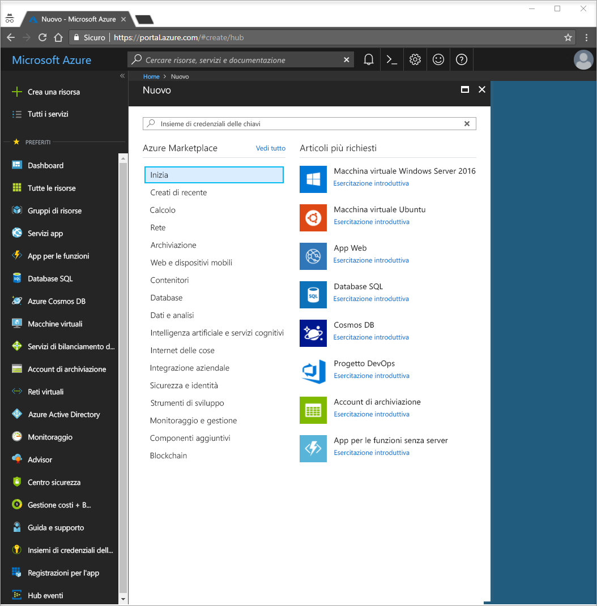
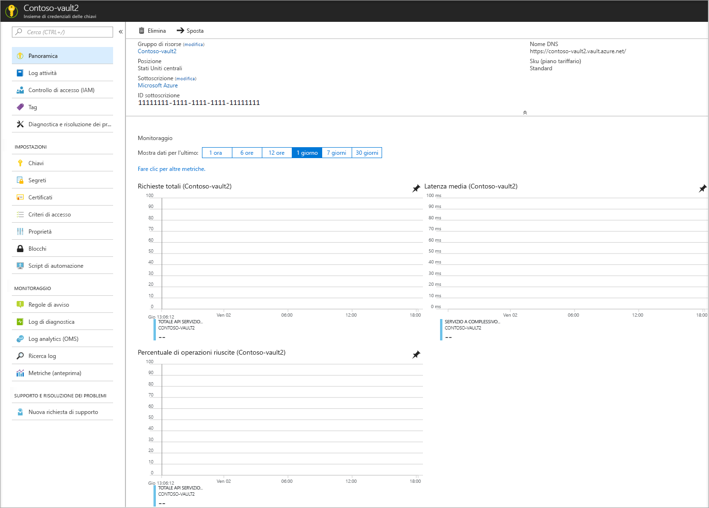
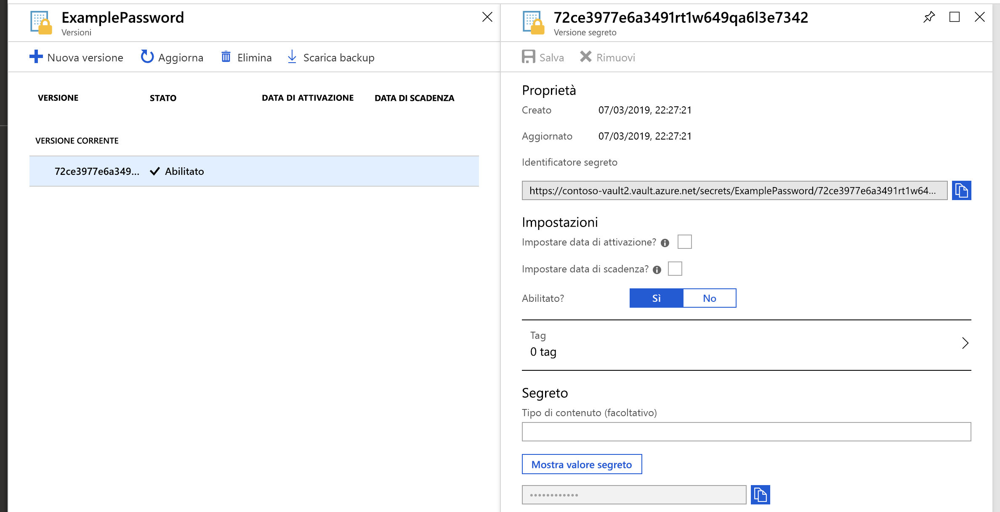

# Guida introduttiva: Impostare e recuperare un segreto da Azure Key Vault usando il portale di Azure

Azure Key Vault è un servizio cloud che funziona come archivio protetto dei segreti. È possibile archiviare in modo sicuro chiavi, password, certificati e altri segreti. È possibile creare e gestire istanze di Azure Key Vault tramite il portale di Azure. In questo avvio rapido viene creato un insieme di credenziali delle chiavi che viene poi usato per archiviare un segreto. Per altre informazioni su Key Vault, vedere la relativa [panoramica](key-vault-overview.md).

Se non si ha una sottoscrizione di Azure, creare un [account gratuito](https://azure.microsoft.com/free/?WT.mc_id=A261C142F) prima di iniziare.

## Accedere ad Azure

Accedere al portale di Azure all'indirizzo https://portal.azure.com.

## Creare un insieme di credenziali

1. Selezionare l'opzione **Crea una risorsa** nell'angolo superiore sinistro del portale di Azure

    
2. Nella casella di ricerca immettere **Key Vault**.
3. Nell'elenco dei risultati scegliere **Key Vault**.
4. Nella sezione Key Vault scegliere **Crea**.
5. Nella pagina **Crea insieme di credenziali delle chiavi** specificare le informazioni seguenti:
    - **Nome**: è necessario un nome univoco. Per questa guida introduttiva si usa **Contoso-vault2**. 
    - **Sottoscrizione** Scegliere una sottoscrizione.
    - In **Gruppo di risorse** scegliere **Crea nuovo** e immettere il nome del gruppo di risorse.
    - Scegliere un percorso nel menu a discesa **Percorso**.
    - Lasciare invariati i valori predefiniti delle altre opzioni.
6. Dopo avere specificato le informazioni, selezionare **Crea**.

Prendere nota delle due proprietà elencate di seguito:

* **Vault Name**: nell'esempio corrisponde a **Contoso-Vault2**. Questo nome verrà usato per altri passaggi.
* **Vault URI** (URI dell'insieme di credenziali): in questo esempio corrisponde a https://contoso-vault2.vault.azure.net/. Le applicazioni che usano l'insieme di credenziali tramite l'API REST devono usare questo URI.

A questo punto, l'account Azure è l'unico autorizzato a eseguire operazioni su questo nuovo insieme di credenziali.

## Aggiungere un segreto all'istanza di Key Vault

Per aggiungere un segreto all'insieme di credenziali, sono sufficienti un paio di passaggi aggiuntivi. In questo caso si aggiunge una password che può essere usata da un'applicazione. La password è denominata **ExamplePassword** e al suo interno viene archiviato il valore di **hVFkk965BuUv**.

1. Nella pagina delle proprietà dell'istanza di Key Vault selezionare **Segreti**.
2. Fare clic su **Genera/Importa**.
3. Nella schermata **Crea un segreto** selezionare i seguenti valori:
    - **Opzioni di caricamento**: manuale.
    - **Nome**: ExamplePassword.
    - **Valore**: hVFkk965BuUv
    - Lasciare invariati gli altri valori predefiniti. Fare clic su **Create**(Crea).

Dopo avere ricevuto il messaggio che indica che il segreto è stato creato, è possibile fare clic sul segreto nell'elenco. Sarà quindi possibile vedere alcune delle proprietà. Se si fa clic sulla versione corrente è possibile visualizzare il valore specificato nel passaggio precedente.

Facendo clic sul pulsante "Mostra il valore segreto" nel riquadro di destra, è possibile visualizzare il valore nascosto. 

## Pulire le risorse

Altre guide introduttive ed esercitazioni relative a Key Vault si basano su questa guida introduttiva. Se si prevede di usare le guide introduttive e le esercitazioni successive, è consigliabile non cancellare le risorse create.
Quando non è più necessario, eliminare il gruppo di risorse per eliminare l'istanza di Key Vault e le risorse correlate. Per eliminare il gruppo di risorse tramite il portale:

1. Immettere il nome del gruppo di risorse nella casella di ricerca nella parte superiore del portale. Quando nei risultati della ricerca viene visualizzato il gruppo di risorse usato in questo avvio rapido, selezionarlo.
2. Selezionare **Elimina gruppo di risorse**.
3. Nella casella **DIGITARE IL NOME DEL GRUPPO DI RISORSE:** digitare il nome del gruppo di risorse e selezionare **Elimina**.

## Passaggi successivi

In questa guida introduttiva è stata creata un'istanza di Key Vault ed è stato archiviato un segreto. Per altre informazioni su Key Vault e su come usarlo con le applicazioni, passare all'esercitazione per le applicazioni Web che usano Key Vault.

> [!div class="nextstepaction"]
> Per informazioni su come leggere un segreto da Key Vault in un'applicazione Web usando le identità gestite per le risorse di Azure, proseguire con l'esercitazione [Configurare un'applicazione Web di Azure per leggere un segreto da Key Vault](quick-create-net.md).
