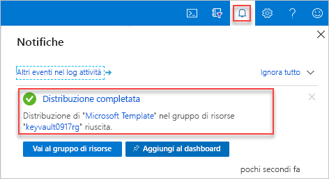

# <a name="quickstart-set-and-retrieve-a-secret-from-azure-key-vault-using-resource-manager-template"></a>Guida introduttiva: Impostare e recuperare un segreto da Azure Key Vault tramite un modello di Resource Manager

[Azure Key Vault](./key-vault-overview.md) è un servizio cloud che offre un archivio sicuro per i segreti, ad esempio le chiavi, le password, i certificati e così via. Questo argomento di avvio rapido illustra il processo di distribuzione di un modello di Resource Manager per creare un insieme di credenziali delle chiavi e un segreto.

Un [modello di Resource Manager](../azure-resource-manager/template-deployment-overview.md) è un file JSON (JavaScript Object Notation) che definisce l'infrastruttura e la configurazione del progetto. Il modello usa una sintassi dichiarativa che consente di indicare ciò che si intende distribuire senza dover scrivere la sequenza dei comandi di programmazione per crearlo. Per altre informazioni sullo sviluppo di modelli di Resource Manager, vedere la [documentazione di Resource Manager](/azure/azure-resource-manager/) e le [informazioni di riferimento sui modelli](/azure/templates/microsoft.keyvault/allversions).

Se non si ha una sottoscrizione di Azure, creare un [account gratuito](https://azure.microsoft.com/free/?WT.mc_id=A261C142F) prima di iniziare.

## <a name="prerequisites"></a>Prerequisiti

Per completare l'esercitazione di questo articolo, sono necessari gli elementi seguenti:

* Per la configurazione delle autorizzazioni nel modello è necessario l'ID oggetto utente di Azure AD. La procedura seguente recupera l'ID oggetto (GUID).

    1. Eseguire il seguente comando di Azure PowerShell o dell'interfaccia della riga di comando di Azure selezionando **Prova** e quindi incollare lo script nel riquadro della shell. Per incollare lo script, fare clic con il pulsante destro del mouse nella shell e quindi scegliere **Incolla**.

        # <a name="clitabcli"></a>[CLI](#tab/CLI)
        ```azurecli-interactive
        echo "Enter your email address that is used to sign in to Azure:" &&
        read upn &&
        az ad user show --id $upn --query "objectId" &&
        echo "Press [ENTER] to continue ..."
        ```

        # <a name="powershelltabpowershell"></a>[PowerShell](#tab/PowerShell)
        ```azurepowershell-interactive
        $upn = Read-Host -Prompt "Enter your email address used to sign in to Azure"
        (Get-AzADUser -UserPrincipalName $upn).Id
        Write-Host "Press [ENTER] to continue..."
        ```

        ---

    2. Annotare l'ID di oggetto poiché verrà richiesto nella sezione successiva di questo avvio rapido.

## <a name="create-a-vault-and-a-secret"></a>Creare un insieme di credenziali e un segreto

Il modello usato in questo avvio rapido proviene dai [modelli di avvio rapido di Azure](https://azure.microsoft.com/resources/templates/101-key-vault-create/).

[!code-json[<Azure Resource Manager template create key vault>](~/quickstart-templates/101-key-vault-create/azuredeploy.json)]

Nel modello sono definite due risorse di Azure:

* **Microsoft.KeyVault/vaults**: consente di creare un insieme di credenziali delle chiavi di Azure.
* **Microsoft.KeyVault/vaults/secrets**: consente di creare un segreto dell'insieme di credenziali delle chiavi.

Altri esempi di modelli di Azure Key Vault sono disponibili [qui](https://azure.microsoft.com/resources/templates/?resourceType=Microsoft.Keyvault).

1. Selezionare l'immagine seguente per accedere ad Azure e aprire un modello. Il modello crea un insieme di credenziali delle chiavi e un segreto.

    <a href="https://portal.azure.com/#create/Microsoft.Template/uri/https%3A%2F%2Fraw.githubusercontent.com%2FAzure%2Fazure-quickstart-templates%2Fmaster%2F101-key-vault-create%2Fazuredeploy.json"></a>

2. Selezionare o immettere i valori seguenti.

    

    A meno che non sia specificato, usare il valore predefinito per creare l'insieme di credenziali delle chiavi e un segreto.

    * **Sottoscrizione**: selezionare una sottoscrizione di Azure.
    * **Gruppo di risorse**: selezionare **Crea nuovo**, immettere un nome univoco per il gruppo di risorse e quindi fare clic su **OK**.
    * **Località**: selezionare una località.  Ad esempio **Stati Uniti centrali**.
    * **Nome insieme di credenziali delle chiavi**: immettere un nome per l'insieme di credenziali delle chiavi. Il nome deve essere globalmente univoco all'interno dello spazio dei nomi .vault.azure.net. Sarà necessario nella sezione successiva per convalidare la distribuzione.
    * **ID tenant**: viene recuperato automaticamente dalla funzione del modello.  Non modificare il valore predefinito.
    * **ID oggetto utente AD**: immettere l'ID oggetto utente di Azure AD recuperato nella sezione [Prerequisiti](#prerequisites).
    * **Nome segreto**: immettere un nome per il segreto archiviato nell'insieme di credenziali delle chiavi,  ad esempio **adminpassword**.
    * **Valore del segreto**: immettere il valore del segreto.  Se si archivia una password, è consigliabile usare la password generata che è stata creata nella sezione Prerequisiti.
    * **Accetto le condizioni riportate sopra**: selezionare questa casella.
3. Selezionare **Acquisto**. Al termine della distribuzione dell'insieme di credenziali delle chiavi, si riceverà una notifica:

    

Per distribuire il modello, si usa il portale di Azure. Oltre al portale di Azure, è anche possibile usare Azure PowerShell, l'interfaccia della riga di comando di Azure e l'API REST. Per informazioni sugli altri metodi di distribuzione, vedere [Distribuire modelli](../azure-resource-manager/resource-group-template-deploy.md).

## <a name="validate-the-deployment"></a>Convalidare la distribuzione

È possibile usare il portale di Azure per controllare l'insieme di credenziali delle chiavi e il segreto oppure usare lo script dell'interfaccia della riga di comando di Azure o di Azure PowerShell seguente per elencare il segreto creato.

# <a name="clitabcli"></a>[CLI](#tab/CLI)

```azurecli-interactive
echo "Enter your key vault name:" &&
read keyVaultName &&
az keyvault secret list --vault-name $keyVaultName &&
echo "Press [ENTER] to continue ..."
```

# <a name="powershelltabpowershell"></a>[PowerShell](#tab/PowerShell)

```azurepowershell-interactive
$keyVaultName = Read-Host -Prompt "Enter your key vault name"
Get-AzKeyVaultSecret -vaultName $keyVaultName
Write-Host "Press [ENTER] to continue..."
```

---

L'output sarà simile al seguente:

# <a name="clitabcli"></a>[CLI](#tab/CLI)


# <a name="powershelltabpowershell"></a>[PowerShell](#tab/PowerShell)


---
## <a name="clean-up-resources"></a>Pulire le risorse

Altre guide introduttive ed esercitazioni relative a Key Vault si basano su questa guida introduttiva. Se si prevede di usare le guide introduttive e le esercitazioni successive, è consigliabile non cancellare le risorse create.
Quando non è più necessario, eliminare il gruppo di risorse per eliminare l'istanza di Key Vault e le risorse correlate. Per eliminare il gruppo di risorse mediante l'interfaccia della riga di comando di Azure oppure Azure PowerShell:

# <a name="clitabcli"></a>[CLI](#tab/CLI)

```azurecli-interactive
echo "Enter the Resource Group name:" &&
read resourceGroupName &&
az group delete --name $resourceGroupName &&
echo "Press [ENTER] to continue ..."
```

# <a name="powershelltabpowershell"></a>[PowerShell](#tab/PowerShell)

```azurepowershell-interactive
$resourceGroupName = Read-Host -Prompt "Enter the Resource Group name"
Remove-AzResourceGroup -Name $resourceGroupName
Write-Host "Press [ENTER] to continue..."
```

---

## <a name="next-steps"></a>Passaggi successivi

In questo argomento di avvio rapido si sono creati un insieme di credenziali delle chiavi e un segreto usando un modello di Azure Resource Manager ed è stata convalidata la distribuzione. Per altre informazioni su Key Vault e Azure Resource Manager, continuare con gli articoli seguenti.

- Leggere una [panoramica di Azure Key Vault](key-vault-overview.md)
- Vedere altre informazioni su [Azure Resource Manager](../azure-resource-manager/resource-group-overview.md)
- Leggere altri dettagli su [chiavi, segreti e certificati](about-keys-secrets-and-certificates.md)
- Esaminare le [procedure consigliate per Azure Key Vault](key-vault-best-practices.md)