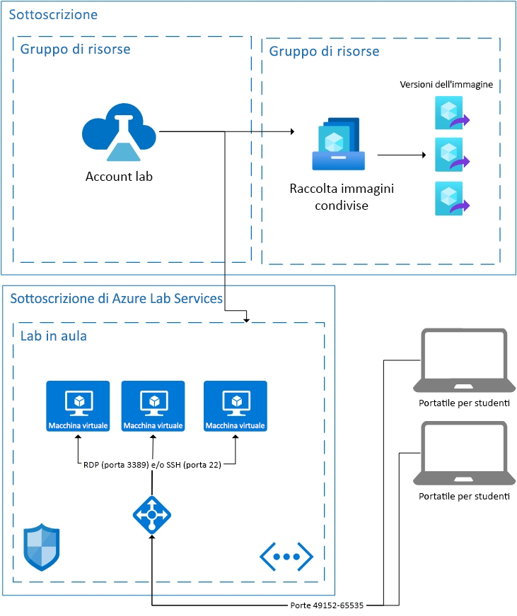

# Elementi di base dell'architettura in Azure Lab Services

Azure Lab Services è una soluzione SaaS (Software-as-a-Service), il che significa che le risorse richieste da Lab Services vengono gestite automaticamente. Questo articolo illustra le risorse di base usate da Lab Services e l'architettura di base di un lab.  

Un paio di aree di Azure Lab Services consentono di usare le proprie risorse insieme al servizio.  Per altre informazioni sull'uso di VM nella propria rete, vedere come [eseguire il peering di una rete virtuale](how-to-connect-peer-virtual-network.md).  Per riutilizzare le immagini di una raccolta di immagini condivise, vedere come [collegare una raccolta di immagini condivise](how-to-attach-detach-shared-image-gallery.md).

Di seguito è riportata l'architettura di base di un lab per le classi.  L'account lab è ospitato nella sottoscrizione. Le VM degli studenti, oltre alle risorse necessarie per supportarle, sono ospitate in una sottoscrizione di proprietà di Lab Services. Ecco una descrizione più dettagliata del contenuto delle sottoscrizioni di Lab Services.

## Risorse ospitate

Le risorse necessarie per eseguire un lab per le classi sono ospitate in una delle sottoscrizioni di Azure gestite da Microsoft.  Le risorse includono una macchina virtuale modello per l'istruttore, una macchina virtuale per ogni studente ed elementi correlati alla rete, ad esempio un sistema di bilanciamento del carico, una rete virtuale e un gruppo di sicurezza di rete.  Queste sottoscrizioni vengono monitorate per rilevare attività sospette.  È importante notare che questo monitoraggio viene eseguito esternamente alle macchine virtuali tramite l'estensione di VM o il monitoraggio dei modelli di rete.  Se è abilitato l'[arresto in seguito alla disconnessione](how-to-enable-shutdown-disconnect.md), nella macchina virtuale è abilitata un'estensione di diagnostica. L'estensione notifica a Lab Services l'evento di disconnessione della sessione RDP (Remote Desktop Protocol).

## Rete virtuale

Ogni lab è isolato nella rispettiva rete virtuale.  Se il lab include una [rete virtuale con peering](how-to-connect-peer-virtual-network.md), ogni lab è isolato nella rispettiva subnet.  Gli studenti si connettono alla loro macchina virtuale tramite un sistema di bilanciamento del carico.  Le macchine virtuali degli studenti non hanno un indirizzo IP pubblico, ma solo un indirizzo IP privato.  La stringa di connessione per lo studente sarà costituita dall'indirizzo IP pubblico del sistema di bilanciamento del carico e da una porta casuale compresa tra 49152 e 65535.  Le regole in ingresso nel sistema di bilanciamento del carico inoltrano la connessione, a seconda del sistema operativo, alla porta 22 (SSH) o alla porta 3389 (RDP) della macchina virtuale appropriata. Un gruppo di sicurezza di rete impedisce il traffico esterno su qualsiasi altra porta.

## Controllo di accesso alle macchine virtuali

Lab Services gestisce la capacità degli studenti di eseguire azioni come l'avvio e l'arresto delle loro macchine virtuali.  Controlla inoltre l'accesso alle informazioni di connessione delle VM.

Lab Services gestisce anche la registrazione degli studenti al servizio. Attualmente sono disponibili due impostazioni di accesso diverse: con restrizioni e senza. Per altre informazioni, vedere l'articolo [Gestire gli utenti del lab](how-to-configure-student-usage.md#send-invitations-to-users). L'accesso con restrizioni significa che Lab Services verifica che gli studenti vengano aggiunti come utenti prima di autorizzare l'accesso. Senza restrizioni significa che tutti gli utenti possono registrarsi purché abbiano il collegamento di registrazione e sia disponibile capacità nel lab. L'accesso senza restrizioni può essere utile per eventi hackathon.

Le VM degli studenti ospitate nel lab per le classi hanno un nome utente e una password impostati dall'autore del lab.  In alternativa, l'autore del lab può consentire agli studenti registrati di scegliere la loro password al primo accesso.  

## Passaggi successivi

Per altre informazioni sulle funzionalità disponibili in Lab Services, vedere [Concetti di Azure Lab Services](classroom-labs-concepts.md) e [Panoramica di Azure Lab Services](classroom-labs-overview.md).
