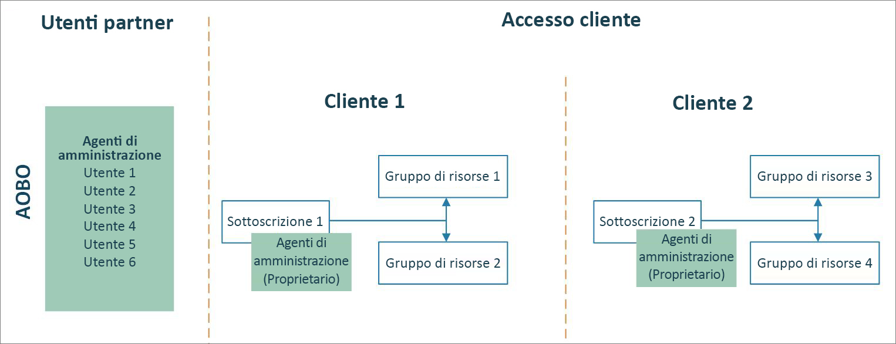
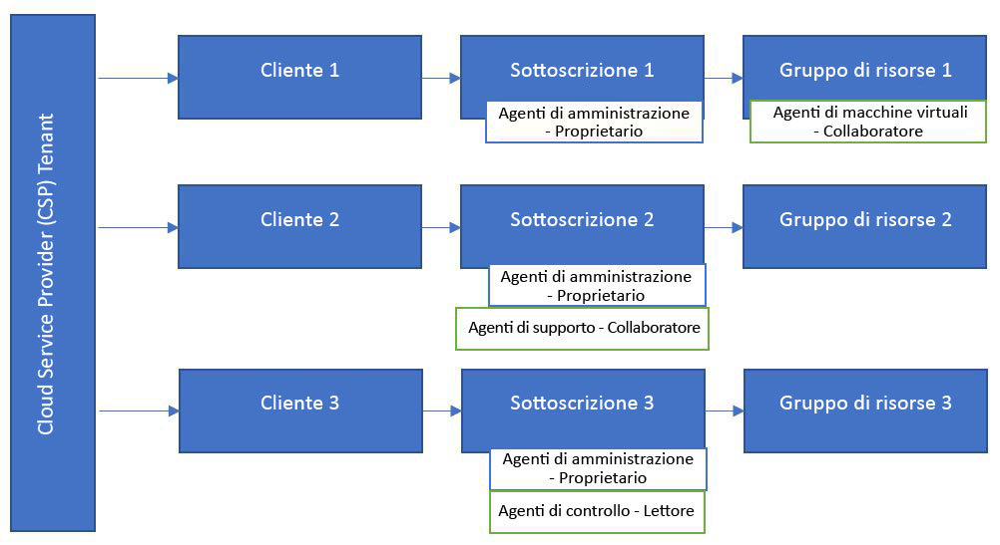

# Azure Lighthouse e programma Cloud Solution Provider

I partner [CSP (Cloud Solution Provider)](https://docs.microsoft.com/partner-center/csp-overview) possono già accedere alle sottoscrizioni di Azure create per i clienti tramite il programma CSP usando la funzionalità [Amministra per conto terzi](https://channel9.msdn.com/Series/cspdev/Module-11-Admin-On-Behalf-Of-AOBO). Questo accesso consente di supportare, configurare e gestire le sottoscrizioni dei clienti direttamente.

Con Azure Lighthouse è possibile usare la gestione risorse delegate di Azure insieme ad Amministra per conto terzi. In questo modo è possibile migliorare la sicurezza e ridurre l'accesso non necessario abilitando autorizzazioni più granulari per gli utenti. È inoltre possibile aumentare l'efficienza e la scalabilità, in quanto gli utenti possono lavorare con più sottoscrizioni dei clienti usando un unico account di accesso nel tenant.

## Funzionalità Amministra per conto terzi

Con la funzionalità Amministra per conto terzi, gli utenti con il ruolo [Agente amministratore](https://docs.microsoft.com/partner-center/permissions-overview#manage-commercial-transactions-in-partner-center-azure-ad-and-csp-roles) nel tenant avranno l'accesso Amministra per conto terzi alle sottoscrizioni di Azure create tramite il programma CSP. Tutti gli utenti che devono accedere alle sottoscrizioni di qualsiasi cliente devono essere membri di questo gruppo. La funzionalità Amministra per conto terzi non offre la possibilità di creare gruppi distinti per clienti diversi o di abilitare ruoli diversi per gruppi o utenti.

## Gestione risorse delegate di Azure

Usando la gestione delle risorse delegate di Azure, è possibile assegnare gruppi diversi a clienti o ruoli diversi, come illustrato nel diagramma seguente. Poiché gli utenti avranno il livello di accesso appropriato tramite la gestione delle risorse delegate di Azure, è possibile ridurre il numero di utenti che hanno il ruolo Agente amministratore e che hanno quindi l'accesso Amministra per conto terzi. Questo garantisce una maggiore sicurezza limitando l'accesso non necessario alle risorse dei clienti. Offre anche maggiori possibilità di gestire più clienti su larga scala.

Per eseguire l'onboarding di una sottoscrizione creata tramite il programma CSP, seguire la procedura descritta in [Eseguire l'onboarding di una sottoscrizione nella gestione risorse delegate di Azure](../how-to/onboard-customer.md). Tutti gli utenti che hanno il ruolo Agente amministratore nel tenant possono eseguire questa operazione di onboarding.

## Passaggi successivi

- Informazioni sulle [esperienze di gestione tra tenant](cross-tenant-management-experience.md).
- Informazioni su come [eseguire l'onboarding di una sottoscrizione di un cliente nella gestione risorse delegate di Azure](../how-to/onboard-customer.md).
- Informazioni sul [programma Cloud Solution Provider](https://docs.microsoft.com/partner-center/csp-overview).
