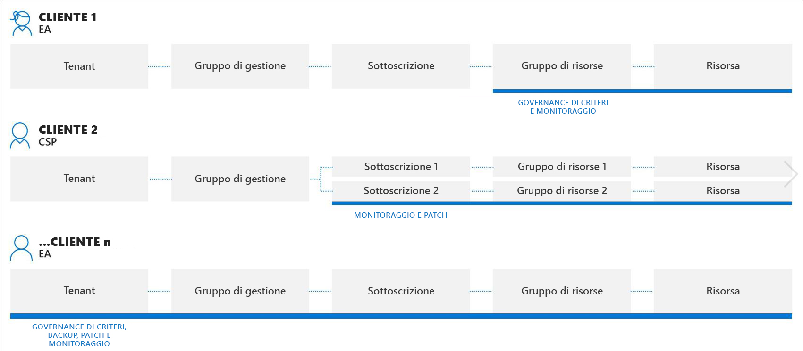
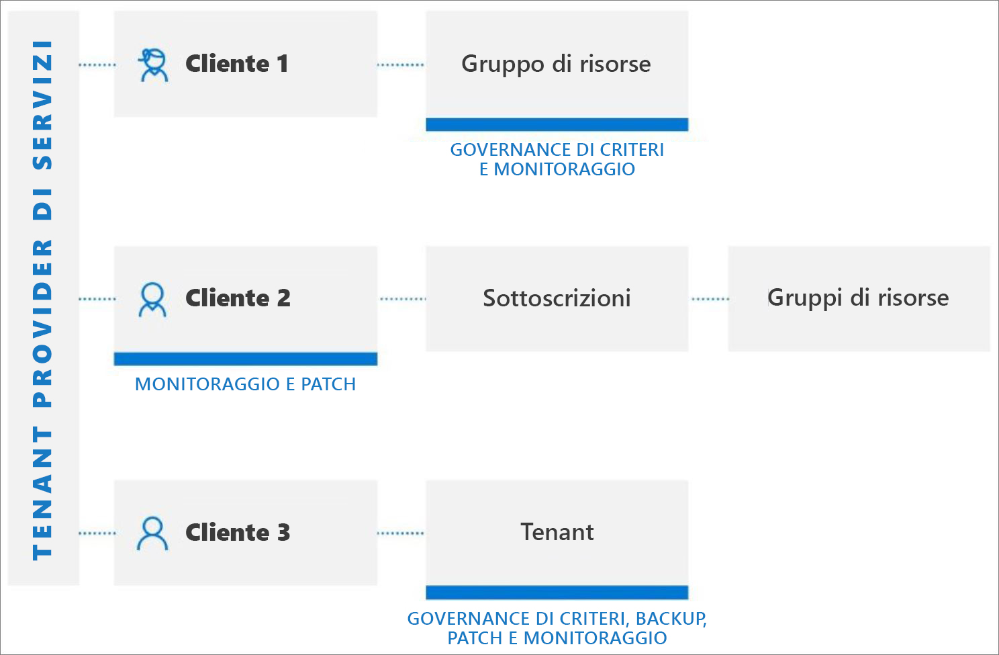

# Esperienze di gestione tra tenant

Questo articolo descrive gli scenari che un provider di servizi può usare con la [gestione risorse delegate di Azure](../concepts/azure-delegated-resource-management.md) per gestire le risorse di Azure per più clienti dal tenant nel [portale di Azure](https://portal.azure.com).

> [!NOTE]
> La gestione risorse delegate di Azure può essere usata anche all'interno di un'azienda con più tenant propri per semplificare l'amministrazione tra tenant.

## Informazioni sui tenant dei clienti

Un tenant di Azure Active Directory (Azure AD) è una rappresentazione di un'organizzazione. Si tratta di un'istanza dedicata di Azure AD che un'organizzazione riceve quando crea una relazione con Microsoft iscrivendosi ad Azure, Microsoft 365 o ad altri servizi. Ogni tenant di Azure AD è distinto e separato dagli altri tenant di Azure AD e ha un proprio ID tenant (un GUID). Per altre informazioni, vedere [Informazioni su Azure Active Directory](https://docs.microsoft.com/azure/active-directory/fundamentals/active-directory-whatis).

In genere, per gestire le risorse di Azure per un cliente, i provider di servizi devono accedere al portale di Azure usando un account associato al tenant del cliente, richiedendo a un amministratore del tenant del cliente di creare e gestire gli account utente per il provider di servizi.

Con la gestione risorse delegate di Azure, il processo di onboarding specifica gli utenti all'interno del tenant del provider di servizi che potranno accedere a sottoscrizioni, gruppi di risorse e risorse nel tenant del cliente e gestirli. Questi utenti possono quindi accedere al portale di Azure usando le proprie credenziali. All'interno del portale di Azure possono gestire le risorse appartenenti a tutti i clienti a cui hanno accesso. Per eseguire questa operazione, visitare la pagina [Clienti personali](../how-to/view-manage-customers.md) nel portale di Azure o accedere direttamente al contesto della sottoscrizione di tale cliente nel portale di Azure o tramite API.

La gestione risorse delegate di Azure consente una maggiore flessibilità nella gestione delle risorse per più clienti senza dover accedere ad account diversi in tenant diversi. Un provider di servizi, ad esempio, può avere tre clienti, con responsabilità e livelli di accesso diversi, come illustrato di seguito:

Usando la gestione risorse delegate di Azure, gli utenti autorizzati possono accedere al tenant del provider di servizi per accedere a queste risorse, come illustrato di seguito:

## Scenari e servizi supportati

L'esperienza di gestione tra tenant supporta attualmente gli scenari seguenti con le risorse dei clienti delegate:

[Automazione di Azure](https://docs.microsoft.com/azure/automation/):

- Usare gli account di automazione per accedere e lavorare con le risorse dei clienti delegate

[Backup di Azure](https://docs.microsoft.com/azure/backup/):

- Eseguire il backup e il ripristino dei dati dei clienti nei tenant dei clienti

[Servizio Azure Kubernetes](https://docs.microsoft.com//azure/aks/):

- Gestire gli ambienti Kubernetes ospitati e distribuire e gestire le applicazioni in contenitori nei tenant dei clienti

[Monitoraggio di Azure](https://docs.microsoft.com/azure/azure-monitor/):

- Visualizzare gli avvisi per le sottoscrizioni delegate nel portale di Azure o a livello di codice tramite chiamate API REST, con la possibilità di visualizzare gli avvisi in tutte le sottoscrizioni
- Visualizzare i dettagli del log attività per le sottoscrizioni delegate
- Log Analytics: Eseguire query sui dati dalle aree di lavoro remote dei clienti in più tenant

[Criteri di Azure](https://docs.microsoft.com/azure/governance/policy/):

- Gli snapshot di conformità mostrano i dettagli per i criteri assegnati nelle sottoscrizioni delegate
- Creare e modificare le definizioni dei criteri in una sottoscrizione delegata
- Assegnare le definizioni dei criteri definite dal cliente nella sottoscrizione delegata
- I clienti visualizzano i criteri creati dal provider di servizi insieme ai criteri che hanno creato personalmente
- Consente di correggere le assegnazioni deployIfNotExists all'interno dei tenant dei clienti se il cliente ha configurato l'identità gestita e *roleDefinitionIds* per l'assegnazione dei criteri

[Azure Resource Graph](https://docs.microsoft.com/azure/governance/resource-graph/):

- Include ora l'ID tenant nei risultati delle query restituiti, consentendo di determinare se una sottoscrizione appartiene al tenant del cliente o al tenant del provider di servizi

[Centro sicurezza di Azure](https://docs.microsoft.com/azure/security-center/):

- Visibilità tra tenant
  - Monitorare la conformità ai criteri di sicurezza e garantire la copertura della sicurezza tra le risorse di tutti i tenant
  - Monitoraggio continuo della conformità alle normative per più clienti in una singola visualizzazione
  - Monitorare, valutare e classificare in ordine di priorità le raccomandazioni sulla sicurezza di utilità pratica con il calcolo del punteggio di sicurezza
- Gestione del comportamento di sicurezza tra tenant
  - Gestire i criteri di sicurezza
  - Intervenire sulle risorse non conformi alle raccomandazioni sulla sicurezza di utilità pratica
  - Raccogliere e archiviare i dati relativi alla sicurezza
- Rilevamento e protezione dalle minacce tra tenant
  - Rilevare le minacce nelle risorse dei tenant
  - Applicare controlli avanzati di protezione dalle minacce, ad esempio l'accesso JIT alle macchine virtuali
  - Rafforzare la configurazione dei gruppi di sicurezza di rete con Protezione avanzata adattiva per la rete
  - Assicurarsi che i server eseguano solo le applicazioni e i processi che devono eseguire con i controlli applicazione adattivi
  - Monitorare le modifiche apportate a file e voci del Registro di sistema importanti con Monitoraggio dell'integrità dei file

[Integrità dei servizi di Azure](https://docs.microsoft.com/azure/service-health/):

- Monitorare l'integrità delle risorse dei clienti con Integrità risorse di Azure
- Tenere traccia dell'integrità dei servizi di Azure usati dai clienti

[Azure Site Recovery](https://docs.microsoft.com/azure/site-recovery/):

- Gestire le opzioni di ripristino di emergenza per le macchine virtuali di Azure nei tenant dei clienti (tenere presente che non è possibile usare gli account RunAs per copiare le estensioni delle macchine virtuali)

[Macchine virtuali di Azure](https://docs.microsoft.com/azure/virtual-machines/):

- Usare le estensioni macchina virtuale di Azure per fornire attività di configurazione e automazione post-distribuzione sulle macchine virtuali di Azure nei tenant dei clienti
- Usare la diagnostica di avvio per risolvere i problemi delle macchine virtuali di Azure nei tenant dei clienti
- Accedere alle macchine virtuali con la console seriale nei tenant dei clienti
- Si noti che non è possibile usare Azure Active Directory per l'accesso remoto a una macchina virtuale e non è possibile integrare una macchina virtuale con un insieme di credenziali delle chiavi per password, segreti o chiavi crittografiche per la crittografia del disco

[Rete virtuale di Azure](https://docs.microsoft.com/azure/virtual-network/):

- Distribuire e gestire reti virtuali e schede di interfaccia di rete virtuale nei tenant dei clienti

Richieste di supporto:

- Aprire le richieste di supporto per le risorse delegate dal pannello **Guida e supporto** nel portale di Azure (selezionando il piano di supporto disponibile per l'ambito delegato)

In tutti gli scenari tenere presenti le limitazioni correnti seguenti:

- Le richieste gestite da Azure Resource Manager possono essere eseguite usando la gestione risorse delegate di Azure. Gli URI delle operazioni per queste richieste iniziano con `https://management.azure.com`. Le richieste gestite da un'istanza di un tipo di risorsa (ad esempio l'accesso ai segreti di Key Vault o l'accesso ai dati di archiviazione) non sono tuttavia supportate con la gestione risorse delegate di Azure. Gli URI delle operazioni per queste richieste iniziano in genere con un indirizzo univoco per l'istanza, ad esempio `https://myaccount.blob.core.windows.net` o `https://mykeyvault.vault.azure.net/`. Il secondo è in genere usato per le operazioni di dati invece che per le operazioni di gestione. 
- Le assegnazione di ruolo devono usare i [ruoli predefiniti](https://docs.microsoft.com/azure/role-based-access-control/built-in-roles) del controllo degli accessi in base al ruolo. Tutti i ruoli predefiniti sono attualmente supportati con la gestione risorse delegate di Azure tranne Proprietario, Amministratore Accesso utenti o qualsiasi ruolo predefinito con l'autorizzazione [DataActions](https://docs.microsoft.com/azure/role-based-access-control/role-definitions#dataactions). Non sono supportati neppure i ruoli personalizzati e i [ruoli di amministratore della sottoscrizione classica](https://docs.microsoft.com/azure/role-based-access-control/classic-administrators).
- Non è attualmente possibile eseguire l'onboarding di una sottoscrizione (o di un gruppo di risorse all'interno di una sottoscrizione) per la gestione risorse delegate di Azure se la sottoscrizione usa Azure Databricks. Analogamente, se una sottoscrizione è stata registrata per l'onboarding con il provider di risorse **Microsoft.ManagedServices**, non sarà possibile creare un'area di lavoro di Databricks per tale sottoscrizione in questo momento.

## Uso di API e strumenti di gestione con la gestione tra tenant

Per i servizi e gli scenari supportati elencati in precedenza, è possibile eseguire le attività di gestione direttamente nel portale oppure usando le API e gli strumenti di gestione, ad esempio l'interfaccia della riga di comando di Azure e Azure PowerShell. Quando si lavora con risorse delegate (per i servizi supportati), possono essere usate tutte le API esistenti.

Sono anche disponibili API specifiche per l'esecuzione di attività di gestione risorse delegate di Azure. Per altre informazioni, vedere la sezione **Riferimento**.

## Passaggi successivi

- Eseguire l'onboarding dei clienti nella gestione risorse delegate di Azure, [usando i modelli di Azure Resource Manager](../how-to/onboard-customer.md) o [pubblicando un'offerta di servizi gestiti privata o pubblica in Azure Marketplace](../how-to/publish-managed-services-offers.md).
- [Visualizzare e gestire i clienti](../how-to/view-manage-customers.md) passando a **Clienti personali** nel portale di Azure.