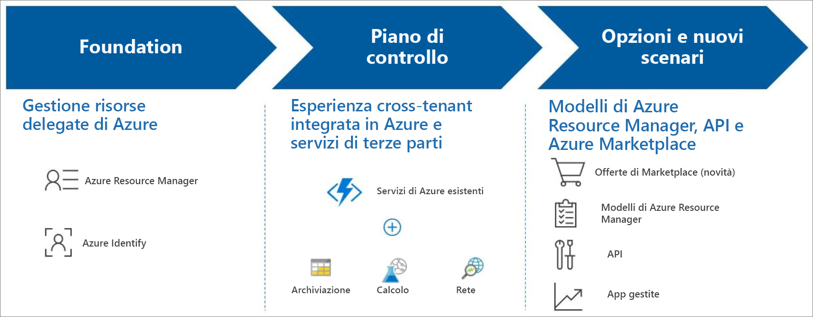

# Informazioni su Azure Lighthouse

Azure Lighthouse offre ai provider di servizi un singolo piano di controllo per visualizzare e gestire Azure tra tutti i loro clienti, con livelli più elevati di automazione, scalabilità e governance ottimizzata. Con Azure Lighthouse, i provider di servizi possono offrire servizi gestiti con strumenti di gestione completi e affidabili integrati nella piattaforma Azure. Questa offerta può anche agevolare le organizzazioni IT aziendali che gestiscono le risorse tra più tenant.

## Vantaggi

Azure Lighthouse consente di creare e distribuire in modo efficiente e proficuo i servizi gestiti per i clienti. Questo approccio offre i vantaggi seguenti:

- **Gestione su larga scala**: l'engagement dei clienti e le operazioni del ciclo di vita per gestire le risorse dei clienti sono più semplici e più scalabili.
- **Maggiore visibilità e precisione per i clienti**: i clienti con risorse gestite avranno una maggiore visibilità sulle azioni e un controllo preciso sull'ambito delegato per la gestione, mentre l'IP viene mantenuto.
- **Strumenti di piattaforma completi e unificati**: l'esperienza con gli strumenti si applica ai principali scenari dei provider di servizi, inclusi più modelli di licenza, ad esempio EA, CSP e con pagamento in base al consumo. Le nuove funzionalità usano gli strumenti e le API esistenti, i modelli di licenza e i programmi per i partner, ad esempio il [programma Cloud Solution Provider (CSP)](https://docs.microsoft.com/partner-center/csp-overview). Le opzioni di Azure Lighthouse scelte possono essere integrate nei flussi di lavoro e nelle applicazioni esistenti ed è possibile tenere traccia dell'impatto sugli engagement dei clienti [collegando l'ID partner](https://docs.microsoft.com/azure/billing/billing-partner-admin-link-started).

Non sono previsti costi aggiuntivi associati all'uso di Azure Lighthouse per gestire le risorse di Azure dei clienti.

## Capabilities

Azure Lighthouse include più modi per semplificare l'engagement e la gestione dei clienti:

- **Gestione risorse delegate di Azure**: gestire in modo sicuro le risorse di Azure dei clienti dal tenant, senza dover cambiare il contesto e i piani di controllo. Per altre informazioni, vedere [Gestione risorse delegate di Azure](./concepts/azure-delegated-resource-management.md).
- **Nuove esperienze con il portale di Azure**: visualizzare le informazioni tra tenant nella nuova pagina **Clienti personali** nel [portale di Azure](https://portal.azure.com). Un pannello **Provider di servizi** corrispondente consente ai clienti di visualizzare e gestire l'accesso per i provider di servizi. Per altre informazioni, vedere [Visualizzare e gestire i clienti](./how-to/view-manage-customers.md) e [Visualizzare e gestire i provider di servizi](./how-to/view-manage-service-providers.md).
- **Modelli di Azure Resource Manager**: Eseguire più facilmente le attività di gestione, incluso l'onboarding dei clienti per la gestione delle risorse delegate di Azure. Per altre informazioni, vedere il [repository di esempi](https://github.com/Azure/Azure-Lighthouse-samples/tree/master/Azure-Delegated-Resource-Management/templates) ed [Eseguire l'onboarding di un cliente nella gestione risorse delegate di Azure](how-to/onboard-customer.md).
- **Offerte di servizi gestiti in Azure Marketplace**: offrire i servizi ai clienti tramite offerte private o pubbliche ed eseguirne automaticamente l'onboarding nella gestione risorse delegate di Azure, in alternativa all'onboarding con i modelli di Azure Resource Manager. Per altre informazioni, vedere [Offerte di servizi gestiti in Azure Marketplace](./concepts/managed-services-offers.md).
- **Applicazioni gestite di Azure**: creare pacchetti e distribuire applicazioni che i clienti possano distribuire e usare facilmente nelle proprie sottoscrizioni. L'applicazione viene distribuita in un gruppo di risorse a cui si accede dal tenant, consentendo di gestire il servizio come parte dell'esperienza complessiva di Azure Lighthouse. Per altre informazioni, vedere [Panoramica delle applicazioni gestite di Azure](https://docs.microsoft.com/azure/managed-applications/overview).

## Passaggi successivi

- Informazioni sulla [gestione risorse delegate di Azure](concepts/azure-delegated-resource-management.md).
- Informazioni sulle [esperienze di gestione tra tenant](concepts/cross-tenant-management-experience.md).
