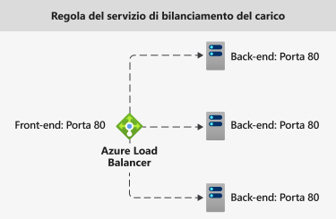
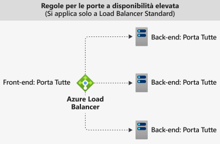
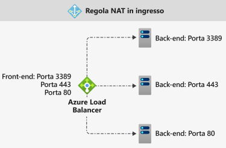

# Componenti di Azure Load Balancer

Azure Load Balancer include alcuni componenti chiave. Questi componenti possono essere configurati nella sottoscrizione tramite:

* Portale di Azure
* Interfaccia della riga di comando di Azure
* Azure PowerShell
* Modelli di Resource Manager

## Configurazione dell'indirizzo IP front-end 

L'indirizzo IP di Azure Load Balancer. Rappresenta il punto di contatto per i client. Questi indirizzi IP possono essere:

- **Indirizzo IP pubblico**
- **Indirizzo IP privato**

La natura dell'indirizzo IP determina il **tipo** del servizio di bilanciamento del carico creato. La selezione dell'indirizzo IP privato crea un servizio di bilanciamento del carico interno. La selezione dell'indirizzo IP pubblico crea un servizio di bilanciamento del carico pubblico.

|  | Load Balancer pubblico  | Load Balancer interno |
| ---------- | ---------- | ---------- |
| **Configurazione dell'indirizzo IP front-end**| Indirizzo IP pubblico | Indirizzo IP privato|
| **Descrizione** | Un servizio di bilanciamento del carico pubblico esegue il mapping dell'indirizzo IP pubblico e della porta del traffico in ingresso all'indirizzo IP privato e alla porta della macchina virtuale. Il servizio di bilanciamento esegue il mapping in senso inverso del traffico di risposta dalla macchina virtuale. Se si applicano le regole di bilanciamento del carico, è possibile distribuire tipi specifici di traffico in più macchine virtuali o servizi. È ad esempio possibile dividere il carico del traffico delle richieste Web tra più server Web.| Un servizio di bilanciamento del carico interno distribuisce il traffico alle risorse che si trovano all'interno di una rete virtuale. Azure limita l'accesso agli indirizzi IP front-end con carico bilanciato di una rete virtuale. Gli indirizzi IP front-end e le reti virtuali non sono mai esposti direttamente a un endpoint di Internet. Le applicazioni line-of-business interne vengono eseguite in Azure e sono accessibili dall'interno di Azure o da risorse locali. |
| **SKU supportati** | Basic e Standard | Basic e Standard |

Il servizio Load Balancer può includere più indirizzi IP front-end. Vedere altre informazioni su [più front-end](load-balancer-multivip-overview.md).

## Pool back-end

Gruppo di macchine virtuali o di istanze nel set di scalabilità di macchine virtuali che gestiscono la richiesta in ingresso. Per un ridimensionamento a costi contenuti in base ai volumi elevati del traffico in ingresso, le linee guida per il calcolo raccomandano in genere di aggiungere altre istanze al pool back-end.

Load Balancer si riconfigura immediatamente tramite una riconfigurazione automatica in base all'aumento o alla riduzione delle istanze. L'aggiunta o la rimozione di macchine virtuali dal pool back-end riconfigura il servizio di bilanciamento del carico senza operazioni aggiuntive. L'ambito del pool back-end è una qualsiasi macchina virtuale nella rete virtuale.

Mentre si valuta come progettare il pool back-end, è consigliabile prevedere il minor numero di singole risorse pool di back-end per ottimizzare ulteriormente la durata delle operazioni di gestione. Non vi è alcuna differenza in termini di scalabilità o prestazioni del piano dati.

## Probe di integrità

Un probe di integrità viene usato per determinare lo stato integrità delle istanze nel pool back-end. Durante la creazione del servizio di bilanciamento del carico, configurare un probe di integrità che verrà usato dal servizio  per determinare se un'istanza è integra e può ricevere traffico.

È possibile definire la soglia di non integrità per i probe di integrità. Se un probe non risponde, Load Balancer interrompe l'invio di nuove connessioni alle istanze non integre. Un errore di probe non influisce sulle connessioni esistenti. La connessione continua fino a quando:

- L'applicazione termina il flusso
- Si verifica un timeout di inattività
- La VM viene arrestata

Load Balancer fornisce diversi tipi di probe di integrità per endpoint: TCP, HTTP e HTTPS. [Altre informazioni sui probe di integrità di Load Balancer](load-balancer-custom-probe-overview.md).

Il servizio Load Balancer Basic non supporta i probe HTTPS. Il servizio Load Balancer Basic chiude tutte le connessioni TCP (incluse quelle stabilite).

## Regole di bilanciamento del carico

Una regola di Load Balancer viene utilizzata per definire il modo in cui il traffico in ingresso viene distribuito a **tutte** le istanze nel pool back-end. Una regola di bilanciamento del carico esegue il mapping di una configurazione IP front-end e di una porta specifiche a più indirizzi IP e porte back-end.

Ad esempio, usare una regola di bilanciamento del carico per la porta 80 per instradare il traffico dall'IP front-end alla porta 80 delle istanze back-end.

  

*Figura: Regole di bilanciamento del carico*

## Porte a disponibilità elevata

Una regola di bilanciamento del carico configurata con **'protocol - all e port - 0'** . 

In questo modo è possibile specificare una singola regola per il bilanciamento del carico di tutti i flussi TCP e UDP in arrivo su tutte le porte di un'istanza interna di Load Balancer Standard. 

La decisione di bilanciamento del carico viene presa per ogni flusso Questa azione è basata sulla seguente connessione a cinque tuple: 

1. Indirizzo IP di origine
2. Porta di origine
3. Indirizzo IP di destinazione
4. Porta di destinazione
5. protocol

Le regole di bilanciamento del carico per porte a disponibilità elevata permettono di gestire scenari critici, ad esempio la disponibilità elevata e la scalabilità per appliance di rete virtuali all'interno di reti virtuali. Questa funzionalità può essere utile quando è necessario eseguire il bilanciamento del carico di un numero elevato di porte.

  

*Figura: Regole per le porte a disponibilità elevata*

Per altre informazioni, vedere [Porte a disponibilità elevata](load-balancer-ha-ports-overview.md).

## Regole NAT in ingresso

Una regola NAT in ingresso inoltra il traffico in arrivo inviato alla combinazione di porta e indirizzo IP front-end. Il traffico viene inviato a una **specifica** macchina virtuale o istanza nel pool back-end. Il port forwarding viene eseguito dalla stessa distribuzione basata su hash del bilanciamento del carico.

Ad esempio, se si desidera utilizzare le sessioni Remote Desktop Protocol (RDP) o Secure Shell (SSH) per separare le istanze delle macchine virtuali all'interno di un pool back-end. È possibile eseguire il mapping di più endpoint interni a porte sullo stesso indirizzo IP front-end. È possibile usare gli indirizzi IP front-end per gestire in modalità remota le macchine virtuali senza un sistema jump box.

  

*Figura: Regole NAT in ingresso*

Le regole NAT in ingresso nel contesto dei set di scalabilità di macchine virtuali sono pool NAT in ingresso. Per altre informazioni, vedere [Componenti di Load Balancer e set di scalabilità di macchine virtuali](../virtual-machine-scale-sets/virtual-machine-scale-sets-networking.md#azure-virtual-machine-scale-sets-with-azure-load-balancer).

## Regole in uscita

Una regola in uscita configura il processo NAT (Network Address Translation) in uscita per tutte le macchine virtuali o le istanze identificate dal pool back-end. In questo modo, le istanze del back-end comunicano (in uscita) con Internet o altri endpoint.

Leggere altre informazioni su [connessioni e regole in uscita](load-balancer-outbound-connections.md).

Il servizio Load Balancer Basic non supporta le regole in uscita.

## Passaggi successivi

- Per iniziare a usare il servizio Load Balancer, vedere [Creare un servizio Load Balancer Standard pubblico](quickstart-load-balancer-standard-public-portal.md).
- Altre informazioni su [Azure Load Balancer](load-balancer-overview.md).
- Informazioni sull'[indirizzo IP pubblico](https://docs.microsoft.com/azure/virtual-network/virtual-network-public-ip-address)
- Informazioni sull'[indirizzo IP privato](https://docs.microsoft.com/azure/virtual-network/virtual-network-ip-addresses-overview-arm#private-ip-addresses)
- Informazioni sull'uso di [Load Balancer Standard e zone di disponibilità](load-balancer-standard-availability-zones.md).
- Altre informazioni sulla diagnostica per [Azure Load Balancer Standard](load-balancer-standard-diagnostics.md).
- Informazioni su [Reimpostare TCP in caso di inattività](load-balancer-tcp-reset.md).
- Informazioni su [Load Balancer Standard con regole di bilanciamento del carico di porte a disponibilità elevata](load-balancer-ha-ports-overview.md).
- Vedere altre informazioni sui [gruppi di sicurezza di rete](../virtual-network/security-overview.md).
- Altre informazioni sui [Limiti di Load Balancer](https://docs.microsoft.com/azure/azure-resource-manager/management/azure-subscription-service-limits#load-balancer).
- Altre informazioni sull'uso del [port forwarding](https://docs.microsoft.com/azure/load-balancer/tutorial-load-balancer-port-forwarding-portal).
