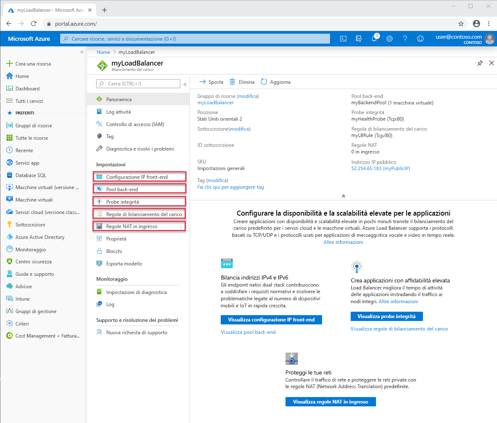

# Componenti e limiti di Load Balancer
Azure Load Balancer contiene diversi componenti chiave.  Questi componenti possono essere configurati nella sottoscrizione tramite il portale di Azure, l'interfaccia della riga di comando di Azure o Azure PowerShell.  

## Componenti di Load Balancer

* **Configurazioni IP front-end**: l'indirizzo IP pubblico del servizio Load Balancer. Rappresenta il punto di contatto per i client. Questi indirizzi possono essere: 

    - **[Indirizzo IP pubblico](https://docs.microsoft.com/azure/virtual-network/virtual-network-public-ip-address)**
    - **[Indirizzo IP privato](https://docs.microsoft.com/azure/virtual-network/virtual-network-ip-addresses-overview-arm#private-ip-addresses)**

* **Pool back-end**: il gruppo di macchine virtuali o di istanze nel set di scalabilità di macchine virtuali che risponderanno alla richiesta in ingresso. Per un ridimensionamento a costi contenuti in base ai volumi elevati del traffico in ingresso, le linee guida per il calcolo raccomandano in genere di aggiungere altre istanze al pool back-end. Load Balancer si riconfigura immediatamente tramite una riconfigurazione automatica in base all'aumento o alla riduzione delle istanze. L'aggiunta o la rimozione di macchine virtuali dal pool back-end riconfigura il servizio Load Balancer senza operazioni aggiuntive. L'ambito del pool back-end è una qualsiasi macchina virtuale nella rete virtuale. Un pool back-end può avere fino a 1000 istanze back-end o configurazioni IP.
Le istanze di Load Balancer Basic hanno un ambito (set di disponibilità) limitato che supporta solo un massimo di 300 configurazioni IP. Per altre informazioni sui limiti, vedere [Limiti di Load Balancer](https://docs.microsoft.com/azure/azure-resource-manager/management/azure-subscription-service-limits#load-balancer). Quando si considera come progettare il pool back-end, è possibile progettare per il minor numero di singole risorse di pool di back-end per ottimizzare ulteriormente la durata delle operazioni di gestione. Non vi è alcuna differenza nelle prestazioni del piano dati o la scala.
* **Probe di integrità**: un **[probe di integrità](https://docs.microsoft.com/azure/load-balancer/load-balancer-custom-probe-overview)** viene usato per determinare l'integrità delle istanze nel pool back-end. È possibile definire la soglia di non integrità per i probe di integrità. Se un probe non risponde, il servizio Load Balancer interrompe l'invio di nuove connessioni alle istanze non integre. Un errore di probe non influisce sulle connessioni esistenti. 
    
    La connessione continua fino a quando: 
    - L'applicazione termina il flusso
    - Si verifica un timeout di inattività
    - La VM viene arrestata

    Load Balancer fornisce diversi tipi di probe di integrità per endpoint:
    - TCP
    - HTTP
    - HTTPS (probe HTTP con wrapper TLS (Transport Layer Security))
     
     Il servizio Load Balancer Basic non supporta i probe HTTPS. Terminerà inoltre tutte le connessioni TCP (incluse quelle stabilite). 
    Per altre informazioni, vedere [Tipi di probe](load-balancer-custom-probe-overview.md#types).

* **Regole di bilanciamento del carico**: le regole di bilanciamento del carico sono quelle che indicano a Load Balancer cosa è necessario fare e quando. 
* **Regole NAT in ingresso**: una regola NAT in ingresso trasmette il traffico da una porta specifica di un indirizzo IP front-end specifico a una determinata porta di un'istanza di back-end specifica nella rete virtuale. Il **[port forwarding](https://docs.microsoft.com/azure/load-balancer/tutorial-load-balancer-port-forwarding-portal)** viene eseguito dalla stessa distribuzione basata su hash del bilanciamento del carico. Scenari comuni per questa funzionalità sono le sessioni di Remote Desktop Protocol (RDP) o Secure Shell (SSH) per le singole istanze di macchina virtuale in una rete virtuale di Azure. È possibile eseguire il mapping di più endpoint interni a porte sullo stesso indirizzo IP front-end. È possibile usare gli indirizzi IP front-end per amministrare in remoto le macchine virtuali senza una finestra di collegamento aggiuntiva.
* **Regole in uscita**: una **[regola in uscita](https://docs.microsoft.com/azure/load-balancer/load-balancer-outbound-rules-overview)** configura NAT (Network Address Translation) in uscita per tutte le macchine virtuali o le istanze identificate dal pool back-end del servizio Load Balancer Standard da trasferire nel front-end.
Il servizio Load Balancer Basic non supporta le regole in uscita.

## Concetti di Load Balancer

Load Balancer offre le funzionalità principali seguenti per applicazioni TCP e UDP:

* **Algoritmo di bilanciamento del carico**: con Azure Load Balancer è possibile creare una regola di bilanciamento del carico per distribuire il traffico che arriva al front-end nelle istanze del pool back-end. Load Balancer usa un algoritmo hash per distribuire i flussi in ingresso e riscrive le intestazioni dei flussi nelle istanze del pool back-end. Un server è disponibile per ricevere i nuovi flussi quando un probe di integrità indica un endpoint di back-end integro.
Per impostazione predefinita, Load Balancer usa un hash a 5 tuple. 

   L'hash include: 

   - **Indirizzo IP di origine**
   - **Porta di origine**
   - **Indirizzo IP di destinazione**
   - **Porta di destinazione**
   - **Numero di protocollo IP per il mapping dei flussi ai server disponibili** 

È possibile creare affinità a un indirizzo IP di origine usando un hash a 2 o 3 tuple per una determinata regola. Tutti i pacchetti dello stesso flusso di pacchetti arrivano sulla stessa istanza dietro il front-end con carico bilanciato. Quando il client avvia un nuovo flusso dallo stesso indirizzo IP di origine, la porta di origine cambia. Di conseguenza, l'algoritmo hash a 5 tuple può far sì che il traffico venga indirizzato verso un endpoint di back-end diverso.
Per altre informazioni, vedere [Configurare la modalità di distribuzione per Azure Load Balancer](./load-balancer-distribution-mode.md). 

L'immagine seguente mostra la distribuzione basata su hash:

  

  *Figura: Distribuzione basata su hash*

* **Indipendenza e trasparenza delle applicazioni**: Load Balancer non interagisce direttamente con il protocollo TCP o UDP o con il livello dell'applicazione. Può essere supportato qualsiasi scenario di applicazione TCP o UDP. Load Balancer non termina né origina flussi, non interagisce con il payload del flusso né fornisce alcuna funzione del gateway a livello dell'applicazione. Gli handshake del protocollo si verificano sempre direttamente tra il client e l'istanza del pool back-end. Una risposta a un flusso in ingresso è sempre una risposta da una macchina virtuale. Quando il flusso arriva nella macchina virtuale, viene mantenuto anche l'indirizzo IP di origine.
  * A ogni endpoint risponde solo una macchina virtuale. Ad esempio, si verifica sempre un handshake TCP tra il client e la macchina virtuale di back-end selezionata. Una risposta a una richiesta in un front-end è una risposta generata da una macchina virtuale di back-end. Quando si convalida correttamente la connettività a un front-end, si convalida anche la connettività end-to-end per almeno una macchina virtuale di back-end.
  * I payload dell'applicazione sono trasparenti per Load Balancer. Qualsiasi applicazione UDP o TCP può essere supportata.
  * Poiché Load Balancer non interagisce con il payload TCP e fornisce l'offload TLS, è possibile creare scenari crittografati end-to-end. L'uso di Load Balancer consente di ottenere un'ampia scalabilità orizzontale per le applicazioni TLS terminando la connessione TLS nella macchina virtuale stessa. Ad esempio, la funzionalità di codifica della sessione TLS è limitata solo dal tipo e dal numero di macchine virtuali aggiunte al pool di back-end.

* **Connessioni in uscita**: Tutti i flussi in uscita dagli indirizzi IP privati all'interno della rete virtuale verso gli indirizzi IP pubblici in Internet possono essere convertiti in indirizzi IP front-end di Load Balancer. Quando un front-end pubblico è associato a una macchina virtuale back-end tramite una regola di bilanciamento del carico, Azure converte le connessioni in uscita nell'indirizzo IP front-end pubblico. Questa configurazione presenta i vantaggi seguenti:
  * Semplicità di aggiornamento e di ripristino di emergenza dei servizi, perché è possibile eseguire il mapping dinamico del front-end a un'altra istanza del servizio.
  * Gestione semplificata degli elenchi di controllo di accesso (ACL). Gli ACL espressi in termini di indirizzi IP front-end non si modificano in caso di ridimensionamento o di ridistribuzione dei servizi. La conversione delle connessioni in uscita in un numero di indirizzi IP inferiore a quello delle macchine riduce il carico correlato all'implementazione di elenchi di destinatari sicuri.

  Il servizio Load Balancer Standard usa un [algoritmo SNAT solido, scalabile e stimabile](load-balancer-outbound-connections.md#snat). Ecco i concetti chiave da ricordare quando si lavora con Load Balancer Standard:

    - Le regole di bilanciamento del carico deducono il modo in cui SNAT è programmato. Le regole di bilanciamento del carico sono specifiche del protocollo. SNAT è specifico del protocollo e la configurazione deve riflettere questa situazione, anziché creare un effetto collaterale.

    - **Più front-end**. Quando sono disponibili più server front-end, vengono usati tutti e ognuno moltiplica il numero di porte SNAT disponibili. Se si desiderano più porte SNAT perché è previsto o è già presente un numero elevato di richieste per le connessioni in uscita, è possibile aggiungere anche l'inventario di porta incrementale SNAT tramite la configurazione di ulteriori server front-end, regole e pool back-end per le stesse risorse della macchina virtuale.

    - **Controllo di quale front-end viene usato in uscita**. È possibile specificare e controllare che un determinato server front-end non venga usato per le connessioni in uscita. Se si intende vincolare le connessioni in uscita in modo che provengano solo da un indirizzo IP front-end specifico, è possibile disabilitare facoltativamente SNAT in uscita per la regola che esprime il mapping in uscita.

    - **Controllo della connettività in uscita**. Gli scenari in uscita sono espliciti e non esiste connettività in uscita fino a quando non viene specificata. Load Balancer Standard esiste all'interno del contesto della rete virtuale.  Una rete virtuale è una rete isolata privata.  A meno che non esista un'associazione con un indirizzo IP pubblico, la connettività pubblica non è consentita.  È possibile contattare [gli endpoint di servizio di rete virtuale](../virtual-network/virtual-network-service-endpoints-overview.md) perché sono dentro e in locale alla rete virtuale.  Se si desidera stabilire la connettività in uscita verso una destinazione esterna alla rete virtuale, sono disponibili due opzioni:
        - assegnare un indirizzo IP pubblico SKU Standard come un indirizzo IP pubblico a livello di istanza per la risorsa di macchina virtuale o
        - inserire la risorsa di macchina virtuale nel pool back-end del Load Balancer Standard pubblico.

        Entrambe consentiranno la connettività in uscita dalla rete virtuale verso l'esterno della rete virtuale. 

        Se si dispone _solo_ di un Load Balancer Standard interno associato al pool back-end in cui si trova la risorsa di macchina virtuale, la macchina virtuale può solamente raggiungere le risorse di rete virtuale e [gli endpoint di servizio di rete virtuale](../virtual-network/virtual-network-service-endpoints-overview.md).  È possibile seguire i passaggi descritti nel paragrafo precedente per creare una connettività in uscita.

        Connettività in uscita di una risorsa di macchina virtuale non associata con SKU Standard rimane come prima.

        Verificare la [discussione approfondita di Connessioni in uscita](load-balancer-outbound-connections.md).

* **Zone di disponibilità**: Load Balancer Standard supporta funzionalità aggiuntive in aree in cui sono disponibili zone di disponibilità. Queste funzionalità sono incrementali rispetto a tutte le funzioni di Load Balancer Standard.  Le configurazioni delle zone di disponibilità sono disponibili per il servizio Load Balancer Standard sia pubblico che interno.
 Un server front-end con ridondanza della zona sopravvive all'errore di zona e viene fornito da parte di infrastrutture dedicate in tutte le zone contemporaneamente. 
Inoltre, è possibile garantire un front-end a una zona specifica. Un server front-end zonale condivide il destino con la rispettiva zona ed è servito solo da un'infrastruttura dedicata in una singola zona.
Il bilanciamento del carico tra zone è disponibile per il pool back-end e qualsiasi risorsa di macchina virtuale in una rete virtuale può far parte di un pool back-end.
Il servizio Load Balancer Basic non supporta le zone.
Per altre informazioni, vedere la [discussione dettagliata sulle abilità associate alle zone di disponibilità](load-balancer-standard-availability-zones.md) e la [panoramica delle zone di disponibilità](../availability-zones/az-overview.md).

* **Porte a disponibilità elevata**: È possibile configurare regole di bilanciamento del carico per ridimensionare l'applicazione e aumentarne l'affidabilità. Quando si usa una regola di bilanciamento del carico con porte a disponibilità elevata, Load Balancer Standard fornisce il bilanciamento del carico per ogni flusso su tutte le porte temporanee dell'indirizzo IP di un front-end interno di Load Balancer Standard.  La funzionalità è utile per altri scenari in cui specificare le singole porte è poco pratico o non opportuno. Una regola di bilanciamento del carico con porte a disponibilità elevata consente di creare scenari attivo-passivo o attivo-attivo n+1 per appliance virtuali di rete e qualsiasi applicazione che richieda ampi intervalli di porte in ingresso.  Un probe di integrità può essere utilizzato per determinare quali back-end dovrebbero ricevere nuovi flussi.  È possibile utilizzare un gruppo di sicurezza di rete per emulare uno scenario di intervallo di porte. Il servizio Load Balancer Basic non supporta le porte a disponibilità elevata.
Vedere la [discussione dettagliata sulle porte a disponibilità elevata](load-balancer-ha-ports-overview.md)
>[!IMPORTANT]
> Se si intende usare un dispositivo di rete virtuale, contattare il fornitore per informazioni aggiuntive oppure per sapere se il prodotto è stato testato con le porte a disponibilità elevata e, quindi, seguire le linee guida specifiche per l'implementazione. 

* **Più front-end**: Load Balancer supporta più regole con più front-end.  Load Balancer Standard ne consente l’espansione agli scenari in uscita.  Gli scenari in uscita sono essenzialmente l'inverso di una regola di bilanciamento del carico in ingresso.  Anche la regola di bilanciamento del carico in ingresso crea un collegamento per le connessioni in uscita. Load Balancer Standard usa tutti i front-end associati a una risorsa di macchina virtuale tramite una regola di bilanciamento del carico.  Inoltre, un parametro della regola di bilanciamento del carico consente di eliminare una regola di bilanciamento del carico allo scopo di favorire la connettività in uscita, il che consente la selezione di front-end specifici e persino di nessun front-end.

In confronto, Load Balancer Basic consente di selezionare un unico server front-end in modo casuale e non consente di controllare il server selezionato.
## Tipi di Load Balancer

### Bilanciamento del carico pubblico

Un servizio Load Balancer pubblico esegue il mapping dell'indirizzo IP pubblico e della porta del traffico in ingresso all'indirizzo IP privato e alla porta della macchina virtuale. Load Balancer esegue il mapping in senso inverso del traffico di risposta dalla macchina virtuale. Se si applicano le regole di bilanciamento del carico, è possibile distribuire tipi specifici di traffico in più macchine virtuali o servizi. È ad esempio possibile dividere il carico del traffico delle richieste Web tra più server Web.

>[!NOTE]
>È possibile implementare solo un servizio Load Balancer pubblico e un servizio Load Balancer interno per set di disponibilità.

La figura seguente mostra un endpoint con carico bilanciato per il traffico Web condiviso fra tre macchine virtuali per la porta TCP 80 pubblica. Queste tre macchine virtuali fanno parte di un set con bilanciamento del carico.

*Figura: bilanciamento del traffico Web tramite un servizio Load Balancer pubblico*

I client Internet inviano richieste di pagine Web all'indirizzo IP pubblico di un'app Web sulla porta TCP 80. Azure Load Balancer distribuisce le richieste tra le tre macchine virtuali del set con carico bilanciato. Per altre informazioni sugli algoritmi di Load Balancer, vedere [Concetti di Load Balancer](concepts-limitations.md#load-balancer-concepts).

Per impostazione predefinita, Azure Load Balancer distribuisce il traffico di rete in modo uniforme tra più istanze di macchine virtuali. È anche possibile configurare l'affinità di sessione. Per altre informazioni, vedere [Configurare la modalità di distribuzione per Azure Load Balancer](load-balancer-distribution-mode.md).

###  Bilanciamento del carico interno

Un servizio Load Balancer interno indirizza il traffico solo alle risorse interne a una rete virtuale o che usano una rete VPN per accedere all'infrastruttura di Azure, a differenza di un servizio Load Balancer pubblico. L'infrastruttura di Azure limita l'accesso agli indirizzi IP front-end con carico bilanciato di una rete virtuale. Gli indirizzi IP front-end e le reti virtuali non sono mai esposti direttamente a un endpoint di Internet. Le applicazioni line-of-business interne vengono eseguite in Azure e sono accessibili dall'interno di Azure o da risorse locali.

Il servizio Load Balancer interno consente di bilanciare i tipi di carico seguenti:

* **In una rete virtuale**: bilanciamento del carico dalle macchine virtuali presenti nella rete virtuale a un set di macchine virtuali che si trovano nella stessa rete virtuale.
* **Per una rete virtuale cross-premise**: bilanciamento del carico dai computer locali a un set di macchine virtuali che si trovano nella stessa rete virtuale.
* **Per le applicazioni multilivello**: bilanciamento del carico per le applicazioni multilivello e con connessione a Internet in cui i livelli di back-end non sono esposti a Internet. I livelli di back-end richiedono il bilanciamento del carico per il traffico dal livello con connessione a Internet. Vedere la figura successiva.
* **Per le applicazioni line-of-business**: bilanciamento del carico per le applicazioni line-of-business ospitate in Azure senza applicazioni software o componenti hardware aggiuntivi per il bilanciamento del carico. Questo scenario include server locali che si trovano nel set di computer con carico bilanciato del traffico.

*Figura: bilanciamento del carico di applicazioni multilivello tramite il servizio Load Balancer sia pubblico che interno*

##  Confronto tra gli SKU di Load Balancer

Load Balancer supporta SKU Basic e Standard, che variano in termini di scalabilità degli scenari, funzionalità e prezzi. Tutti gli scenari possibili con Load Balancer Basic possono essere creati anche con Load Balancer Standard. Le API per entrambi gli SKU sono simili e vengono richiamate tramite la specifica di uno SKU. L'API per supportare gli SKU di Load Balancer e l'indirizzo IP pubblico sono disponibili a partire dall'API `2017-08-01`. Entrambi gli SKU condividono la stessa API e la stessa struttura generale.

La configurazione dello scenario completo potrebbe variare leggermente in base allo SKU. La documentazione di Load Balancer specifica quando un articolo è applicabile solo a un determinato SKU. Esaminare la tabella seguente per confrontare e comprendere le differenze. Per altre informazioni, vedere [Azure Panoramica di Load Balancer Standard](load-balancer-standard-overview.md).

>[!NOTE]
> Microsoft consiglia Load Balancer Standard.
Le macchine virtuali autonome, i set di disponibilità e i set di scalabilità di macchine virtuali possono essere collegati solo a uno SKU, non a entrambi. Se usati con gli indirizzi IP pubblici, lo SKU di Load Balancer e quello dell'indirizzo IP pubblico devono corrispondere. Gli SKU di Load Balancer e quelli degli indirizzi IP pubblici non sono modificabili.

[!INCLUDE [comparison table](../../includes/load-balancer-comparison-table.md)]

Per altre informazioni, vedere [Limiti di Load Balancer](https://docs.microsoft.com/azure/azure-resource-manager/management/azure-subscription-service-limits#load-balancer). Per informazioni dettagliate su Load Balancer Standard, vedere [panoramica](load-balancer-standard-overview.md), [prezzi](https://aka.ms/lbpricing) e [contratto di servizio](https://aka.ms/lbsla).

## Limitazioni

- Gli SKU non sono modificabili. Non è possibile modificare lo SKU di una risorsa esistente.
- Una risorsa autonoma per macchine virtuali, una risorsa per un set di disponibilità o una risorsa per un set di scalabilità di macchine virtuali può essere riferita a uno SKU, non a entrambi.
- Una regola di Load Balancer non può estendersi a due reti virtuali.  I front-end e le relative istanze di back-end devono trovarsi nella stessa rete virtuale.  
- Le [operazioni di spostamento delle sottoscrizioni](../azure-resource-manager/management/move-resource-group-and-subscription.md) non sono supportate per le risorse di Load Balancer Standard e IP pubblico.
- I ruoli di lavoro Web senza rete virtuale e altri servizi della piattaforma Microsoft possono essere accessibili solo dalle istanze dietro un Load Balancer Standard interno. Non è necessario basarsi su questo poiché il servizio stesso o la piattaforma sottostante possono essere soggetti a modifiche senza preavviso. Presupporre sempre che è necessario creare una [connettività in uscita](load-balancer-outbound-connections.md) in modo esplicito se desiderato quando si usa solo Load Balancer Standard interno.

- Load Balancer consente di eseguire il bilanciamento del carico e il port forwarding per protocolli TCP o UDP specifici. Le regole di bilanciamento del carico e le regole NAT in ingresso supportano TCP e UDP, ma non altri protocolli IP, ad esempio ICMP.

  Load Balancer non termina, non risponde o non interagisce in altro modo con il payload di un flusso UDP o TCP perché non è un proxy. La corretta convalida della connettività a un front-end deve essere eseguita in banda con lo stesso protocollo usato in una regola NAT in ingresso o di bilanciamento del carico. Per visualizzare una risposta da un front-end, almeno una delle macchine virtuali deve generare una risposta per un client.

  La mancata ricezione di una risposta in banda da parte del front-end di Load Balancer indica che nessuna macchina virtuale è stata in grado di rispondere. Nessun elemento può interagire con un front-end del servizio Load Balancer senza una macchina virtuale in grado di rispondere. Questo principio si applica anche alle connessioni in uscita in cui il mascheramento delle porte SNAT è supportato solo per i protocolli TCP e UDP. Per tutti gli altri protocolli IP, incluso ICMP, l'esito è negativo. Assegnare un indirizzo IP pubblico a livello di istanza per mitigare questo problema. Per altre informazioni, vedere [Informazioni su SNAT e PAT](load-balancer-outbound-connections.md#snat).

- I servizi Load Balancer interni non convertono le connessioni originate in uscita nel front-end di un servizio Load Balancer interno perché si trovano nello spazio di indirizzi IP privati. I servizi Load Balancer pubblici consentono di stabilire [connessioni in uscita](load-balancer-outbound-connections.md) dagli indirizzi IP privati interni alla rete virtuale a indirizzi IP pubblici. Per i servizi Load Balancer interni, questo approccio evita un potenziale esaurimento delle porte SNAT all'interno di uno spazio di indirizzi IP interno univoco, in cui la conversione non è obbligatoria.

  Un effetto collaterale consiste nella mancata corrispondenza dei due rami del flusso qualora un flusso in uscita da una macchina virtuale nel pool back-end tenti un flusso verso il front-end del servizio Load Balancer interno nel pool _e_ venga mappato a se stesso. A causa della mancata corrispondenza, il flusso ha esito negativo. Il flusso ha esito positivo se non viene mappato alla stessa macchina virtuale nel pool back-end che ha creato il flusso verso il front-end.

  Quando il flusso viene mappato nuovamente a se stesso, il flusso in uscita sembra provenire dalla macchina virtuale verso il front-end e il flusso in ingresso corrispondente sembra provenire dalla macchina virtuale verso se stesso. Dal punto di vista del sistema operativo guest, le parti in ingresso e in uscita dello stesso flusso non corrispondono all'interno della macchina virtuale. Lo stack TCP non riconosce queste metà come appartenenti allo stesso flusso, sebbene lo siano. L'origine e la destinazione non corrispondono. Quando il flusso viene mappato a qualsiasi altra macchina virtuale nel pool di back-end, le metà del flusso corrispondono e la macchina virtuale può rispondere al flusso stesso.

  Il sintomo di questo scenario è il verificarsi di timeout di connessione intermittenti quando il flusso torna nello stesso back-end che lo ha originato. Soluzioni alternative comuni includono l'inserimento di un livello proxy dietro il servizio Load Balancer interno e l'uso delle regole di stile DSR (Direct Server Return). Per altre informazioni, vedere [Più front-end per Azure Load Balancer](load-balancer-multivip-overview.md).

  È possibile combinare un servizio Load Balancer interno con qualsiasi proxy di terze parti o usare un [gateway applicazione](../application-gateway/application-gateway-introduction.md) per scenari proxy con HTTP/HTTPS. Sebbene sia possibile usare un servizio Load Balancer pubblico per attenuare questo problema, lo scenario risultante è soggetto a [esaurimento SNAT](load-balancer-outbound-connections.md#snat). Evitare questo secondo approccio, a meno che non sia gestito accuratamente.

- In generale, l'inoltro di frammenti IP non è supportato nelle regole di bilanciamento del carico né lo è frammentazione IP dei pacchetti UDP e TCP. È possibile usare le regole di bilanciamento del carico per le porte a disponibilità elevata per l'invio di frammenti IP esistenti. Per altre informazioni, vedere [Panoramica delle porte a disponibilità elevata](load-balancer-ha-ports-overview.md).

## Passaggi successivi

- Vedere [Creare un servizio Load Balancer Standard pubblico](quickstart-load-balancer-standard-public-portal.md) per iniziare a usare un servizio Load Balancer, crearne uno, creare macchine virtuali con un'estensione IIS personalizzata installata e bilanciare il carico dell'app Web tra le macchine virtuali.
- Altre informazioni su [Azure Load Balancer](load-balancer-overview.md).
- Informazioni sull'uso di [Load Balancer Standard e zone di disponibilità](load-balancer-standard-availability-zones.md).
- Informazioni sui [probe di integrità](load-balancer-custom-probe-overview.md).
- Altre informazioni sulla diagnostica per [Azure Load Balancer Standard](load-balancer-standard-diagnostics.md).
- Informazioni sull'uso di [Load Balancer per le connessioni in uscita](load-balancer-outbound-connections.md).
- Altre informazioni sulle [Regole in uscita](load-balancer-outbound-rules-overview.md).
- Informazioni su [Reimpostare TCP in caso di inattività](load-balancer-tcp-reset.md).
- Informazioni su [Load Balancer Standard con regole di bilanciamento del carico di porte a disponibilità elevata](load-balancer-ha-ports-overview.md).
- Informazioni sull'uso di [Load Balancer con più front-end](load-balancer-multivip-overview.md).
- Vedere altre informazioni sui [gruppi di sicurezza di rete](../virtual-network/security-overview.md).