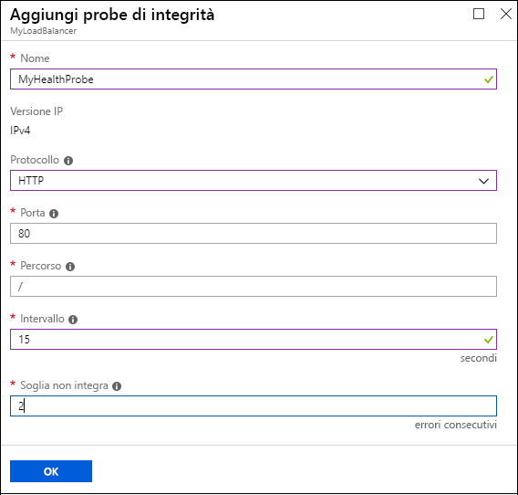
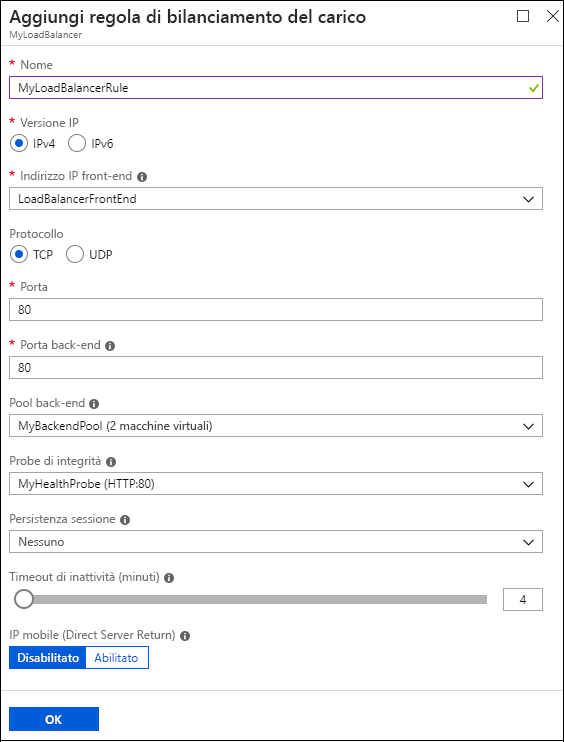

# Creazione del servizio di bilanciamento del carico Internet attraverso il portale di Azure

> [!div class="op_single_selector"]
> * [Portale](../load-balancer/load-balancer-get-started-internet-portal.md)
> * [PowerShell](../load-balancer/load-balancer-get-started-internet-arm-ps.md)
> * [Interfaccia della riga di comando di Azure](../load-balancer/load-balancer-get-started-internet-arm-cli.md)
> * [Modello](../load-balancer/load-balancer-get-started-internet-arm-template.md)

[!INCLUDE [load-balancer-basic-sku-include.md](../../includes/load-balancer-basic-sku-include.md)]

[!INCLUDE [load-balancer-get-started-internet-intro-include.md](../../includes/load-balancer-get-started-internet-intro-include.md)]

Questo articolo illustra il modello di distribuzione Gestione risorse.

[!INCLUDE [load-balancer-get-started-internet-scenario-include.md](../../includes/load-balancer-get-started-internet-scenario-include.md)]

In questa sede viene illustrata la sequenza delle singole attività da eseguire per creare un servizio di bilanciamento del carico e vengono illustrate in dettaglio le operazioni da effettuare per raggiungere l'obiettivo.

## Elementi necessari per creare un servizio di bilanciamento del carico Internet

È necessario creare e configurare gli oggetti seguenti per distribuire un servizio di bilanciamento del carico.

* Configurazione di IP front-end: contiene gli indirizzi IP pubblici per il traffico di rete in ingresso.
* Pool di indirizzi back-end: contiene interfacce di rete (NIC) per le macchine virtuali per la ricezione di traffico di rete dal servizio di bilanciamento del carico.
* Regole di bilanciamento del carico: contengono regole per il mapping di una porta pubblica nel servizio di bilanciamento del carico alle porte nel pool di indirizzi back-end.
* Regole NAT in ingresso: contengono regole per il mapping di una porta pubblica nel servizio di bilanciamento del carico a una porta per una macchina virtuale specifica nel pool di indirizzi back-end.
* Probe: contengono probe di integrità usati per verificare la disponibilità di istanze di macchine virtuali nel pool di indirizzi back-end.

È possibile ottenere altre informazioni sui componenti del servizio di bilanciamento del carico con Azure Resource Manager in [Supporto di Azure Resource Manager per il bilanciamento del carico](load-balancer-arm.md).

## Configurare un servizio di bilanciamento del carico nel portale di Azure

> [!IMPORTANT]
> L'esempio presuppone che ci sia una rete virtuale denominata **myVNet**. A tal proposito, fare riferimento a [Creare una rete virtuale](../virtual-network/virtual-networks-create-vnet-arm-pportal.md) . Presuppone anche la presenza di una subnet all'interno di **myVNet** chiamata **LB-Subnet-BE** e di due macchine virtuali denominate **web1** e **web2** rispettivamente all'interno dello stesso set di disponibilità denominato **myAvailSet** in **myVNet**. Fare riferimento a [questo collegamento](../virtual-machines/virtual-machines-windows-hero-tutorial.md?toc=%2fazure%2fvirtual-machines%2fwindows%2ftoc.json) per creare le macchine virtuali.

1. Utilizzare un browser per accedere al portale di Azure ( [http://portal.azure.com](http://portal.azure.com) ) con il proprio account di Azure.
2. In alto a sinistra nella schermata fare clic su **Nuovo** > **Rete** > **Bilanciamento del carico**.
3. Nel pannello **Crea bilanciamento del carico** digitare un nome per il servizio di bilanciamento del carico. Qui viene chiamato **myLoadBalancer**.
4. In **Tipo** selezionare **Pubblica**.
5. In **Indirizzo IP pubblico** creare un nuovo indirizzo IP pubblico denominato **myPublicIP**.
6. In Gruppo di risorse, selezionare **myRG**. Selezionare quindi un **Percorso** appropriato e fare clic su **OK**. Il servizio di bilanciamento del carico avvia la distribuzione e richiede alcuni minuti per completare correttamente la distribuzione.

    

## Creare un pool di indirizzi back-end

1. Dopo aver distribuito correttamente il bilanciamento del carico, selezionarlo dalle risorse. In impostazioni, selezionare i pool di back-end. Immettere un nome per il pool di back-end. Successivamente fare clic sul pulsante **Aggiungi** nella parte superiore del pannello visualizzato.
2. Nel pannello **Aggiungi pool back-end** fare clic su **Aggiungi una macchina virtuale**.  Selezionare **Scegliere un set di disponibilità** in **Set di disponibilità**, quindi selezionare **myAvailSet**. Selezionare successivamente **Scegliere le macchine virtuali** nella sezione Macchine virtuali del pannello e fare clic su **web1** e **web2**, le due macchine virtuali create per il bilanciamento del carico. Verificare che entrambe abbiano i segni di spunta blu a sinistra, come illustrato nell'immagine sotto. Fare clic su **Seleziona** nel pannello, quindi premere OK nel pannello **Scegliere le macchine virtuali** e fare clic su **OK** nel pannello **Aggiungi pool back-end**.

    

3. Verificare la presenza di un aggiornamento nel menu a discesa delle notifiche relativo al salvataggio del pool back-end del servizio di bilanciamento del carico e all'aggiornamento dell'interfaccia di rete per entrambe le macchine virtuali **web1** e **web2**.

## Creare un probe, una regola LB e le regole NAT

1. Creare un probe di integrità.

    In impostazioni di bilanciamento del carico, selezionare Probe, quindi fare clic su **Aggiungi** nella parte superiore del pannello.

    Esistono due modi per configurare un probe: HTTP o TCP. In questo esempio viene utilizzato HTTP, ma TCP può essere configurato in modo anaolo.
    Aggiornare le informazioni necessarie. Come accennato, **myLoadBalancer** bilancia il carico del traffico sulla porta 80. Il percorso selezionato è HealthProbe.aspx, l'intervallo è di 15 secondi e il valore impostato per la soglia non integra è 2. Al termine, fare clic su **OK** per creare il probe.

    Spostare il puntatore del mouse sull'icona "i" per ottenere maggiori informazioni sulle singole configurazioni e su come possono essere modificate per soddisfare i requisiti.

    

2. Creare una regola del servizio di bilanciamento del carico.

    Fare clic sulle regole di bilanciamento del carico nella sezione Impostazioni del servizio di bilanciamento del carico. Nel nuovo pannello, fare clic su **Aggiungi**. Rinominare la regola. In questo caso, è HTTP. Scegliere le porte di front-end e back-end. In questo caso, la porta 80 viene usata per entrambi. Scegliere **LB-backend** come pool back-end e **HealthProbe** creato in precedenza come probe. È possibile impostare altre configurazioni in base ai requisiti. Dopodiché, fare clic su OK per salvare la regola di bilanciamento del carico.

    

3. Creare le regole NAT in ingresso

    Fare clic sulle regole NAT in ingresso nella sezione Impostazioni del servizio di bilanciamento del carico. Nel nuovo pannello fare clic su **Aggiungi**. Poi rinominare la regola NAT in ingresso. In questo caso, **inboundNATrule1**. La destinazione deve essere l'indirizzo IP pubblico creato in precedenza. Selezionare l'opzione Personalizzato in Servizio e selezionare il protocollo che si desidera utilizzare. Qui è stato selezionato il protocollo TCP. Immettere la porta, 3441, e la porta di destinazione, che in questo caso è 3389, quindi fare clic su OK per salvare la regola.

    Dopo aver creato la prima regola, ripetere la procedura per creare la seconda regola NAT in ingresso denominata inboundNATrule2 dalla porta 3442 alla porta di destinazione 3389.

    

## Rimuovere un bilanciamento del carico

Per eliminare un servizio di bilanciamento del carico, selezionarlo. Nel pannello *Bilanciamento del carico* fare clic su **Elimina** nella parte superiore del pannello. Fare clic su **Sì** quando richiesto.

## Passaggi successivi

[Introduzione alla configurazione del bilanciamento del carico interno](load-balancer-get-started-ilb-arm-cli.md)

[Configurare una modalità di distribuzione del servizio di bilanciamento del carico](load-balancer-distribution-mode.md)

[Configurare le impostazioni del timeout di inattività TCP per il bilanciamento del carico](load-balancer-tcp-idle-timeout.md)
