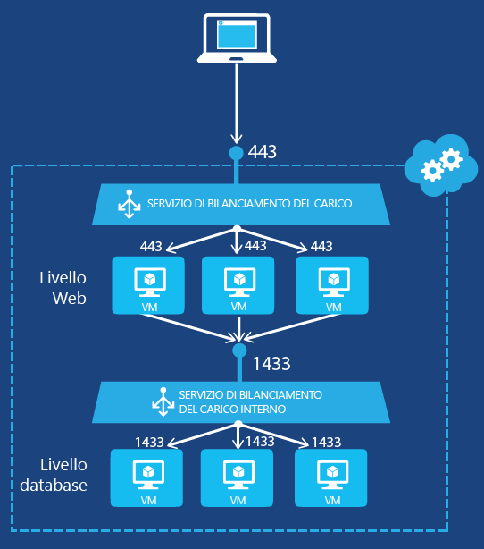
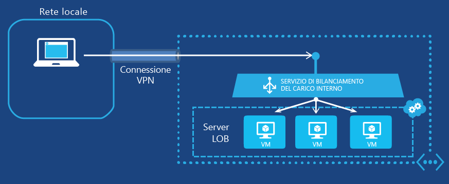

<properties
   pageTitle="Introduzione al bilanciamento del carico interno | Microsoft Azure"
   description="Configurare il bilanciamento del carico interno e implementarlo per le macchine virtuali e le distribuzioni cloud"
   services="load-balancer"
   documentationCenter="na"
   authors="joaoma"
   manager="adinah"
   editor="tysonn" />
<tags
   ms.service="load-balancer"
   ms.devlang="na"
   ms.topic="get-started-article"
   ms.tgt_pltfrm="na"
   ms.workload="infrastructure-services"
   ms.date="07/10/2015"
   ms.author="joaoma" />

# Introduzione alla configurazione del bilanciamento del carico interno

Il bilanciamento del carico interno di Azure consente di bilanciare il carico tra macchine virtuali che si trovano in un servizio cloud o una rete virtuale nell'ambito di un'area. Per informazioni sull'uso e sulla configurazione di reti virtuali nell'ambito di un'area, vedere [Reti virtuali di area](../regional-virtual-networks.md) nel blog di Azure. Le reti virtuali esistenti che sono state configurate per un gruppo di affinità non possono usare il bilanciamento del carico interno.

## Creazione di un set con carico bilanciato interno per macchine virtuali

Per creare un set con carico bilanciato interno di Azure e i server che invieranno il traffico a esso, è necessario eseguire le operazioni seguenti:

1. Creare un'istanza ILB che sarà l'endpoint del traffico in ingresso da configurare con carico bilanciato tra i server di un set con carico bilanciato.

1. Aggiungere gli endpoint corrispondenti alle macchine virtuali che riceveranno il traffico in ingresso.

1. Configurare i server che invieranno il traffico da configurare con carico bilanciato per inviare il traffico all'indirizzo IP virtuale dell'istanza ILB.

### Passaggio 1: Creare un'istanza ILB

Per un servizio cloud esistente o un servizio cloud distribuito in una rete virtuale dell'area, è possibile creare un'istanza ILB con i seguenti comandi di Windows PowerShell:

	$svc="<Cloud Service Name>"
	$ilb="<Name of your ILB instance>"
	$subnet="<Name of the subnet within your virtual network>"
	$IP="<The IPv4 address to use on the subnet-optional>"

	Add-AzureInternalLoadBalancer -ServiceName $svc -InternalLoadBalancerName $ilb –SubnetName $subnet –StaticVNetIPAddress $IP

Per usare questi comandi, inserire i valori e rimuovere < and >. Di seguito è fornito un esempio:

	$svc="WebCloud-NY"
	$ilb="SQL-BE"
	$subnet="Farm1"
	$IP="192.168.98.10"
	Add-AzureInternalLoadBalancer -ServiceName $svc -InternalLoadBalancerName $ilb –SubnetName $subnet –StaticVNetIPAddress $IP

### Passaggio 2: Aggiungere gli endpoint all'istanza ILB

Per le macchine virtuali esistenti, è possibile aggiungere gli endpoint all'istanza ILB con i seguenti comandi:

	$svc="<Cloud service name>"
	$vmname="<Name of the VM>"
	$epname="<Name of the endpoint>"
	$lbsetname="<Name of the load balancer set>"
	$prot="tcp" or "udp"
	$locport=<local port number>
	$pubport=<public port number>
	$ilb="<Name of your ILB instance>"
	Get-AzureVM –ServiceName $svc –Name $vmname | Add-AzureEndpoint -Name $epname -LbsetName $lbsetname -Protocol $prot -LocalPort $locport -PublicPort $pubport –DefaultProbe -InternalLoadBalancerName $ilb | Update-AzureVM

Per usare questi comandi, inserire i valori e rimuovere < and >.

Si noti che questo uso del cmdlet di Windows PowerShell [Add-AzureEndpoint](https://msdn.microsoft.com/library/dn495300.aspx) richiede il set di parametri DefaultProbe. Per altre informazioni sui set di parametri aggiuntivi, vedere [Add-AzureEndpoint](https://msdn.microsoft.com/library/dn495300.aspx).

Di seguito è fornito un esempio:

	$svc="AZ-LOB1"
	$vmname="SQL-LOBAZ1"
	$epname="SQL1"
	$lbsetname="SQL-LB"
	$prot="tcp"
	$locport=1433
	$pubport=1433
	$ilb="SQL ILB"
	Get-AzureVM –ServiceName $svc –Name $vmname | Add-AzureEndpoint -Name $epname -Lbset $lbsetname -Protocol $prot -LocalPort $locport -PublicPort $pubport –DefaultProbe -InternalLoadBalancerName $ilb | Update-AzureVM

### Passaggio 3: Configurare i server per inviare il traffico al nuovo endpoint ILB

È necessario configurare i server il cui il traffico verrà configurato con carico bilanciato per usare il nuovo indirizzo IP (indirizzo VIP) dell'istanza ILB. Si tratta dell'indirizzo su cui è in ascolto l'istanza ILB. Nella maggior parte dei casi, è sufficiente aggiungere o modificare un record DNS per l'indirizzo VIP dell'istanza ILB.

Se l'indirizzo IP è stato specificato durante la creazione dell'istanza ILB, l'indirizzo VIP. In caso contrario, è possibile visualizzare l'indirizzo VIP eseguendo i comandi seguenti:

	$svc="<Cloud Service Name>"
	Get-AzureService -ServiceName $svc | Get-AzureInternalLoadBalancer

Per usare questi comandi, inserire i valori e rimuovere < and >. Di seguito è fornito un esempio:

	$svc="WebCloud-NY"
	Get-AzureService -ServiceName $svc | Get-AzureInternalLoadBalancer

Dalla visualizzazione del comando Get-AzureInternalLoadBalancer prendere nota dell'indirizzo IP e apportare le modifiche necessarie ai server o ai record DNS per assicurarsi che il traffico venga inviato all'indirizzo VIP.

>[AZURE.NOTE]La piattaforma Microsoft Azure usa un indirizzo IPv4 statico e instradabile pubblicamente per un'ampia gamma di scenari di amministrazione. L'indirizzo IP è 168.63.129.16. Questo indirizzo IP non deve essere bloccato da alcun firewall, in quanto potrebbe provocare un comportamento imprevisto. Per quanto riguarda il bilanciamento del carico interno di Azure, questo indirizzo IP viene usato da probe di monitoraggio del servizio di bilanciamento del carico per determinare lo stato di integrità delle macchine virtuali in un set con carico bilanciato. Se un gruppo di sicurezza di rete viene usato per limitare il traffico a macchine virtuali di Azure in un set con carico internamente bilanciato o viene applicato a una subnet di rete virtuale, assicurarsi di aggiungere una regola di sicurezza di rete per consentire il traffico dall'indirizzo 168.63.129.16.

## Esempi end-to-end di bilanciamento del carico interno

Per una descrizione del processo end-to-end di creazione di un set con carico bilanciato per due configurazioni di esempio, vedere le sezioni seguenti.

### Applicazione multilivello con connessione Internet

Contoso Corporation desidera fornire il bilanciamento del carico tra un set di server Web con connessione Internet e un set di server di database. Entrambi i set di server sono ospitati in un unico servizio cloud di Azure. Il traffico dei server Web verso la porta TCP 1433 deve essere distribuito tra tre macchine virtuali nel livello database. La figura 1 illustra la configurazione.

Figura 1: esempio di applicazione multilivello con connessione Internet

La configurazione è costituita dai seguenti elementi:

- Il servizio cloud esistente che ospita le macchine virtuali è denominato Contoso-PartnerSite.

- I tre server di database esistenti sono denominati PARTNER-SQL-1, PARTNER-SQL-2 e PARTNER-SQL-3.

- I server Web nel livello Web si connettono ai server di database nel livello database usando il nome DNS partner-sql.external.contoso.com.

I seguenti comandi configurano una nuova istanza ILB denominata PARTNER-DBTIER e aggiungono gli endpoint alle macchine virtuali corrispondenti ai tre server di database:

	$svc="Contoso-PartnerSite"
	$ilb="PARTNER-DBTIER"
	Add-AzureInternalLoadBalancer -ServiceName $svc -InternalLoadBalancerName $ilb

	$prot="tcp"
	$locport=1433
	$pubport=1433
	$epname="DBTIER1"
	$lbsetname="SQL-LB"
	$vmname="PARTNER-SQL-1"
	Get-AzureVM –ServiceName $svc –Name $vmname | Add-AzureEndpoint -Name $epname -LbSetName $lbsetname -Protocol $prot -LocalPort $locport -PublicPort $pubport –DefaultProbe -InternalLoadBalancerName $ilb | Update-AzureVM

	$epname="DBTIER2"
	$vmname="PARTNER-SQL-2"
	Get-AzureVM –ServiceName $svc –Name $vmname | Add-AzureEndpoint -Name $epname -LbSetName $lbsetname -Protocol $prot -LocalPort $locport -PublicPort $pubport –DefaultProbe -InternalLoadBalancerName $ilb | Update-AzureVM

	$epname="DBTIER3"
	$vmname="PARTNER-SQL-3"
	Get-AzureVM –ServiceName $svc –Name $vmname | Add-AzureEndpoint -Name $epname -LbSetName $lbsetname -Protocol $prot -LocalPort $locport -PublicPort $pubport –DefaultProbe -InternalLoadBalancerName $ilb | Update-AzureVM

Successivamente, Contoso ha determinato l'indirizzo VIP dell'istanza ILB PARTNER-DBTIER con il comando seguente:

	Get-AzureService -ServiceName $svc | Get-AzureInternalLoadBalancer

Dalla visualizzazione di questo comando, Contoso a preso nota dell'indirizzo VIP 100.64.65.211 e ha configurato il record dell'indirizzo DNS (A) in modo che il nome partner-sql.external.contoso.com usi questo nuovo indirizzo.

### Applicazione line-of-business ospitata in Azure

Contoso Corporation desidera ospitare un'applicazione line-of-business in un set di server Web in Azure. Il traffico client verso la porta TCP 80 deve essere configurato con carico bilanciato tra tre macchine virtuali in esecuzione in una rete virtuale cross-premise. La figura 2 illustra la configurazione.

Figura 2: esempio di applicazione line-of-business ospitata in Azure

La configurazione è costituita dai seguenti elementi:

- Il servizio cloud esistente che ospita le macchine virtuali è denominato Contoso-Legal.

- La subnet in cui si trovano i server line-of-business è denominata LOB-LEGAL e Contoso ha scelto l'indirizzo 198.168.99.145 come indirizzo VIP per il bilanciamento del carico interno.

- I tre server line-of-business esistenti sono denominati LEGAL-1, LEGAL-2 e LEGAL-3.

- I client Web Intranet vi si connettono usando il nome DNS legalnet.corp.contoso.com.

I seguenti comandi creano un'istanza ILB denominata LEGAL-ILB e aggiungono gli endpoint alle macchine virtuali corrispondenti ai tre server line-of-business:

	$svc="Contoso-Legal"
	$ilb="LEGAL-ILB"
	$subnet="LOB-LEGAL"
	$IP="198.168.99.145"
	Add-AzureInternalLoadBalancer –ServiceName $svc -InternalLoadBalancerName $ilb –SubnetName $subnet –StaticVNetIPAddress $IP

	$prot="tcp"
	$locport=80
	$pubport=80
	$epname="LOB1"
	$lbsetname="LOB-LB"
	$vmname="LEGAL-1"
	Get-AzureVM –ServiceName $svc –Name $vmname | Add-AzureEndpoint -Name $epname-LbSetName $lbsetname -Protocol $prot -LocalPort $locport -PublicPort $pubport –DefaultProbe -InternalLoadBalancerName $ilb | Update-AzureVM

	$epname="LOB2"
	$vmname="LEGAL2"
	Get-AzureVM –ServiceName $svc –Name $vmname | Add-AzureEndpoint -Name $epname -LbSetName $lbsetname -Protocol $prot -LocalPort $locport -PublicPort $pubport –DefaultProbe -InternalLoadBalancerName $ilb | Update-AzureVM

	$epname="LOB3"
	$vmname="LEGAL3"
	Get-AzureVM –ServiceName $svc –Name $vmname | Add-AzureEndpoint -Name $epname -LbSetName $lbsetname -Protocol $prot -LocalPort $locport -PublicPort $pubport –DefaultProbe -InternalLoadBalancerName $ilb | Update-AzureVM

Contoso ha quindi configurato il record A DNS in modo che il nome legalnet.corp.contoso.com usi l'indirizzo 198.168.99.145.

## Aggiungere una macchina virtuale a ILB

Per aggiungere una macchina virtuale a un'istanza ILB quando viene creata, è possibile usare i cmdlet New-AzureInternalLoadBalancerConfig e New-AzureVMConfig.

Di seguito è fornito un esempio:

	$svc="AZ-LOB1"
	$ilb="LOB-ILB"
	$vnet="LOBNet_Azure"
	$subnet="LOBServers"
	$vmname="LOB-WEB1"
	$adminuser="Lando"
	$adminpw="Platform327"
	$regionname="North Central US"

	$myilbconfig=New-AzureInternalLoadBalancerConfig -InternalLoadBalancerName $ilb -SubnetName $subnet
	$images = Get-AzureVMImage
	New-AzureVMConfig -Name $vmname -InstanceSize Small -ImageName $images[50].ImageName | Add-AzureProvisioningConfig -Windows -AdminUsername $adminuser -Password $adminpw | New-AzureVM -ServiceName $svc -InternalLoadBalancerConfig $myilbconfig -Location $regionname –VNetName $vnet

## Configurazione di ILB per i servizi cloud

ILB è supportato sia per le macchine virtuali che per i servizi cloud. Un endpoint ILB creato in un servizio cloud esterno a una rete virtuale dell'area sarà accessibile solo nel servizio cloud.

La configurazione di ILB deve essere impostata durante la creazione della prima distribuzione nel servizio cloud, come illustrato nell'esempio seguente.

>[AZURE.IMPORTANT]Come prerequisito per eseguire i passaggi seguenti, è necessario avere già creato una rete virtuale per la distribuzione cloud. Per creare ILB, saranno necessari il nome della rete virtuale e il nome della subnet.

### Passaggio 1

Aprire il file di configurazione del servizio (file cscfg) per la distribuzione cloud in Visual Studio e aggiungere la sezione seguente per creare ILB sotto l'ultimo elemento "</Role>" per la configurazione di rete.

	<NetworkConfiguration>
	  <LoadBalancers>
	    <LoadBalancer name="name of the load balancer">
	      <FrontendIPConfiguration type="private" subnet="subnet-name" staticVirtualNetworkIPAddress="static-IP-address"/>
	    </LoadBalancer>
	  </LoadBalancers>
	</NetworkConfiguration>
 

Aggiungere i valori per il file di configurazione di rete per visualizzare come apparirà. Nell'esempio, si supponga di avere creato una subnet denominata "test_vnet" con una subnet 10.0.0.0/24 denominata test_subnet e un IP statico 10.0.0.4. Il servizio di bilanciamento del carico si chiamerà testLB.

	<NetworkConfiguration>
	  <LoadBalancers>
	    <LoadBalancer name="testLB">
	      <FrontendIPConfiguration type="private" subnet="test_subnet" staticVirtualNetworkIPAddress="10.0.0.4"/>
	    </LoadBalancer>
	  </LoadBalancers>
	</NetworkConfiguration>

Per altre informazioni sullo schema di bilanciamento del carico, vedere [Aggiungere il bilanciamento del carico](https://msdn.microsoft.com/library/azure/dn722411.aspx)

### Passaggio 2

Modificare il file di definizione del servizio (.csdef) per aggiungere gli endpoint a ILB. Mentre viene creata un'istanza del ruolo, il file di definizione del servizio aggiungerà le istanze del ruolo a ILB.

	<WorkerRole name="worker-role-name" vmsize="worker-role-size" enableNativeCodeExecution="[true|false]">
	  <Endpoints>
	    <InputEndpoint name="input-endpoint-name" protocol="[http|https|tcp|udp]" localPort="local-port-number" port="port-number" certificate="certificate-name" loadBalancerProbe="load-balancer-probe-name" loadBalancer="load-balancer-name" />
	  </Endpoints>
	</WorkerRole>

Usando gli stessi valori dell'esempio precedente, aggiungere i valori al file di definizione del servizio.

	<WorkerRole name=WorkerRole1" vmsize="A7" enableNativeCodeExecution="[true|false]">
	  <Endpoints>
	    <InputEndpoint name="endpoint1" protocol="http" localPort="80" port="80" loadBalancer="testLB" />
	  </Endpoints>
	</WorkerRole>

Il carico del traffico di rete verrà bilanciato con il servizio di bilanciamento del carico testLB usando la porta 80 per le richieste in ingresso e anche per l'invio alle istanze del ruolo di lavoro.

## Rimozione della configurazione ILB

Per rimuovere una macchina virtuale come endpoint da un'istanza ILB, usare i comandi seguenti:

	$svc="<Cloud service name>"
	$vmname="<Name of the VM>"
	$epname="<Name of the endpoint>"
	Get-AzureVM -ServiceName $svc -Name $vmname | Remove-AzureEndpoint -Name $epname | Update-AzureVM

Per usare questi comandi, inserire i valori rimuovendo < and >.

Di seguito è fornito un esempio:

	$svc="AZ-LOB1"
	$vmname="SQL-LOBAZ1"
	$epname="SQL1"
	Get-AzureVM -ServiceName $svc -Name $vmname | Remove-AzureEndpoint -Name $epname | Update-AzureVM

Per rimuovere un'istanza ILB da un servizio cloud, usare i comandi seguenti:

	$svc="<Cloud service name>"
	Remove-AzureInternalLoadBalancer -ServiceName $svc

Per usare questi comandi, inserire il valore e rimuovere < and >.

Di seguito è fornito un esempio:

	$svc="AZ-LOB1"
	Remove-AzureInternalLoadBalancer -ServiceName $svc

## Altre informazioni sui cmdlet ILB

Per ottenere altre informazioni sui cmdlet ILB, eseguire i comandi seguenti in un prompt di Windows PowerShell per Azure:

- Get-help New-AzureInternalLoadBalancerConfig -full

- Get-help Add-AzureInternalLoadBalancer -full

- Get-help Get-AzureInternalLoadbalancer -full

- Get-help Remove-AzureInternalLoadBalancer -full

## Vedere anche

[Configurare una modalità di distribuzione del bilanciamento del carico](load-balancer-distribution-mode.md)

[Configurare le impostazioni del timeout di inattività TCP per il bilanciamento del carico](load-balancer-tcp-idle-timeout.md)
 

<!---HONumber=July15_HO4-->