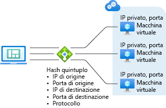

# Panoramica del servizio di bilanciamento del carico

Il servizio di bilanciamento del carico di Azure offre elevati livelli di disponibilità e prestazioni di rete per le applicazioni. Si tratta di un servizio di bilanciamento del carico di livello 4 (TCP, UDP) che distribuisce il traffico in ingresso tra istanze integre di servizi definiti in un set con carico bilanciato.

Azure Load Balancer può essere configurato per:

* Bilanciare il carico del traffico Internet in ingresso nelle macchine virtuali. Questa configurazione è nota come [bilanciamento del carico Internet tra più macchine virtuali o servizi](load-balancer-internet-overview.md).
* Bilanciare il carico del traffico tra macchine virtuali in una rete virtuale, tra macchine virtuali nei servizi cloud o tra computer locali e macchine virtuali in una rete virtuale cross-premise. Questa configurazione è nota come [bilanciamento del carico interno](load-balancer-internal-overview.md).
* Inoltrare il traffico esterno a una specifica macchina virtuale.

Tutte le risorse nel cloud richiedono un indirizzo IP pubblico per poter essere raggiungibili da Internet. L'infrastruttura cloud di Azure usa per le proprie risorse indirizzi IP non instradabili. Azure usa Network Address Translation (NAT) con indirizzi IP pubblici per comunicare con Internet.

## Modelli di distribuzione di Azure

È importante comprendere le differenze tra il [modello di distribuzione](../azure-resource-manager/resource-manager-deployment-model.md)classica di Azure e quello di Azure Resource Manager. Azure Load Balancer viene configurato in modo diverso in ogni modello.

### Modello di distribuzione classica di Azure

Le macchine virtuali distribuite entro il limite di un servizio cloud possono essere raggruppate per usare un servizio di bilanciamento del carico. In questo modello al servizio cloud vengono assegnati un indirizzo IP pubblico e un Fully Qualified Domain Name (FQDN). Il servizio di bilanciamento del carico esegue la conversione delle porte e bilancerà il traffico di rete, usando l'indirizzo IP pubblico per il servizio cloud.

Il traffico con carico bilanciato è definito dagli endpoint. Gli endpoint di conversione delle porte hanno una relazione uno-a-uno tra la porta pubblica assegnata dell'indirizzo IP pubblico e la porta locale assegnata al servizio su una macchina virtuale specifica. Gli endpoint di bilanciamento del carico hanno una relazione uno-a molti tra l'indirizzo IP pubblico e le porte locali assegnate ai servizi sulle macchine virtuali nel servizio cloud.

Figura 1. Azure Load Balancer nel modello di distribuzione classica

L'etichetta del dominio per l'indirizzo IP pubblico usato dal servizio di bilanciamento del carico per questo modello di distribuzione è \<nome servizio cloud\>.cloudapp.net. Il grafico seguente mostra Azure Load Balancer in questo modello.

### Modello di distribuzione di Azure Resource Manager

Nel modello di distribuzione di Resource Manager non è necessario creare un servizio cloud. Il bilanciamento del carico viene creato per instradare in modo esplicito il traffico tra più macchine virtuali.

Un indirizzo IP pubblico è una singola risorsa con un'etichetta di dominio (nome DNS). In questo caso l'indirizzo IP pubblico è associato alla risorsa del servizio di bilanciamento del carico. Le regole del servizio di bilanciamento del carico e le regole NAT in ingresso usano l'indirizzo IP pubblico come endpoint Internet per le risorse che ricevono il traffico di rete con carico bilanciato.

Un indirizzo IP privato o pubblico viene assegnato alla risorsa di interfaccia di rete collegata a una macchina virtuale. Quando un'interfaccia di rete viene aggiunta a un pool di indirizzi IP back-end del servizio di bilanciamento del carico, tale servizio inizia a inviare il traffico di rete con carico bilanciato in base alle regole di bilanciamento del carico create.

Il grafico seguente mostra Azure Load Balancer in questo modello:

Figura 2. Azure Load Balancer in Resource Manager

Il servizio di bilanciamento del carico può essere gestito mediante modelli, API e strumenti basati su Azure Resource Manager. Per altre informazioni su Azure Resource Manager, vedere [Panoramica di Azure Resource Manager](../azure-resource-manager/resource-group-overview.md).

## Funzionalità del bilanciamento del carico

* Distribuzione basata su hash

    Il servizio di bilanciamento del carico di Azure usa un algoritmo di distribuzione basato su hash. Per impostazione predefinita, usa un hash a 5 tuple composto da IP di origine, porta di origine, IP di destinazione, porta di destinazione e tipo di protocollo, per eseguire il mapping del traffico ai server disponibili. La persistenza viene mantenuta solo *all'interno* di una sessione di trasporto. I pacchetti nella stessa sessione TCP o UDP verranno indirizzati alla stessa istanza nell'endpoint con carico bilanciato. Quando il client chiude e riapre la connessione o avvia una nuova sessione dallo stesso IP di origine, la porta di origine cambia. È quindi possibile che il traffico venga indirizzato a un diverso endpoint in un data center differente.

    Per altre informazioni dettagliate, vedere [Modalità di distribuzione del servizio di bilanciamento del carico (affinità IP di origine)](load-balancer-distribution-mode.md). Il grafico seguente illustra la distribuzione basata su hash:

    

    Figura 3. Distribuzione basata su hash

* Port forwarding

    Il servizio di bilanciamento del carico di Azure consente di controllare la gestione della comunicazione in ingresso. Questa comunicazione include il traffico avviato da host Internet, macchine virtuali in altri servizi cloud o reti virtuali. Questo controllo è rappresentato da un endpoint, detto anche endpoint di input.

    Un endpoint di input è in ascolto su una porta pubblica e inoltra il traffico a una porta interna. È possibile eseguire il mapping delle stesse porte per un endpoint interno o esterno oppure usare una porta diversa. È ad esempio possibile configurare un server Web per l'ascolto sulla porta 81, mentre l'endpoint pubblico è mappato alla porta 80. La creazione di un endpoint pubblico determina la creazione di un'istanza del servizio di bilanciamento del carico.

    Se usato per la creazione, il portale di Azure crea automaticamente gli endpoint della macchina virtuale per il traffico delle sessioni remote di Windows PowerShell e per il protocollo Remote Desktop Protocol (RDP). È possibile usare tutti questi endpoint per amministrare la macchina virtuale in remoto tramite Internet.

* Riconfigurazione automatica

    Il servizio di bilanciamento del carico di Azure si riconfigura immediatamente quando si aumentano o si riducono le istanze. Questa riconfigurazione, ad esempio, ha luogo quando si aumenta il numero delle istanze per il ruolo di lavoro/Web in un servizio cloud o quando si aggiungono altre macchine virtuali allo stesso set con carico bilanciato.

* Monitoraggio del servizio

    Azure Load Balancer può verificare l'integrità delle varie istanze del server. Se un probe non risponde, il servizio di bilanciamento del carico interrompe l'invio di nuove connessioni alle istanze non integre. Ciò non influisce sulle connessioni esistenti.

    Sono supportati tre tipi di probe:

    + **Probe dell'agente guest (solo su macchine virtuali Platform as a Service)**: il servizio di bilanciamento del carico usa l'agente guest all'interno della macchina virtuale. L'agente guest è in ascolto e risponde con HTTP 200 OK solo quando l'istanza è pronta, ovvero quando lo stato dell'istanza non è Occupato, Riciclo in corso o Arresto. Se l'agente non risponde con un messaggio HTTP 200 OK, il servizio di bilanciamento del carico contrassegna l'istanza che non risponde e interrompe l'invio di traffico a tale istanza. Il servizio di bilanciamento del carico continua a eseguire il ping dell'istanza. Se l'agente guest risponde con HTTP 200, il servizio di bilanciamento del carico invierà ancora il traffico a tale istanza. Quando si usa un ruolo Web, il codice del sito Web in genere viene eseguito in w3wp.exe, che non viene monitorato dall'infrastruttura di Azure o dall'agente guest. Gli errori in w3wp.exe, ad esempio le risposte HTTP 500, non verranno quindi segnalati all'agente guest e il servizio di bilanciamento del carico non sa di dover escludere l'istanza dalla rotazione.
    + **Probe HTTP personalizzato:** questo probe esegue l'override del probe predefinito (agente guest). È possibile usarlo per creare la logica personalizzata con cui determinare l'integrità dell'istanza del ruolo. Il servizio di bilanciamento del carico eseguirà regolarmente il probe dell'endpoint (per impostazione predefinita, ogni 15 secondi). L'istanza è considerata nella rotazione se risponde con ACK TCP o HTTP 200 entro il periodo di timeout (per impostazione predefinita, 31 secondi). Questo è utile per implementare la propria logica per la rimozione delle istanze dalla rotazione del servizio di bilanciamento del carico. È possibile, ad esempio, configurare l'istanza in modo che restituisca uno stato diverso da 200 se l'istanza usa più del 90% della CPU. Per i ruoli Web che usano w3wp.exe, si ottiene anche il monitoraggio automatico del sito Web, perché gli errori nel codice del sito Web restituiscono al probe uno stato diverso da 200.
    + **Probe TCP personalizzato:** questo probe si basa sulla corretta attivazione di una sessione TCP in una porta probe definita.

    Per altre informazioni, vedere [Schema LoadBalancerProbe](https://msdn.microsoft.com/library/azure/jj151530.aspx).

* Source NAT

    Tutto il traffico in uscita proveniente dal servizio e destinato a Internet viene sottoposto a un processo SNAT (Source NAT) usando lo stesso indirizzo VIP del traffico in ingresso. Questo processo offre tre importanti vantaggi:

    + Consente di eseguire in modo semplice l'aggiornamento e il ripristino di emergenza dei servizi, perché è possibile eseguire il mapping dinamico dell'indirizzo VIP a un'altra istanza del servizio.
    + Semplifica la gestione dell'elenco di controllo di accesso (ACL). Tali elenchi espressi in termini di VIP non si modificano in caso di ridimensionamento o ridistribuzione dei servizi.

    La configurazione di bilanciamento del carico supporta il processo NAT di tipo full cone per UDP. Con questo tipo di processo, la porta consente le connessioni in ingresso da qualsiasi host esterno (in risposta a una richiesta in uscita).

    Per ogni nuova connessione in uscita avviata da una macchina virtuale, viene allocata anche una porta in uscita dal servizio di bilanciamento del carico. L'host esterno vede il traffico in arrivo con una porta allocata dell'IP virtuale (indirizzo VIP). Per gli scenari che richiedono un numero elevato di connessioni in uscita, è consigliabile usare gli [indirizzi IP pubblici a livello di istanza](../virtual-network/virtual-networks-instance-level-public-ip.md) per poter avere un indirizzo IP in uscita dedicato per SNAT. Ciò consente di ridurre il rischio di esaurimento delle porte.

    Il numero massimo di porte che possono essere usate dall'indirizzo VIP o dall'IP pubblico a livello di istanza è 64.000. Si tratta di una limitazione standard TCP.

### Supporto per più indirizzi IP con carico bilanciato per le macchine virtuali
A un set di macchine virtuali è possibile assegnare più di un indirizzo IP pubblico con carico bilanciato. Ciò consente di ospitare più siti Web SSL e/o più listener del gruppo di disponibilità SQL Server AlwaysOn nello stesso set di macchine virtuali. Per altre informazioni, vedere [Indirizzi VIP multipli per un servizio cloud](load-balancer-multivip.md).

[!INCLUDE [load-balancer-compare-tm-ag-lb-include.md](../../includes/load-balancer-compare-tm-ag-lb-include.md)]

## Passaggi successivi

[Panoramica del servizio di bilanciamento del carico Internet](load-balancer-internet-overview.md)

[Panoramica del bilanciamento del carico interno](load-balancer-internal-overview.md)

[Introduzione alla creazione del servizio di bilanciamento del carico Internet](load-balancer-get-started-internet-arm-ps.md)

<!--HONumber=Nov16_HO5-->

