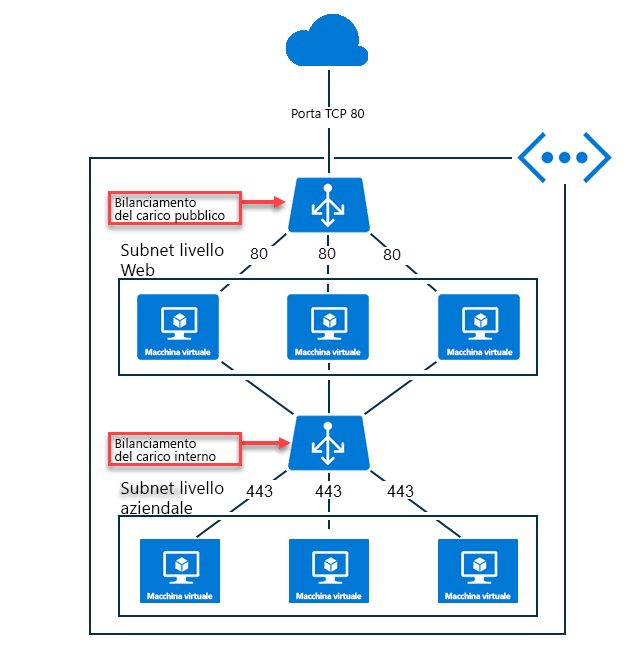

# Informazioni su Azure Load Balancer

Azure Load Balancer consente di ridimensionare le applicazioni e di creare disponibilità elevata per i servizi. Load Balancer supporta scenari in ingresso e in uscita, offre bassa latenza e velocità effettiva elevata e una scalabilità fino a milioni di flussi per tutte le applicazioni TCP e UDP.  

Load Balancer distribuisce i nuovi flussi in ingresso che arrivano sul front-end di Load Balancer nelle istanze del pool back-end in base alle regole e ai probe di integrità. 

In aggiunta, un Load Balancer pubblico può anche offrire connessioni in uscita per le macchine virtuali all'interno della rete virtuale convertendo gli indirizzi IP privati in indirizzi IP pubblici.

Azure Load Balancer è disponibile in due SKU, ovvero Basic e Standard. con differenze di scalabilità, funzionalità e prezzo. Tutti gli scenari possibili con Load Balancer Basic possono essere creati anche con Load Balancer Standard, anche se l'approccio può essere leggermente diverso. Man mano che si apprendono nuove cose su Load Balancer, è importante acquisire familiarità con le caratteristiche principali e le differenze specifiche per SKU.

## Perché usare Azure Load Balancer 

È possibile usare Azure Load Balancer per eseguire queste operazioni:

* Bilanciare il carico del traffico Internet in ingresso nelle macchine virtuali. Questa configurazione è nota come [Load Balancer pubblico](#publicloadbalancer).
* Bilanciare il carico del traffico tra le VM all'interno di una rete virtuale. È anche possibile raggiungere un front-end di Load Balancer da una rete locale in uno scenario ibrido. Entrambi gli scenari usano una configurazione nota come [Load Balancer interno](#internalloadbalancer).
* Inoltrare il traffico a una porta specifica su specifiche macchine virtuali con le regole NAT (Network Address Translation) in ingresso.
* Offrire [connettività in uscita](load-balancer-outbound-connections.md) per le macchine virtuali all'interno della rete virtuale usando un Load Balancer pubblico.

>[!NOTE]
> Azure offre una suite di soluzioni di bilanciamento del carico completamente gestite per tutti gli scenari. Per la terminazione del protocollo Transport Layer Security (TLS) ("offload SSL"), la richiesta per HTTP/HTTPS o l'elaborazione a livello di applicazione, vedere [Gateway di applicazione](../application-gateway/application-gateway-introduction.md). Se si desidera il bilanciamento del carico DNS globale, esaminare l'articolo relativo a [Gestione traffico di Microsoft Azure](../traffic-manager/traffic-manager-overview.md). Gli scenari end-to-end potrebbero trarre vantaggio dalla combinazione di queste soluzioni in base alle esigenze.

## Informazioni sulle risorse di Load Balancer

Una risorsa di Load Balancer può esistere come bilanciamento del carico pubblico o interno. Le funzioni della risorsa di Load Balancer sono espresse come definizione di front-end, regola, probe di integrità e pool back-end. Le macchine virtuali vengono inserite nel pool back-end specificando il pool back-end dalla macchina virtuale.

Le risorse di Load Balancer sono oggetti all'interno dei quali è possibile esprimere in che modo Azure deve programmare la propria infrastruttura multi-tenant per ottenere lo scenario che si vuole creare. Non esiste una relazione diretta tra le risorse di Load Balancer e l'infrastruttura effettiva. La creazione di Load Balancer non crea un'istanza e la capacità è sempre disponibile. 

## Funzionalità principali di Load Balancer

Load Balancer offre le funzionalità principali seguenti per applicazioni TCP e UDP:

* **Bilanciamento del carico**

    Con Azure Load Balancer è possibile creare una regola di bilanciamento del carico per distribuire il traffico che arriva al front-end nelle istanze del pool back-end. Load Balancer usa un algoritmo basato su hash per distribuire i flussi in ingresso e riscrive di conseguenza le intestazioni dei flussi nelle istanze del pool back-end. Un server è disponibile per ricevere i nuovi flussi quando un probe di integrità indica un endpoint di back-end integro.
    
    Per impostazione predefinita, Load Balancer usa un hash a 5 tuple composto da indirizzo IP di origine, porta di origine, indirizzo IP di destinazione, porta di destinazione e numero di protocollo IP per eseguire il mapping dei flussi nei server disponibili. È possibile scegliere di creare affinità per uno specifico indirizzo IP di origine scegliendo un hash a 2 o a 3 tuple per una determinata regola. Tutti i pacchetti dello stesso flusso di pacchetti arrivano sulla stessa istanza dietro il front-end con carico bilanciato. Quando il client avvia un nuovo flusso dallo stesso indirizzo IP di origine, la porta di origine cambia. Di conseguenza, le 5 tuple possono far sì che il traffico sia indirizzato verso un endpoint di back-end diverso.

    Per altre informazioni, vedere l'articolo sulla [modalità di distribuzione di Load Balancer](load-balancer-distribution-mode.md). L'immagine seguente mostra la distribuzione basata su hash:

    

    *Figura: Distribuzione basata su hash*

* **Port forwarding**

    Load Balancer consente di creare una regola NAT in ingresso per inoltrare il traffico di una porta specifica di un determinato indirizzo IP front-end a una porta specifica di una determinata istanza di back-end all'interno della rete virtuale. Ciò avviene anche tramite la stessa distribuzione basata su hash del bilanciamento del carico. Scenari comuni per questa funzionalità sono le sessioni di Remote Desktop Protocol (RDP) o Secure Shell (SSH) per le singole istanze di macchina virtuale all'interno della rete virtuale di Azure. È possibile eseguire il mapping di più endpoint interni per diverse porte sullo stesso indirizzo IP front-end. È possibile usare gli indirizzi IP frontend per amministrare in remoto le macchine virtuali sul Web senza la necessità di un jumpbox aggiuntivo.

* **Applicazione indipendente e trasparente**

    Load Balancer non interagisce direttamente con TCP o UDP o con il livello dell'applicazione e può supportare qualsiasi scenario dell'applicazione basato su TCP o UDP.  Load Balancer non termina e non dà origine a flussi, non interagisce con il payload dei flussi, non offre alcuna funzione di gateway applicazione e gli handshake del protocollo si verificano sempre direttamente tra il client e l'istanza del pool back-end.  Una risposta a un flusso in ingresso è sempre una risposta da una macchina virtuale.  Quando il flusso arriva nella macchina virtuale, viene mantenuto anche l'indirizzo IP di origine.  Alcuni esempi per illustrare ulteriormente la trasparenza:
    - A ogni endpoint risponde solo una macchina virtuale.  Ad esempio, si verifica sempre un handshake TCP tra il client e la macchina virtuale di back-end selezionata.  Una risposta a una richiesta in un front-end è una risposta generata dalla macchina virtuale di back-end. Quando si convalida correttamente la connettività a un front-end, si convalida la connettività end-to-end per almeno una macchina virtuale di back-end.
    - I payload delle applicazioni sono trasparenti per Load Balancer e possono essere supportate tutte le applicazioni UDP o TCP. Per i carichi di lavoro che richiedono l'elaborazione di richieste HTTP o la manipolazione di payload a livello di applicazione (ad esempio l'analisi di URL HTTP), usare un servizio di bilanciamento del carico di livello 7 come [gateway applicazione](https://azure.microsoft.com/services/application-gateway).
    - Dato che Load Balancer è indipendente dal payload TCP e l'offload TLS ("SSL") non è presente, è possibile creare scenari end-to-end crittografati con Load Balancer e ottenere una soluzione con elevata scalabilità orizzontale per le applicazioni TLS terminando la connessione TLS nella macchina virtuale stessa.  Ad esempio, la capacità di codifica della sessione TLS è limitata solo dal tipo e dal numero di macchine virtuali aggiunte al pool di back-end.  Se è necessario un "offload SSL" o il trattamento al livello dell'applicazione oppure si vuole delegare la gestione dei certificati ad Azure, usare invece il [gateway applicazione](https://azure.microsoft.com/services/application-gateway) del servizio di bilanciamento del carico di livello 7 di Azure.
        

* **Riconfigurazione automatica**

    Load Balancer si riconfigura immediatamente in base all'aumento o alla riduzione delle istanze. L'aggiunta o la rimozione di macchine virtuali dal pool back-end riconfigura il servizio Load Balancer senza operazioni aggiuntive sulla risorsa di Load Balancer.

* **Probe di integrità**

    Load Balancer usa i probe di integrità definiti dall'utente per determinare l'integrità delle istanze nel pool back-end. Se un probe non risponde, il servizio Load Balancer interrompe l'invio di nuove connessioni alle istanze non integre. Le connessioni esistenti non sono interessate e continua fino a quando l'applicazione non termina il flusso, non si verifica un timeout di inattività o la macchina virtuale non viene arrestata.
     
    Il bilanciamento del carico fornisce [diversi tipi di probe di integrità](load-balancer-custom-probe-overview.md#types) per endpoint TCP, HTTP e HTTPS.

    Inoltre, quando si utilizzano servizi cloud Classic, è consentito anche un tipo aggiuntivo, ovvero  [Agente guest](load-balancer-custom-probe-overview.md#guestagent).  Questo deve essere considerato tuttavia come probe di integrità di ultima scelta e non è consigliato se sono disponibili altre opzioni.
    
* **Connessioni in uscita (SNAT)**

    Tutti i flussi in uscita dagli indirizzi IP privati all'interno della rete virtuale verso gli indirizzi IP pubblici in Internet possono essere convertiti in indirizzi IP front-end di Load Balancer. Quando un front-end pubblico è associato a una macchina virtuale back-end tramite una regola di bilanciamento del carico, Azure programma le connessioni in uscita da convertire automaticamente nell'indirizzo IP front-end pubblico.

    * È possibile eseguire in modo semplice l'aggiornamento e il ripristino di emergenza dei servizi, perché è possibile eseguire il mapping dinamico del front-end in un'altra istanza del servizio.
    * Gestione semplificata degli elenchi di controllo di accesso (ACL). Gli ACL espressi in termini di indirizzi IP front-end non si modificano in caso di ridimensionamento o ridistribuzione dei servizi.  La conversione delle connessioni in uscita in un numero di indirizzi IP inferiore a quello delle macchine può ridurre il carico correlato all'inserimento nell'elenco di elementi consentiti.

    Per altre informazioni, vedere [Connessioni in uscita](load-balancer-outbound-connections.md).

Load Balancer Standard offre capacità aggiuntive specifiche dello SKU oltre a queste capacità fondamentali. Esaminare la restante parte di questo articolo per informazioni dettagliate.

##  Confronto tra gli SKU di Load Balancer

Load Balancer supporta gli SKU Basic e Standard, ciascuno con differenze in termini di dimensioni degli scenari, funzionalità e prezzi. Tutti gli scenari possibili con Load Balancer Basic possono essere creati anche con Load Balancer Standard. In effetti, le API per entrambi gli SKU sono simili e vengono richiamate tramite la specifica di uno SKU. L'API per supportare gli SKU di Load Balancer e l'indirizzo IP pubblico sono disponibili a partire dall'API 2017-08-01. Entrambi gli SKU hanno la stessa API e la stessa struttura generale.

A seconda dello SKU scelto, tuttavia, la configurazione completa dello scenario può essere leggermente diversa. La documentazione di Load Balancer specifica quando un articolo è applicabile solo a un determinato SKU. Esaminare la tabella seguente per confrontare e comprendere le differenze. Per altre informazioni, vedere [Panoramica di Azure Load Balancer Standard](load-balancer-standard-overview.md).

>[!NOTE]
> Per i nuovi progetti è consigliabile adottare Load Balancer Standard. 

Le macchine virtuali autonome, i set di disponibilità e i set di scalabilità di macchine virtuali possono essere collegati solo a uno SKU, non a entrambi. Se usati con gli indirizzi IP pubblici, lo SKU di Load Balancer e quello dell'indirizzo IP pubblico devono corrispondere. Gli SKU di Load Balancer e quelli degli indirizzi IP pubblici non sono modificabili.

_È consigliabile specificare gli SKU in modo esplicito, anche se non è ancora obbligatorio._  In questo momento le modifiche necessarie vengono mantenute al minimo. Se non si specifica lo SKU, si presuppone l'intenzione di usare lo SKU Basic nella versione API 2017-08-01.

>[!IMPORTANT]
>Load Balancer Standard è un nuovo prodotto di Load Balancer e in larga misura un soprainsieme di Load Balancer Basic. Tra i due prodotti ci sono differenze importanti e valutate attentamente. Tutti gli scenari end-to-end possibili con Load Balancer Basic possono essere creati anche con Load Balancer Standard. Se si conosce già Load Balancer Basic, è consigliabile acquisire familiarità con Load Balancer Standard per comprendere le modifiche di comportamento più recenti tra le versioni Standard e Basic e il relativo impatto. Leggere attentamente questa sezione.

[!INCLUDE [comparison table](../../includes/load-balancer-comparison-table.md)]

Per altre informazioni, vedere i [limiti del servizio di Load Balancer](https://aka.ms/lblimits). Per informazioni dettagliate su Load Balancer Standard, vedere [panoramica](load-balancer-standard-overview.md), [prezzi](https://aka.ms/lbpricing) e [contratto di servizio](https://aka.ms/lbsla).

## Concetti

### Bilanciamento del carico pubblico

Load Balancer pubblico esegue il mapping dell'indirizzo IP pubblico e del numero di porta del traffico in ingresso all'indirizzo IP privato e al numero di porta della macchina virtuale e viceversa per il traffico di risposta proveniente dalla macchina virtuale. Applicando le regole di bilanciamento del carico è possibile distribuire tipi specifici di traffico in più macchine virtuali o servizi. È ad esempio possibile dividere il carico del traffico delle richieste Web tra più server Web.

La figura seguente mostra un endpoint con carico bilanciato per il traffico Web condiviso fra tre macchine virtuali per la porta TCP 80 pubblica. Queste tre macchine virtuali fanno parte di un set con bilanciamento del carico.

*Figura: bilanciamento del carico del traffico Web tramite un servizio Load Balancer pubblico*

Quando i client Internet inviano richieste di pagine Web all'indirizzo IP pubblico di un'app Web sulla porta TCP 80, Azure Load Balancer distribuisce le richieste tra le tre macchine virtuali del set con carico bilanciato. Per altre informazioni sull'algoritmo di Load Balancer, vedere la sezione delle [funzionalità di Load Balancer](load-balancer-overview.md##fundamental-load-balancer-features) di questo articolo.

Per impostazione predefinita, Azure Load Balancer distribuisce il traffico di rete in modo uniforme tra più istanze di macchine virtuali. È anche possibile configurare l'affinità di sessione. Per altre informazioni, vedere l'articolo sulla [modalità di distribuzione di Load Balancer](load-balancer-distribution-mode.md).

###  Bilanciamento del carico interno

Un servizio Load Balancer interno indirizza il traffico solo alle risorse che si trovano all'interno di una rete virtuale o che usano una VPN per accedere all'infrastruttura di Azure. In questo senso, il servizio Load Balancer interno si differenzia da un Load Balancer pubblico. L'infrastruttura di Azure limita l'accesso agli indirizzi IP front-end con carico bilanciato di una rete virtuale. Gli indirizzi IP front-end e le reti virtuali non sono mai esposti direttamente a un endpoint di Internet. Le applicazioni line-of-business interne vengono eseguite in Azure e sono accessibili dall'interno di Azure o da risorse locali.

Il servizio Load Balancer interno consente di bilanciare i tipi di carico seguenti:

* **In una rete virtuale**: bilanciamento del carico dalle macchine virtuali nella rete virtuale a un set di macchine virtuali che si trovano nella stessa rete virtuale.
* **Per una rete virtuale cross-premise**: bilanciamento del carico dai computer locali a un set di macchine virtuali che si trovano nella stessa rete virtuale. 
* **Per le applicazioni multilivello**: bilanciamento del carico per le applicazioni multilivello e con connessione a Internet in cui i livelli di back-end non sono esposti a Internet. I livelli di back-end richiedono il bilanciamento del carico per il traffico dal livello con connessione a Internet (vedere la figura seguente).
* **Per le applicazioni line-of-business**: bilanciamento del carico per le applicazioni line-of-business ospitate in Azure senza applicazioni software o componenti hardware aggiuntivi per il bilanciamento del carico. Questo scenario include server locali che si trovano nel set di computer il cui traffico ha il carico bilanciato.

*Figura: bilanciamento del carico di applicazioni multilivello tramite servizi Load Balancer sia pubblico che interno*

## Prezzi

Il costo dell'utilizzo del servizio Load Balancer Standard viene addebitato in base ai criteri seguenti.

- Numero di regole di bilanciamento del carico e in uscita configurate (le regole NAT in ingresso non vengono conteggiate ai fini del numero totale di regole).
- Quantità di dati elaborati in ingresso e in uscita indipendentemente dalla regola. 

Per informazioni sui prezzi di Load Balancer Standard, visitare la pagina [Prezzi del servizio Load Balancer](https://azure.microsoft.com/pricing/details/load-balancer/).

Load Balancer Basic è disponibile senza alcun addebito.

## Contratto di servizio

Per informazioni sul contratto di servizio di Load Balancer Standard, visitare la pagina del [contratto di servizio di Load Balancer Standard](https://aka.ms/lbsla). 

## Limitazioni

- Load Balancer è un prodotto TCP o UDP per il bilanciamento del carico e il port forwarding per questi protocolli IP specifici.  Le regole di bilanciamento del carico e le regole NAT in ingresso sono supportate per TCP e UDP e non per altri protocolli IP, tra cui ICMP. Load Balancer non termina, non risponde o non interagisce in altro modo con il payload di un flusso UDP o TCP. Non è un proxy. La convalida della connettività a un front-end deve avvenire in banda con lo stesso protocollo usato in un bilanciamento del carico o in una regola NAT in ingresso (TCP o UDP) _e_ almeno una delle macchine virtuali deve generare una risposta affinché un client possa vedere una risposta da un front-end.  La mancata ricezione di una risposta in banda da parte del front-end di Load Balancer indica che nessuna macchina virtuale è stata in grado di rispondere.  Non è possibile interagire con un front-end di Load Balancer senza una macchina virtuale in grado di rispondere.  Questo vale anche per le connessioni in uscita in cui lo [SNAT di mascheramento delle porte](load-balancer-outbound-connections.md#snat) è supportato solo per TCP e UDP. Qualsiasi altro protocollo IP, incluso ICMP, non funziona.  Assegnare un indirizzo IP pubblico a livello di istanza per la mitigazione.
- A differenza dei servizi di bilanciamento del carico pubblici che forniscono [connessioni in uscita](load-balancer-outbound-connections.md) quando si passa da indirizzi IP privati all'interno della rete virtuale a indirizzi IP pubblici, i servizi di bilanciamento del carico interni non convertono le connessioni originate in uscita nel front-end di un servizio di bilanciamento del carico perché entrambi si trovano in uno spazio indirizzi IP privato.  In questo modo si evita il rischio di esaurimento della porta SNAT all'interno di uno spazio indirizzi IP interno univoco in cui non è richiesta la conversione.  L'effetto collaterale è che se un flusso in uscita da una VM nel pool di back-end tenta di raggiungere il front-end del Load Balancer interno in cui risiede il pool _e_ viene rimappato su se stesso, i due lati del flusso non corrispondono e il flusso avrà esito negativo.  Se il flusso non è stato rimappato sulla stessa VM del pool di back-end che ha creato il flusso verso il front-end, il flusso avrà esito positivo.   Quando il flusso viene rimappato su se stesso, il flusso in uscita sembra provenire dalla VM verso il front-end e il flusso in ingresso corrispondente sembra provenire dalla VM verso se stessa. Dal punto di vista del sistema operativo guest, le parti in ingresso e in uscita dello stesso flusso non corrispondono all'interno della macchina virtuale. Lo stack TCP non riconoscerà queste metà del flusso come facenti parte dello stesso flusso perché l'origine e la destinazione non corrispondono.  Quando il flusso viene mappato su qualsiasi altra VM nel pool di back-end, le metà del flusso corrispondono e la VM può rispondere correttamente al flusso stesso.  Il sintomo per questo scenario è timeout di connessione intermittenti quando il flusso restituisce nel back-end stesso che ha originato il flusso. Esistono diverse soluzioni alternative comuni per ottenere questo scenario in modo affidabile (origine dei flussi da un pool di back-end verso i pool di back-end o il front-end del Load Balancer interno) che includono l'inserimento di un livello di proxy dietro il servizio di bilanciamento del carico interno oppure l'[uso di regole in stile DSR](load-balancer-multivip-overview.md).  I clienti possono combinare un bilanciamento del carico interno con qualsiasi proxy di terze parti o sostituire il [Gateway applicazione](../application-gateway/application-gateway-introduction.md) interno per gli scenari di proxy limitati a HTTP/HTTPS. Anche se è possibile usare un servizio di bilanciamento del carico pubblico per la mitigazione, lo scenario risultante è soggetto a [esaurimento SNAT](load-balancer-outbound-connections.md#snat) e deve essere evitato a meno che non venga gestito con attenzione.

## Passaggi successivi

Quella descritta è una panoramica di Azure Load Balancer. Per iniziare a usare un servizio Load Balancer, crearne uno, creare macchine virtuali con un'estensione IIS personalizzata installata e bilanciare il carico dell'app Web tra le macchine virtuali. Per informazioni su queste procedure, vedere la guida introduttiva [Creare un servizio di bilanciamento del carico di base](quickstart-create-basic-load-balancer-portal.md).
