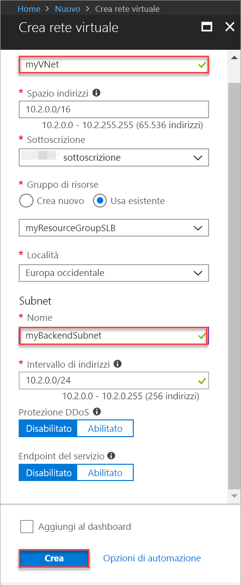
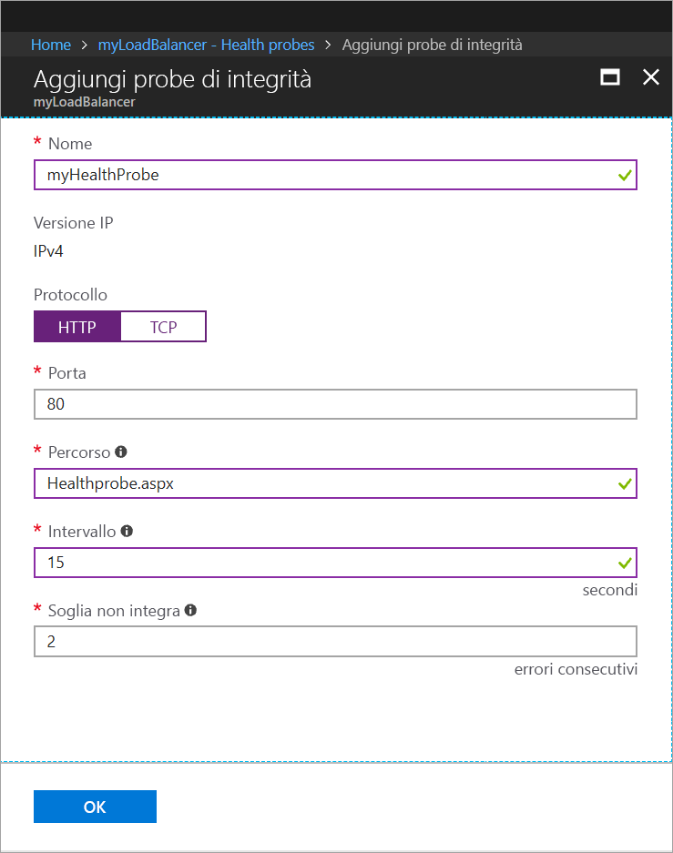
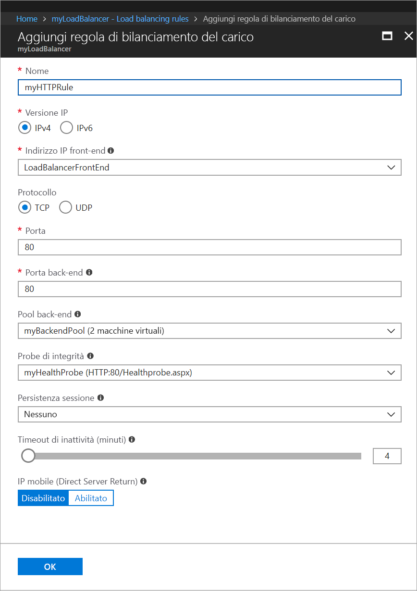
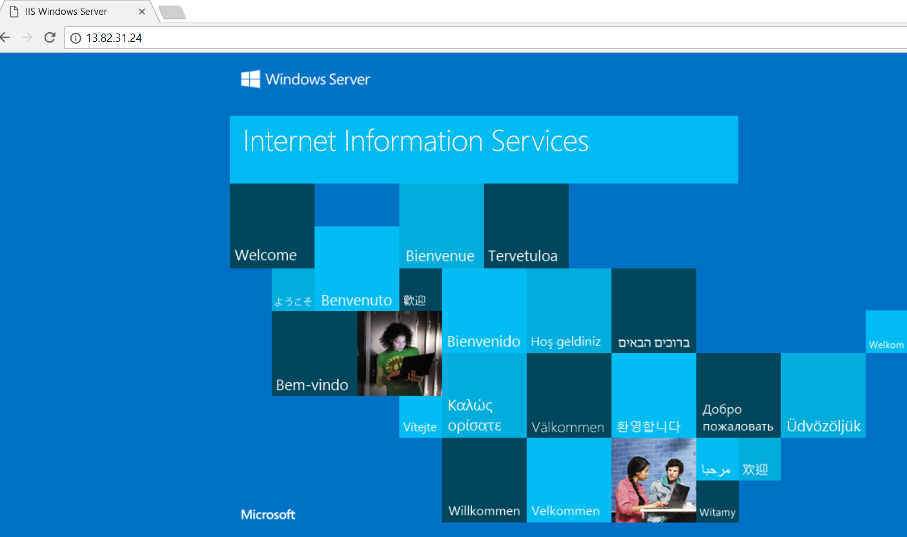

# Guida introduttiva: Creare un servizio di bilanciamento del carico Standard per bilanciare il carico delle macchine virtuali con il portale di Azure

Il bilanciamento del carico offre un livello più elevato di disponibilità e scalabilità distribuendo le richieste in ingresso tra più macchine virtuali. È possibile usare il portale di Azure per creare un servizio di bilanciamento del carico di macchine virtuali. Questa guida introduttiva illustra come bilanciare il carico delle macchine virtuali con un'istanza di Load Balancer Standard.

Se non si ha una sottoscrizione di Azure, creare un [account gratuito](https://azure.microsoft.com/free/?WT.mc_id=A261C142F) prima di iniziare. 

## Accedere ad Azure

Accedere al portale di Azure all'indirizzo [http://portal.azure.com](http://portal.azure.com).

## Creare un servizio di bilanciamento del carico pubblico

In questa sezione viene creato un servizio di bilanciamento del carico pubblico che consente di bilanciare il carico delle macchine virtuali. Load Balancer Standard supporta solo un indirizzo IP pubblico standard. Quando si crea un'istanza di Load Balancer Standard, è necessario creare anche un nuovo indirizzo IP pubblico standard che viene configurato come il front-end (denominato come *LoadBalancerFrontend* per impostazione predefinita) per Load Balancer Standard. 

1. Nella parte superiore sinistra dello schermo fare clic su **Crea una risorsa** > **Rete** > **Servizio di bilanciamento del carico**.
2. Nella pagina **Crea servizio di bilanciamento del carico** immettere o selezionare le informazioni seguenti, accettare le impostazioni predefinite per le impostazioni rimanenti e quindi selezionare **Crea**:

    | Impostazione                 | Valore                                              |
    | ---                     | ---                                                |
    | NOME                   | *myLoadBalancer*                                   |
    | type          | Pubblico                                        |
    | SKU           | Standard                          |
    | Indirizzo IP pubblico | Selezionare **Crea nuovo** e digitare *myPublicIP* nella casella di testo. Per impostazione predefinita, per l'indirizzo IP pubblico è selezionato lo SKU Standard. Per **Zona di disponibilità** selezionare **Con ridondanza della zona**. |
    | Sottoscrizione               | Selezionare la propria sottoscrizione.    |
    |Gruppo di risorse | Selezionare **Crea nuovo** e quindi digitare *myResourceGroupSLB*.    |
    | Località           | Selezionare **Europa occidentale**.                          |
    

## Creare i server back-end

In questa sezione si crea una rete virtuale, si creano due macchine virtuali per il pool back-end del servizio di bilanciamento del carico e quindi si installa IIS nelle macchine virtuali per testare il servizio di bilanciamento del carico.

### Crea rete virtuale
1. Nella parte superiore sinistra della schermata fare clic su **Nuovo** > **Rete** > **Rete virtuale** e immettere i valori seguenti per la rete virtuale:
    - *myVnet* come nome della rete virtuale.
    - *myResourceGroupSLB* come nome del gruppo di risorse esistente.
    - *myBackendSubnet* come nome della subnet.
2. Fare clic su **Crea** per creare la rete virtuale.

    

### Creare macchine virtuali

1. Nella parte superiore sinistra della schermata fare clic su **Nuovo** > **Calcolo** > **Windows Server 2016 Datacenter** e immettere i valori seguenti per la macchina virtuale:
    - *myVM1* come nome della macchina virtuale.        
    - *myResourceGroupSLB* come **Gruppo di risorse**, selezionare **Usa esistente** e quindi selezionare *myResourceGroupSLB*.
2. Fare clic su **OK**.
3. Selezionare **DS1_V2** come dimensioni per la macchina virtuale e fare clic su **Seleziona**.
4. Immettere i valori seguenti per le impostazioni della macchina virtuale:
    1. Assicurarsi che *myVNet* sia selezionato come rete virtuale e che *myBackendSubnet* sia selezionato come subnet.
    2. Per **Indirizzo IP pubblico** nel riquadro **Crea indirizzo IP pubblico** selezionare **Standard** e quindi **OK**.
    3. Per **Gruppo di sicurezza di rete** selezionare **Avanzate** e quindi seguire questa procedura:
        1. Selezionare *Gruppo di sicurezza di rete (firewall) e nella pagina **Scegli un gruppo di sicurezza di rete** selezionare **Crea nuovo**. 
        2. Nella pagina **Crea gruppo di sicurezza di rete**, per **Nome** immettere *myNetworkSecurityGroup*, quindi selezionare **OK**.
5. Fare clic su **Disabilitato** per disabilitare la diagnostica di avvio.
6. Fare clic su **OK**, verificare le impostazioni nella pagina di riepilogo e quindi fare clic su **Crea**.
7. Seguendo i passaggi da 1 a 6, creare una seconda macchina virtuale denominata *VM2* con *myAvailibilityset* come set di disponibilità, *myVnet* come rete virtuale, *myBackendSubnet* come subnet e **myNetworkSecurityGroup* come gruppo di sicurezza di rete. 

### Creare una regola del gruppo di sicurezza di rete

In questa sezione si crea una regola NSG per consentire connessioni in ingresso tramite HTTP.

1. Fare clic su **Tutte le risorse** nel menu a sinistra e quindi nell'elenco delle risorse fare clic su **myNetworkSecurityGroup**, che si trova nel gruppo di risorse **myResourceGroupSLB**.
2. In **Impostazioni** fare clic su **Regole di sicurezza in ingresso** e quindi su **Aggiungi**.
3. Immettere questi valori per la regola di sicurezza in ingresso denominata *myHTTPRule* per consentire connessioni HTTP in ingresso tramite la porta 80:
    - *Tag del servizio* come **Origine**
    - *Internet* come **Tag del servizio di origine**
    - *80* come **Intervalli di porte di destinazione**
    - *TCP* come **Protocollo**
    - *Consenti* come **Azione**
    - *100* come **Priorità**
    - *myHTTPRule* come nome
    - *Consenti HTTP* come descrizione
4. Fare clic su **OK**.
 
### Installare IIS

1. Fare clic su **Tutte le risorse** nel menu a sinistra e quindi nell'elenco delle risorse fare clic su **myVM1**, che si trova nel gruppo di risorse *myResourceGroupLB*.
2. Nella pagina **Panoramica** fare clic su **Connect to RDP** (Connetti a RDP) nella macchina virtuale.
3. Accedere alla macchina virtuale con nome utente *azureuser*.
4. Nel desktop del server passare a **Strumenti di amministrazione Windows**>**Server Manager**.
5. In Server Manager fare clic su **Aggiungi ruoli e funzionalità**.
6. Nella procedura guidata **Aggiungi ruoli e funzionalità** usare i valori seguenti:
    - Nella pagina **Selezione tipo di installazione** fare clic su **Installazione basata su ruoli o basata su funzionalità**.
    - Nella pagina **Selezione server di destinazione** fare clic su **myVM1**.
    - Nella pagina **Selezionare un ruolo server** fare clic su **Web Server (IIS)**.
    - Seguire le istruzioni per completare il resto della procedura guidata. 
7. Ripetere i passaggi da 1 a 6 per la macchina virtuale *myVM2*.

## Creare risorse di bilanciamento del carico

In questa sezione si configurano le impostazioni del servizio di bilanciamento del carico per un pool di indirizzi back-end e un probe di integrità e si specifica una regola di bilanciamento del carico.

### Creare un pool di indirizzi back-end

Per distribuire il traffico alle macchine virtuali, è necessario che un pool di indirizzi back-end contenga gli indirizzi IP delle schede di interfaccia di rete virtuale connesse al bilanciamento del carico. Creare il pool di indirizzi back-end *myBackendPool* per includere *VM1* e *VM2*.

1. Fare clic su **Tutte le risorse** nel menu a sinistra e quindi fare clic su **myLoadBalancer** nell'elenco di risorse.
2. In **Impostazioni** fare clic su **Pool back-end** e quindi su **Aggiungi**.
3. Nella pagina **Aggiungi pool back-end** seguire questa procedura:
   - Digitare *myBackendPool* come nome del pool back-end.
   - Per **Rete virtuale**, selezionare *myVNet*.
   - Aggiungere *myVM1* e *myVM2* in **Macchina virtuale** con gli indirizzi IP corrispondenti e quindi selezionare **Aggiungi**.
    - Fare clic su **OK**.

3. Verificare che l'impostazione del pool back-end di bilanciamento del carico visualizzi entrambe le macchine virtuali **VM1** e **VM2**.

### Creare un probe di integrità

Per consentire al servizio di bilanciamento del carico di monitorare lo stato dell'app, si usa un probe di integrità. Il probe di integrità aggiunge o rimuove in modo dinamico le VM nella rotazione del servizio di bilanciamento del carico in base alla rispettiva risposta ai controlli di integrità. Creare un probe di integrità *myHealthProbe* per monitorare l'integrità delle macchine virtuali.

1. Fare clic su **Tutte le risorse** nel menu a sinistra e quindi fare clic su **myLoadBalancer** nell'elenco di risorse.
2. In **Impostazioni** fare clic su **Probe integrità** e quindi su **Aggiungi**.
3. Usare questi valori per creare il probe di integrità:
    - *myHealthProbe* come nome del probe di integrità.
    - **HTTP** come tipo di protocollo.
    - *80* come numero della porta.
    - *Healthprobe.aspx*: per il percorso dell'URI. È possibile sostituire questo valore con qualsiasi altro URI o mantenere il valore di percorso predefinito **"\\"** per ottenere l'URI predefinito.
    - *15* in **Intervallo** come numero di secondi tra i tentativi del probe.
    - *2* per **Soglia di non integrità** come numero di errori di probe consecutivi che devono verificarsi prima che una macchina virtuale venga considerata non integra.
4. Fare clic su **OK**.

   

### Creare una regola di bilanciamento del carico

Una regola di bilanciamento del carico consente di definire come il traffico verrà distribuito alle VM. Definire la configurazione IP front-end per il traffico in ingresso e il pool IP back-end che riceve il traffico, insieme alle porte di origine e di destinazione necessarie. Creare una regola di bilanciamento del carico *myLoadBalancerRuleWeb* per l'ascolto sulla porta 80 nel front-end *FrontendLoadBalancer* e l'invio del traffico di rete con bilanciamento del carico al pool di indirizzi back-end *myBackEndPool* sempre tramite la porta 80. 

1. Fare clic su **Tutte le risorse** nel menu a sinistra e quindi fare clic su **myLoadBalancer** nell'elenco di risorse.
2. In **Impostazioni** fare clic su **Regole di bilanciamento del carico** e quindi su **Aggiungi**.
3. Usare questi valori per configurare la regola di bilanciamento del carico:
    - *myHTTPRule* come nome della regola di bilanciamento del carico.
    - **TCP** come tipo di protocollo.
    - *80* come numero della porta.
    - *80* come porta back-end.
    - *myBackendPool* come nome del pool back-end.
    - *myHealthProbe* come nome del probe di integrità.
4. Fare clic su **OK**.
    
    

## Testare il servizio di bilanciamento del carico
1. Trovare l'indirizzo IP pubblico del servizio di bilanciamento del carico nella schermata **Panoramica**. Fare clic su **Tutte le risorse** e quindi su **myPublicIP**.

2. Copiare l'indirizzo IP pubblico e quindi incollarlo nella barra degli indirizzi del browser. Nel browser verrà visualizzata la pagina predefinita del server Web IIS.

      

## Pulire le risorse

Quando non sono più necessari, eliminare il gruppo di risorse, il servizio di bilanciamento del carico e tutte le risorse correlate. A questo scopo, selezionare il gruppo di risorse che contiene il servizio di bilanciamento del carico e fare clic su **Elimina**.

## Passaggi successivi

In questa guida introduttiva si è creata un'istanza di Load Balancer Standard, si sono collegate macchine virtuali, si è eseguita la configurazione della regola del traffico di bilanciamento del carico e del probe di integrità e quindi si è testato il bilanciamento del carico. Per altre informazioni su Azure Load Balancer, passare alle esercitazioni su Azure Load Balancer.

> [!div class="nextstepaction"]
> [Esercitazioni su Azure Load Balancer](tutorial-load-balancer-standard-public-zone-redundant-portal.md)
