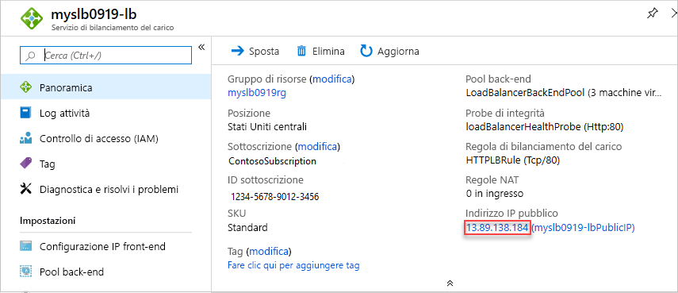

# <a name="quickstart-create-a-standard-load-balancer-to-load-balance-vms-by-using-azure-resource-manager-template"></a>Guida introduttiva: Creare un'istanza di Load Balancer Standard per bilanciare il carico delle VM con un modello di Azure Resource Manager

Il bilanciamento del carico offre un livello più elevato di disponibilità e scalabilità distribuendo le richieste in ingresso tra più macchine virtuali. Questo argomento di avvio rapido illustra come distribuire un modello di Azure Resource Manager che consente di creare un'istanza di Load Balancer Standard per bilanciare il carico delle macchine virtuali. Usando un modello di Resource Manager è necessario un numero di passaggi minore rispetto ad altri metodi di distribuzione.

Un [modello di Resource Manager](../azure-resource-manager/template-deployment-overview.md) è un file JSON (JavaScript Object Notation) che definisce l'infrastruttura e la configurazione del progetto. Il modello usa una sintassi dichiarativa che consente di indicare ciò che si intende distribuire senza dover scrivere la sequenza dei comandi di programmazione per crearlo. Per altre informazioni sullo sviluppo di modelli di Resource Manager, vedere la [documentazione di Resource Manager](/azure/azure-resource-manager/) e le [informazioni di riferimento sui modelli](/azure/templates/microsoft.network/loadbalancers).

Se non si ha una sottoscrizione di Azure, creare un [account gratuito](https://azure.microsoft.com/free/?WT.mc_id=A261C142F) prima di iniziare.

## <a name="create-a-standard-load-balancer"></a>Creare un'istanza di Load Balancer Standard

Un'istanza di Load Balancer Standard supporta solo un indirizzo IP pubblico standard. Quando si crea un'istanza di Load Balancer Standard, è necessario creare anche un nuovo indirizzo IP pubblico standard che viene configurato come front-end per Load Balancer Standard.

In questo argomento viene usato un [modello di avvio rapido](https://raw.githubusercontent.com/Azure/azure-quickstart-templates/master/101-load-balancer-standard-create/azuredeploy.json).

[!code-json[<Azure Resource Manager template create standard load balancer>](~/quickstart-templates/101-load-balancer-standard-create/azuredeploy.json)]

Nel modello sono state definite più risorse di Azure.

- **Microsoft.Network/loadBalancers**
- **Microsoft.Network/publicIPAddresses**: per il servizio di bilanciamento del carico
- **Microsoft.Network/networkSecurityGroups**
- **Microsoft.Network/virtualNetworks**
- **Microsoft.Compute/virutalMachines** (3 risorse di questo tipo)
- **Microsoft.Network/publicIPAddresses** (3 risorse di questo tipo): per ognuna delle tre macchine virtuali
- **Microsoft.Network/networkInterfaces** (3 risorse di questo tipo)
- **Microsoft.Compute/virtualMachine/extensions** (3 risorse di questo tipo): usare per configurare IIS e le pagine Web

Per altri modelli correlati ad Azure Load Balancer, vedere [Modelli di avvio rapido di Azure](https://azure.microsoft.com/resources/templates/?resourceType=Microsoft.Network&pageNumber=1&sort=Popular).

1. Selezionare **Prova** per il blocco di codice seguente per aprire Azure Cloud Shell e seguire le istruzioni per la connessione ad Azure.

   ```azurepowershell-interactive
   $projectName = Read-Host -Prompt "Enter a project name with 12 or less letters or numbers that is used to generate Azure resource names"
   $location = Read-Host -Prompt "Enter the location (i.e. centralus)"
   $adminUserName = Read-Host -Prompt "Enter the virtual machine administrator account name"
   $adminPassword = Read-Host -Prompt "Enter the virtual machine administrator password" -AsSecureString

   $resourceGroupName = "${projectName}rg"
   $templateUri = "https://raw.githubusercontent.com/Azure/azure-quickstart-templates/master/101-load-balancer-standard-create/azuredeploy.json"

   New-AzResourceGroup -Name $resourceGroupName -Location $location
   New-AzResourceGroupDeployment -ResourceGroupName $resourceGroupName -TemplateUri $templateUri -projectName $projectName -location $location -adminUsername $adminUsername -adminPassword $adminPassword

   Write-Host "Press [ENTER] to continue."
   ```

   Attendere finché non viene visualizzato il prompt nella console.

1. Selezionare **Copia** nel blocco di codice precedente per copiare lo script di PowerShell.

1. Fare clic con il pulsante destro del mouse sul riquadro della console della shell e quindi scegliere **Incolla**.

1. Immettere i valori desiderati.

   La distribuzione del modello creerà tre zone di disponibilità. Le zone di disponibilità sono supportate solo in [alcune aree di Azure](../availability-zones/az-overview.md). Usare una delle aree di Azure supportate. Se non si è certi, immettere **centralus**.

   Il nome del gruppo di risorse è il nome del progetto seguito da **rg**. Questo nome sarà necessario nella prossima sezione.

Per la distribuzione del modello sono necessari circa 10 minuti. Al termine, l'output sarà simile al seguente:


Per distribuire il modello viene usato Azure PowerShell. Oltre ad Azure PowerShell, è anche possibile usare il portale di Azure, l'interfaccia della riga di comando di Azure e l'API REST. Per informazioni sugli altri metodi di distribuzione, vedere [Distribuire modelli](../azure-resource-manager/resource-group-template-deploy-portal.md).

## <a name="test-the-load-balancer"></a>Testare il servizio di bilanciamento del carico

1. Accedere al [portale di Azure](https://portal.azure.com).

1. Selezionare **Gruppi di risorse** nel riquadro sinistro.

1. Selezionare il gruppo di risorse creato nella sezione precedente. Il nome del gruppo di risorse predefinito è il nome del progetto seguito da **rg**.

1. Selezionare l'istanza di Load Balancer. Il nome predefinito è il nome del progetto seguito da **-lb**.

1. Copiare la parte dell'indirizzo IP dell'indirizzo IP pubblico e quindi incollarlo nella barra degli indirizzi del browser.

   

    Verrà visualizzata la pagina predefinita del server Web Internet Information Services (IIS).

   

Per verificare la distribuzione del traffico dell'istanza di Load Balancer fra tutte e tre le macchine virtuali, è possibile forzare l'aggiornamento del Web browser dal computer client.

## <a name="clean-up-resources"></a>Pulire le risorse

Quando non sono più necessari, eliminare il gruppo di risorse, il servizio di bilanciamento del carico e tutte le risorse correlate. A questo scopo, accedere al portale di Azure, selezionare il gruppo di risorse che contiene l'istanza di Load Balancer e quindi selezionare **Elimina gruppo di risorse**.

## <a name="next-steps"></a>Passaggi successivi

In questo argomento di avvio rapido è stata creata un'istanza di Load Balancer Standard, sono state collegate ad essa alcune macchine virtuali, è stata configurata la regola del traffico di Load Balancer, è stato definito il probe di integrità e quindi è stata testata l'istanza di Load Balancer.

Per altre informazioni, passare alle esercitazioni su Load Balancer.

> [!div class="nextstepaction"]
> [Esercitazioni su Azure Load Balancer](tutorial-load-balancer-standard-public-zone-redundant-portal.md)
