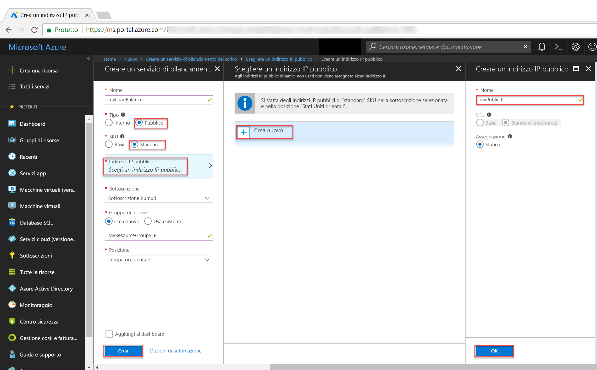

# <a name="tutorial-create-and-manage-standard-load-balancer-using-the-azure-portal"></a>Esercitazione: Creare e gestire un'istanza di Load Balancer Standard con il portale di Azure

Il bilanciamento del carico offre un livello più elevato di disponibilità e scalabilità distribuendo le richieste in ingresso tra più macchine virtuali. In questa esercitazione vengono illustrati i diversi componenti di Azure Load Balancer Standard che distribuiscono il traffico e garantiscono una disponibilità elevata. Si apprenderà come:


> [!div class="checklist"]
> * Creare un servizio di bilanciamento del carico di Azure
> * Creare un probe di integrità per il servizio di bilanciamento del carico
> * Creare regole del traffico di bilanciamento del carico
> * Creare macchine virtuali e installare il server IIS
> * Collegare macchine virtuali a un servizio di bilanciamento del carico
> * Visualizzare un bilanciamento del carico in azione
> * Aggiungere e rimuovere macchine virtuali da un bilanciamento del carico


Se non si ha una sottoscrizione di Azure, creare un [account gratuito](https://azure.microsoft.com/free/?WT.mc_id=A261C142F) prima di iniziare. 

## <a name="log-in-to-azure"></a>Accedere ad Azure

Accedere al portale di Azure all'indirizzo [http://portal.azure.com](http://portal.azure.com).

## <a name="create-a-standard-load-balancer"></a>Creare un'istanza di Load Balancer Standard

In questa sezione viene creato un servizio di bilanciamento del carico pubblico che consente di bilanciare il carico delle macchine virtuali. Load Balancer Standard supporta solo un indirizzo IP pubblico standard. Quando si crea un'istanza di Load Balancer Standard, è necessario creare anche un nuovo indirizzo IP pubblico standard che viene configurato come front-end (denominato *LoadBalancerFrontend* per impostazione predefinita) per Load Balancer Standard. 

1. Nella parte superiore sinistra dello schermo fare clic su **Crea una risorsa** > **Rete** > **Load Balancer**.
2. Nella pagina **Creare un servizio di bilanciamento del carico** immettere questi valori per il bilanciamento del carico:
    - *myLoadBalancer* come nome del servizio di bilanciamento del carico.
    - **Pubblico** come tipo di bilanciamento del carico.
    - **Standard** come versione SKU del servizio di bilanciamento del carico.
     - *myPublicIP* come **nuovo** IP pubblico da creare.
    - *myResourceGroupLB* come nome del **nuovo** gruppo di risorse creato selezionato da creare.
    - **westeurope** come percorso.
3. Fare clic su **Crea** per creare il servizio di bilanciamento del carico.


   
## <a name="create-load-balancer-resources"></a>Creare risorse di bilanciamento del carico

In questa sezione si configurano le impostazioni del servizio di bilanciamento del carico per un pool di indirizzi back-end e un probe di integrità e si specificano le regole di bilanciamento del carico.

### <a name="create-a-backend-address-pool"></a>Creare un pool di indirizzi back-end

Per distribuire il traffico alle macchine virtuali, è necessario che un pool di indirizzi back-end contenga gli indirizzi IP delle schede di interfaccia di rete virtuale connesse al bilanciamento del carico. Creare il pool di indirizzi back-end *myBackendPool* per includere *VM1* e *VM2*.

1. Fare clic su **Tutte le risorse** nel menu a sinistra e quindi fare clic su **myLoadBalancer** nell'elenco di risorse.
2. In **Impostazioni** fare clic su **Pool back-end** e quindi su **Aggiungi**.
3. Nella pagina **Aggiungi pool back-end** digitare *myBackEndPool* come nome per il pool back-end e quindi fare clic su **OK**.

### <a name="create-a-health-probe"></a>Creare un probe di integrità

Per consentire al servizio di bilanciamento del carico di monitorare lo stato dell'app, si usa un probe di integrità. Il probe di integrità aggiunge o rimuove in modo dinamico le VM nella rotazione del servizio di bilanciamento del carico in base alla rispettiva risposta ai controlli di integrità. Creare un probe di integrità *myHealthProbe* per monitorare l'integrità delle macchine virtuali.

1. Fare clic su **Tutte le risorse** nel menu a sinistra e quindi fare clic su **myLoadBalancer** nell'elenco di risorse.
2. In **Impostazioni** fare clic su **Probe integrità** e quindi su **Aggiungi**.
3. Usare questi valori per creare il probe di integrità:
    - *myHealthProbe* come nome del probe di integrità.
    - **HTTP** come tipo di protocollo.
    - *80* come numero della porta.
    - *15* in **Intervallo** come numero di secondi tra i tentativi del probe.
    - *2* per **Soglia di non integrità** come numero di errori di probe consecutivi che devono verificarsi prima che una macchina virtuale venga considerata non integra.
4. Fare clic su **OK**.

   

### <a name="create-a-load-balancer-rule"></a>Creare una regola di bilanciamento del carico

Una regola di bilanciamento del carico consente di definire come il traffico verrà distribuito alle VM. Definire la configurazione IP front-end per il traffico in ingresso e il pool IP back-end che riceve il traffico, insieme alle porte di origine e di destinazione necessarie. Creare una regola di bilanciamento del carico *myLoadBalancerRuleWeb* per l'ascolto sulla porta 80 nel front-end *FrontendLoadBalancer* e l'invio del traffico di rete con bilanciamento del carico al pool di indirizzi back-end *myBackEndPool* sempre tramite la porta 80. 

1. Fare clic su **Tutte le risorse** nel menu a sinistra e quindi fare clic su **myLoadBalancer** nell'elenco di risorse.
2. In **Impostazioni** fare clic su **Regole di bilanciamento del carico** e quindi su **Aggiungi**.
3. Usare questi valori per configurare la regola di bilanciamento del carico:
    - *myHTTPRule* come nome della regola di bilanciamento del carico.
    - **TCP** come tipo di protocollo.
    - *80* come numero della porta.
    - *80* come porta back-end.
    - *myBackendPool* come nome del pool back-end.
    - *myHealthProbe* come nome del probe di integrità.
4. Fare clic su **OK**.
    
## <a name="create-backend-servers"></a>Creare i server back-end

In questa sezione si crea una rete virtuale, si creano tre macchine virtuali per il pool back-end del servizio di bilanciamento del carico e quindi si installa IIS nelle macchine virtuali per testare il servizio di bilanciamento del carico.

### <a name="create-a-virtual-network"></a>Crea rete virtuale
1. Nella parte superiore sinistra della schermata fare clic su **Nuovo** > **Rete** > **Rete virtuale** e immettere i valori seguenti per la rete virtuale:
    - *myVnet* come nome della rete virtuale.
    - *myResourceGroupSLB* come nome del gruppo di risorse esistente.
    - *myBackendSubnet* come nome della subnet.
2. Fare clic su **Crea** per creare la rete virtuale.

    

### <a name="create-virtual-machines"></a>Creare macchine virtuali

1. Nella parte superiore sinistra della schermata fare clic su **Nuovo** > **Calcolo** > **Windows Server 2016 Datacenter** e immettere i valori seguenti per la macchina virtuale:
    - *myVM1* come nome della macchina virtuale.        
    - *azureuser* come nome utente dell'amministratore.    
    - *myResourceGroupSLB* come **Gruppo di risorse**, selezionare **Usa esistente** e quindi selezionare *myResourceGroupSLB*.
2. Fare clic su **OK**.
3. Selezionare **DS1_V2** come dimensioni per la macchina virtuale e fare clic su **Seleziona**.
4. Immettere i valori seguenti per le impostazioni della macchina virtuale:
    -  *myVNet*: assicurarsi che sia stata fatta la selezione come rete virtuale.
    - *myBackendSubnet* - assicurarsi che sia selezionato come subnet.
    - *myNetworkSecurityGroup* come nome del nuovo gruppo di sicurezza di rete (firewall) che è necessario creare.
5. Fare clic su **Disabilitato** per disabilitare la diagnostica di avvio.
6. Fare clic su **OK**, verificare le impostazioni nella pagina di riepilogo e quindi fare clic su **Crea**.
7. Creare altre due macchine virtuali denominate *VM2* e *VM3* con *myVnet* come rete virtuale, *myBackendSubnet* come subnet e **myNetworkSecurityGroup* come gruppo di sicurezza di rete seguendo i passaggi da 1 a 6. 

### <a name="create-nsg-rules"></a>Creare le regole NSG

In questa sezione vengono create regole NSG per consentire connessioni in ingresso tramite HTTP e RDP.

1. Fare clic su **Tutte le risorse** nel menu a sinistra e quindi nell'elenco delle risorse fare clic su **myNetworkSecurityGroup**, che si trova nel gruppo di risorse **myResourceGroupSLB**.
2. In **Impostazioni** fare clic su **Regole di sicurezza in ingresso** e quindi su **Aggiungi**.
3. Immettere questi valori per la regola di sicurezza in ingresso denominata *myHTTPRule* per consentire connessioni HTTP in ingresso tramite la porta 80:
    - *Tag del servizio* come **Origine**
    - *Internet* come **Tag del servizio di origine**
    - *80* come **Intervalli di porte di destinazione**
    - *TCP* come **Protocollo**
    - *Consenti* come **Azione**
    - *100* come **Priorità**
    - *myHTTPRule* come nome
    - *Consenti HTTP* come descrizione
4. Fare clic su **OK**.
 
 
5. Ripetere i passaggi da 2 a 4 per creare un'altra regola denominata *myRDPRule* per consentire una connessione RDP in ingresso tramite la porta 3389 con i valori seguenti:
    - *Tag del servizio* come **Origine**
    - *Internet* come **Tag del servizio di origine**
    - *3389* come **Intervalli di porte di destinazione**
    - *TCP* come **Protocollo**
    - *Consenti* come **Azione**
    - *200* come **Priorità**
    - *myRDPRule* come nome
    - *Consenti RDP* come descrizione

### <a name="install-iis-on-vms"></a>Installare IIS in macchine virtuali

1. Fare clic su **Tutte le risorse** nel menu a sinistra e quindi nell'elenco delle risorse fare clic su **myVM1**, che si trova nel gruppo di risorse *myResourceGroupSLB*.
2. Nella pagina **Panoramica** fare clic su **Connetti** per connettersi a RDP nella macchina virtuale.
3. Accedere alla macchina virtuale con nome utente *azureuser*.
4. Nel desktop del server passare a **Strumenti di amministrazione Windows**>**Windows PowerShell**.
5. Nella finestra di PowerShell eseguire i comandi seguenti per installare il server IIS, rimuovere il file predefinito iisstart.htm e aggiungere un nuovo file iisstart.htm che visualizza il nome della macchina virtuale:

   ```azurepowershell-interactive
    
    # install IIS server role
    Install-WindowsFeature -name Web-Server -IncludeManagementTools
    
    # remove default htm file
     remove-item  C:\inetpub\wwwroot\iisstart.htm
    
    # Add a new htm file that displays server name
     Add-Content -Path "C:\inetpub\wwwroot\iisstart.htm" -Value $("Hello World from" + $env:computername)
   ```
6. Chiudere la sessione RDP con *myVM1*.
7. Ripetere i passaggi da 1 a 6 per installare IIS e il file iisstart.htm aggiornato in *myVM2* e *myVM3*.

## <a name="add-vms-to-the-backend-address-pool"></a>Aggiungere macchine virtuali al pool di indirizzi back-end

Per distribuire il traffico alle macchine virtuali, aggiungere le macchine virtuali *VM1*, *VM2* e *VM3* al pool di indirizzi back-end *myBackendPool* creato in precedenza. Il pool back-end contiene gli indirizzi IP delle schede di interfaccia di rete virtuale connesse al bilanciamento del carico.

1. Fare clic su **Tutte le risorse** nel menu a sinistra e quindi fare clic su **myLoadBalancer** nell'elenco di risorse.
2. In **Impostazioni** fare clic su **Pool back-end**, quindi nell'elenco del pool back-end fare clic su **myBackendPool**.
3. Nella pagina **myBackendPool** seguire questa procedura:
    - Fare clic su **Aggiungi una configurazione IP della rete di destinazione** per aggiungere ogni macchina virtuale (*myVM1*, *myVM2* e *myVM3*) creata nel pool back-end.
    - Fare clic su **OK**.

4. Verificare che l'impostazione del pool back-end di bilanciamento del carico visualizzi tutte le macchine virtuali **VM1**, **VM2** e **myVM3**.

## <a name="test-the-load-balancer"></a>Testare il servizio di bilanciamento del carico
1. Trovare l'indirizzo IP pubblico del servizio di bilanciamento del carico nella schermata **Panoramica**. Fare clic su **Tutte le risorse** e quindi su **myPublicIP**.

2. Copiare l'indirizzo IP pubblico e quindi incollarlo nella barra degli indirizzi del browser. Nel browser verrà visualizzata la pagina predefinita del server Web IIS.

      

Per verificare la distribuzione del traffico tra le tre macchine virtuali che eseguono l'app da parte del servizio di bilanciamento del carico, forzare l'aggiornamento del Web browser.

## <a name="remove-or-add-vms-from-the-backend-pool"></a>Rimuovere o aggiungere macchine virtuali dal pool back-end
Potrebbe essere necessario eseguire attività di manutenzione sulle VM che eseguono l'app, ad esempio per installare aggiornamenti del sistema operativo, oppure aggiungere altre VM per gestire un aumento del traffico verso l'app. Questa sezione illustra come rimuovere o aggiungere una VM nel servizio di bilanciamento del carico.

1. Fare clic su **Tutte le risorse** nel menu a sinistra e quindi fare clic su **myLoadBalancer** nell'elenco di risorse.
2. In **Impostazioni** fare clic su **Pool back-end**, quindi nell'elenco del pool back-end fare clic su **myBackendPool**.
3. Nella pagina **myBackendPool**, in **Configurazioni IP della rete di destinazione** per rimuovere *VM1* dal back-end fare clic sull'icona di eliminazione accanto a **Macchina virtuale: myVM1**.

Quando *myVM1* non è più nel pool di indirizzi back-end, è possibile eseguire qualsiasi attività di manutenzione in *myVM1*, come l'installazione di aggiornamenti software. In assenza di *VM1**, il carico viene ora bilanciato tra *myVM2* e *myVM3*. 

Per aggiungere nuovamente *myVM1* al pool back-end, seguire la procedura descritta nella sezione *Aggiungere macchine virtuali al pool di indirizzi back-end* di questo articolo.

## <a name="clean-up-resources"></a>Pulire le risorse

Quando non sono più necessari, eliminare il gruppo di risorse, il servizio di bilanciamento del carico e tutte le risorse correlate. A questo scopo, selezionare il gruppo di risorse che contiene il servizio di bilanciamento del carico e fare clic su **Elimina**.

## <a name="next-steps"></a>Passaggi successivi

In questa esercitazione si è creata un'istanza di Load Balancer Standard, si sono collegate le macchine virtuali, si è eseguita la configurazione della regola del traffico di bilanciamento del carico e del probe di integrità e quindi si è testato il bilanciamento del carico. È stata inoltre rimossa una macchina virtuale dal set con carico bilanciato e la macchina virtuale è stata aggiunta nuovamente al pool di indirizzi back-end. Per altre informazioni su Azure Load Balancer, passare alle esercitazioni su Azure Load Balancer.

> [!div class="nextstepaction"]
> [Esercitazioni su Azure Load Balancer](tutorial-load-balancer-standard-public-zone-redundant-portal.md)
