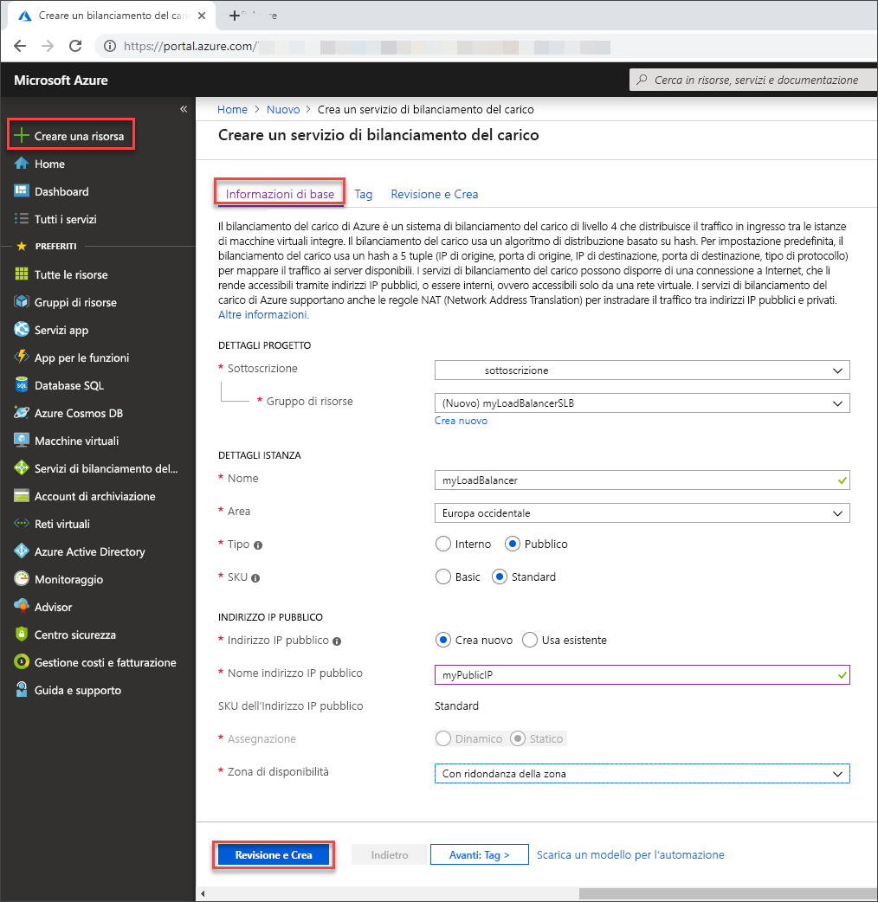

# <a name="tutorial-load-balance-internet-traffic-to-vms-using-the-azure-portal"></a>Esercitazione: Bilanciare il carico del traffico Internet verso le macchine virtuali con il portale di Azure

Il bilanciamento del carico offre un livello più elevato di disponibilità e scalabilità distribuendo le richieste in ingresso tra più macchine virtuali. In questa esercitazione vengono illustrati i diversi componenti di Azure Load Balancer Standard che distribuiscono il traffico Internet verso le macchine virtuali e garantiscono una disponibilità elevata. Si apprenderà come:


> [!div class="checklist"]
> * Creare un'istanza di Azure Load Balancer
> * Creare risorse di Load Balancer
> * Creare macchine virtuali e installare il server IIS
> * Visualizzare Load Balancer in azione
> * Aggiungere e rimuovere macchine virtuali da un'istanza di Load Balancer

Se non si ha una sottoscrizione di Azure, creare un [account gratuito](https://azure.microsoft.com/free/?WT.mc_id=A261C142F) prima di iniziare. 

## <a name="sign-in-to-the-azure-portal"></a>Accedere al portale di Azure

Accedere al portale di Azure all'indirizzo [https://portal.azure.com](https://portal.azure.com).

## <a name="create-a-standard-load-balancer"></a>Creare un'istanza di Load Balancer Standard

In questa sezione viene creata un'istanza di Load Balancer Standard che consente di bilanciare il carico delle macchine virtuali. Load Balancer Standard supporta solo un indirizzo IP pubblico standard. Quando si crea un'istanza di Load Balancer Standard, è necessario creare anche un nuovo indirizzo IP pubblico standard che viene configurato come front-end (denominato *LoadBalancerFrontend* per impostazione predefinita) per Load Balancer Standard. 

1. Nella parte superiore sinistra dello schermo fare clic su **Crea una risorsa** > **Rete** > **Servizio di bilanciamento del carico**.
2. Nella scheda **Generale** della pagina **Crea servizio di bilanciamento del carico** immettere o selezionare le informazioni seguenti, accettare le impostazioni predefinite per le opzioni rimanenti e quindi selezionare **Rivedi e crea**:

    | Impostazione                 | Valore                                              |
    | ---                     | ---                                                |
    | Sottoscrizione               | Selezionare la propria sottoscrizione.    |    
    | Gruppo di risorse         | Selezionare **Crea nuovo** e digitare *myResourceGroupSLB* nella casella di testo.|
    | NOME                   | *myLoadBalancer*                                   |
    | Region         | Selezionare **Europa occidentale**.                                        |
    | Type          | Selezionare **Pubblica**.                                        |
    | SKU           | Selezionare **Standard**.                          |
    | Indirizzo IP pubblico | Selezionare **Crea nuovo**. |
    | Nome dell'indirizzo IP pubblico              | Digitare *myPublicIP* nella casella di testo.   |
    |Zona di disponibilità| Selezionare **Con ridondanza della zona**.    |

3. Nella scheda **Rivedi e crea** fare clic su **Crea**.

   

## <a name="create-load-balancer-resources"></a>Creare risorse di Load Balancer

In questa sezione si configurano le impostazioni di Load Balancer per un pool di indirizzi back-end e un probe di integrità e si specifica una regola di bilanciamento.

### <a name="create-a-backend-address-pool"></a>Creare un pool di indirizzi back-end

Per distribuire il traffico alle macchine virtuali, è necessario che un pool di indirizzi back-end contenga gli indirizzi IP delle schede di interfaccia di rete virtuale connesse al servizio di bilanciamento del carico. Creare il pool di indirizzi back-end *myBackendPool* per includere le macchine virtuali per il bilanciamento del carico del traffico Internet.

1. Selezionare **Tutti i servizi** nel menu a sinistra, selezionare **Tutte le risorse** e quindi fare clic su **myLoadBalancer** nell'elenco di risorse.
2. In **Impostazioni** fare clic su **Pool back-end** e quindi su **Aggiungi**.
3. Nella pagina **Aggiungi pool back-end** digitare *myBackEndPool* come nome per il pool back-end e quindi selezionare **Aggiungi**.

### <a name="create-a-health-probe"></a>Creare un probe di integrità

Per consentire all'istanza di Load Balancer di monitorare lo stato dell'app, si usa un probe di integrità. Il probe di integrità aggiunge o rimuove in modo dinamico le macchine virtuali nella rotazione dell'istanza di Load Balancer in base alla rispettiva risposta ai controlli di integrità. Creare un probe di integrità *myHealthProbe* per monitorare l'integrità delle macchine virtuali.

1. Selezionare **Tutti i servizi** nel menu a sinistra, selezionare **Tutte le risorse** e quindi fare clic su **myLoadBalancer** nell'elenco di risorse.
2. In **Impostazioni** fare clic su **Probe integrità** e quindi su **Aggiungi**.
3. Usare questi valori per creare il probe di integrità:
     
    | Impostazione | Valore |
    | ------- | ----- |
    | NOME | Immettere *myHealthProbe*. |
    | Protocollo | Selezionare **HTTP**. |
    | Porta | Immettere *80*.|
    | Interval | Immettere *15* in **Intervallo** come numero di secondi tra i tentativi del probe. |
    | Soglia non integra | Selezionare *2* per **Soglia di non integrità** come numero di errori di probe consecutivi che devono verificarsi prima che una macchina virtuale venga considerata non integra.|
    | Probe di integrità | Selezionare *myHealthProbe*. |
    
4. Selezionare **OK**.

### <a name="create-a-load-balancer-rule"></a>Creare una regola di bilanciamento del carico

Una regola di bilanciamento del carico consente di definire come il traffico verrà distribuito alle VM. Definire la configurazione IP front-end per il traffico in ingresso e il pool IP back-end che riceve il traffico, insieme alle porte di origine e di destinazione necessarie. Creare una regola di bilanciamento del carico *myLoadBalancerRuleWeb* per l'ascolto sulla porta 80 nel front-end *FrontendLoadBalancer* e l'invio del traffico di rete con bilanciamento del carico al pool di indirizzi back-end *myBackEndPool* sempre tramite la porta 80.

1. Selezionare **Tutti i servizi** nel menu a sinistra, selezionare **Tutte le risorse** e quindi fare clic su **myLoadBalancer** nell'elenco di risorse.
2. In **Impostazioni** fare clic su **Regole di bilanciamento del carico** e quindi su **Aggiungi**.
3. Usare questi valori per configurare la regola di bilanciamento del carico:

    | Impostazione | Valore |
    | ------- | ----- |
    | NOME | Immettere *myHTTPRule*. |
    | Protocollo | selezionare **TCP**. |
    | Porta | Immettere *80*.|
    | Porta back-end | Immettere *80*. |
    | Pool back-end | Selezionare *myBackendPool*.|
    | Probe di integrità | Selezionare *myHealthProbe*. |
    
4. Accettare tutte le impostazioni predefinite e selezionare **OK**.

## <a name="create-backend-servers"></a>Creare i server back-end

In questa sezione si crea una rete virtuale, si creano tre macchine virtuali per il pool back-end al servizio di bilanciamento del carico e quindi si installa IIS nelle macchine virtuali per testare il servizio di bilanciamento del carico.

### <a name="create-a-virtual-network"></a>Crea rete virtuale

1. Nella parte superiore sinistra della schermata, selezionare **Crea una risorsa** > **Rete** > **Rete virtuale**.
2. In **Crea rete virtuale** immettere o selezionare queste informazioni:

    | Impostazione | Valore |
    | ------- | ----- |
    | NOME | Immettere *myVNet*. |
    | Spazio degli indirizzi | Immettere *10.1.0.0/16*. |
    | Sottoscrizione | Selezionare la propria sottoscrizione.|
    | Gruppo di risorse | Selezionare la risorsa esistente: *myResourceGroupSLB*. |
    | Località | Selezionare **Europa occidentale**.|
    | Subnet - Nome | Immettere *myBackendSubnet*. |
    | Subnet - Intervallo di indirizzi | Immettere *10.1.0.0/24*. |
    
3. Lasciare tutte le impostazioni predefinite e selezionare **Crea**.

### <a name="create-virtual-machines"></a>Creare macchine virtuali

Load Balancer Standard supporta solo le macchine virtuali con indirizzi IP standard nel pool di back-end. In questa sezione si creeranno tre macchine virtuali (*myVM1*, *myVM2*, e *myVM3*) con un indirizzo IP pubblico standard in tre aree diverse (*Zona 1*, *Zona 2*, e *Zona 3*) che vengono aggiunte al pool di back-end dell'istanza di Load Balancer Standard che è stata creata in precedenza.

1. In altro a sinistra nel portale selezionare **Crea una risorsa** > **Calcolo** > **Windows Server 2016 Datacenter**. 
   
1. In **Crea macchina virtuale** digitare o selezionare i valori seguenti nella scheda **Nozioni di base**:
   - **Sottoscrizione** > **Gruppo di risorse**: Selezionare **myResourceGroupSLB**.
   - **Dettagli istanza** > **Nome macchina virtuale**: Digitare *myVM1*.
   - **Dettagli dell'istanza** > **Area** > selezionare **Europa occidentale**.
   - **Dettagli dell'istanza** > **Opzioni di disponibilità** > selezionare **Zone di disponibilità**. 
   - **Dettagli dell'istanza** > **Zona di disponibilità** > selezionare **1**.
  
1. Selezionare la scheda **Rete**, oppure selezionare **Avanti: Dischi**, quindi **Avanti: Rete**. 
   
   - Verificare che siano selezionate le opzioni seguenti:
       - **Rete virtuale**: **myVnet**
       - **Subnet**: **myBackendSubnet**
       - **IP pubblico** > selezionare **Crea nuovo** e nella finestra **Crea indirizzo IP pubblico** selezionare **Standard**, per **SKU**, e **Con ridondanza della zona**, per la **Zona di disponibilità**
      
   - Per creare un nuovo gruppo di sicurezza di rete (NSG), un tipo di firewall, in **Gruppo di sicurezza di rete** selezionare **Avanzate**. 
       1. Nel campo **Configura gruppo di sicurezza di rete** selezionare **Crea nuovo**. 
       1. Digitare *myNetworkSecurityGroup* e selezionare **OK**.

   - Per rendere la macchina virtuale parte del pool back-end di Load Balancer, completare i passaggi seguenti:
        - In **Bilanciamento del carico**, per **Posizionare questa macchina virtuale prima di una soluzione di bilanciamento del carico esistente?** selezionare **Sì**.
        - In **Impostazioni di bilanciamento del carico**, per **Opzioni di bilanciamento del carico**, selezionare **Azure Load Balancer**.
        - Per **Selezionare un servizio di bilanciamento del carico**, specificare *myLoadBalancer*. 
1. Selezionare la scheda **Gestione** oppure **Avanti** > **Gestione**. In **Monitoraggio** impostare **Diagnostica di avvio** su **Off**. 
1. Selezionare **Rivedi e crea**.   
1. Rivedere le impostazioni e quindi selezionare **Crea**.
1. Seguire i passaggi per creare due macchine virtuali aggiuntive: *myVM2* e *myVM3*, con un indirizzo IP pubblico con SKU standard in **Zona di disponibilità**, rispettivamente **2** e **3** e tutte le altre impostazioni identiche a *myVM1*.  

### <a name="create-network-security-group-rule"></a>Creare una regola del gruppo di sicurezza di rete

In questa sezione si crea una regola del gruppo di sicurezza rete per consentire connessioni in ingresso tramite HTTP.

1. Selezionare **Tutti i servizi** nel menu a sinistra, selezionare **Tutte le risorse** e quindi nell'elenco delle risorse fare clic su **myNetworkSecurityGroup**, che si trova nel gruppo di risorse **myResourceGroupSLB**.
2. In **Impostazioni** fare clic su **Regole di sicurezza in ingresso** e quindi su **Aggiungi**.
3. Immettere questi valori per la regola di sicurezza in ingresso denominata *myHTTPRule* per consentire connessioni HTTP in ingresso tramite la porta 80:
    - *Tag del servizio* come **Origine**
    - *Internet* come **Tag del servizio di origine**
    - *80* come **Intervalli di porte di destinazione**
    - *TCP* come **Protocollo**
    - *Consenti* come **Azione**
    - *100* come **Priorità**
    - *myHTTPRule* come nome
    - *Consenti HTTP* come descrizione
4. Selezionare **Aggiungi**.

### <a name="install-iis-on-vms"></a>Installare IIS in macchine virtuali

1. Selezionare **Tutti i servizi** nel menu a sinistra, selezionare **Tutte le risorse** e quindi nell'elenco delle risorse fare clic su **myVM1**, che si trova nel gruppo di risorse *myResourceGroupSLB*.
2. Nella pagina **Panoramica** fare clic su **Connetti** per connettersi a RDP nella macchina virtuale.
3. Nella finestra popup **Connetti alla macchina virtuale in corso** selezionare **Scarica file RDP** e quindi aprire il file RDP scaricato.
4. Nella finestra **Connessione Desktop remoto** fare clic su **Connetti**.
5. Accedere alla VM con le credenziali fornite durante la creazione di questa VM. Verrà avviata una sessione Desktop remoto con la macchina virtuale *myVM1*.
6. Nel desktop del server passare a **Strumenti di amministrazione Windows**>**Windows PowerShell**.
7. Nella finestra di PowerShell eseguire i comandi seguenti per installare il server IIS, rimuovere il file predefinito iisstart.htm e aggiungere un nuovo file iisstart.htm che visualizza il nome della macchina virtuale:

   ```azurepowershell-interactive
    
    # install IIS server role
    Install-WindowsFeature -name Web-Server -IncludeManagementTools
    
    # remove default htm file
     remove-item  C:\inetpub\wwwroot\iisstart.htm
    
    # Add a new htm file that displays server name
     Add-Content -Path "C:\inetpub\wwwroot\iisstart.htm" -Value $("Hello World from " + $env:computername)
   ```
6. Chiudere la sessione RDP con *myVM1*.
7. Ripetere i passaggi da 1 a 6 per installare IIS e il file iisstart.htm aggiornato in *myVM2* e *myVM3*.

## <a name="test-the-load-balancer"></a>Testare il servizio di bilanciamento del carico
1. Trovare l'indirizzo IP pubblico del servizio di bilanciamento del carico nella schermata **Panoramica**. Selezionare **Tutti i servizi** nel menu a sinistra, selezionare **Tutte le risorse** e quindi fare clic su **myPublicIP**.

2. Copiare l'indirizzo IP pubblico e quindi incollarlo nella barra degli indirizzi del browser. Nel browser verrà visualizzata la pagina predefinita del server Web IIS.

      

Per verificare la distribuzione del traffico tra le tre macchine virtuali che eseguono l'app da parte del servizio di bilanciamento del carico, forzare l'aggiornamento del Web browser.

## <a name="remove-or-add-vms-from-the-backend-pool"></a>Rimuovere o aggiungere macchine virtuali dal pool back-end
Potrebbe essere necessario eseguire attività di manutenzione sulle VM che eseguono l'app, ad esempio per installare aggiornamenti del sistema operativo, oppure aggiungere altre VM per gestire un aumento del traffico verso l'app. Questa sezione illustra come rimuovere o aggiungere una macchina virtuale (*myVM1*) nel servizio di bilanciamento del carico.

### <a name="remove-vm-from-a-backend-pool"></a>Rimuovere una macchina virtuale da un pool back-end
Per rimuovere *myVM1* dal pool di back-end, completare i passaggi seguenti:

1. Selezionare **Tutti i servizi** nel menu a sinistra, selezionare **Tutte le risorse** e quindi fare clic su **myLoadBalancer** nell'elenco di risorse.
2. In **Impostazioni** fare clic su **Pool back-end**, quindi nell'elenco del pool back-end fare clic su **myBackendPool**.
3. Nella pagina **myBackendPool**, per rimuovere *VM1* selezionare l'icona di eliminazione alla fine della riga che visualizza *myVM1* e quindi fare clic su **Salva**.

Quando *myVM1* non è più nel pool di indirizzi back-end, è possibile eseguire qualsiasi attività di manutenzione in *myVM1*, come l'installazione di aggiornamenti software. In assenza di *VM1*, il carico viene ora bilanciato tra *myVM2* e *myVM3*. 

### <a name="add-vm-to-a-backend-pool"></a>Aggiungere una macchina virtuale a un pool back-end
Per aggiungere nuovamente *myVM1* al pool back-end, completare i passaggi seguenti:

1. Selezionare **Tutti i servizi** nel menu a sinistra, selezionare **Tutte le risorse** e quindi selezionare **myVM1** nell'elenco di risorse.
2. Nella pagina **myVM1**, in **Impostazioni** selezionare **Rete**.
3. Nella pagina **Rete**, selezionare la scheda **Bilanciamento del carico** e quindi selezionare **Aggiungi servizio di bilanciamento del carico**.
4. Nella pagina **Aggiungi servizio di bilanciamento del carico**, eseguire le operazioni seguenti:
   1. In **Opzioni di bilanciamento del carico**, selezionare **Azure Load Balancer**.
   2. In **Seleziona un servizio di bilanciamento del carico**, selezionare *myLoadBalancer*.
   3. In **Seleziona pool back-end**, selezionare *MyBackendPool*. 

## <a name="clean-up-resources"></a>Pulire le risorse

Quando non sono più necessari, eliminare il gruppo di risorse, il servizio di bilanciamento del carico e tutte le risorse correlate. A questo scopo, selezionare il gruppo di risorse *myResouceGroupSLB* che contiene il servizio di bilanciamento del carico e quindi selezionare **Elimina**.

## <a name="next-steps"></a>Passaggi successivi

In questa esercitazione si è creata un'istanza di Load Balancer Standard, si sono collegate le macchine virtuali, si è eseguita la configurazione della regola del traffico di bilanciamento del carico e del probe di integrità e quindi si è testato il servizio di bilanciamento del carico. È stata inoltre rimossa una macchina virtuale dal set con carico bilanciato e la macchina virtuale è stata aggiunta nuovamente al pool di indirizzi back-end. Per altre informazioni su Azure Load Balancer, passare alle esercitazioni su Azure Load Balancer.

> [!div class="nextstepaction"]
> [Esercitazioni su Azure Load Balancer](tutorial-load-balancer-standard-public-zone-redundant-portal.md)
