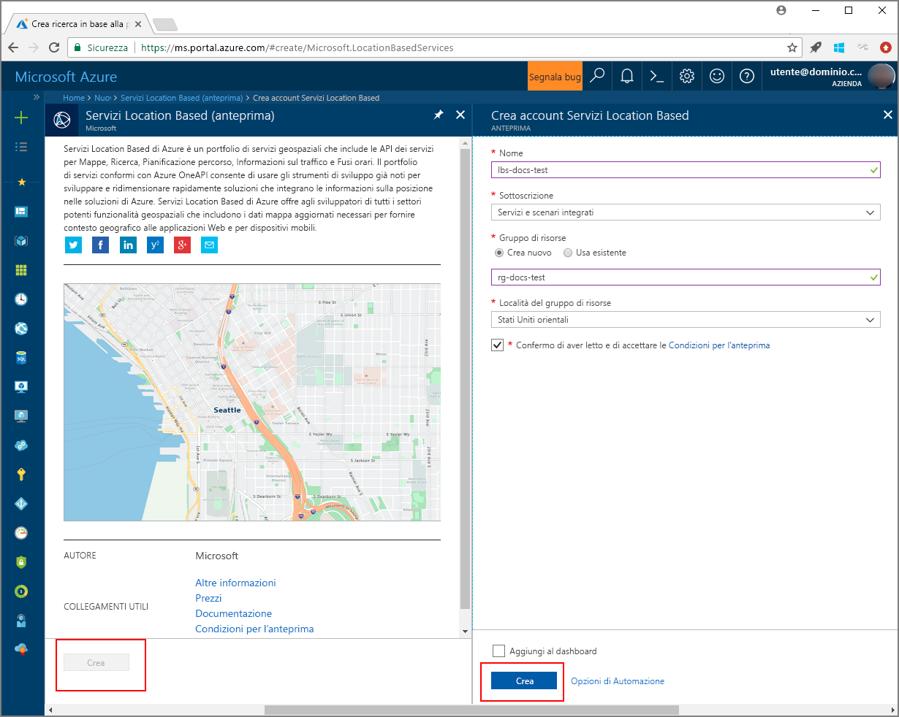
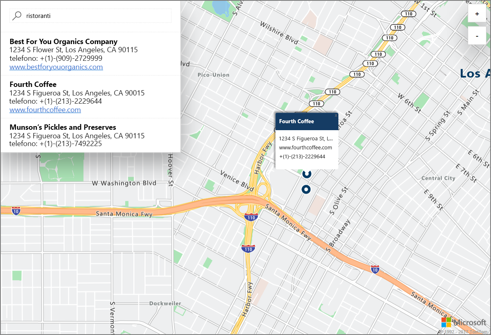

# Avviare una demo di una ricerca interattiva sulla mappa con Servizi Location Based di Azure (anteprima)

Questo articolo illustra le funzionalità di Servizi Location Based di Azure (anteprima) mediante una ricerca interattiva con le mappe di Azure. Vengono anche descritti i passaggi di base per creare un account di Servizi Location Based di Azure e ottenere la chiave dell'account da usare nell'applicazione Web demo. 

Se non si ha una sottoscrizione di Azure, creare un [account gratuito](https://azure.microsoft.com/free/?WT.mc_id=A261C142F) prima di iniziare.

## Accedere al Portale di Azure

Accedere al [Portale di Azure](https://portal.azure.com/).

## Creare un account Servizi Location Based e ottenere la relativa chiave

1. Nell'angolo superiore sinistro del [portale di Azure](https://portal.azure.com) fare clic su **Crea una risorsa**.
2. Nella casella *Cerca nel Marketplace* digitare **Servizi Location Based**.
3. In *Risultati* fare clic su **Servizi Location Based (preview)**. Fare clic sul pulsante **Crea** visualizzato sotto la mappa. 
4. Nella pagina **Crea account Servizi Location Based** immettere il *Nome* per il nuovo account, selezionare la *Sottoscrizione* da usare e immettere il nome di un *Gruppo di risorse* nuovo o esistente. Selezionare la posizione per il gruppo di risorse, accettare le *Condizioni per l'anteprima* e fare clic su **Crea**.

    

5. Una volta creato l'account, aprirlo e passare a **IMPOSTAZIONI**. Fare clic su **Chiavi** per ottenere le chiavi primaria e secondaria per l'account Servizi Location Based di Azure. Copiare il valore di **Chiave primaria** negli Appunti in locale per usarlo nella sezione seguente. 

## Scaricare l'applicazione demo per le mappe di Azure

1. Scaricare o copiare il contenuto del file [interactiveSearch.html](https://github.com/Azure-Samples/location-based-services-samples/blob/master/src/interactiveSearch.html).
2. Salvare il contenuto del file in locale come **AzureMapDemo.html** e aprirlo in un editor di testo.
3. Cercare la stringa `<insert-key>` e sostituirla con il valore di **Chiave primaria** ottenuto nella sezione precedente. 

## Avviare l'applicazione demo per le mappe di Azure

1. Aprire il file **AzureMapDemo.html** nel browser che si preferisce.
2. Osservare la mappa visualizzata della città di Los Angeles. La città è determinata dal valore della coppia `[longitude, latitude]` assegnato alla variabile JavaScript denominata **center** in *AzureMapDemo.html*. È possibile modificare queste coordinate per visualizzare qualsiasi altra città desiderata. Le coordinate della città di New York sono ad esempio *[-74.0060, 40.7128]*.
3. Nella casella di ricerca nell'angolo superiore sinistro dell'applicazione Web demo immettere qualsiasi tipo di posizione o indirizzo da cercare. 
4. Spostare il puntatore del mouse sull'elenco di indirizzi e posizioni visualizzato sotto la casella di ricerca e osservare che l'indicatore corrispondente sulla mappa visualizza le informazioni sulla posizione corrispondente. Avviando, ad esempio, questa applicazione Web e cercando *restaurants* il risultato è il seguente. Si noti che per la privacy delle aziende private, sono visualizzati nomi e indirizzi fittizi. 

    

## Pulire le risorse

Le esercitazioni illustrano in modo dettagliato come usare e configurare Servizi Location Based di Azure per l'account. Se si prevede di continuare a usare le esercitazioni, non eliminare le risorse create in questa guida introduttiva. Se non si prevede di continuare, usare i passaggi seguenti per eliminare tutte le risorse create da questa guida introduttiva.

1. Chiudere il browser che esegue l'applicazione Web **AzureMapDemo.html**.
2. Nel menu a sinistra del portale di Azure fare clic su **Tutte le risorse** e quindi selezionare l'account di Servizi Location Based. Nella parte superiore del pannello **Tutte le risorse** fare clic su **Elimina**.

## Passaggi successivi

In questa guida introduttiva è stato creato l'account di Servizi Location Based di Azure ed è stata avviata un'app demo usando l'account. Per informazioni su come creare un'applicazione usando le API di Servizi Location Based di Azure, continuare con l'esercitazione seguente.

> [!div class="nextstepaction"]
> [Esercitazione per l'uso di una mappa di Azure e della ricerca](./tutorial-search-location.md)
