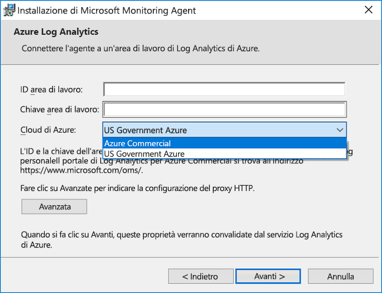
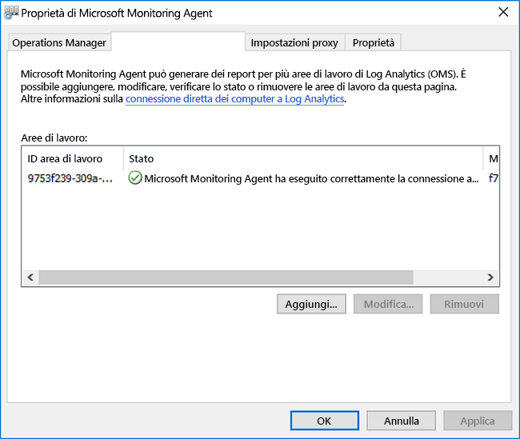

# <a name="connect-windows-computers-to-the-log-analytics-service-in-azure"></a>Connettere computer Windows al servizio Log Analytics in Azure

Per monitorare e gestire macchine virtuali o computer fisici in Data Center locale o un altro ambiente cloud con Log Analitica, è necessario distribuire Microsoft Monitoring Agent (MMA) e configurarlo per segnalare a uno o più Log Analitica le aree di lavoro.  L'agente supporta anche il ruolo di lavoro ibridi per Runbook di automazione di Azure.  

In un computer Windows monitorato, l'agente viene elencato come il servizio Microsoft Monitoring Agent. Il servizio Microsoft Monitoring Agent raccoglie gli eventi dal file di log e registro eventi di Windows, i dati sulle prestazioni e altri dati di telemetria. Anche quando l'agente è in grado di comunicare con il servizio Registro Analitica che riporti, l'agente continua a essere eseguito e accoda i dati raccolti sul disco del computer monitorato. Quando la connessione viene ripristinata, il servizio Microsoft Monitoring Agent invia i dati raccolti per il servizio.

L'agente siano installato utilizzando uno dei metodi seguenti. La maggior parte delle installazioni di utilizzano una combinazione di questi metodi per installare diversi set di computer, come appropriato.

* Installazione manuale. Il programma di installazione viene eseguito manualmente nel computer mediante Installazione guidata, dalla riga di comando, o distribuiti tramite uno strumento di distribuzione software esistente.
* Automazione di Azure Desired State Configuration (DSC). Uso di DSC in automazione di Azure con uno script per i computer Windows già distribuiti nell'ambiente in uso.  
* Script di PowerShell.
* Modello di gestione risorse per le macchine virtuali in esecuzione Windows locale nello Stack di Azure.  

Per comprendere i requisiti di sistema e di rete per distribuire l'agente di Windows, vedere [raccogliere i dati dall'ambiente in uso con Azure Log Analitica](log-analytics-concept-hybrid.md#prerequisites).

## <a name="obtain-workspace-id-and-key"></a>Ottenere l'ID e la chiave dell'area di lavoro
Prima di installare Microsoft Monitoring Agent per Windows, sono necessari l'ID e la chiave dell'area di lavoro per l'area di lavoro di Log Analytics.  Queste informazioni sono necessarie durante l'installazione da ogni metodo di installazione per configurare l'agente e verificare che possa comunicare correttamente con Log Analitica correttamente.  

1. Nel portale di Azure fare clic su **Altri servizi** nell'angolo in basso a sinistra. Nell'elenco delle risorse digitare **Log Analytics**. Non appena si inizia a digitare, l'elenco viene filtrato in base all'input. Selezionare **Log Analytics**.
2. Nell'elenco delle aree di lavoro Log Analitica, selezionare l'area di lavoro che si intende nella configurazione dell'agente di report.
3. Selezionare **Impostazioni avanzate**.<br><br> <br><br>  
4. Selezionare **Origini connesse** e quindi **Server Windows**.   
5. Il valore a destra di **ID area di lavoro** e **Chiave primaria**. Copiare e incollare entrambi i valori nell'editor predefinito.   
   
## <a name="install-the-agent-using-setup"></a>Installare gli agenti con il programma di installazione
Le istruzioni seguenti consentono di installare e configurare l'agente per Log Analytics nel cloud di Azure e di Azure per enti pubblici, installando Microsoft Monitoring Agent nel computer.  Il programma di installazione per l'agente è contenuto all'interno del file scaricato e deve essere estratte in ordine 

1. Nella pagina **Server Windows** selezionare la versione appropriata da scaricare in **Scarica agente Windows** a seconda dell'architettura del processore del sistema operativo Windows.
2. Eseguire il programma di installazione per installare l'agente nel computer in uso.
2. Nella pagina di **benvenuto** fare clic su **Avanti**.
3. Nella pagina **Condizioni di licenza** leggere la licenza e quindi fare clic su **Accetto**.
4. Nella pagina **Cartella di destinazione** modificare o mantenere la cartella di installazione predefinita e quindi fare clic su **Avanti**.
5. Nella pagina **Opzioni di installazione dell'agente** scegliere di connettere l'agente ad Azure Log Analytics (OMS) e quindi fare clic su **Avanti**.   
6. Nella pagina **Azure Log Analytics** eseguire le operazioni seguenti:
   1. Incollare **ID area di lavoro** e **Chiave dell'area di lavoro (Chiave primaria)** copiati in precedenza.  Se il computer deve fare riferimento a un'area di lavoro di Log Analytics nel cloud di Azure per enti pubblici, selezionare **Azure Governo degli Stati Uniti** nell'elenco a discesa **Cloud di Azure**.  
   2. Se il computer deve comunicare tramite un server proxy con il servizio Log Analytics, fare clic su **Avanzate** e specificare l'URL e il numero di porta del server proxy.  Se il server proxy richiede l'autenticazione, digitare il nome utente e la password per l'autenticazione nel server proxy, quindi fare clic su **Avanti**.  
7. Fare clic su **Avanti** dopo aver specificato le impostazioni di configurazione necessarie.<br><br> <br><br>
8. Nella pagina **Pronto per l'installazione** rivedere le scelte effettuate e quindi fare clic su **Installa**.
9. Nella pagina **Configurazione completata** fare clic su **Fine**.

Al termine, verrà visualizzato **Microsoft Monitoring Agent** nel **Pannello di controllo**. Per confermare che segnala al Log Analitica, esaminare [verificare la connettività dell'agente di Log Analitica](#verify-agent-connectivity-to-log-analytics). 

## <a name="install-the-agent-using-the-command-line"></a>Installare l'agente usando la riga di comando
Il file scaricato per l'agente è un pacchetto di installazione autonomo creato con IExpress.  Il programma di installazione per l'agente e i file di supporto sono contenuti nel pacchetto e devono essere estratti per la corretta installazione dalla riga di comando illustrata negli esempi seguenti.  Questo metodo supporta la configurazione dell'agente per segnalare a Azure commerciali e cloud governo.  

>[!NOTE]
>Per aggiornare un agente è necessario usare l'API di scripting di Log Analytics. Vedere l'argomento [la gestione e manutenzione dell'agente di Log Analitica per Windows e Linux](log-analytics-agent-manage.md) per ulteriori informazioni.

Nella tabella seguente illustra i parametri specifici di Log Analitica supportati dal programma di installazione per l'agente, inclusi quelli distribuiti tramite DSC di automazione.

|Opzioni specifiche di MMA                   |Note         |
|---------------------------------------|--------------|
|ADD_OPINSIGHTS_WORKSPACE               | 1 = Configura l'agente per fare riferimento a un'area di lavoro                |
|OPINSIGHTS_WORKSPACE_ID                | Id dell'area di lavoro (guid) per l'area di lavoro da aggiungere                    |
|OPINSIGHTS_WORKSPACE_KEY               | Chiave dell'area di lavoro usata per autenticarsi inizialmente nell'area di lavoro |
|OPINSIGHTS_WORKSPACE_AZURE_CLOUD_TYPE  | Specificare l'ambiente cloud in cui si trova l'area di lavoro <br> 0 = Cloud commerciale di Azure (impostazione predefinita) <br> 1 = Azure per enti pubblici |
|OPINSIGHTS_PROXY_URL               | URI per il proxy da usare |
|OPINSIGHTS_PROXY_USERNAME               | Nome utente per accedere a un proxy autenticato |
|OPINSIGHTS_PROXY_PASSWORD               | Password per accedere a un proxy autenticato |

1. Per estrarre i file di installazione dell'agente, prompt dei comandi con privilegi elevati eseguire `extract MMASetup-<platform>.exe` e verrà richiesto per il percorso di file da estrarre.  In alternativa, è possibile specificare il percorso, passando gli argomenti `extract MMASetup-<platform>.exe /c:<Path> /t:<Path>`.  Per ulteriori informazioni sul swtiches della riga di comando supportati da IExpress, vedere [della riga di comando per IExpress](https://support.microsoft.com/help/197147/command-line-switches-for-iexpress-software-update-packages) e quindi aggiornare l'esempio in base alle esigenze.
2. Per installare l'agente e configurarlo in modo da segnalare al cloud di Azure commerciale, un'area di lavoro dalla cartella automaticamente sono stati estratti i file di installazione in cui digitare: 
   
     ```dos
    setup.exe /qn ADD_OPINSIGHTS_WORKSPACE=1 OPINSIGHTS_WORKSPACE_AZURE_CLOUD_TYPE=0 OPINSIGHTS_WORKSPACE_ID=<your workspace id> OPINSIGHTS_WORKSPACE_KEY=<your workspace key> AcceptEndUserLicenseAgreement=1
    ```

   In alternativa, per configurare l'agente per fare riferimento al cloud di Azure del governo, digitare: 

     ```dos
    setup.exe /qn ADD_OPINSIGHTS_WORKSPACE=1 OPINSIGHTS_WORKSPACE_AZURE_CLOUD_TYPE=1 OPINSIGHTS_WORKSPACE_ID=<your workspace id> OPINSIGHTS_WORKSPACE_KEY=<your workspace key> AcceptEndUserLicenseAgreement=1
    ```

## <a name="install-the-agent-using-dsc-in-azure-automation"></a>Installare l'agente usando DSC in Automazione di Azure

È possibile utilizzare lo script di esempio riportato di seguito per installare l'agente mediante DSC di automazione di Azure.   Se non si dispone di un account di automazione, vedere [Guida introduttiva di automazione di Azure](../automation/automation-offering-get-started.md) per comprendere i requisiti e passaggi per la creazione di un account di automazione di richiesto prima di usare DSC di automazione.  Se non si ha familiarità con DSC di automazione, esaminare [Introduzione a DSC di automazione](../automation/automation-dsc-getting-started.md).

L'esempio seguente installa l'agente a 64 bit, identificato dal `URI` valore. È possibile utilizzare anche la versione a 32 bit sostituendo il valore dell'URI. Gli URI per entrambe le versioni sono:

- Agente di Windows a 64 bit - https://go.microsoft.com/fwlink/?LinkId=828603
- Agente di Windows a 32 bit - https://go.microsoft.com/fwlink/?LinkId=828604


>[!NOTE]
>In questo esempio di stored procedure e script non supporta l'aggiornamento dell'agente già distribuito in un computer Windows.

Le versioni a 32 e 64 bit del pacchetto agente dispongono di un codice prodotto diverso e vengono rilasciate nuove versioni dispongono inoltre di un valore univoco.  Il codice prodotto è un GUID che è l'identificazione di un'applicazione o il prodotto principale e viene rappresentato da Windows Installer **ProductCode** proprietà.  Il `ProductId value` nel **MMAgent.ps1** script deve corrispondere il codice prodotto dal pacchetto di installazione dell'agente a 32 bit o 64 bit.

Per recuperare direttamente il codice prodotto dal pacchetto di installazione dell'agente, è possibile utilizzare Orca.exe dal [Windows SDK componenti di Windows Installer Developers](https://msdn.microsoft.com/library/windows/desktop/aa370834%27v=vs.85%28.aspx) che un componente di Windows Software Development Kit o usando PowerShell segue un [uno script di esempio](http://www.scconfigmgr.com/2014/08/22/how-to-get-msi-file-information-with-powershell/) scritto da un Microsoft Valuable Professional (MVP).

1. Importare il modulo xPSDesiredStateConfiguration da [http://www.powershellgallery.com/packages/xPSDesiredStateConfiguration](http://www.powershellgallery.com/packages/xPSDesiredStateConfiguration) in Automazione di Azure.  
2.  Creare gli asset variabili di Automazione di Azure per *OPSINSIGHTS_WS_ID* e *OPSINSIGHTS_WS_KEY*. Impostare *OPSINSIGHTS_WS_ID* per l'ID area di lavoro Log Analitica e set *OPSINSIGHTS_WS_KEY* alla chiave primaria dell'area di lavoro.
3.  Copiare lo script e salvarlo come MMAgent.ps1

    ```PowerShell
    Configuration MMAgent
    {
        $OIPackageLocalPath = "C:\Deploy\MMASetup-AMD64.exe"
        $OPSINSIGHTS_WS_ID = Get-AutomationVariable -Name "OPSINSIGHTS_WS_ID"
        $OPSINSIGHTS_WS_KEY = Get-AutomationVariable -Name "OPSINSIGHTS_WS_KEY"

        Import-DscResource -ModuleName xPSDesiredStateConfiguration

        Node OMSnode {
            Service OIService
            {
                Name = "HealthService"
                State = "Running"
                DependsOn = "[Package]OI"
            }

            xRemoteFile OIPackage {
                Uri = "https://go.microsoft.com/fwlink/?LinkId=828603"
                DestinationPath = $OIPackageLocalPath
            }

            Package OI {
                Ensure = "Present"
                Path  = $OIPackageLocalPath
                Name = "Microsoft Monitoring Agent"
                ProductId = "8A7F2C51-4C7D-4BFD-9014-91D11F24AAE2"
                Arguments = '/C:Deploy"setup.exe /qn ADD_OPINSIGHTS_WORKSPACE=1 OPINSIGHTS_WORKSPACE_ID=' + $OPSINSIGHTS_WS_ID + ' OPINSIGHTS_WORKSPACE_KEY=' + $OPSINSIGHTS_WS_KEY + ' AcceptEndUserLicenseAgreement=1"'
                DependsOn = "[xRemoteFile]OIPackage"
            }
        }
    }

    ```

4. [Importare lo script di configurazione MMAgent.ps1](../automation/automation-dsc-getting-started.md#importing-a-configuration-into-azure-automation) nell'account di automazione. 
5. [Assegnare un computer Windows o un nodo](../automation/automation-dsc-getting-started.md#onboarding-an-azure-vm-for-management-with-azure-automation-dsc) alla configurazione. Entro 15 minuti, il nodo controlla la configurazione e l'agente viene inserito nel nodo.

## <a name="verify-agent-connectivity-to-log-analytics"></a>Verificare la connettività dell'agente di Log Analitica

Una volta instalaltion dell'agente, la verifica della connessione è stata stabilita e creazione di report può essere eseguita in due modi.  

Dal computer in **Pannello di controllo**, trovare l'elemento **Microsoft Monitoring Agent**.  Selezionarlo e scegliere il **Analitica Log di Azure (OMS)** scheda l'agente deve essere visualizzato un messaggio che informa: **di Microsoft Monitoring Agent è connesso correttamente al servizio di Microsoft Operations Management Suite.**<br><br> 

È anche possibile eseguire una ricerca semplice log nel portale di Azure.  

1. Nel portale di Azure fare clic su **Altri servizi** nell'angolo in basso a sinistra. Nell'elenco delle risorse digitare **Log Analytics**. Non appena si inizia a digitare, l'elenco viene filtrato in base all'input. Selezionare **Log Analytics**.  
2. Nella pagina dell'area di lavoro Log Analitica, selezionare l'area di lavoro di destinazione e quindi selezionare il **ricerca nei Log** riquadro. 
2. Nel riquadro di ricerca di Log, il tipo di campo di query:  

    ```
    search * 
    | where Type == "Heartbeat" 
    | where Category == "Direct Agent" 
    | where TimeGenerated > ago(30m)  
    ```

Nei risultati della ricerca restituiti, vedrai i record di heartbeat per il computer che indica che è connesso e creazione di report al servizio.   

## <a name="next-steps"></a>Passaggi successivi

Revisione [la gestione e manutenzione dell'agente di Log Analitica per Windows e Linux](log-analytics-agent-manage.md) per apprendere come gestire l'agente durante il ciclo di vita di distribuzione nei computer.  