# Introduzione a un'area di lavoro di Log Analytics
È possibile iniziare a usare rapidamente Azure Log Analytics, che consente di valutare dati di intelligence operativa ottenuti dall'infrastruttura IT. Questo articolo consente di esaminare, analizzare e agire con facilità sui dati raccolti *gratuitamente*.

Questo articolo è un'introduzione di Log Analytics e include una breve esercitazione che illustra una distribuzione minima in Azure, che consente di iniziare a usare il servizio. Il contenitore logico in cui vengono archiviati i dati di gestione in Azure viene definito area di lavoro. Dopo avere esaminato le informazioni e completato la valutazione, è possibile rimuovere l'area di lavoro di valutazione. Questo articolo è un'esercitazione, quindi non fornisce indicazioni sui requisiti aziendali, sulla pianificazione o sull'architettura.

>[!NOTE]
>Se si usa il cloud di Microsoft Azure per enti pubblici, vedere la [documentazione sul monitoraggio e sulla gestione di Azure per enti pubblici](https://review.docs.microsoft.com/azure/azure-government/documentation-government-services-monitoringandmanagement#log-analytics).

Ecco una breve analisi del processo usato per iniziare:

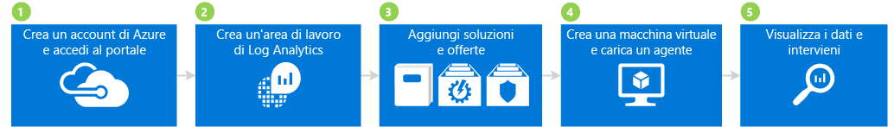

## 1 Creare un account Azure e accedere

Se non si ha già un account Azure, è necessario crearne uno per usare Log Analytics. È possibile creare un [account gratuito](https://azure.microsoft.com/free/) con validità di 30 giorni, che consente di accedere a qualsiasi servizio di Azure.

### Per creare un account gratuito e accedere
1. Seguire la procedura illustrata in [Creare l'account Azure gratuito](https://azure.microsoft.com/free/).
2. Aprire il [portale di Azure](https://portal.azure.com) e accedere.

## 2 Creare un'area di lavoro

Il passaggio successivo consiste nella creazione di un'area di lavoro.

1. Nel portale di Azure cercare l'elenco di servizi nel Marketplace per *Log Analytics*, quindi selezionare **Log Analytics**.  
    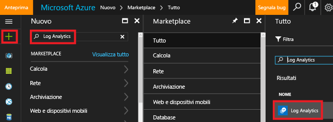
2. Fare clic su **Crea** e selezionare le opzioni per gli elementi seguenti:
   * **Area di lavoro OMS**: immettere un nome per l'area di lavoro.
   * **Sottoscrizione** : in presenza di più sottoscrizioni, scegliere quella da associare alla nuova area di lavoro.
   * **Gruppo di risorse**
   * **Posizione**
   * **Piano tariffario**  
       
3. Fare clic su **OK** per visualizzare l'elenco delle aree di lavoro.
4. Selezionare un'area di lavoro per visualizzare i dettagli corrispondenti nel portale di Azure.       
             

## 3 Aggiungere soluzioni e offerte di soluzioni

Aggiungere quindi le soluzioni e le offerte di soluzioni. Le soluzioni di gestione sono una raccolta di regole logiche, di visualizzazione e di acquisizione dei dati che forniscono metriche relative a un'area problematica specifica. Un'offerta di soluzioni è un raggruppamento di soluzioni di gestione.

L'aggiunta di soluzioni all'area di lavoro consente a Log Analytics di raccogliere diversi tipi di dati dai computer connessi all'area di lavoro tramite gli agenti. Gli agenti di onboarding vengono illustrati più avanti.

### Per aggiungere soluzioni e offerte di soluzioni

1. Nel portale di Azure fare clic su **Nuovo**, quindi nella casella **Cerca nel Marketplace** immettere **Activity Log Analytics** e premere INVIO.
2. Nel pannello Tutto selezionare **Activity Log Analytics** e quindi fare clic su **Crea**.  
    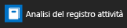  
3. Nel pannello relativo al *nome della soluzione di gestione* selezionare un'area di lavoro da associare alla soluzione di gestione.
4. Fare clic su **Crea**.  
    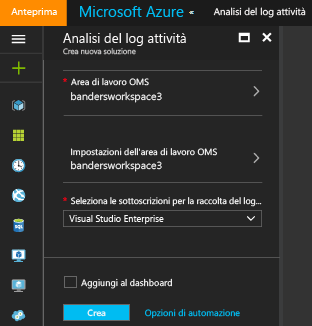  
5. Ripetere i passaggi dall'1 al 4 per aggiungere:
    - L'offerta del servizio **Sicurezza e conformità** con le soluzioni Antimalware Assessment e Sicurezza e conformità.
    - L'offerta del servizio **Automation & Control** con le soluzioni ruolo di lavoro ibrido di Automazione, Rilevamento modifiche e System Update Assessment (definita anche Gestione aggiornamenti). È necessario creare un account di Automazione quando si aggiunge un'offerta di soluzioni.  
        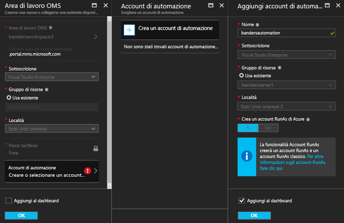  
6. È possibile visualizzare le soluzioni di gestione aggiunte all'area di lavoro passando a **Log Analytics** > **Sottoscrizioni** > ***nome dell'area di lavoro*** > **Panoramica**. Vengono visualizzati i riquadri per le soluzioni di gestione aggiunte.  
    >[!NOTE]
    >Poiché non sono stati connessi agenti all'area di lavoro, non vengono visualizzati dati per le soluzioni aggiunte.  

    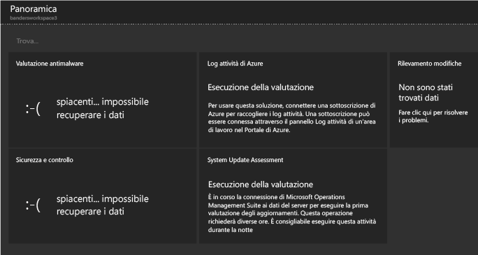

## 4 Creare una macchina virtuale ed eseguire l'onboarding di un agente

Creare quindi una semplice macchina virtuale in Azure. Dopo la creazione di una VM, eseguire l'onboarding dell'agente OMS per abilitarlo. L'abilitazione dell'agente avvia la raccolta di dati dalla macchina virtuale e invia i dati a Log Analytics.

### Per creare una macchina virtuale

- Seguire le indicazioni disponibili in [Creare la prima macchina virtuale Windows nel portale di Azure](../virtual-machines/virtual-machines-windows-hero-tutorial.md) e avviare la nuova macchina virtuale.

### Connettere la macchina virtuale a Log Analytics

- Seguire le indicazioni disponibili in [Connettere macchine virtuali di Azure a Log Analytics](log-analytics-azure-vm-extension.md) per connettere la VM a Log Analytics usando il portale di Azure.

## 5 Visualizzare i dati e definire le azioni necessarie

È stata eseguita in precedenza l'abilitazione della soluzione Activity Log Analytics e delle offerte di servizi Sicurezza e conformità e Automation & Control. Verranno quindi esaminati i dati raccolti dalle soluzioni e i risultati delle ricerche nei log.

Per iniziare, esaminare i dati visualizzati nelle soluzioni. Analizzare quindi le ricerche nei log a cui si accede dalla pagina corrispondente. Le ricerche nei log permettono di combinare e correlare i dati del computer provenienti da più origini nell'ambiente corrente. Per altre informazioni, vedere [Ricerche nei log in Log Analytics](log-analytics-log-searches.md). Definire quindi le azioni necessarie in base ai dati trovati tramite il portale OMS, esterno al portale di Azure.

### Per visualizzare i dati di Antimalware

1. Nel portale di Azure passare a **Log Analytics** > ***area di lavoro***.
2. Nel pannello per l'area di lavoro in **Generale** fare clic su **Panoramica**.  
    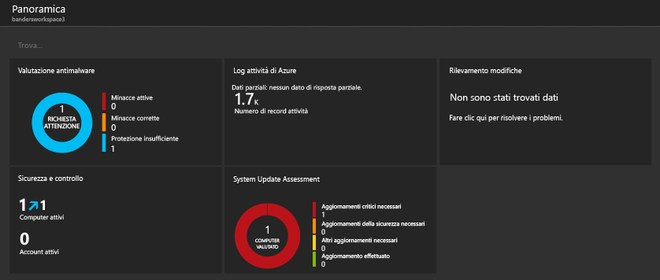
3. Fare clic sul riquadro **Antimalware Assessment**. Come si può notare in questo esempio, Windows Defender è installato in un computer, ma la firma non è aggiornata.  
    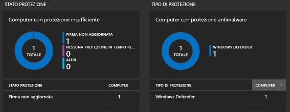
4. Per questo esempio, in **Stato protezione** fare clic su **Firma non aggiornata** per aprire la Ricerca log e visualizzare i dettagli dei computer con firme non aggiornate. Si noti che in questo esempio il computer è denominato *getstarted*. Se sono presenti più computer con firme non aggiornate, vengono visualizzati tutti nei risultati di Ricerca log.  
    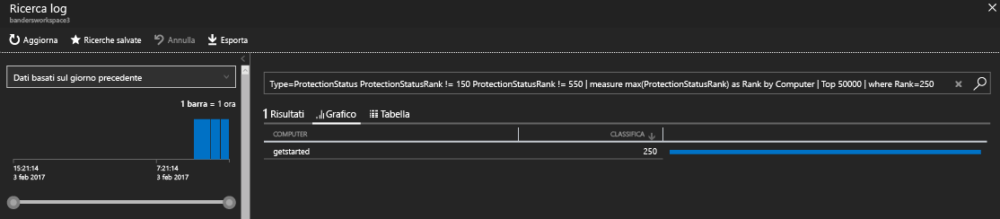

### Per visualizzare i dati di Sicurezza e controllo

1. Nel pannello per l'area di lavoro in **Generale** fare clic su **Panoramica**.  
2. Fare clic sul riquadro **Sicurezza e controllo**. Come si può notare in questo esempio, esistono due problemi rilevanti: un computer privo di aggiornamenti critici e un computer con protezione insufficiente.  
    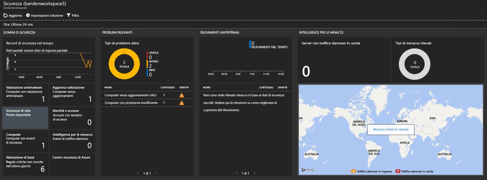
3. Per questo esempio, in **Errori rilevanti** fare clic su **Computer con aggiornamenti critici mancanti** per aprire Ricerca log e visualizzare informazioni dettagliate sui computer privi di aggiornamenti critici. In questo esempio non sono presenti un aggiornamento critico e 63 aggiornamenti di altro tipo.  
    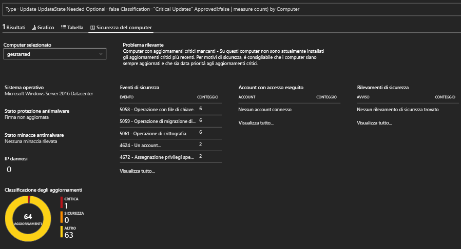

### Per visualizzare i dati di Aggiornamenti del sistema e definire le azioni necessarie

1. Nel pannello per l'area di lavoro in **Generale** fare clic su **Panoramica**.  
2. Fare clic sul riquadro **System Update Assessment**. Come si può notare in questo esempio, è presente un computer Windows computer denominato *getstarted* che necessita di aggiornamenti critici, oltre a un computer che necessita di aggiornamenti delle definizioni.  
    
3. Per questo esempio, in **Aggiornamenti mancanti** fare clic su **Aggiornamenti critici** per aprire Ricerca log e visualizzare informazioni dettagliate sui computer privi di aggiornamenti critici. In questo esempio è assente un aggiornamento ed è presente un aggiornamento obbligatorio.  
    
4. Passare al sito Web [Operations Management Suite](http://microsoft.com/oms) e accedere con l'account Azure. Dopo avere eseguito l'accesso, si noti che le informazioni sulla soluzione sono simili a quelle visualizzate nel portale di Azure.  
    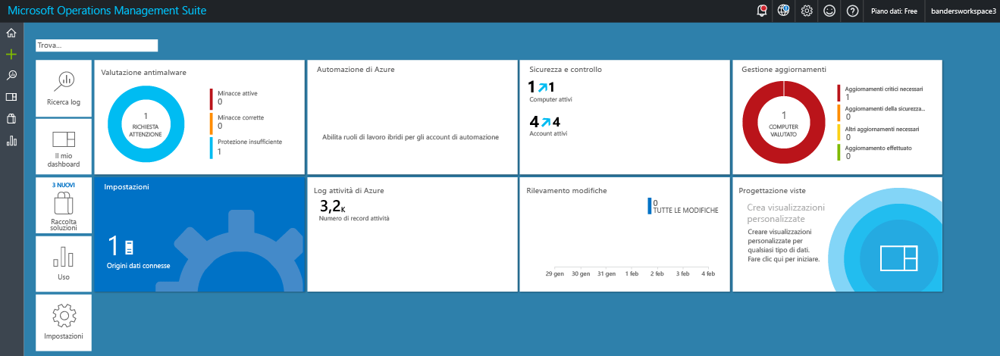
5. Fare clic sul riquadro **Gestione aggiornamenti**.
6. Nel dashboard di Gestione aggiornamenti si noti che le informazioni sull'aggiornamento del sistema sono simili alle informazioni di Aggiornamenti del sistema visualizzate nel portale di Azure. Il riquadro **Gestisci le distribuzioni dell'aggiornamento**, tuttavia, è nuovo. Fare clic sul riquadro **Gestisci le distribuzioni dell'aggiornamento**.  
    
7. Nella pagina **Distribuzioni di aggiornamento** fare clic su **Aggiungi** per creare una *operazione di aggiornamento*.  
    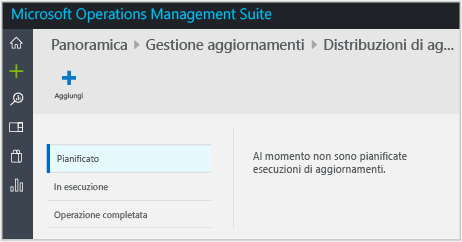
8.  Nella pagina **Nuova distribuzione aggiornamenti** digitare un nome per la distribuzione dell'aggiornamento, selezionare i computer da aggiornare (in questo esempio *getstarted*), scegliere una pianificazione e quindi fare clic su **Salva**.  
    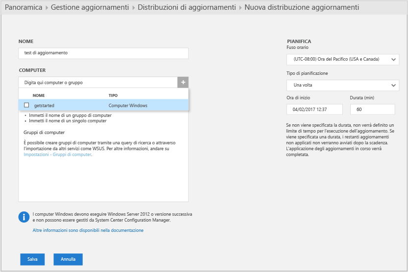  
    Dopo il salvataggio della distribuzione dell'aggiornamento, viene visualizzato l'aggiornamento pianificato.  
    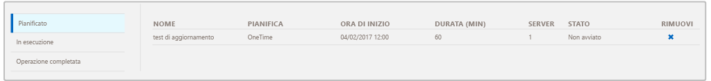  
    Al termine dell'operazione di aggiornamento, lo stato sarà **Operazione completata**.
    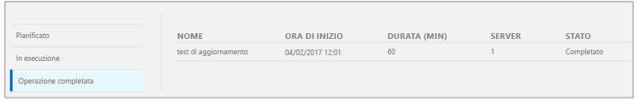
9. Al termine dell'operazione di aggiornamento, è possibile verificare se l'operazione ha avuto esito positivo o negativo e visualizzare informazioni dettagliate sugli aggiornamenti applicati.

## Dopo la valutazione

In questa esercitazione è stato installato un agente in una macchina virtuale e sono state eseguite rapidamente le operazioni iniziali. La procedura seguita è semplice e veloce. La maggior parte delle organizzazioni e delle aziende di grandi dimensioni, tuttavia, ha infrastrutture IT locali complesse. La raccolta di dati da questi ambienti complessi richiede quindi una pianificazione e un impegno superiori rispetto all'esercitazione. Per collegamenti ad articoli utili, vedere la sezione Passaggi successivi seguente.

È possibile rimuovere facoltativamente l'area di lavoro creata con questa esercitazione.

## Passaggi successivi
* Informazioni sulla connessione degli [agenti Windows](log-analytics-windows-agents.md) a Log Analytics.
* Informazioni sulla connessione degli [agenti di Operations Manager](log-analytics-om-agents.md) a Log Analytics.
* [Aggiungere soluzioni di Log Analytics dalla raccolta soluzioni](log-analytics-add-solutions.md) per aggiungere funzionalità e raccogliere i dati.
* Acquisire familiarità con le [ricerche nei log](log-analytics-log-searches.md) per visualizzare le informazioni dettagliate raccolte dalle soluzioni.

